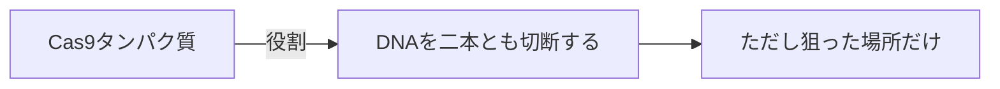
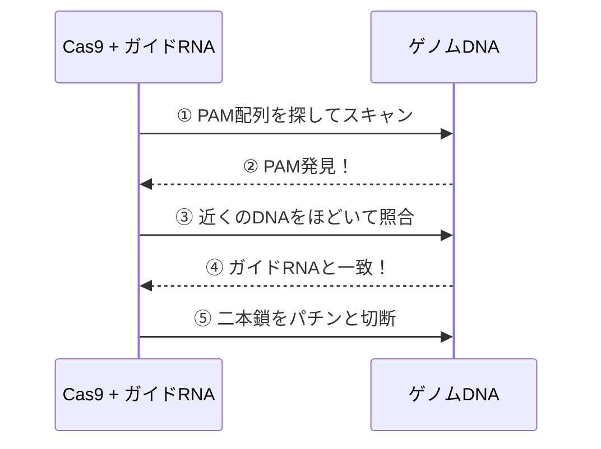
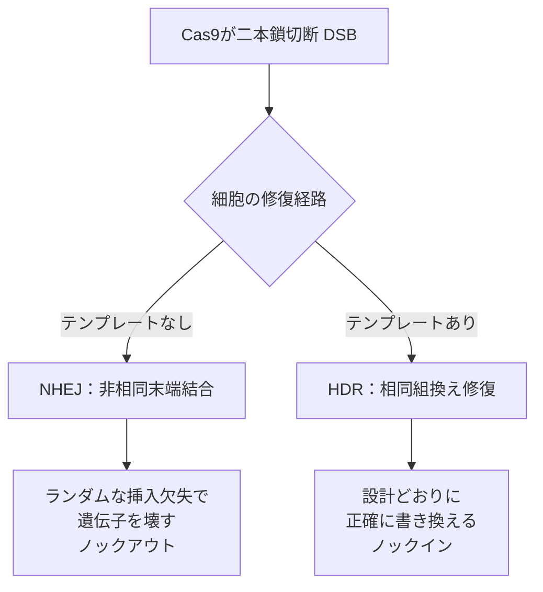
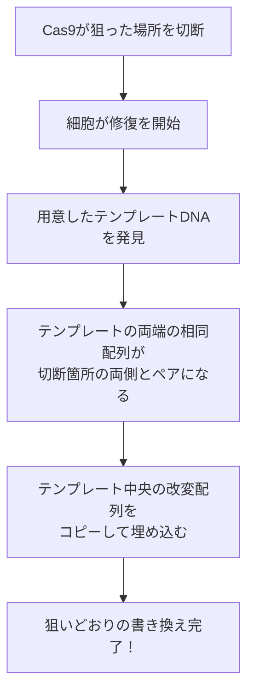
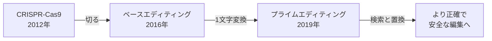

# CRISPRによるゲノム編集の仕組み（超詳細版）

## 🎯 まず、この講義で何を学ぶのか

最終ゴール：**CRISPR-Cas9が「どうやってゲノムの狙った1か所だけ」を書き換えるのか、その分子の仕組みからガイドRNAの設計方法までを完全に理解する**

でも、ちょっと待ってください。そもそも「ゲノムを編集する」って、一体どういうことなのでしょうか。
ヒトのゲノムは約30億文字（塩基）もあります。その中のたった1文字を、狙って書き換える。実は、これは**30億ページの本から、特定の1ページの1文字だけを探し出して訂正する**ようなものなんです。

しかも驚くべきことに、この技術は2020年にノーベル化学賞を受賞しました（Jennifer DoudnaとEmmanuelle Charpentier）。今日はこの「生命の文章校正ツール」の仕組みを、一切の飛躍なしに解き明かしていきます。

## 🤔 ステップ0：なぜCRISPRが革命的なのか

### 0-1. そもそもの問題を考えてみよう

あなたは遺伝病を治す研究者だとします。ある患者さんのDNAには、1文字の間違い（変異）があって、それが病気の原因になっています。

```
正常な遺伝子： ...ATG GCT GAA... （正しいタンパク質ができる）
患者の遺伝子： ...ATG GCT TAA... （途中で止まってしまう = 病気）
                          ↑ここの1文字が違う
```

やりたいことはシンプルです。「この `T` を `G` に直したい」。
でも、30億文字の中から、この1か所だけを正確に見つけて、しかもそこだけを切る道具なんて、本当にあるのでしょうか？

### 0-2. 驚きの事実：その道具は「細菌の免疫システム」だった

実はCRISPRは、人間が発明したものではありません。**細菌が大昔からウィルスと戦うために持っていた免疫システム**を借りてきたものなんです。

細菌はウィルス（ファージ）に感染されると、その侵入者のDNAの断片を「指名手配書」として自分のゲノムに保存します。次に同じウイルスが来たとき、保存しておいた指名手配書と照合して、ピンポイントでウイルスのDNAを切断して退治するのです。

この「指名手配書と照合して切る」仕組みを、私たちのゲノム編集に転用したのがCRISPR-Cas9です。

## 📖 ステップ1：登場人物を整理しよう

CRISPRの仕組みは、たった2人の主役で動いています。これさえ押さえれば、もう半分わかったようなものです。

### 1-1. ハサミ役：Cas9タンパク質

Cas9（キャスナイン）は**DNAを切断するハサミ**です。でも、ただのハサミではありません。「指示された場所しか切らない」という賢いハサミです。



### 1-2. 案内役：ガイドRNA（gRNA）

ここが最重要ポイントです。Cas9は単体ではどこを切ればいいかわかりません。
そこで**ガイドRNA**という「カーナビ」が、Cas9を目的地まで案内します。

ガイドRNAは約20文字のRNA配列で、これが**切りたいDNAの配列と相補的（ペアになる）**になっています。

```
切りたいDNA：  5'-...GACGCATTGCACTGGATCAG...-3'
                      ||||||||||||||||||||  ← 塩基対で結合
ガイドRNA：    3'-...CUGCGUAACGUGACCUAGUC...-5'
```

つまり、**ガイドRNAの配列を変えるだけで、ゲノムのどこでも狙える**わけです。ここがCRISPRが「プログラム可能」と言われる理由です。

## 📖 ステップ2：実際にDNAを切るまでの流れ

では、Cas9とガイドRNAがどうやって協力して、狙った場所を切るのか。ステップごとに追いかけましょう。



### 2-1. まず「PAM」という目印を探す

でも、ちょっと待ってください。30億文字の中から20文字を探すのは大変です。Cas9はいきなり全部を照合するのでしょうか？

実は違います。Cas9はまず **PAM（パム）** という短い目印を探します。Cas9（化膿レンサ球菌由来のSpCas9）の場合、PAMは `NGG`（Nは任意の塩基）というたった3文字です。

```
ゲノム： ...GACGCATTGCACTGGATCAG TGG...
                                    ↑↑↑ これがPAM（NGG）
```

このPAMがすぐ隣にないと、Cas9は照合すらしません。これは「まず本棚の番号を確認してから、そのページを開く」ような効率化の工夫です。

:::tip ここがポイント！
**PAMはガイドRNAの設計に絶対必要な制約**です。「狙いたい場所のすぐ隣にNGGがあること」が条件になります。これは後のガイドRNA設計で何度も出てきます。
:::

### 2-2. ガイドRNAと照合する

PAMを見つけたら、Cas9はその隣のDNAをほどき、ガイドRNAと1文字ずつ照合します。20文字がちゃんとペアになれば「ここが目的地だ！」と確定します。

### 2-3. パチンと切る（二本鎖切断 = DSB）

照合が成功すると、Cas9はDNAの**二本鎖を両方とも切断**します。これを **二本鎖切断（DSB: Double-Strand Break）** と呼びます。

```
切断前： 5'-...GACGCATTGCAC|TGGATCAG TGG...-3'
         3'-...CTGCGTAACGTG|ACCTAGTC ACC...-5'
                          ↑ ここでパチン（両方の鎖を切る）
```

## 📖 ステップ3：切った後どうなる？ ここが運命の分かれ道

さて、ここで一番面白い部分です。Cas9はDNAを「切る」だけ。**実は書き換えているのは、切られた細胞自身の修復システム**なんです。

「えっ、Cas9が直すんじゃないの？」と思いますよね。違うんです。Cas9はただ切るだけ。そこからどう修復されるかで、編集の結果が決まります。

DNAが切られると、細胞は「大変だ、ゲノムが壊れた！」と慌てて修復を始めます。この修復には**2つの経路**があり、これがCRISPR編集の2大手法に直結します。



### 3-1. 経路その1：NHEJ（とりあえずくっつける雑な修復）

**NHEJ（非相同末端結合：Non-Homologous End Joining）** は、切れた両端を「とにかく急いでくっつける」修復です。

でも、この修復は雑なので、つなぎ目に**数文字の挿入や欠失（インデル）**がよく起こります。

```
元の配列：     ...GCT GAA TTC...
NHEJ後の例：   ...GCT GA_ TTC...  （1文字欠けた）
              → 読み枠がズレて、遺伝子が機能しなくなる
```

一見「失敗」に見えますが、これを逆に利用します。**遺伝子をわざと壊したいとき（ノックアウト）** にはNHEJが大活躍します。テンプレートを用意しなくていいので簡単で、効率も高いのが特徴です。

### 3-2. 経路その2：HDR（お手本を見ながら正確に直す修復）

ここからが、ユーザーの皆さんが特に知りたい **相同組換え（HDR：Homology-Directed Repair）** です。次のステップで徹底的に解説します。

## 📖 ステップ4：相同組換え（HDR）を完全理解する

### 4-1. そもそも「相同組換え」とは何か

**相同（そうどう）** とは「配列がよく似ている」という意味です。**組換え（くみかえ）** は「DNAをつなぎ替える」こと。

細胞には元々「DNAが切れたとき、よく似た配列をお手本にして正確に直す」という高精度な修復能力があります。これは細胞分裂のとき、同じ配列を持つ姉妹染色体をお手本にして傷を直す、本来の仕組みです。

CRISPRではこの仕組みをハックします。**人工的に「お手本（修復テンプレート）」を一緒に細胞に入れておく**のです。すると細胞は、本来の姉妹染色体ではなく、私たちが用意したお手本を見ながら修復します。

### 4-2. HDRの仕組みをステップで追う



### 4-3. 修復テンプレートの設計図

HDRの主役は**修復テンプレート（ドナーDNA）**です。これは次の3つの部分でできています。

```
修復テンプレート（ドナーDNA）の構造：

[左ホモロジーアーム] - [入れたい配列] - [右ホモロジーアーム]
   ↑切断点の左と同じ      ↑書き換え内容      ↑切断点の右と同じ
```

- **ホモロジーアーム（相同領域）**：切断箇所の左右と「まったく同じ配列」。これがあるおかげで、細胞は「ここに当てはめればいいんだな」とわかります。
- **入れたい配列**：1文字の訂正でも、遺伝子まるごとの挿入でもOK。

:::tip ここがポイント！
ホモロジーアームの長さが成功率を左右します。

- **1文字の修正など小さな編集**：一本鎖DNA（ssODN）を使い、片側30〜60塩基程度のアームで十分
- **遺伝子まるごとの挿入など大きな編集**：プラスミドを使い、片側500〜1000塩基程度の長いアームが必要
  :::

### 4-4. NHEJとHDRの比較表

| 比較項目   | NHEJ               | HDR（相同組換え）              |
| ---------- | ------------------ | ------------------------------ |
| お手本     | 不要               | 必要（修復テンプレート）       |
| 結果       | ランダムなインデル | 設計どおりの正確な配列         |
| 主な用途   | 遺伝子ノックアウト | 正確な修正・ノックイン         |
| 効率       | 高い               | 低い（数％程度のことも）       |
| 起こる時期 | 細胞周期全般       | 主にS/G2期（分裂中の細胞のみ） |

### 4-5. でも待って、なぜHDRは効率が低いの？

ここで素朴な疑問。「正確なら、なぜみんなHDRを使わないの？」

理由は2つあります。

1. **HDRは細胞分裂中（S/G2期）の細胞でしか起こらない**から。神経細胞のような分裂しない細胞ではほぼ使えません。
2. **細胞はそもそもNHEJを優先する**から。切れたら反射的に「とりあえずくっつける」を選びがちなのです。

だから研究の現場では「HDRの効率をどう上げるか」が大きなテーマになっています（NHEJを邪魔する薬を加える、テンプレートを工夫する、など）。

## 📖 ステップ5：ガイドRNAの作り方（設計の実践）

ここからが実践編です。「自分の狙った場所を編集するガイドRNAを、どう設計するか」を具体的に見ていきましょう。

### 5-1. ステップA：標的配列を決める

まず、編集したい遺伝子の周辺配列（DNA）を用意します。

```
編集したい領域の例：
5'-...TTAGCTGACGCATTGCACTGGATCAGTGGCCA...-3'
```

### 5-2. ステップB：PAM（NGG）を探す

その配列の中から **NGG** のパターンをすべて探します。ガイドRNAはこのPAMの**すぐ上流（5'側）の20塩基**を標的にします。

```
5'-...TTAGCTGACGCATTGCACTGGATCAG TGG CCA...-3'
       └────────20塩基の標的────┘ └PAM┘
       これがガイドRNAの配列になる候補
```

:::warning 重要な制約
ガイドRNAの配列にはPAM（NGG）そのものは**含めません**。PAMはあくまでCas9がDNA側で認識する目印で、ガイドRNAは「PAMの隣の20塩基」だけに対応します。
:::

### 5-3. ステップC：候補の中から良いものを選ぶ（3つの基準）

PAMは配列中にたくさん見つかります。その中から「良いガイドRNA」を選ぶ基準は3つです。

1. **オフターゲットが少ないこと（特異性）**
   - 似た配列がゲノムの他の場所にあると、間違ってそこも切ってしまう（オフターゲット効果）。
   - 標的配列がゲノム全体で「ユニーク」であるほど良い。
2. **オンターゲット活性が高いこと（切断効率）**
   - GC含量が40〜60％程度だと切れやすい傾向。
   - 末尾（PAM側）の塩基にGがあると効率が上がる傾向。
3. **切断点が編集したい場所に近いこと**
   - Cas9は **PAMから3塩基上流** を切ります。HDRでは切断点が編集箇所に近いほど成功率が上がるため、これも重要です。

:::tip 実務では設計ツールを使う
手計算は大変なので、実際には設計ツール（CRISPOR、Benchling、CHOPCHOPなど）に標的の遺伝子名や配列を入力すると、候補gRNAをオフターゲット・効率スコア付きで自動提案してくれます。
:::

### 5-4. ステップD：sgRNAの形にする

初期のCRISPRでは、案内役は **crRNA**（標的を認識）と **tracrRNA**（Cas9と結合）という2本のRNAに分かれていました。

DoudnaとCharpentierの大発見は、**この2本を1本につなげても機能する**ことでした。これが **sgRNA（single guide RNA：シングルガイドRNA）** です。今のCRISPRはほぼこのsgRNAを使います。

```
sgRNA = [20塩基の標的配列（crRNA部分）] + [Cas9と結合する足場（tracrRNA部分）]
         ↑ここだけ自分で設計する          ↑この部分は固定で共通
```

つまり、**自分で設計するのは前半の20塩基だけ**。後ろの足場部分は決まった配列を使い回せばいいのです。

### 5-5. コードで体験：ガイドRNA候補を自動で探す

実際に、標的配列からガイドRNA候補を探すPythonコードでCRISPR設計の感覚をつかみましょう。

```python
def find_guide_rnas(dna_sequence, guide_length=20):
    """
    DNA配列からCRISPR-Cas9のガイドRNA候補を探す関数。

    何をするか：NGG（PAM）を探し、その上流20塩基を候補として返す
    なぜ必要か：Cas9はPAMの隣しか切れないため、PAM基準で探すのが定石
    どう使う：編集したい遺伝子周辺のDNA配列を渡す
    """
    candidates = []

    # 配列を1文字ずつスキャンしてPAM（NGG）を探す
    # PAMの前に20塩基ぶんの余裕が必要なので、guide_lengthからスタート
    for i in range(guide_length, len(dna_sequence) - 2):
        # i, i+1, i+2 の3文字がPAMの候補
        pam = dna_sequence[i:i + 3]

        # PAMの条件は NGG（2文字目と3文字目がG）
        if pam[1] == "G" and pam[2] == "G":
            # PAMのすぐ上流（5'側）20塩基がガイドRNAの標的
            guide = dna_sequence[i - guide_length:i]

            # GC含量を計算（切断効率の目安、40〜60%が理想）
            gc_count = guide.count("G") + guide.count("C")
            gc_content = gc_count / guide_length * 100

            candidates.append({
                "guide": guide,
                "pam": pam,
                "position": i - guide_length,
                "gc_content": round(gc_content, 1),
            })

    return candidates


# 実験してみましょう
test_dna = "TTAGCTGACGCATTGCACTGGATCAGTGGCCAGATCGGAATTCGGCCTAAGG"
results = find_guide_rnas(test_dna)

print(f"見つかったガイドRNA候補：{len(results)}個\n")
for r in results:
    # GC含量が理想範囲かどうかも表示
    quality = "◎良好" if 40 <= r["gc_content"] <= 60 else "△要検討"
    print(f"標的: {r['guide']} | PAM: {r['pam']} "
          f"| GC: {r['gc_content']}% {quality}")
```

実行結果の例：

```
見つかったガイドRNA候補：4個

標的: GACGCATTGCACTGGATCAG | PAM: TGG | GC: 55.0% ◎良好
標的: CACTGGATCAGTGGCCAGAT | PAM: CGG | GC: 55.0% ◎良好
標的: TCAGTGGCCAGATCGGAATT | PAM: CGG | GC: 50.0% ◎良好
標的: CCAGATCGGAATTCGGCCTA | PAM: AGG | GC: 55.0% ◎良好
```

このように、配列を入れるだけで候補が機械的に出てきます。あとは前述の3基準（特異性・効率・切断位置）で絞り込めばよいのです。

:::warning このコードはあくまで学習用
実務のオフターゲット評価には、ゲノム全体に対する類似配列検索が必要です。ここではPAM探索の原理を理解するための簡易版である点に注意してください（推測ではなく、特異性チェックを省いた教材用という意味）。
:::

## 📖 ステップ6：CRISPRの進化形（最新の動向）

CRISPR-Cas9は「切る」技術でしたが、「切ると予測できないインデルが入る」「HDRの効率が低い」という弱点がありました。そこで近年、**切らずに書き換える**新世代技術が登場しています。

### 6-1. ベースエディティング（Base Editing）

二本鎖を切らずに、**1文字の塩基だけを化学的に変換**する技術です。

- C→T、A→Gのような「1文字の書き換え」が、DSBなしでできます。
- DSBを起こさないので、ランダムなインデルのリスクが大幅に減ります。

### 6-2. プライムエディティング（Prime Editing）

2019年に登場した技術で、**「検索と置換（find and replace）」**とも呼ばれます。

- 特殊なガイドRNA（pegRNA）に「書き換えたい配列の情報」を持たせ、逆転写酵素を使って直接書き込みます。
- HDRのようにテンプレートを別途用意せず、1文字置換・小さな挿入・欠失が幅広くできます。



これらは「Cas9をハサミとしてではなく、書き換え装置の運び役として使う」発想の転換です。基本にあるのは、やはり**ガイドRNAでピンポイントに案内する**というCRISPRの原理です。

## 📝 まとめ：今日学んだことを整理

### レベル1：表面的理解（これだけでもOK）

- CRISPRは細菌の免疫システムを借りた**ゲノム編集ツール**
- **Cas9（ハサミ）** と **ガイドRNA（カーナビ）** の2人で動く
- ガイドRNAの配列を変えるだけで、狙う場所を自由に変えられる

### レベル2：本質的理解（ここまで来たら素晴らしい）

- Cas9は **PAM（NGG）** を目印に探し、ガイドRNAと照合して**二本鎖切断（DSB）**する
- 書き換えるのはCas9ではなく、**細胞自身の修復システム**
  - **NHEJ**：雑にくっつける → 遺伝子ノックアウトに使う
  - **HDR（相同組換え）**：お手本を見て正確に直す → 正確な修正・ノックインに使う
- HDRには**ホモロジーアーム付きの修復テンプレート**が必須

### レベル3：応用的理解（プロレベル）

- ガイドRNA設計は「PAM探索 →（特異性・効率・切断位置）で選抜 → sgRNA化」の流れ
- HDRは細胞周期（S/G2期）に依存し効率が低い、という制約を理解した上で手法を選ぶ
- ベースエディティング／プライムエディティングは、DSBを避けてより安全・正確に編集する次世代技術

## 🔮 次回への期待

CRISPRはいまや、遺伝病治療（2023年には鎌状赤血球症の治療薬が承認されました）、農作物の改良、感染症診断にまで広がっています。

さらに驚くべきことに、CRISPRの原理は「特定のDNA配列を検出する」という点で、**バイオインフォマティクスの文字列検索アルゴリズム**とまったく同じ問題を扱っています。次は「ゲノム上の標的配列をどう高速に・正確に探すか」という、まさにこのサイトの中心テーマである配列検索アルゴリズムとの深い関係に迫っていきましょう。

## 📚 参考文献

- Jinek M, et al. "A Programmable Dual-RNA–Guided DNA Endonuclease in Adaptive Bacterial Immunity." _Science_, 2012.（CRISPR-Cas9をゲノム編集に応用した記念碑的論文）
- Doudna JA, Charpentier E. "The new frontier of genome engineering with CRISPR-Cas9." _Science_, 2014.
- Anzalone AV, et al. "Search-and-replace genome editing without double-strand breaks or donor DNA." _Nature_, 2019.（プライムエディティング）
- [Addgene CRISPR Guide](https://www.addgene.org/guides/crispr/)（gRNA設計・実験プロトコルの実践的解説）
