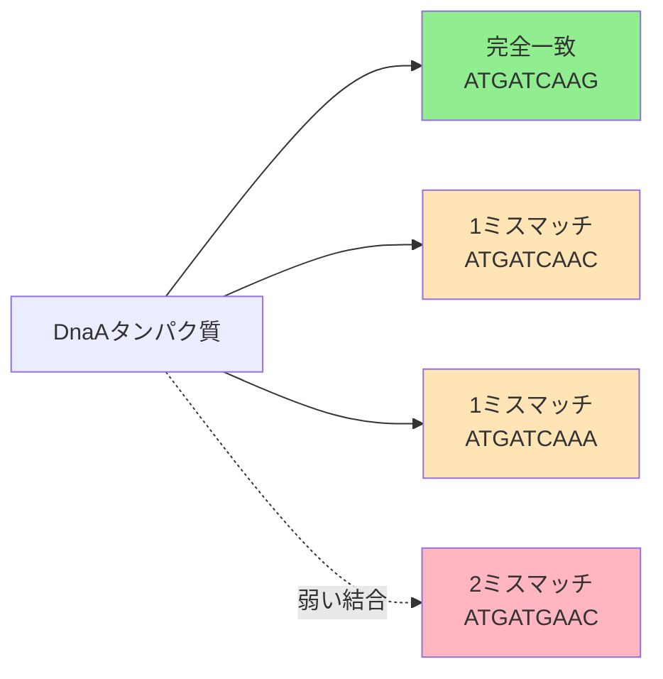

# ミスマッチを許容する頻出語問題

## 📝 問題定義

### 入力

- DNA配列（文字列）
- k（k-merの長さ）
- d（許容するミスマッチ数）

### 出力

- 最大`d`ミスマッチで最も頻繁に出現するk-merのリスト

## 🎯 なぜミスマッチが重要か

### 生物学的な理由

1. タンパク質結合の柔軟性
   - DnaAタンパク質は完全一致でなくても結合可能
   - 進化的な変異を許容

2. 実験誤差の考慮
   - シーケンシングエラー
   - 自然な変異

3. 進化的保存
   - 種間で少し異なるが機能的に同じ配列



## 📐 ハミング距離

### 定義

2つの同じ長さの文字列間で、異なる文字の位置の数。

```python
def hamming_distance(p, q):
    """
    2つの文字列間のハミング距離を計算

    Args:
        p, q: 同じ長さの文字列

    Returns:
        ハミング距離
    """
    if len(p) != len(q):
        raise ValueError("文字列の長さが異なります")

    return sum(1 for i in range(len(p)) if p[i] != q[i])
```

### 例

```python
# 例1
p = "ATGATCAAG"
q = "ATGATCAAC"
print(f"ハミング距離: {hamming_distance(p, q)}")  # 1

# 例2
p = "ATGATCAAG"
q = "ATCATGAAG"
print(f"ハミング距離: {hamming_distance(p, q)}")  # 2
```

## 🌐 近傍（neighborhood）

### 定義

パターンPの近傍とは、Pとのハミング距離が指定値以下のすべてのパターンの集合。

### 実装

```python
def generate_neighborhood(pattern, d):
    """
    パターンのd-neighborhoodを生成（再帰的アプローチ）

    Args:
        pattern: 元のパターン
        d: 許容するミスマッチ数

    Returns:
        d-neighborhoodのリスト
    """
    if d == 0:
        return [pattern]

    if len(pattern) == 1:
        return ['A', 'C', 'G', 'T']

    neighborhood = []
    suffix_neighbors = generate_neighborhood(pattern[1:], d)

    for text in suffix_neighbors:
        if hamming_distance(pattern[1:], text) < d:
            # まだミスマッチに余裕がある場合
            for nucleotide in ['A', 'C', 'G', 'T']:
                neighborhood.append(nucleotide + text)
        else:
            # ミスマッチの余裕がない場合
            neighborhood.append(pattern[0] + text)

    return neighborhood
```

### 効率的な実装（反復的アプローチ）

```python
def generate_neighborhood_iterative(pattern, d):
    """
    パターンのd-neighborhoodを生成（反復的アプローチ）

    Args:
        pattern: 元のパターン
        d: 許容するミスマッチ数

    Returns:
        d-neighborhoodのセット
    """
    neighborhood = {pattern}

    for i in range(d):
        new_neighbors = set()
        for neighbor in neighborhood:
            for j in range(len(neighbor)):
                for nucleotide in ['A', 'C', 'G', 'T']:
                    if neighbor[j] != nucleotide:
                        new_pattern = neighbor[:j] + nucleotide + neighbor[j+1:]
                        new_neighbors.add(new_pattern)
        neighborhood.update(new_neighbors)

    return neighborhood
```

## 💻 基本的な実装

### ナイーブなアプローチ

```python
def frequent_words_with_mismatches(text, k, d):
    """
    ミスマッチを許容する頻出語を見つける（基本版）

    Args:
        text: DNA配列
        k: k-merの長さ
        d: 許容するミスマッチ数

    Returns:
        最頻出のk-merのリスト
    """
    patterns = []
    freq_map = {}
    n = len(text)

    # すべての位置でk-merを抽出
    for i in range(n - k + 1):
        pattern = text[i:i+k]
        neighborhood = generate_neighborhood(pattern, d)

        # 各近傍パターンの頻度をカウント
        for neighbor in neighborhood:
            if neighbor not in freq_map:
                freq_map[neighbor] = 0
            freq_map[neighbor] += 1

    # 最大頻度を見つける
    max_count = max(freq_map.values()) if freq_map else 0

    # 最大頻度を持つパターンを収集
    for pattern, count in freq_map.items():
        if count == max_count:
            patterns.append(pattern)

    return patterns
```

## 🚀 最適化された実装

### 頻度配列を使用したアプローチ

```python
def pattern_to_number(pattern):
    """パターンを数値に変換"""
    number = 0
    base_map = {'A': 0, 'C': 1, 'G': 2, 'T': 3}

    for nucleotide in pattern:
        number = number * 4 + base_map[nucleotide]

    return number

def number_to_pattern(number, k):
    """数値をパターンに変換"""
    nucleotides = ['A', 'C', 'G', 'T']
    pattern = []

    for _ in range(k):
        pattern.append(nucleotides[number % 4])
        number //= 4

    return ''.join(reversed(pattern))

def frequent_words_with_mismatches_optimized(text, k, d):
    """
    最適化されたミスマッチ頻出語探索

    Args:
        text: DNA配列
        k: k-merの長さ
        d: 許容するミスマッチ数

    Returns:
        最頻出のk-merのリスト
    """
    patterns = []
    freq_array = [0] * (4  k)

    # 頻度配列を構築
    for i in range(len(text) - k + 1):
        pattern = text[i:i+k]
        neighborhood = generate_neighborhood(pattern, d)

        for neighbor in neighborhood:
            index = pattern_to_number(neighbor)
            freq_array[index] += 1

    # 最大頻度を見つける
    max_count = max(freq_array)

    # 最大頻度を持つパターンを収集
    for i in range(4  k):
        if freq_array[i] == max_count:
            pattern = number_to_pattern(i, k)
            patterns.append(pattern)

    return patterns
```

## 🧬 逆相補鎖を考慮した拡張

### 問題の拡張

DNAは二本鎖なので、逆相補鎖も考慮します。

```python
def reverse_complement(pattern):
    """逆相補鎖を計算"""
    complement = {'A': 'T', 'T': 'A', 'C': 'G', 'G': 'C'}
    return ''.join(complement[base] for base in pattern[::-1])

def frequent_words_with_mismatches_and_rc(text, k, d):
    """
    ミスマッチと逆相補鎖を考慮した頻出語探索

    Args:
        text: DNA配列
        k: k-merの長さ
        d: 許容するミスマッチ数

    Returns:
        最頻出のk-merのリスト
    """
    patterns = []
    freq_map = {}

    # すべての位置でk-merを抽出
    for i in range(len(text) - k + 1):
        pattern = text[i:i+k]
        rc_pattern = reverse_complement(pattern)

        # パターンとその逆相補鎖の近傍を生成
        neighborhood = generate_neighborhood(pattern, d)
        rc_neighborhood = generate_neighborhood(rc_pattern, d)

        # 頻度をカウント
        for neighbor in neighborhood:
            freq_map[neighbor] = freq_map.get(neighbor, 0) + 1

        for neighbor in rc_neighborhood:
            freq_map[neighbor] = freq_map.get(neighbor, 0) + 1

    # 最大頻度を見つける
    max_count = max(freq_map.values())

    # 最大頻度を持つパターンを収集
    for pattern, count in freq_map.items():
        if count == max_count:
            patterns.append(pattern)

    return patterns
```

## 📊 実例と応用

### 例1：小さなゲノムでのテスト

```python
# テストケース
text = "ACGTTGCATGTCGCATGATGCATGAGAGCT"
k = 4
d = 1

result = frequent_words_with_mismatches(text, k, d)
print(f"最頻出パターン（d={d}）: {result}")

# 出力例：
# 最頻出パターン（d=1）: ['ATGC', 'ATGT', 'GATG']
```

### 例2：DnaAボックス探索への応用

```python
def find_dnaa_boxes_with_mismatches(ori_region, k=9, d=1):
    """
    ミスマッチを許容してDnaAボックスを探索

    Args:
        ori_region: 複製起点周辺の配列
        k: DnaAボックスの長さ（通常9）
        d: 許容するミスマッチ数

    Returns:
        DnaAボックス候補とその頻度
    """
    # ミスマッチを許容した頻出語を探す
    candidates = frequent_words_with_mismatches_and_rc(ori_region, k, d)

    # 結果を分析
    results = []
    for pattern in candidates:
        count = approximate_pattern_count(ori_region, pattern, d)
        results.append({
            'pattern': pattern,
            'count': count,
            'reverse_complement': reverse_complement(pattern)
        })

    # 頻度順にソート
    results.sort(key=lambda x: x['count'], reverse=True)

    return results

def approximate_pattern_count(text, pattern, d):
    """近似パターンマッチングのカウント"""
    count = 0
    k = len(pattern)

    for i in range(len(text) - k + 1):
        if hamming_distance(text[i:i+k], pattern) <= d:
            count += 1

    return count
```

## 📈 計算量分析

### 時間計算量

- ナイーブなアプローチ：O(n × k × 4^d)
  - n：テキストの長さ
  - k：パターンの長さ
  - 4^d：d-近傍のサイズ（概算）

### 空間計算量

- 頻度配列を使用：O(4^k)
- ハッシュマップを使用：O(n × 4^d)

### 最適化のポイント

1. 近傍生成の効率化
   - メモ化を使用
   - 重複を避ける

2. 頻度カウントの高速化
   - ビット演算の活用
   - 並列処理

## 🎓 まとめ

1. ミスマッチは生物学的に重要
   - タンパク質結合の柔軟性
   - 進化的変異の許容

2. ハミング距離と近傍の概念
   - 類似性の定量化
   - 探索空間の定義

3. アルゴリズムの拡張性
   - 逆相補鎖の考慮
   - より複雑なパターンへの対応

## 🚀 次のステップ

- [モチーフ探索問題](./motif-finding)
- [位置重み行列（PWM）](./position-weight-matrix)
- [ギブスサンプリング](./gibbs-sampling)

## 📚 参考資料

- [Rosalind - Frequent Words with Mismatches](http://rosalind.info/problems/ba1i/)
- [Approximate Pattern Matching](https://en.wikipedia.org/wiki/Approximate_string_matching)
- Compeau, P. & Pevzner, P. (2015) "Bioinformatics Algorithms"
