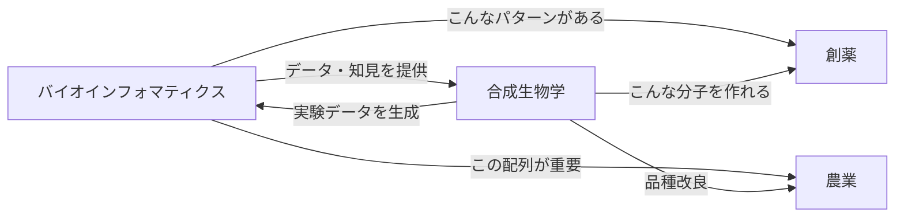

# バイオインフォマティクスと合成生物学の違い

## 🤔 よくある誤解

「バイオインフォマティクス = 薬を作る学問」は**部分的にしか正しくありません**。

## 📊 バイオインフォマティクスとは

### 本質：データから生命を理解する

```
大量の生物データ
↓
パターンを発見
↓
生命現象を理解
↓
応用（創薬は一例）
```

### 主な仕事

1. **ゲノム解析**
   - DNAの配列を読んで意味を理解
   - 「この生物の設計図はこうなってる」

2. **進化の解明**
   - 種の系統樹を作る
   - 「人間とチンパンジーはいつ分かれたか」

3. **タンパク質の構造予測**
   - アミノ酸配列から3D構造を予測
   - AlphaFoldが有名

4. **遺伝子の発現解析**
   - どの遺伝子がいつ働くか
   - 「がん細胞で異常に働く遺伝子は何か」

## 🔬 合成生物学との違い

### 合成生物学：生命を設計・作る

```
設計したい機能
↓
DNAをデザイン
↓
実際に合成
↓
生物に組み込む
↓
新しい生物・機能の創造
```

### 具体例の比較

| 分野 | バイオインフォマティクス   | 合成生物学                       |
| ---- | -------------------------- | -------------------------------- |
| 目的 | **理解・解析**             | **設計・創造**                   |
| 例1  | コロナウィルスの変異を追跡 | 光る大腸菌を作る                 |
| 例2  | がん遺伝子を特定           | プラスチックを分解する細菌を設計 |
| 例3  | 薬のターゲットを発見       | 人工的な遺伝子回路を作る         |
| 例4  | タンパク質の機能を予測     | 新しい酵素をデザイン             |

## 🔄 実際の関係性

### 相補的な関係



### 協力の例

1. **創薬での協力**

   ```
   バイオインフォマティクス：標的タンパク質を発見
   ↓
   合成生物学：そのタンパク質を大量生産
   ↓
   バイオインフォマティクス：薬候補をスクリーニング
   ↓
   合成生物学：薬を微生物で生産
   ```

2. **ワクチン開発**

   ```
   バイオインフォマティクス：ウイルスの変異を解析
   ↓
   合成生物学：mRNAワクチンを設計・合成
   ```

## 💊 創薬における役割分担

### バイオインフォマティクスの役割

- **発見**：薬のターゲットを見つける
- **予測**：どんな分子が効きそうか
- **最適化**：副作用を減らす改良案

### 合成生物学の役割

- **生産**：薬を作る微生物を設計
- **改良**：より効果的な分子を作る
- **デリバリー**：薬を届ける仕組みを作る

## 🎯 今学んでいることの位置づけ

### Week 2のモチーフ発見

```
モチーフ発見（バイオインフォマティクス）
↓
「この配列が重要らしい」
↓
創薬チーム：薬のターゲットにする
合成生物学チーム：この配列を改変した生物を作る
進化研究者：この配列がなぜ保存されているか調べる
```

## 🌟 どちらも重要

### バイオインフォマティクスがないと

- 膨大なデータから意味を見出せない
- どこを狙えばいいかわからない
- 実験計画を最適化できない

### 合成生物学がないと

- 発見を実用化できない
- 新しい治療法を作れない
- 理論を実証できない

## 📚 まとめ

- **バイオインフォマティクス**：生命を**理解**する（解析・予測）
- **合成生物学**：生命を**作る**（設計・創造）
- **創薬**：両方の協力で実現

モチーフ発見は「理解」のステップ。これがあって初めて「何を作るべきか」がわかる。

---

_両方できるとスーパーマン。でも、まずは片方を深く理解することが大切。_
