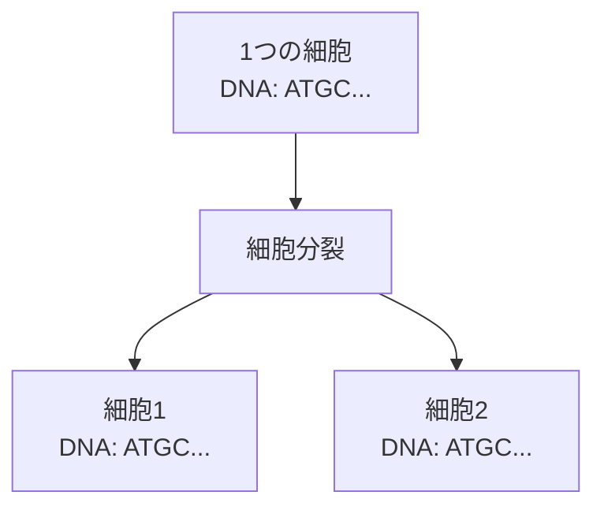
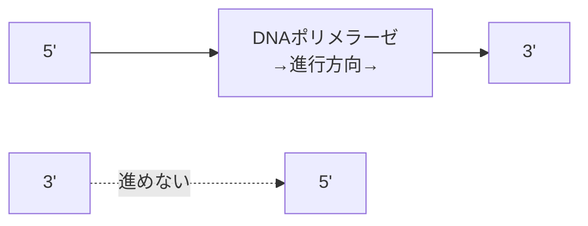

# 生物学の基礎知識

## 🎯 このページの目的

プログラマーがバイオインフォマティクスを学ぶ上で必要な生物学の基礎知識をまとめました。
難しい専門用語もできるだけ分かりやすく説明します。

## 🧬 DNAとは何か

### プログラマー向けの説明

DNAをプログラムのソースコードだと考えてください。

```
プログラミングの世界              生物学の世界
━━━━━━━━━━━━━━━━━━━━━━━━━━━━━━━━━━━━━━━━━━━━━
ソースコード         →          DNA
コンパイル          →          転写（Transcription）
実行ファイル        →          RNA
プログラムの実行     →          翻訳（Translation）
実行結果           →          タンパク質
```

### DNAの基本構造

#### 1. 4文字のアルファベット

DNAは4種類の「文字」（塩基）で書かれています。

- A（アデニン / Adenine）
- T（チミン / Thymine）
- G（グアニン / Guanine）
- C（シトシン / Cytosine）

```python
# DNAはこんな感じの文字列
dna_sequence = "ATGATCAAGGTCGCACTA"

# プログラムで言えば、4進数のようなもの
# 0, 1, 2, 3 の代わりに A, T, G, C を使う
```

#### 2. 相補的なペア（塩基対）

DNAの重要な性質：必ずペアを作る。

- Aは必ずTとペア
- Gは必ずCとペア

```python
def get_complement(base):
    """1つの塩基の相補塩基を返す"""
    pairs = {'A': 'T', 'T': 'A', 'G': 'C', 'C': 'G'}
    return pairs[base]

# 例
print(get_complement('A'))  # T
print(get_complement('G'))  # C
```

#### 3. 二本鎖構造

DNAは2本の鎖がらせん状に絡まった構造（二重らせん）です。

```
5' → ATGATCAAG → 3'  (上の鎖)
     |||||||||
3' ← TACTAGTTC ← 5'  (下の鎖：逆相補鎖)
```

重要なポイント。

- 2本の鎖は逆向き（反並行）
- 片方の鎖が分かれば、もう片方は自動的に決まる

## 🔄 DNA複製とは

### なぜ複製が必要

細胞が分裂するときは、それぞれに同じDNAが必要です。



### 複製の仕組み（超簡略版）

1. DNAがほどける

   ```
   二本鎖 → 一本鎖 + 一本鎖
   ```

2. それぞれの鎖を鋳型にして新しい鎖を作る

   ```
   元の鎖1 + 新しい鎖A → 新しい二本鎖DNA
   元の鎖2 + 新しい鎖B → 新しい二本鎖DNA
   ```

3. 結果：1つのDNAが2つになる

## 🎯 複製起点（OriC）とは

### プログラミングで例えると

```python
# プログラムには「エントリーポイント」がある
def main():  # ← ここから実行が始まる
    print("プログラム開始")

# DNAにも「複製開始ポイント」がある
# それが複製起点（Origin of replication = OriC）
```

### なぜ特定の場所から始まる

理由1：効率性。

- ランダムに始めると混乱する
- 決まった場所から始めることで確実に複製

理由2：制御。

- いつ複製を始めるかをコントロールしやすい
- 必要なタンパク質を集めやすい

## 🔍 DnaAボックスとDnaAタンパク質

### 分かりやすい例え

```
DnaAボックス = パスワード入力欄
DnaAタンパク質 = パスワード

正しいパスワード（DnaAタンパク質）を
正しい場所（DnaAボックス）に入力すると
システム（DNA複製）が起動する
```

### 実際の仕組み

1. DnaAボックス：DNA上の特別な配列（約9文字）

   ```
   例：ATGATCAAG
   ```

2. DnaAタンパク質：この配列を認識して結合するタンパク質

3. 複数のDnaAボックスが必要
   - 通常3〜4個以上
   - 近い距離に存在
   - セキュリティの多要素認証のようなもの

## 📏 ゲノムサイズの感覚

### 身近な例で理解する

| 生物           | ゲノムサイズ | 例えると         |
| -------------- | ------------ | ---------------- |
| ウィルス       | 数千文字     | ツイート数個分   |
| 細菌（大腸菌） | 約460万文字  | 小説10冊分       |
| 人間           | 約30億文字   | 百科事典1000冊分 |

```python
# 大腸菌のゲノムで「ATGATCAAG」を探すのは
# 10冊の本から特定の単語を探すようなもの

ecoli_genome_size = 4_600_000  # 460万文字
pattern = "ATGATCAAG"  # 9文字

# 可能な9文字の組み合わせ
possible_patterns = 4  9  # 262,144通り

# 偶然一致する確率は低い！
```

## 🤔 よくある疑問

### Q1: なぜATGCの4文字だけ

A: 化学的な安定性と情報密度のバランスが良いから。

- 2文字だと情報が少なすぎる
- 6文字以上だと化学的に不安定
- 4文字がちょうど良い

### Q2: DNAとRNAの違いは

A: 簡単に言うと。

- DNA = 永久保存版の設計図（ハードディスク）
- RNA = 一時的なコピー（メモリ）

主な違い。

- DNAはTを使う、RNAはU（ウラシル）を使う
- DNAは二本鎖、RNAは主に一本鎖
- DNAは安定、RNAは不安定（すぐ分解される）

### Q3: 複製にどのくらい時間がかかる

A。

- 大腸菌：約40分で全ゲノムを複製
- 人間：約8時間
- 1秒間に約1000文字をコピー

## 🔬 もう少し詳しく：複製の方向性

### 5'と3'って何

DNAの鎖には方向があります。

```
5' ← 炭素原子の番号
   P-糖-塩基
   |
   P-糖-塩基
   |
   P-糖-塩基
3' ← 炭素原子の番号
```

プログラミングで例えると。

```python
# 配列には順番がある
array = [1, 2, 3, 4, 5]
# 前から読む：1→2→3→4→5
# 後ろから読む：5→4→3→2→1

# DNAも同じ
# 5'→3'方向：ATGC
# 3'→5'方向：CGTA（逆向き）
```

### なぜ方向が重要

#### DNAポリメラーゼは一方向にしか進めない



これが後の講義で出てくる「リーディング鎖」と「ラギング鎖」の話につながります。

## 📚 次のステップ

基礎が分かったら、実際の講義に進みましょう。

1. [DNA複製はゲノムのどこで始まるのか（前編）](../lectures/week1/dna-replication-part1) - 複製起点の探し方
2. [頻出語問題](../algorithms/frequent-words) - 実際のアルゴリズム

## 🎓 まとめ

- DNA = 4文字（ATGC）で書かれた生命の設計図
- 複製起点 = DNA複製が始まる特別な場所
- DnaAボックス = 複製開始の合図となる特別な配列
- 相補性 = AとT、GとCが必ずペアを作る性質

これらの基礎知識があれば、バイオインフォマティクスのアルゴリズムも理解しやすくなります。
