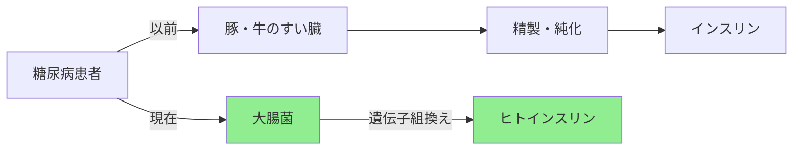
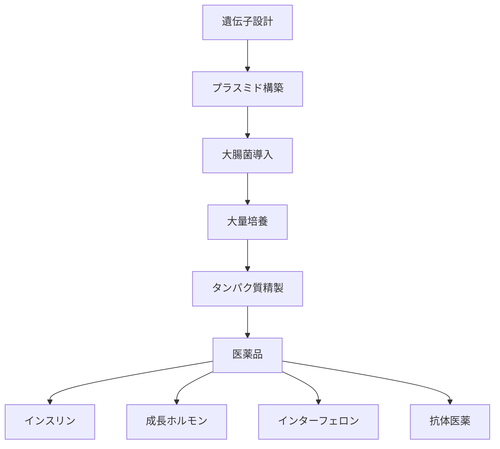

# なぜ大腸菌がこんなに使われるのか（超詳細版）

## 🎯 まず、この講義で何を学ぶのか

最終ゴール：大腸菌が生物学研究の主役である理由と、合成生物学での活用方法を完全理解する。
でも、ちょっと待ってください。そもそも大腸菌って、私たちのお腹にいる細菌じゃないですか。
実は、この身近な微生物が現代生物学の礎を築いたんです。インスリンからmRNAワクチンまで、画期的な医薬品の多くが大腸菌なしでは生まれなかった。今日はその秘密に迫ります。

## 🤔 ステップ0：なぜ大腸菌が重要なのか

### 0-1. そもそもの問題を考えてみよう

想像してください。あなたは新しいタンパク質を作りたい研究者です。例えば、新しい治療薬の候補となるタンパク質や、工業的に有用な酵素を開発したいとします。

しかし、人間の細胞で実験するには深刻な制約があります。まず、ヒト細胞の培養には約24時間という世代時間が必要で、1つの実験に数週間かかってしまいます。これは研究のスピードを著しく遅らせる要因となります。さらに、培養に必要な培地や成長因子、血清などの試薬は非常に高価で、小規模な実験でも1回あたり数十万円のコストがかかることも珍しくありません。そして何より、ヒト由来の細胞を扱うことには倫理的な配慮が必要で、厳格な規制と承認プロセスを経なければなりません。

これらの制約を前に、研究者たちはどうすればよいのでしょうか。答えは、もっとシンプルで扱いやすい生物を使うことです。

### 0-2. 驚きの事実

実は、その答えが大腸菌なのです。大腸菌は驚くべき特性を持っています。
まずはその増殖速度です。最適な条件下ではわずか20分で倍増します。これは人間の細胞と比較すると実に72倍の速さです。この高速な増殖により、朝に実験を開始すれば、その日の夕方には結果を確認できるという、研究開発のサイクルを劇的に短縮できるのです。

経済的な面でも大腸菌は革命的です。培養に必要なLB培地（Luria-Bertani培地）は、主に酵母エキス、トリプトン、塩化ナトリウムといった安価な成分で構成され、1リットルあたり約100円という低コストで調製できます。これは哺乳類の細胞を培養する場合に比べて1/1000以下のコストです。

遺伝子操作の容易さも特筆すべき点です。プラスミドという環状DNAを使った遺伝子導入は、確立された手法により高い再現性で実行でき、特別な技術や高価な機器を必要としません。そして培養条件も非常にシンプルで、37℃という体温と同じ温度さえ維持できれば、どこでも培養が可能です。

これらの特性により、大腸菌はまさに生物学のプログラミング言語と呼べる存在になっているのです。プログラマーがコードを書いて実行するように、研究者は遺伝子を設計して大腸菌に導入し、目的のタンパク質を生産させることができるのです。

## 📖 ステップ1：大腸菌の基本スペック

### 1-1. 大腸菌って何者なのか

```
大腸菌（Escherichia coli, E. coli）
├── 分類：細菌（バクテリア）
├── サイズ：約2μm（髪の毛の太さの1/50）
├── ゲノムサイズ：約460万塩基対
├── 遺伝子数：約4,300個
└── 世代時間：20分（最適条件下）
```

人間のゲノムが30億塩基対なのに対し、大腸菌はたった460万。まるで超コンパクトな生命のマイコンピュータです。

### 1-2. なぜこんなに速く増えるのか

```python
def bacterial_growth(initial_cells=1, minutes=120):
    """
    大腸菌の増殖シミュレーション
    20分ごとに倍増する
    """
    generations = minutes // 20  # 何世代経過したか
    final_cells = initial_cells * (2  generations)

    print(f"開始時: {initial_cells}個")
    print(f"{minutes}分後: {final_cells:,}個")
    print(f"つまり{generations}世代で{final_cells/initial_cells:,.0f}倍になります")

    return final_cells

# 実験してみよう
bacterial_growth(1, 120)  # 2時間後
# 開始時: 1個
# 120分後: 64個
# つまり6世代で64倍になります

bacterial_growth(1, 480)  # 8時間後
# 開始時: 1個
# 480分後: 16,777,216個
# つまり24世代で16,777,216倍になります
```

たった8時間で1個の細胞が1600万個になります。これが大腸菌の素晴らしい増殖力です。

## 📖 ステップ2：歴史的ブレークスルー

### 2-1. ノーベル賞の宝庫

大腸菌研究から生まれたノーベル賞を紹介します。

1. 1958年：DNAの半保存的複製の発見
   - 私たちが学んだDNA複製の仕組み
2. 1965年：遺伝子制御の解明
   - ラクトースオペロン（Week2のモチーフ発見に関連）
3. 1978年：制限酵素の発見
   - DNAを切る「はさみ」の発見
4. 2008年：GFP（緑色蛍光タンパク質）
   - 大腸菌で大量生産

### 2-2. インスリン製造革命（1978年）



遺伝子組換え大腸菌により次のような利点があります。

- コスト1/100以下に
- アレルギー反応激減
- 供給量無限に

## 📖 ステップ3：プラスミドという魔法の道具

### 3-1. プラスミドって何なのか

でも待って、どうやって大腸菌に人間の遺伝子を入れるのでしょうか。

答えは、プラスミドという小さな環状DNAを使うことです。

```
プラスミドのイメージ：
    染色体DNA（本体）
         ↓
    ╔═══════════╗
    ║  大腸菌    ║
    ║   ○←プラスミド（追加パーツ）
    ║  〜〜〜    ║ ← 染色体（4.6Mb）
    ╚═══════════╝

プラスミド = 取り外し可能なUSBメモリのようなものです。
```

### 3-2. プラスミドの構造

```python
class Plasmid:
    """
    プラスミドの基本構造
    """
    def __init__(self):
        self.components = {
            "origin": "複製開始点（OriC）",  # Week1で学んだ内容
            "promoter": "プロモーター（遺伝子ON/OFFスイッチ）",  # Week2のモチーフ
            "gene": "目的の遺伝子（インスリンなど）",
            "antibiotic_resistance": "抗生物質耐性遺伝子",
            "restriction_sites": "制限酵素認識配列"
        }

    def explain_component(self, component):
        """各パーツの役割を説明"""
        explanations = {
            "origin": "プラスミドが細胞内で複製されるための開始点",
            "promoter": "遺伝子の発現をコントロール（強さ調節可能）",
            "gene": "作りたいタンパク質の設計図",
            "antibiotic_resistance": "プラスミドを持つ細胞だけを選別",
            "restriction_sites": "DNAを切り貼りする場所"
        }
        return explanations.get(component, "不明なコンポーネント")
```

### 3-3. プラスミド導入の実際

```python
def transform_bacteria():
    """
    大腸菌へのプラスミド導入プロセス
    これをトランスフォーメーションという
    """
    steps = [
        "1. 大腸菌を氷冷CaCl2溶液に懸濁（細胞膜を透過しやすく）",
        "2. プラスミドDNAを加える",
        "3. 42℃で45秒ヒートショック（細胞膜に穴を開ける）",
        "4. 氷上で2分冷却（穴を閉じる）",
        "5. 培地で37℃培養",
        "6. 抗生物質入り培地でセレクション"
    ]

    for step in steps:
        print(f"→ {step}")

    print("\n成功率：約0.01-0.1%だけど、")
    print("大腸菌が1億個いれば10万個は成功します")

transform_bacteria()
```

## 📖 ステップ4：合成生物学での活躍

### 4-1. 合成生物学とは

```
バイオインフォマティクス：生命を「読む」（解析）
        ↓↑
合成生物学：生命を「書く」（創造）
```

大腸菌は生命のプログラミング実行環境です。

### 4-2. 実際の応用例

#### 例1：バイオ燃料生産

```python
def biofuel_production():
    """
    大腸菌でバイオ燃料を作る
    """
    pathway = {
        "step1": "糖を取り込む",
        "step2": "代謝経路を改変",
        "step3": "エタノールやブタノールを生産",
        "step4": "細胞外に分泌"
    }

    print("通常の大腸菌：糖 → エネルギー（ATP）")
    print("改変大腸菌：糖 → バイオ燃料")

    efficiency = 0.4  # 理論収率の40%
    sugar_kg = 1
    fuel_liters = sugar_kg * efficiency
    print(f"\n砂糖1kg → {fuel_liters}リットルの燃料")
```

#### 例2：医薬品生産



### 4-3. カーボンニュートラル生産

最新の応用として、CO2を食べる大腸菌があります。

```python
def carbon_neutral_ecoli():
    """
    炭素固定能を持つ大腸菌の設計
    光合成細菌の遺伝子を導入
    """
    modifications = {
        "RuBisCO": "CO2固定酵素（植物から）",
        "カルビンサイクル": "CO2を糖に変換する経路",
        "エネルギー供給": "水素や電気から"
    }

    print("通常：糖 → 大腸菌 → 産物 + CO2")
    print("改変：CO2 → 大腸菌 → 産物")
    print("\nつまり、CO2を原料にものづくりができます")

    return "2021年にイスラエルで成功"
```

## 📖 ステップ5：なぜ他の生物じゃダメなのか

### 5-1. 他の候補との比較

```python
def compare_organisms():
    """
    研究用生物の比較
    """
    organisms = {
        "大腸菌": {
            "増殖時間": "20分",
            "培養コスト": "低",
            "遺伝子操作": "超簡単",
            "安全性": "高（K-12株）",
            "タンパク質生産": "高速"
        },
        "酵母": {
            "増殖時間": "90分",
            "培養コスト": "中",
            "遺伝子操作": "簡単",
            "安全性": "高",
            "タンパク質生産": "糖鎖修飾可能"
        },
        "昆虫細胞": {
            "増殖時間": "24時間",
            "培養コスト": "高",
            "遺伝子操作": "難しい",
            "安全性": "中",
            "タンパク質生産": "複雑なタンパク質可"
        },
        "哺乳類細胞": {
            "増殖時間": "24-48時間",
            "培養コスト": "超高",
            "遺伝子操作": "難しい",
            "安全性": "要注意",
            "タンパク質生産": "ヒト型に近い"
        }
    }

    for org, props in organisms.items():
        print(f"\n【{org}】")
        for key, value in props.items():
            print(f"  {key}: {value}")

    print("\n→ 基礎研究なら大腸菌が圧倒的に有利です")
```

### 5-2. 大腸菌の限界

でも、大腸菌にも弱点があります。これらの限界を理解することは、発現系を選択する上で極めて重要です。

1. 糖鎖修飾ができない

   哺乳類の細胞で作られるタンパク質の多くは、翻訳後に糖鎖が付加される。この糖鎖修飾は、タンパク質の安定性、活性、体内動態に重要な役割を果たす。例えば、抗体医薬品のFc領域の糖鎖は、`抗体依存性細胞傷害活性（ADCC）`に必須。しかし、原核生物である大腸菌には小胞体やゴルジ体といった糖鎖修飾する細胞小器官が存在しないため、この重要な修飾を再現できない。

2. ジスルフィド結合形成が苦手

   多くの分泌タンパク質や細胞外タンパク質は、正しい立体構造を維持するためにジスルフィド結合を必要とする。しかし、大腸菌の細胞質は還元的環境（グルタチオンやチオレドキシンが豊富）であるため、ジスルフィド結合が形成されにくい。この問題を回避するため、酸化的環境であるペリプラズム空間への分泌や、特殊な酸化還元環境を持つ変異株（例：Origami株）の使用が必要になる場合がある。

3. 大腸菌にとって毒性のあるタンパク質は条件次第
   - 正確には「まったく作れない」のではなく、強い毒性があると高発現で増殖阻害や細胞死を招き、生産が難しくなる
   - 宿主である大腸菌に無害なタンパク質なら通常どおり生産できる
   - 発現を厳密に制御できる系を用いると、毒性による影響を抑えて生産できる場合がある
   - 例としては誘導発現、低コピー数プラスミド、低温発現、融合タグやペリプラズム分泌、DE3やBL21などの発現に最適化された宿主株の選択
   - それでも強い毒性で困難な場合は、別宿主（酵母・昆虫・哺乳類細胞）や細胞フリー系の利用を検討する

## 📖 ステップ6：安全性はどうなのか

### 6-1. 実験室株K-12の秘密

```
野生の大腸菌：腸内で生存可能、時に病原性
        ↓ 1922年から研究室で継代培養
K-12株：もはや自然界では生きられません。
```

大腸菌K-12株には興味深い歴史があります。1922年、スタンフォード大学のClifford Dobell博士が、回復期の患者から分離した大腸菌を研究室で継代培養し始めました。それから100年以上、研究室という特殊な環境で世代を重ねた結果、K-12株は野生の大腸菌とは全く異なる性質を獲得しました。

最も重要な変化は、腸内での生存能力の喪失です。野生の大腸菌が持っていた腸管への付着因子や、他の腸内細菌との競合に必要な遺伝子が失われ、もはや人間の腸内では定着できなくなりました。さらに、病原性に関わる遺伝子群も欠失しており、たとえ体内に入っても病気を引き起こす能力がありません。

加えて、K-12株は栄養要求性を獲得しています。つまり、研究室で供給される特定のアミノ酸やビタミンがなければ生存できず、自然環境では即座に死滅してしまいます。また、野生株が持つ抗生物質耐性も失われており、一般的な抗生物質に対して感受性を示します。

これらの特徴により、K-12株は究極に安全な実験生物となっているのです。

### 6-2. バイオセーフティレベル

```python
def biosafety_levels():
    """
    バイオセーフティレベルの説明
    """
    levels = {
        "BSL1": {
            "リスク": "最小",
            "例": "大腸菌K-12株",
            "設備": "通常の実験台でOK"
        },
        "BSL2": {
            "リスク": "中程度",
            "例": "病原性大腸菌",
            "設備": "安全キャビネット必要"
        },
        "BSL3": {
            "リスク": "高",
            "例": "結核菌",
            "設備": "陰圧室、HEPAフィルター"
        },
        "BSL4": {
            "リスク": "最高",
            "例": "エボラウイルス",
            "設備": "完全隔離施設"
        }
    }

    print("大腸菌K-12はBSL1 = 高校の理科室でも扱える安全性です")
```

## 📝 まとめ：今日学んだことを整理

### レベル1：表面的理解（これだけでもOK）

- 大腸菌は20分で倍増する高速増殖生物
- プラスミドを使って遺伝子を導入できる
- インスリンなど多くの医薬品生産に使われている

### レベル2：本質的理解（ここまで来たら素晴らしい）

- 大腸菌は生物学研究の標準プラットフォーム
- プラスミドはプログラム可能な遺伝子カセット
- 合成生物学では生きた工場として機能
- K-12株は究極に安全化された実験生物

### レベル3：応用的理解（プロレベル）

- OriCとプロモーターの知識でプラスミド設計が可能
- トランスフォーメーション効率を理解して実験計画立案
- 大腸菌の限界を知り、他の発現系との使い分けができる
- カーボンニュートラル生産など最先端応用を理解

## 🚀 次回予告

次回は「プラスミド設計の実践」です。

- 実際にインスリン生産用プラスミドを設計
- BioPythonを使った配列設計
- 制限酵素地図の作成

大腸菌とプラスミドの知識を活かして、実際にバイオエンジニアリングに挑戦します。

## 📚 もっと学びたい人へ

### 実験してみよう

```python
# 大腸菌の世代時間計算機
def generation_calculator(target_cells=1e9, initial_cells=1):
    """
    目標細胞数に達するまでの時間を計算
    """
    import math
    generations = math.log2(target_cells / initial_cells)
    minutes = generations * 20
    hours = minutes / 60

    print(f"目標：{target_cells:,.0f}個")
    print(f"必要世代数：{generations:.1f}")
    print(f"必要時間：{hours:.1f}時間")

    return hours

# 1個から10億個まで
generation_calculator(1e9, 1)
```

### 関連トピック

- [DNA複製の仕組み](../lectures/week1/dna-replication-part1) - OriCの詳細
- [モチーフ発見](../lectures/week2/motif-finding-part1) - プロモーターの仕組み
- [合成生物学入門](./bioinformatics-vs-synthetic-biology) - 読むvs書く

---

_次回もお楽しみに。大腸菌の世界は奥が深い。_
