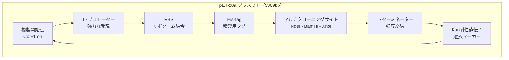

# プラスミド設計の実践（超詳細版）

## 🎯 まず、この講義で何を学ぶのか

最終ゴール：**実際にインスリン生産用プラスミドを設計し、大腸菌でタンパク質を作る方法を完全習得する**

でも、ちょっと待ってください。プラスミドを設計するって、一体どういうことなのでしょうか。
実は、これはまるで**生物版のプログラミング**なんです。今日は実際に手を動かして、インスリンを作る大腸菌をデザインしてみましょう。

## 🤔 ステップ0：なぜプラスミド設計が重要なのか

### 0-1. そもそもの問題を考えてみよう

あなたは製薬会社の研究者です。糖尿病患者のためにインスリンを大量生産したい。でも次のような課題があります。

- ヒトの遺伝子を大腸菌にそのまま入れても動かない
- プロモーターの強さを調整しないと生産量が少ない
- 精製しやすいタグを付けないと取り出せない
- 選別マーカーがないと成功した細胞を見分けられない

じゃあ、どうすればいいのでしょうか。

### 0-2. 驚きの事実

実は、プラスミドは**カスタマイズ可能な遺伝子カセット**です。

- 必要なパーツを組み合わせて設計
- BioPythonでシミュレーション可能
- 実際に注文して手に入る（1週間、数万円）
- 成功すれば1リットルで数グラムのタンパク質生産

つまり、プラスミド設計は**生命をプログラムする技術**そのものです。

## 📖 ステップ1：プラスミドの基本構造を理解する

### 1-1. プラスミドの必須要素

```python
class PlasmidComponents:
    """
    プラスミドに必要な要素
    """
    def __init__(self):
        self.essential = {
            "ori": "複製開始点（Origin of Replication）",
            "promoter": "プロモーター（転写開始シグナル）",
            "rbs": "リボソーム結合部位（翻訳開始）",
            "gene": "目的遺伝子（インスリンなど）",
            "terminator": "ターミネーター（転写終結）",
            "selection": "選択マーカー（抗生物質耐性）",
            "mcs": "マルチクローニングサイト（制限酵素部位）"
        }

    def explain(self, component):
        """各要素の詳細説明"""
        details = {
            "ori": "大腸菌内でプラスミドが複製されるための開始点。高コピー（100-200）か低コピー（10-20）を選択",
            "promoter": "転写の強さを決める。T7、lac、trcなど様々な種類がある",
            "rbs": "Shine-Dalgarno配列。リボソームが結合して翻訳を開始",
            "gene": "作りたいタンパク質の設計図。コドン最適化が重要",
            "terminator": "転写を確実に終了させる。rrnBが一般的",
            "selection": "プラスミドを持つ細胞だけが生き残る仕組み",
            "mcs": "遺伝子を挿入するための場所。複数の制限酵素サイト"
        }
        return details.get(component, "不明")

# 実際に見てみよう
plasmid = PlasmidComponents()
for key, value in plasmid.essential.items():
    print(f"{key}: {value}")
    print(f"  → {plasmid.explain(key)}\n")
```

### 1-2. 実際のプラスミド地図



## 📖 ステップ2：インスリン遺伝子の準備

### 2-1. ヒトインスリンの構造

```python
def insulin_structure():
    """
    ヒトインスリンの構造
    プロインスリン → インスリン（A鎖 + B鎖）
    """
    # プロインスリンの配列（簡略化）
    proinsulin = {
        "signal": "MALWMRLLPL",  # シグナルペプチド（24aa）
        "b_chain": "FVNQHLCGSH...",  # B鎖（30aa）
        "c_peptide": "EAEDLQVGQ...",  # Cペプチド（31aa）
        "a_chain": "GIVEQCCTSI..."  # A鎖（21aa）
    }

    print("プロインスリンの構造：")
    print("シグナル - B鎖 - Cペプチド - A鎖")
    print("\n成熟インスリン：")
    print("B鎖 ←S-S結合→ A鎖")
    print("（Cペプチドは切断される）")

    return proinsulin
```

### 2-2. コドン最適化の重要性

```python
def codon_optimization():
    """
    大腸菌用にコドンを最適化
    同じアミノ酸でも使用頻度の高いコドンを選ぶ
    """
    # 例：アルギニン（Arg）のコドン
    codons = {
        "CGT": 0.38,  # 大腸菌での使用頻度38%
        "CGC": 0.40,  # 40% ← これを選ぶ
        "CGA": 0.06,  # 6%（レアコドン、避ける）
        "CGG": 0.10,  # 10%
        "AGA": 0.04,  # 4%（レアコドン）
        "AGG": 0.02   # 2%（レアコドン）
    }

    print("アルギニンのコドン使用頻度（大腸菌）：")
    for codon, freq in sorted(codons.items(), key=lambda x: x[1], reverse=True):
        bar = "■" * int(freq * 100)
        status = "推奨" if freq > 0.15 else "避ける"
        print(f"{codon}: {bar} {freq:.0%} [{status}]")

    print("\n結論：CGCまたはCGTを使用する")
```

## 📖 ステップ3：BioPythonで実際に設計する

### 3-1. 必要なライブラリのインストール

```python
# インストールコマンド
# pip install biopython

from Bio import SeqIO
from Bio.Seq import Seq
from Bio.SeqRecord import SeqRecord
from Bio.SeqFeature import SeqFeature, FeatureLocation
import Bio.Restriction as Restriction
```

### 3-2. プラスミドの設計

```python
def design_insulin_plasmid():
    """
    インスリン生産用プラスミドの設計
    """
    # 1. 基本配列の定義
    components = {
        "t7_promoter": "TAATACGACTCACTATAGGG",
        "rbs": "AGGAGGT",  # Shine-Dalgarno配列
        "his_tag": "ATGCACCACCACCACCACCAC",  # 6xHis-tag
        "ndeI": "CATATG",  # 制限酵素サイト
        "insulin": "ATGTTCGTCAACCAACACCTGTGCGGCTCACAC...",  # インスリン遺伝子（最適化済み）
        "bamHI": "GGATCC",  # 制限酵素サイト
        "terminator": "CTAGCATAACCCCTTGGGGCCTCTAAACGGGTCT"
    }

    # 2. 配列を連結
    full_sequence = ""
    for name, seq in components.items():
        full_sequence += seq
        print(f"{name}: {len(seq)}bp 追加")

    # 3. Seqオブジェクトの作成
    plasmid_seq = Seq(full_sequence)

    # 4. 制限酵素チェック
    print("\n制限酵素サイト確認：")
    for enzyme_name in ["NdeI", "BamHI", "EcoRI", "XhoI"]:
        enzyme = getattr(Restriction, enzyme_name)
        sites = enzyme.search(plasmid_seq)
        print(f"{enzyme_name}: {len(sites)}サイト")

    return plasmid_seq

# 実行
plasmid = design_insulin_plasmid()
```

### 3-3. 制限酵素地図の作成

```python
def create_restriction_map(sequence):
    """
    制限酵素地図を作成
    """
    # よく使う制限酵素
    enzymes = [
        Restriction.EcoRI,
        Restriction.BamHI,
        Restriction.HindIII,
        Restriction.PstI,
        Restriction.SalI,
        Restriction.XbaI,
        Restriction.NdeI,
        Restriction.XhoI
    ]

    print("制限酵素地図：")
    print("-" * 50)

    for enzyme in enzymes:
        sites = enzyme.search(sequence)
        if sites:
            print(f"{enzyme.__name__:10} 切断位置: {sites}")
            for site in sites:
                # 切断部位の前後10塩基を表示
                start = max(0, site - 10)
                end = min(len(sequence), site + 10)
                context = sequence[start:end]
                print(f"  位置{site}: ...{context}...")

    return enzymes
```

## 📖 ステップ4：発現条件の最適化

### 4-1. プロモーターの選択

```python
def promoter_comparison():
    """
    プロモーターの強さ比較
    """
    promoters = {
        "T7": {
            "strength": "超強力",
            "control": "IPTG誘導",
            "leakiness": "低",
            "用途": "大量生産"
        },
        "lac": {
            "strength": "中程度",
            "control": "IPTG誘導",
            "leakiness": "中",
            "用途": "調節可能な発現"
        },
        "trc": {
            "strength": "強力",
            "control": "IPTG誘導",
            "leakiness": "低",
            "用途": "高発現"
        },
        "araBAD": {
            "strength": "調節可能",
            "control": "アラビノース",
            "leakiness": "極低",
            "用途": "厳密な制御"
        }
    }

    print("プロモーター比較表：")
    print("=" * 60)
    for name, props in promoters.items():
        print(f"\n【{name}プロモーター】")
        for key, value in props.items():
            print(f"  {key}: {value}")

    print("\n推奨：インスリンには漏れの少ないT7が最適")
```

### 4-2. 培養条件の最適化

```python
def optimization_protocol():
    """
    タンパク質生産の最適化プロトコル
    """
    protocol = {
        "1. 前培養": {
            "培地": "LB + カナマイシン(50μg/ml)",
            "温度": "37℃",
            "時間": "一晩",
            "振盪": "200rpm"
        },
        "2. 本培養": {
            "培地": "TB培地（栄養豊富）",
            "接種": "前培養の1/100量",
            "温度": "37℃",
            "OD600": "0.6-0.8まで培養"
        },
        "3. 誘導": {
            "誘導剤": "IPTG 1mM",
            "温度": "下げる（20-30℃）",
            "理由": "封入体形成を防ぐ",
            "時間": "4-16時間"
        },
        "4. 収穫": {
            "遠心": "4,000g, 15分",
            "洗浄": "PBS緩衝液",
            "保存": "-80℃または即精製"
        }
    }

    for step, details in protocol.items():
        print(f"\n{step}")
        for key, value in details.items():
            print(f"  {key}: {value}")

    print("\n期待収量：1リットルあたり100-500mg")
```

## 📖 ステップ5：トラブルシューティング

### 5-1. よくある問題と解決法

```python
def troubleshooting_guide():
    """
    よくある問題と解決法
    """
    problems = {
        "発現量が低い": [
            "コドンを最適化する",
            "プロモーターを強いものに変更",
            "培地を栄養豊富なものに変更",
            "誘導条件を最適化"
        ],
        "封入体ができる": [
            "誘導温度を下げる（16-20℃）",
            "IPTG濃度を下げる（0.1-0.5mM）",
            "シャペロンを共発現",
            "可溶性タグ（MBP、GST）を付加"
        ],
        "タンパク質が分解される": [
            "プロテアーゼ欠損株を使用",
            "培養温度を下げる",
            "プロテアーゼ阻害剤を添加",
            "精製を迅速に行う"
        ],
        "毒性がある": [
            "厳密に制御できるプロモーター使用",
            "低コピープラスミド使用",
            "誘導を遅い時期に行う"
        ]
    }

    for problem, solutions in problems.items():
        print(f"\n問題：{problem}")
        for i, solution in enumerate(solutions, 1):
            print(f"  解決策{i}: {solution}")
```

### 5-2. 成功の確認方法

```python
def validation_methods():
    """
    発現確認の方法
    """
    methods = {
        "1. コロニーPCR": {
            "目的": "プラスミド導入の確認",
            "時間": "3時間",
            "コスト": "低"
        },
        "2. 制限酵素処理": {
            "目的": "挿入断片の確認",
            "時間": "4時間",
            "コスト": "低"
        },
        "3. SDS-PAGE": {
            "目的": "タンパク質発現の確認",
            "時間": "4時間",
            "コスト": "中"
        },
        "4. Western blot": {
            "目的": "特異的検出（His-tag）",
            "時間": "1-2日",
            "コスト": "高"
        },
        "5. 活性測定": {
            "目的": "機能の確認",
            "時間": "様々",
            "コスト": "様々"
        }
    }

    print("段階的な確認方法：")
    for method, details in methods.items():
        print(f"\n{method}")
        for key, value in details.items():
            print(f"  {key}: {value}")
```

## 📖 ステップ6：実際の注文から実験まで

### 6-1. プラスミド合成サービス

```python
def plasmid_synthesis_services():
    """
    プラスミド合成サービスの比較
    """
    services = {
        "GenScript": {
            "価格": "10万円〜",
            "納期": "2-3週間",
            "特徴": "コドン最適化込み"
        },
        "IDT": {
            "価格": "8万円〜",
            "納期": "2週間",
            "特徴": "gBlocksで部分合成も可"
        },
        "Twist Bioscience": {
            "価格": "5万円〜",
            "納期": "3-4週間",
            "特徴": "大規模合成に強い"
        },
        "国内サービス": {
            "価格": "15万円〜",
            "納期": "1-2週間",
            "特徴": "サポートが充実"
        }
    }

    print("プラスミド合成サービス比較：")
    for service, info in services.items():
        print(f"\n【{service}】")
        for key, value in info.items():
            print(f"  {key}: {value}")

    print("\n推奨：初心者は国内サービスがサポート充実")
```

### 6-2. 実験プロトコルの実例

```python
def actual_experiment_protocol():
    """
    実際の実験手順（1日の流れ）
    """
    schedule = {
        "9:00": "前培養から本培養へ植え継ぎ",
        "9:30": "培養開始（37℃、200rpm）",
        "11:30": "OD600測定（約0.3）",
        "13:00": "OD600測定（約0.6）→ IPTG添加",
        "13:30": "温度を25℃に下げて誘導培養",
        "17:30": "サンプリング（発現確認用）",
        "18:00": "一晩誘導培養継続",

        "翌日9:00": "菌体回収（遠心分離）",
        "10:00": "細胞破砕（超音波or French press）",
        "11:00": "遠心分離（可溶性画分の取得）",
        "13:00": "Ni-NTAカラムで精製開始",
        "15:00": "溶出・透析",
        "17:00": "SDS-PAGEで確認",
        "18:00": "濃度測定・保存"
    }

    print("インスリン生産の実験スケジュール：")
    print("=" * 50)
    for time, task in schedule.items():
        print(f"{time}: {task}")

    print("\n総収量：1Lから約200mgのインスリン")
```

## 📝 まとめ：今日学んだことを整理

### レベル1：表面的理解（これだけでもOK）

- プラスミドは遺伝子を運ぶベクター
- 必要な要素を組み合わせて設計する
- BioPythonで配列設計ができる
- 合成サービスで注文可能

### レベル2：本質的理解（ここまで来たら素晴らしい）

- プロモーター、RBS、ターミネーターの役割を理解
- コドン最適化の重要性を認識
- 制限酵素サイトの設計ができる
- 発現条件の最適化方法を理解
- トラブルシューティングの基本を習得

### レベル3：応用的理解（プロレベル）

- 複数の遺伝子を同時発現させる設計
- 代謝経路全体の再構築
- CRISPR/Cas9用のプラスミド設計
- 自動化された大規模スクリーニング
- 特許を考慮した配列設計

## 🚀 次回予告

次回は「**タンパク質精製の実践**」です。

- His-tagを使った精製の詳細
- カラムクロマトグラフィーの原理
- 純度の評価方法
- 活性測定の実際

せっかく作ったインスリン、きれいに精製して薬にする方法を学びます。

## 📚 もっと学びたい人へ

### 実践課題

```python
# 課題：自分の好きなタンパク質のプラスミドを設計してみよう
def design_your_protein():
    """
    例：GFP（緑色蛍光タンパク質）の設計
    """
    # 1. タンパク質を選ぶ
    # 2. 配列を取得（NCBI、UniProt）
    # 3. コドン最適化
    # 4. プラスミドマップ作成
    # 5. 制限酵素サイト確認
    pass
```

### 役立つリソース

- [Addgene](https://www.addgene.org/) - プラスミドデータベース
- [NEB](https://www.neb.com/) - 制限酵素、クローニングツール
- [SnapGene](https://www.snapgene.com/) - プラスミド設計ソフト（有料）
- [Benchling](https://www.benchling.com/) - 無料の配列設計ツール

### 関連トピック

- [大腸菌の基礎](./e-coli-why-so-important) - なぜ大腸菌を使うのか
- [DNA複製の仕組み](../lectures/week1/dna-replication-part1) - OriCの詳細
- [モチーフ発見](../lectures/week2/motif-finding-part1) - プロモーターの仕組み

---

_次回もお楽しみに。タンパク質精製の世界へ。_
