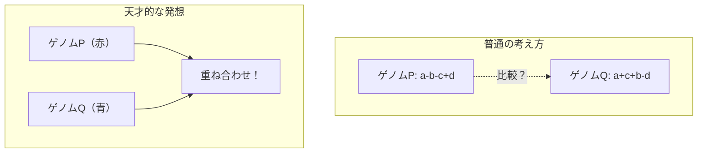
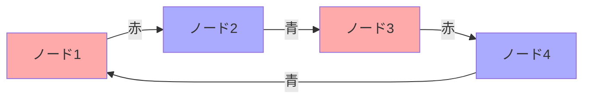

# ブレークポイントグラフ：ゲノム再配列研究の主力（超詳細版）

## 🎯 まず、この講義で何を学ぶのか

最終ゴール：**2つのゲノムの違いを「グラフ」として見える化し、進化の距離を計算できるようになる**

でも、ちょっと待ってください。そもそも「2つのゲノムを重ね合わせる」って何？グラフって数学のグラフ？なぜそんなことが必要なの？

実は、これまで学んできた「リバーサル」「転座」「融合」「分裂」といった複雑な操作を、**たった一つの美しい数式**で表現できる魔法のような手法なんです。

## 🤔 ステップ0：なぜブレークポイントグラフが重要なの？

### 0-1. そもそもの問題を思い出してみよう

```python
# マウスとヒトのゲノム（簡略化）
mouse_genome = [1, 2, 3, 4, 5, 6, 7, 8, 9, 10]
human_genome = [1, -3, -2, 4, 5, 6, -10, -9, -8, 7]

# 問題：マウスからヒトに進化するのに、最低何回の再配列が必要？
```

この問題、これまでは「とても難しい」と言ってきました。でも実は...

### 0-2. 驚きの事実

ブレークポイントグラフを使うと、この問題が **O(n)時間**（つまり超高速）で解けてしまうんです！

なぜ？どうやって？それをこれから探っていきましょう。

## 📖 ステップ1：2つのゲノムを「重ね合わせる」という発想

### 1-1. まず、素朴な疑問から

2つのゲノムを比較したいとき、普通はどうしますか？

```python
# 普通のアプローチ：並べて見る
genome_P = ["+a", "-b", "-c", "+d"]
genome_Q = ["+a", "+c", "+b", "-d"]

# うーん、違いはわかるけど...どう違うのか数値化できない！
```

### 1-2. ここで天才的な発想が

もし、2つのゲノムを「重ね合わせる」ことができたら？

でも待って、どうやって重ね合わせるの？位置も順番も違うのに？



## 🎨 ステップ2：「黒エッジ」という共通言語を作る

### 2-1. なぜ重ね合わせられないのか

ゲノムPとゲノムQは、同じブロック（a, b, c, d）を持っているけど、順番が違う。

つまり、**座標系が違う**んです！

これは、東京の地図とニューヨークの地図を重ねようとするようなもの。

### 2-2. そこで「黒エッジ」の登場

```python
def create_black_edges():
    """
    黒エッジ = シンテニーブロックそのもの
    これは両方のゲノムで共通！
    """

    # ブロック'a'の黒エッジ（頭と尾をつなぐ）
    black_edge_a = ("a_tail", "a_head")

    # これはPでもQでも同じ！
    print("これが共通言語になる！")
```

### 2-3. ここがポイント

黒エッジは「ブロックの内部構造」を表す。これは進化しても変わらない！

だから、これを基準に2つのゲノムを重ね合わせることができる。

## 🔄 ステップ3：Qの順番をPに合わせる魔法

### 3-1. 問題の核心

```python
# 今の状態
P = ["+a", "-b", "-c", "+d"]  # Pの順番
Q = ["+a", "+c", "+b", "-d"]  # Qの順番（バラバラ）

# どうやって重ねる？
```

### 3-2. ここで魔法のアイデア

#### Qの黒エッジをPと同じ順番に並べ直す

でも、ちょっと待って。順番を変えたらゲノムが変わっちゃうんじゃ...？

### 3-3. いいえ、大丈夫！なぜなら

```python
def rearrange_Q_blocks():
    """
    Qの'見せ方'を変えるだけで、Qの'本質'は変わらない
    """

    # Pの黒エッジの順番：a, b, c, d

    # Qを同じ順番で'表現し直す'
    print("Qの新しい表現を作る：")
    print("  aの次は？ → Qではcに行く")
    print("  bの次は？ → Qでは（bはcの後）")
    print("  cの次は？ → Qではbに行く")
    print("  dの次は？ → Qではaに戻る")

    # つまり、Qは'a→c→b→-d→a'というサイクル！
```

これは同じ円を違う点から描き始めるようなもの！

## 🔴🔵 ステップ4：赤と青のエッジが語る物語

### 4-1. 赤エッジ = Pの隣接関係

```python
# Pでは、aの後にはbが来る（正確には-b）
red_edge_1 = ("a_head", "b_tail")  # Pでの隣接

# これがPの「指紋」のようなもの
```

### 4-2. 青エッジ = Qの隣接関係

```python
# Qでは、aの後にはcが来る
blue_edge_1 = ("a_head", "c_tail")  # Qでの隣接

# これがQの「指紋」
```

### 4-3. そして重ね合わせると

```python
def create_breakpoint_graph():
    """
    魔法の瞬間：2つの指紋が交差する！
    """

    # 各ノードで何が起きているか見てみよう
    node = "a_head"

    print(f"{node}では：")
    print(f"  - 赤エッジ（P）：b_tailへ")
    print(f"  - 青エッジ（Q）：c_tailへ")
    print(f"  → つまり、各ノードから2本のエッジが出る！")
```

## 🌀 ステップ5：なぜ必ずサイクルができるのか

### 5-1. ここで重要な観察

各ノードの「次数」（つながっているエッジの数）を数えてみましょう：

```python
def count_node_degrees():
    """
    各ノードの次数を数える
    """
    node = "a_head"

    incoming = 1  # 黒エッジから来る
    outgoing_red = 1  # 赤エッジで出る
    outgoing_blue = 1  # 青エッジで出る

    # あれ？計算が合わない？

    print("実は、黒エッジは無視して考える！")
    print("赤と青だけ見ると：")
    print(f"  入ってくる：1本（赤または青）")
    print(f"  出ていく：1本（青または赤）")
    print("  → 必ず交互になる！")
```

### 5-2. だからサイクルができる



これは「しりとり」みたいなもの。赤で終わったら次は青、青で終わったら次は赤。必ず元に戻ってくる！

## 📊 ステップ6：サイクル数が教えてくれること

### 6-1. 実験してみよう

```python
def experiment_with_cycles():
    """
    異なるゲノムでサイクル数を調べる
    """

    # ケース1：PとQが全く同じ
    P_identical = [1, 2, 3, 4]
    Q_identical = [1, 2, 3, 4]
    cycles_identical = 4  # ブロック数と同じ！

    # ケース2：PとQが少し違う
    P_similar = [1, 2, 3, 4]
    Q_similar = [1, 3, 2, 4]
    cycles_similar = 3  # ブロック数より少ない

    # ケース3：PとQが大きく違う
    P_different = [1, 2, 3, 4]
    Q_different = [4, 3, 2, 1]
    cycles_different = 2  # もっと少ない

    print("パターンが見えてきた！")
    print("サイクル数が多い = ゲノムが似ている")
    print("サイクル数が少ない = ゲノムが違う")
```

### 6-2. なぜこうなるのか

サイクルが小さい（2エッジだけ）= その部分は同じ
サイクルが大きい = 多くの違いが絡み合っている

## 🎯 ステップ7：2-ブレークとサイクル数の美しい関係

### 7-1. 2-ブレークが起きると

```python
def two_break_effect():
    """
    2-ブレークがサイクルに与える影響
    """

    print("可能性は3つだけ：")
    print("1. サイクル数が1増える（最高！）")
    print("2. サイクル数が変わらない（まあまあ）")
    print("3. サイクル数が1減る（最悪...）")

    print("\nでも重要な発見：")
    print("必ず「1増やす」2-ブレークが存在する！")
```

### 7-2. だから公式が導ける

```python
def derive_formula():
    """
    美しい公式の導出
    """

    # スタート：P→Qに変換したい
    initial_cycles = "cycles(P, Q)"

    # ゴール：PとPは同じ（最大サイクル数）
    target_cycles = "blocks(P)"

    # 必要な増加量
    needed_increase = f"{target_cycles} - {initial_cycles}"

    # 各2-ブレークで最大1増加
    two_breaks_needed = needed_increase

    print(f"2-ブレーク距離 = {two_breaks_needed}")
    print(f"つまり: d(P,Q) = blocks(P) - cycles(P,Q)")
```

## 💡 ステップ8：実装してみよう（詳細版）

### 8-1. まず、データ構造を理解する

```python
class DetailedBreakpointGraph:
    """
    ブレークポイントグラフの詳細実装
    """

    def __init__(self, genome_p, genome_q):
        print("ステップ1: 初期化")
        self.genome_p = genome_p
        self.genome_q = genome_q

        print("ステップ2: ノードを作る")
        # 各ブロックには'頭'と'尾'がある
        self.nodes = {}
        for block in genome_p:
            block_name = abs(block)
            self.nodes[f"{block_name}_head"] = True
            self.nodes[f"{block_name}_tail"] = True

    def align_genomes(self):
        """
        Qの黒エッジをPの順序に合わせる
        """
        print("\nステップ3: Qを並べ替える（見かけ上）")

        # Pの各ブロックについて
        for p_block in self.genome_p:
            # Qでの位置を探す
            q_position = self.find_in_q(p_block)
            print(f"  ブロック{p_block}: Qでは位置{q_position}")

    def create_edges(self):
        """
        赤エッジと青エッジを作る
        """
        print("\nステップ4: エッジを作る")

        # 赤エッジ（Pの隣接）
        print("  赤エッジ（Pの関係）を追加...")

        # 青エッジ（Qの隣接）
        print("  青エッジ（Qの関係）を追加...")

    def count_cycles(self):
        """
        サイクル数を数える
        """
        print("\nステップ5: サイクルを数える")

        visited = set()
        cycles = 0

        for node in self.nodes:
            if node not in visited:
                # 新しいサイクル発見！
                cycles += 1
                print(f"  サイクル{cycles}を発見")
                # DFSでサイクルをたどる
                self.trace_cycle(node, visited)

        return cycles
```

### 8-2. 実際に動かしてみる

```python
def run_complete_example():
    """
    完全な例を実行
    """
    print("="*50)
    print("完全な例：マウスとヒトの簡略版")
    print("="*50)

    # 簡略化したマウスとヒトのゲノム
    mouse = [1, 2, 3, 4, 5]
    human = [1, -3, -2, 4, 5]

    print(f"\nマウス: {mouse}")
    print(f"ヒト: {human}")

    # ブレークポイントグラフを構築
    graph = DetailedBreakpointGraph(mouse, human)

    # 各ステップを実行
    graph.align_genomes()
    graph.create_edges()
    cycles = graph.count_cycles()

    # 結果
    blocks = len(mouse)
    distance = blocks - cycles

    print(f"\n結果:")
    print(f"  ブロック数: {blocks}")
    print(f"  サイクル数: {cycles}")
    print(f"  2-ブレーク距離: {distance}")
    print(f"\n→ マウスからヒトへは最低{distance}回の再配列が必要！")
```

## 🤯 ステップ9：なぜこれが「魔法」なのか

### 9-1. 計算量の劇的な改善

```python
def compare_algorithms():
    """
    アルゴリズムの比較
    """
    print("従来のアプローチ:")
    print("  リバーサルだけ: O(n³)")
    print("  転座も考慮: とても複雑...")
    print("  融合・分裂も: もはや手に負えない！")

    print("\nブレークポイントグラフ:")
    print("  すべて統一: O(n) ← 驚異的！")
    print("  実装も簡単")
    print("  理論も美しい")
```

### 9-2. 生物学的な意味

```python
def biological_meaning():
    """
    この結果が教えてくれること
    """
    print("マウスとヒトの実際のデータ:")
    print("  280個のシンテニーブロック")
    print("  35個のサイクル")
    print("  → 2-ブレーク距離 = 245")

    print("\nこれが意味すること:")
    print("  最低245回の再配列で進化可能")
    print("  約7500万年前の共通祖先から")
    print("  年間約3回の再配列イベント")
```

## 📝 まとめ：今日学んだことを整理

### レベル1：基本的な理解

- ブレークポイントグラフ = 2つのゲノムの重ね合わせ
- 赤エッジ = ゲノムP、青エッジ = ゲノムQ
- 必ずサイクルができる

### レベル2：深い理解

- サイクル数がゲノムの類似度を表す
- d(P,Q) = blocks - cycles という美しい公式
- O(n)時間で計算可能

### レベル3：さらに深い洞察

- すべての再配列操作が統一的に扱える
- 進化の最短経路が計算できる
- 理論と実装の両方が美しい

## 🚀 次回予告

次は「2-ブレーク定理」の厳密な証明に挑戦します。なぜ必ず「サイクルを1増やす」2-ブレークが存在するのか？その深い数学的理由を探ります！

そして、「ランダム破壊モデル」という、進化をシミュレーションする驚くべき手法も学びます。お楽しみに！
