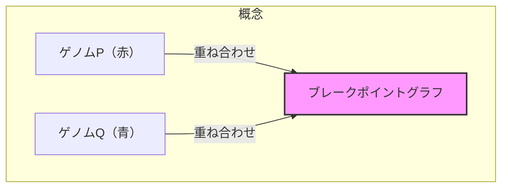

# ブレークポイントグラフ：ゲノム再配列研究の主力

## 🎯 この講義で学ぶこと

- **ブレークポイントグラフ** の定義と構築方法
- **2つのゲノムの重ね合わせ** という革新的概念
- **赤青サイクル** の性質と重要性
- **サイクル数** と2-ブレーク距離の関係
- **2-ブレーク定理** への導入

## 📐 ブレークポイントグラフとは

### 基本概念

ブレークポイントグラフは、2つのゲノムを比較するための強力なツールです。



### 構築の手順

```python
class BreakpointGraph:
    """
    2つのゲノムのブレークポイントグラフを構築
    """

    def __init__(self, genome_p, genome_q):
        self.genome_p = genome_p  # 赤いゲノム
        self.genome_q = genome_q  # 青いゲノム
        self.graph = {}

    def construct(self):
        """
        ブレークポイントグラフの構築手順

        1. Qの黒エッジをPと同じ順序に配置
        2. PとQを重ね合わせる
        3. 赤青サイクルを形成
        """

        # ステップ1: 黒エッジの配置を統一
        aligned_q = self.align_black_edges(self.genome_q, self.genome_p)

        # ステップ2: グラフを構築
        self.create_graph(self.genome_p, aligned_q)

        return self.graph

    def align_black_edges(self, genome_q, genome_p):
        """
        Qの黒エッジをPの順序に合わせて配置
        """
        # 各シンテニーブロックの順序を保持
        block_order = self.get_block_order(genome_p)

        # Qを同じ順序で再配置
        aligned = []
        for block in block_order:
            # Qでのブロックの位置と向きを見つける
            position = self.find_block_in_genome(block, genome_q)
            aligned.append(position)

        return aligned
```

## 🔴🔵 赤青サイクルの形成

### なぜサイクルが形成されるのか

```python
def explain_cycle_formation():
    """
    赤青サイクルが必ず形成される理由
    """

    print("サイクル形成の原理:")
    print("1. 各ノードの次数は必ず2（赤エッジ1本 + 青エッジ1本）")
    print("2. したがって、必ず交互のサイクルを形成")
    print("3. 赤→青→赤→青... という交互パターン")

    # 図解
    cycle_example = """
    ノードA ━(赤)━ ノードB
       ┃              ┃
     (青)           (青)
       ┃              ┃
    ノードD ━(赤)━ ノードC
    """

    print(cycle_example)
```

### 具体例での構築

```python
def construct_example():
    """
    具体例：P = (+a -b -c +d), Q = (+a +c +b -d) のブレークポイントグラフ
    """

    # ステップ1: Qの黒エッジをPの順序に配置
    print("元のゲノム:")
    print("P = (+a -b -c +d)")
    print("Q = (+a +c +b -d)")

    print("\nステップ1: Qを再配置")
    print("Qの新しい表現:")
    print("  aの後 → c")
    print("  cの後 → b")
    print("  bの後 → -d")
    print("  -dの後 → a")

    # ステップ2: 重ね合わせ
    print("\nステップ2: PとQを重ね合わせ")
    print("黒エッジ: 共通（シンテニーブロック）")
    print("赤エッジ: Pの隣接関係")
    print("青エッジ: Qの隣接関係")

    # 結果のグラフ構造
    return create_breakpoint_graph_structure()
```

## 📊 サイクル数の重要性

### サイクル数の定義と計算

```python
class CycleCounter:
    """
    ブレークポイントグラフのサイクル数を計算
    """

    def __init__(self, breakpoint_graph):
        self.graph = breakpoint_graph
        self.visited = set()
        self.cycles = []

    def count_cycles(self):
        """
        赤青交互サイクルの数を数える
        """
        cycle_count = 0

        for node in self.graph.nodes():
            if node not in self.visited:
                # 新しいサイクルを発見
                cycle = self.trace_cycle(node)
                if cycle:
                    self.cycles.append(cycle)
                    cycle_count += 1

        return cycle_count

    def trace_cycle(self, start_node):
        """
        1つのサイクルをトレース
        """
        cycle = []
        current = start_node
        use_red_edge = True  # 赤と青を交互に使用

        while True:
            cycle.append(current)
            self.visited.add(current)

            # 次のノードを取得（赤青交互）
            if use_red_edge:
                next_node = self.graph.get_red_neighbor(current)
            else:
                next_node = self.graph.get_blue_neighbor(current)

            if next_node == start_node:
                # サイクル完成
                return cycle

            current = next_node
            use_red_edge = not use_red_edge  # エッジの色を交替
```

### サイクル数の最大値

```python
def maximum_cycles(genome_p, genome_q):
    """
    サイクル数が最大になる条件
    """

    if genome_p == genome_q:  # 同一のゲノム
        # 各ブロックが独立した2-サイクルを形成
        max_cycles = len(genome_p)  # ブロック数

        print(f"同一ゲノムの場合:")
        print(f"  サイクル数 = ブロック数 = {max_cycles}")
        print(f"  各サイクルは最小（2エッジ）")

        return max_cycles
    else:
        # 異なるゲノムの場合、サイクルは大きくなる
        actual_cycles = count_actual_cycles(genome_p, genome_q)
        print(f"異なるゲノムの場合:")
        print(f"  サイクル数 = {actual_cycles} < {len(genome_p)}")

        return actual_cycles
```

## 🔄 2-ブレークとサイクル数の関係

### 重要な観察

```python
def two_break_effect_on_cycles():
    """
    2-ブレーク操作がサイクル数に与える影響
    """

    print("2-ブレークの効果:")
    print("1. 最良の場合: サイクル数を1増やす")
    print("2. 最悪の場合: サイクル数を1減らす")
    print("3. 中立の場合: サイクル数は変化しない")

    # 視覚的説明
    print("""
    例1: 1サイクル → 2サイクル（分割）
    ○━━━━━━━━━○  →  ○━━━○  ○━━━○

    例2: 2サイクル → 1サイクル（融合）
    ○━━━○  ○━━━○  →  ○━━━━━━━━━○
    """)
```

### 2-ブレーク定理への道

```python
class TwoBreakTheorem:
    """
    2-ブレーク定理の基礎
    """

    @staticmethod
    def derive_distance_formula():
        """
        2-ブレーク距離の公式を導出

        定理: d(P, Q) = blocks(P) - cycles(P, Q)
        """

        print("2-ブレーク定理の導出:")
        print()
        print("1. PとQが同一の場合:")
        print("   cycles(P, P) = blocks(P)")
        print()
        print("2. 各2-ブレークは最大で1サイクル増加")
        print()
        print("3. PをQに変換するには:")
        print("   cycles(P, Q) → blocks(P)")
        print("   必要な2-ブレーク数 = blocks(P) - cycles(P, Q)")

        return "d(P, Q) = blocks(P) - cycles(P, Q)"
```

## 🧮 実装例：完全なブレークポイントグラフ

```python
class CompleteBreakpointGraph:
    """
    完全なブレークポイントグラフの実装
    """

    def __init__(self, genome_p, genome_q):
        self.genome_p = genome_p
        self.genome_q = genome_q
        self.nodes = {}
        self.red_edges = []
        self.blue_edges = []
        self.black_edges = []

    def build(self):
        """
        ブレークポイントグラフを構築
        """
        # ノードを作成（各ブロックの頭と尾）
        self.create_nodes()

        # 黒エッジ（シンテニーブロック）
        self.add_black_edges()

        # 赤エッジ（Pの隣接関係）
        self.add_red_edges(self.genome_p)

        # 青エッジ（Qの隣接関係、Pの順序に合わせて）
        aligned_q = self.align_genome(self.genome_q, self.genome_p)
        self.add_blue_edges(aligned_q)

        return self

    def count_cycles(self):
        """
        サイクル数を計算
        """
        visited = set()
        cycles = 0

        for node in self.nodes:
            if node not in visited:
                # DFSでサイクルを探索
                cycle_nodes = self.dfs_cycle(node, visited)
                if cycle_nodes:
                    cycles += 1

        return cycles

    def calculate_distance(self):
        """
        2-ブレーク距離を計算
        """
        blocks = len(self.genome_p)
        cycles = self.count_cycles()

        distance = blocks - cycles

        print(f"ブロック数: {blocks}")
        print(f"サイクル数: {cycles}")
        print(f"2-ブレーク距離: {distance}")

        return distance
```

## 📈 複雑な例：多染色体ゲノム

```python
def multichromosomal_example():
    """
    多染色体ゲノムのブレークポイントグラフ
    """

    # P: 1染色体、Q: 2染色体
    P = [('+a', '+b', '+c', '+d', '+e', '+f')]
    Q = [('+a', '-c', '-f', '-e'), ('+b', '+d')]

    print("ゲノムP（1染色体）:")
    print("  ", P[0])

    print("\nゲノムQ（2染色体）:")
    print("  染色体1:", Q[0])
    print("  染色体2:", Q[1])

    # ブレークポイントグラフを構築
    graph = CompleteBreakpointGraph(P, Q)
    graph.build()

    # サイクル数を計算
    cycles = graph.count_cycles()
    print(f"\nサイクル数: {cycles}")

    # このサイクル数から2-ブレーク距離を導出
    distance = graph.calculate_distance()

    return distance
```

## 📝 まとめ

### 重要なポイント

1. **ブレークポイントグラフ** = 2つのゲノムの重ね合わせ
2. **必ず赤青交互サイクル** を形成（各ノードの次数が2）
3. **サイクル数** が再配列の複雑さを表す
4. **2-ブレーク距離** = blocks - cycles
5. **最大サイクル数** = ブロック数（同一ゲノムの場合）

### 次のステップ

- 2-ブレーク定理の証明
- ランダム破壊モデルの解析
- 実際の進化シナリオへの応用

## 🔗 関連トピック

- [ゲノム再配列：マンとマウス](./genome-rearrangements-man-to-mouse.md)
- 2-ブレーク定理（次回）
- ランダム破壊モデル
