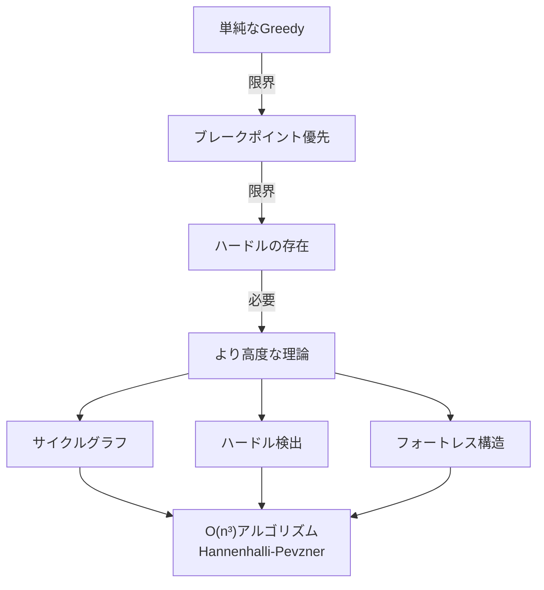

# ブレークポイント定理：リバーサル距離の下限を理解する

## 🎯 この講義で学ぶこと

- **隣接関係とブレークポイント** の厳密な定義
- **ブレークポイント定理** の証明と意味
- **改善されたGreedyアルゴリズム** の考え方
- **リバーサルとブレークポイント** の関係性
- アルゴリズムの **限界と複雑性**

## 📐 隣接関係とブレークポイントの定義

### 隣接関係（Adjacency）

隣接関係とは、恒等順列において隣り合うべき要素が、現在の順列でも適切な順序で隣り合っている状態です。

```python
def is_adjacency(pi, i):
    """
    位置iとi+1が隣接関係かを判定

    隣接関係の条件：
    1. 順番通り：pi[i+1] = pi[i] + 1
    2. 逆順だが連続：pi[i] = -(k), pi[i+1] = -(k-1)
    """
    if i >= len(pi) - 1:
        return False

    # 順番通りの場合
    if pi[i+1] == pi[i] + 1:
        return True

    # 逆順だが連続している場合
    if pi[i] < 0 and pi[i+1] < 0:
        if pi[i] == pi[i+1] - 1:  # -8, -7のような場合
            return True

    return False
```

### ブレークポイント（Breakpoint）

ブレークポイントは隣接関係でない箇所：

```python
def count_breakpoints(pi):
    """
    拡張順列でブレークポイントを数える

    拡張順列：[0] + pi + [n+1]
    """
    n = len(pi)
    # 拡張順列を作成
    extended = [0] + pi + [n + 1]

    breakpoints = 0
    for i in range(len(extended) - 1):
        if not is_consecutive(extended[i], extended[i+1]):
            breakpoints += 1

    return breakpoints

def is_consecutive(a, b):
    """2つの要素が連続しているか判定"""
    # 正の向きで連続
    if b == a + 1:
        return True
    # 負の向きで連続（例：-8と-7）
    if a < 0 and b < 0 and a == b + 1:
        return True
    return False
```

## 🔍 具体例での理解

順列 `[+3, +4, +5, -12, -8, -7, -6, +1, +2, +10, +9, +11, +13, +14]` を分析：

```mermaid
graph TD
    subgraph "拡張順列での分析"
        A["0"] ---|ブレークポイント| B["+3"]
        B ---|隣接| C["+4"]
        C ---|隣接| D["+5"]
        D ---|ブレークポイント| E["-12"]
        E ---|ブレークポイント| F["-8"]
        F ---|隣接| G["-7"]
        G ---|隣接| H["-6"]
        H ---|ブレークポイント| I["+1"]
        I ---|隣接| J["+2"]
        J ---|ブレークポイント| K["+10"]
        K ---|ブレークポイント| L["+9"]
        L ---|ブレークポイント| M["+11"]
        M ---|ブレークポイント| N["+13"]
        N ---|隣接| O["+14"]
        O ---|隣接| P["15"]
    end
```



### 詳細な分析

```python
def analyze_permutation(pi):
    """
    順列の隣接関係とブレークポイントを詳細分析
    """
    n = len(pi)
    extended = [0] + pi + [n + 1]

    print("拡張順列:", extended)
    print("\n位置ごとの分析:")

    adjacencies = []
    breakpoints = []

    for i in range(len(extended) - 1):
        a, b = extended[i], extended[i+1]

        if is_consecutive(a, b):
            adjacencies.append((i, a, b))
            print(f"  位置{i}: {a:+3} → {b:+3} [隣接関係]")
        else:
            breakpoints.append((i, a, b))
            print(f"  位置{i}: {a:+3} → {b:+3} [ブレークポイント]")

    print(f"\n統計:")
    print(f"  隣接関係数: {len(adjacencies)}")
    print(f"  ブレークポイント数: {len(breakpoints)}")
    print(f"  合計: {len(adjacencies) + len(breakpoints)} = n + 1 = {n + 1}")

    return adjacencies, breakpoints

# 例の実行
example = [3, 4, 5, -12, -8, -7, -6, 1, 2, 10, 9, 11, 13, 14]
analyze_permutation(example)
```

## 📊 ブレークポイント定理

### 定理の内容

> **ブレークポイント定理**
>
> リバーサル距離 d(π) は、ブレークポイント数 b(π) に対して：
>
> **d(π) ≥ b(π) / 2**

### 証明

```python
def prove_breakpoint_theorem():
    """
    ブレークポイント定理の証明を実装で示す
    """
    print("ブレークポイント定理の証明:")
    print("=" * 50)

    # 事実1：恒等順列のブレークポイント数は0
    identity = list(range(1, 11))
    b_identity = count_breakpoints(identity)
    print(f"1. 恒等順列のブレークポイント数: {b_identity}")

    # 事実2：1回のリバーサルで最大2つのブレークポイントを除去
    print("\n2. 1回のリバーサルの効果:")
    print("   - 影響を受けるのはリバーサル端点の2箇所のみ")
    print("   - 内部のブレークポイントは保存される")
    print("   - 最良の場合：2つのブレークポイントを除去")
    print("   - 最悪の場合：0個（変化なし）")

    # 結論
    print("\n3. 定理の導出:")
    print("   b個のブレークポイントを0にするには")
    print("   最低でも b/2 回のリバーサルが必要")
    print("   ∴ d(π) ≥ b(π) / 2")
```

### リバーサルがブレークポイントに与える影響

```python
def reversal_effect_on_breakpoints(pi, i, j):
    """
    リバーサル(i, j)がブレークポイントに与える影響を分析
    """
    before_bp = count_breakpoints(pi)

    # リバーサルを適用
    pi_reversed = pi.copy()
    pi_reversed[i:j+1] = pi_reversed[i:j+1][::-1]
    pi_reversed[i:j+1] = [-x for x in pi_reversed[i:j+1]]

    after_bp = count_breakpoints(pi_reversed)

    change = before_bp - after_bp

    print(f"リバーサル({i}, {j})の効果:")
    print(f"  前: {before_bp} ブレークポイント")
    print(f"  後: {after_bp} ブレークポイント")
    print(f"  変化: {change} （{'減少' if change > 0 else '増加' if change < 0 else '変化なし'}）")

    return change
```

## 🎯 改善されたGreedyアルゴリズム

### ブレークポイントを最大限減らすアプローチ

```python
class ImprovedGreedySorting:
    def __init__(self, permutation):
        self.permutation = permutation.copy()
        self.reversals = []

    def find_best_reversal(self):
        """
        最もブレークポイントを減らすリバーサルを探す
        """
        n = len(self.permutation)
        current_bp = count_breakpoints(self.permutation)

        best_reversal = None
        best_reduction = 0

        # すべての可能なリバーサルを試す
        for i in range(n):
            for j in range(i, n):
                # リバーサルを仮適用
                temp = self.permutation.copy()
                temp[i:j+1] = temp[i:j+1][::-1]
                temp[i:j+1] = [-x for x in temp[i:j+1]]

                # ブレークポイント数の変化を計算
                new_bp = count_breakpoints(temp)
                reduction = current_bp - new_bp

                if reduction > best_reduction:
                    best_reduction = reduction
                    best_reversal = (i, j)

        return best_reversal, best_reduction

    def sort(self, verbose=False):
        """
        ブレークポイントを優先的に減らすソート
        """
        step = 0

        while count_breakpoints(self.permutation) > 0:
            step += 1
            bp_before = count_breakpoints(self.permutation)

            # 最良のリバーサルを見つける
            reversal, reduction = self.find_best_reversal()

            if reversal is None or reduction == 0:
                if verbose:
                    print(f"ステップ {step}: ブレークポイントを減らせない状況")
                # ブレークポイントを減らせない場合の処理
                break

            # リバーサルを適用
            i, j = reversal
            self.permutation[i:j+1] = self.permutation[i:j+1][::-1]
            self.permutation[i:j+1] = [-x for x in self.permutation[i:j+1]]
            self.reversals.append((i+1, j+1))

            if verbose:
                print(f"ステップ {step}: リバーサル({i+1}, {j+1})")
                print(f"  ブレークポイント: {bp_before} → {count_breakpoints(self.permutation)}")
                print(f"  削減数: {reduction}")

        return len(self.reversals)
```

## ⚠️ アルゴリズムの限界

### ブレークポイントを減らせない状況

```python
def find_hurdle_examples():
    """
    ブレークポイントを減らせない順列の例を探す
    """
    # ハードルと呼ばれる特殊な構造を持つ順列
    hurdle_example = [3, 1, 2, 4]

    print("ハードルを持つ順列の例:")
    print(f"順列: {hurdle_example}")
    print(f"ブレークポイント数: {count_breakpoints(hurdle_example)}")

    # すべてのリバーサルを試す
    n = len(hurdle_example)
    improvements = []

    for i in range(n):
        for j in range(i, n):
            temp = hurdle_example.copy()
            temp[i:j+1] = temp[i:j+1][::-1]

            bp_change = count_breakpoints(hurdle_example) - count_breakpoints(temp)
            improvements.append((i, j, bp_change))

    max_improvement = max(improvements, key=lambda x: x[2])
    print(f"最良のリバーサル: ({max_improvement[0]}, {max_improvement[1]})")
    print(f"ブレークポイント削減数: {max_improvement[2]}")

    if max_improvement[2] == 0:
        print("⚠️ どのリバーサルもブレークポイントを減らせない！")
```

## 📈 複雑性の認識

### なぜ逆転によるソートは難しいのか



## 📝 まとめ

### 重要なポイント

1. **ブレークポイント定理**: リバーサル距離の理論的下限を与える
2. **1回のリバーサルの限界**: 最大2つのブレークポイントしか除去できない
3. **改善されたGreedy**: ブレークポイントを優先的に減らす戦略
4. **アルゴリズムの限界**: ハードルなど、単純なアプローチでは解決できない構造が存在
5. **複雑性**: 最適解を求めるには高度な理論（サイクルグラフ、ハードル理論）が必要

### 次のステップ

より複雑だが扱いやすい問題へ：

- **多染色体ゲノムの再配列**
- **2-ブレーク距離**
- **より一般的な再配列操作**

## 🔗 関連トピック

- [リバーサルによるソート](./sorting-by-reversals.md)
- [リバーサルによるソート - 実装](./sorting-by-reversals-implementation.md)
- 2-ブレーク距離（次回）
