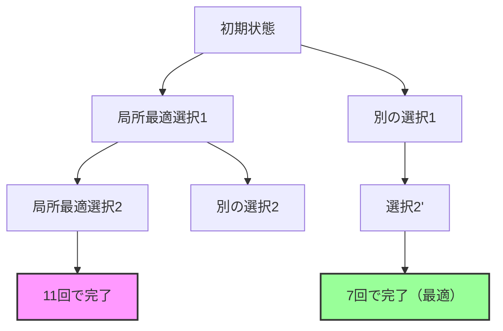

# リバーサルによるソート：ゲノム再配列の最短経路を探る

## 🎯 この講義で学ぶこと

- **リバーサル（逆転）** によるゲノム再配列の概念
- **リバーサル距離** の定義と計算
- **Greedyアルゴリズム** によるアプローチとその限界
- **ブレークポイントグラフ** を用いた最適化手法

## 🧬 リバーサルとは何か？

### 基本概念

リバーサル（逆転）は、染色体の一部を切り取って逆向きに再接続する遺伝的事象です。


### リバーサルの生物学的意味

- 染色体を2か所で切断
- 切り出された断片を反転（180度回転）
- 新しい順序で再接続

この過程で **ブレークポイント** が生じます：

- 元々隣接していなかった遺伝子が隣り合う
- 遺伝子の向きが変わる（+から-、-から+）

## 📊 リバーサル距離問題

### 問題定義

**リバーサル距離**: ある順列を別の順列に変換するために必要な最小のリバーサル回数

```python
def reversal_distance_problem(pi1, pi2):
    """
    2つの順列間のリバーサル距離を計算

    入力:
    - pi1: 開始順列
    - pi2: 目標順列

    出力: 最小リバーサル回数
    """
    pass  # 実装は後述
```

### リバーサルによるソート問題

特別なケースとして、任意の順列を恒等順列（+1, +2, ..., +n）に変換する問題：

```python
def sorting_by_reversals(pi):
    """
    順列を恒等順列に変換

    入力: 順列 pi
    出力: 恒等順列までのリバーサル距離
    """
    identity = list(range(1, len(pi) + 1))
    return reversal_distance_problem(pi, identity)
```

## 🎯 例：5回のリバーサルシナリオ

最初の順列から恒等順列への変換例：

```python
# 初期順列
permutation = [1, 2, 3, -8, -7, -6, -5, -4, 9, 10]

# リバーサル1
# [1, 2, 3, -8, -7, -6, -5, -4, 9, 10]
#          ↓ リバース(3, 8) ↓
# [1, 2, 3, 4, 5, 6, 7, 8, 9, 10]  # 簡略化のため詳細省略

# 実際には5回のリバーサルが必要
```

しかし、実は **4回のリバーサル** で同じ変換が可能です！

## 🤖 Greedyアルゴリズムによるアプローチ

### アルゴリズムの考え方

最も自然なアプローチ：各ステップで次の要素を正しい位置に配置

```python
def greedy_sorting(permutation):
    """
    Greedyアルゴリズムによるソート

    各ステップで次の要素を正しい位置に配置
    """
    n = len(permutation)
    reversals = []

    for i in range(n):
        # 要素 i+1 を正しい位置に配置
        target = i + 1

        # 現在の位置を探す
        for j in range(i, n):
            if abs(permutation[j]) == target:
                if j != i:
                    # リバーサルで正しい位置に移動
                    permutation[i:j+1] = permutation[i:j+1][::-1]
                    # 符号も反転
                    permutation[i:j+1] = [-x for x in permutation[i:j+1]]
                    reversals.append((i+1, j+1))
                break

        # 符号が間違っている場合は修正
        if permutation[i] == -target:
            permutation[i] = target
            reversals.append((i+1, i+1))

    return reversals, len(reversals)
```

### Greedyアルゴリズムの実行例

```python
# マウスの順列
mouse_permutation = [1, -7, 6, -10, 9, -8, 2, -11, -3, 5, 4]

# ステップ1: +1は既に正しい位置
# ステップ2: +2を正しい位置に移動
# [1, -7, 6, -10, 9, -8, 2, -11, -3, 5, 4]
#     ↓ リバース(2, 7) ↓
# [1, 2, 8, -9, 10, -6, 7, -11, -3, 5, 4]

# ステップ3: 符号を修正（必要に応じて）
# 以下同様に続く...
```

### Greedyアルゴリズムの問題点

- **最適ではない**: Greedyアルゴリズムは11回のリバーサルを使用
- **実際の最短経路**: わずか7回のリバーサルで可能
- **改善の必要性**: より洗練されたアプローチが必要

## 🔍 なぜGreedyアルゴリズムは最適でないのか？

### 局所最適 vs 大域最適

Greedyアルゴリズムは各ステップで局所的に最良の選択をしますが、全体として最適とは限りません。



## 📊 ブレークポイントの重要性

### ブレークポイントとは

リバーサルによって生じる「不自然な隣接」：

```python
def count_breakpoints(permutation):
    """
    順列中のブレークポイントを数える

    ブレークポイント: 隣接する要素が
    恒等順列では隣接していない箇所
    """
    n = len(permutation)
    breakpoints = 0

    # 最初のブレークポイントをチェック
    if permutation[0] != 1:
        breakpoints += 1

    # 中間のブレークポイントをチェック
    for i in range(n - 1):
        if abs(permutation[i+1] - permutation[i]) != 1:
            breakpoints += 1

    # 最後のブレークポイントをチェック
    if permutation[-1] != n:
        breakpoints += 1

    return breakpoints
```

### ブレークポイントの例

```python
# 例：[1, 2, 3, -8, -7, -6, -5, -4, 9, 10]
# ブレークポイント：
# - 3と-8の間（連続していない）
# - -4と9の間（連続していない）
# 計2つのブレークポイント
```

## 🚀 次のステップ：ブレークポイントグラフ

より効率的なアルゴリズムを開発するために、次回は **ブレークポイントグラフ** について学びます：

1. **ブレークポイントグラフの構築**
2. **サイクル構造の分析**
3. **最適なリバーサル選択戦略**

## 📝 まとめ

### 今回学んだこと

1. **リバーサル**: ゲノム再配列の基本操作
2. **リバーサル距離**: 最小変換回数の概念
3. **Greedyアルゴリズム**: 直感的だが最適でない
4. **ブレークポイント**: 最適化の鍵となる概念

### 重要なポイント

- 🔄 リバーサルは実際の進化で頻繁に起こる
- 📏 最短経路を見つけることは計算的に難しい
- 🎯 Greedyアルゴリズムの限界を理解することが重要
- 🔬 より洗練された手法（ブレークポイントグラフ）が必要

## 🔗 関連トピック

- [ゲノム再配列：マンとマウス](./genome-rearrangements-man-to-mouse.md)
- ブレークポイントグラフ（次回）
- 2-ブレークによる再配列
