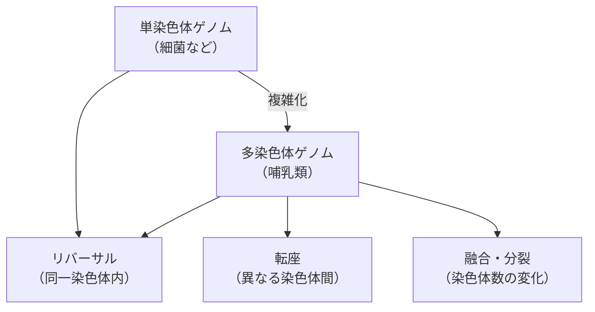
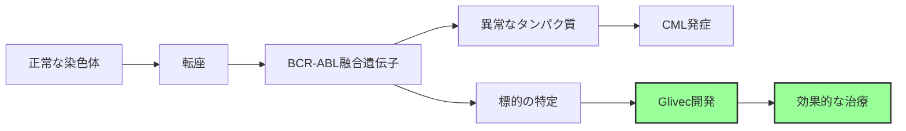
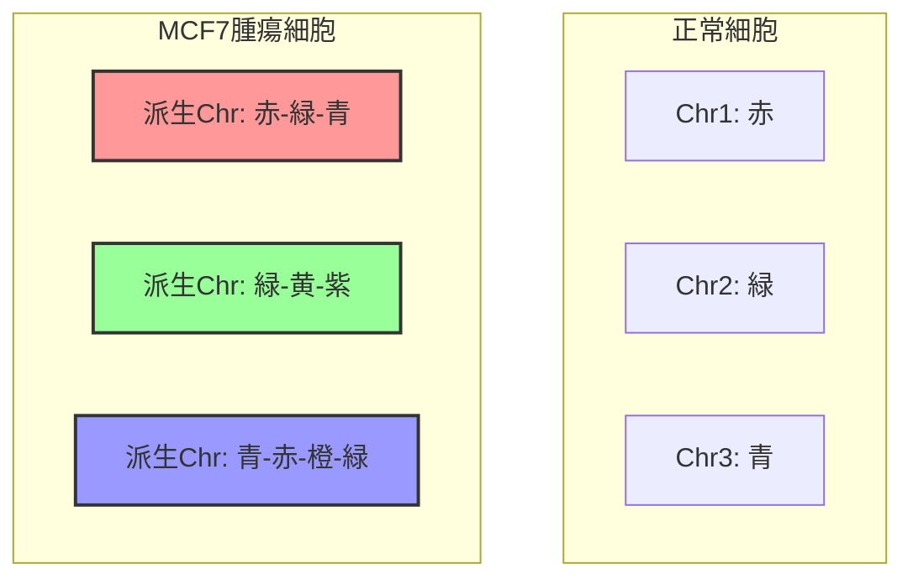
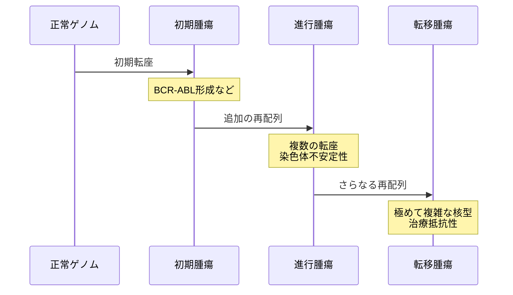

# 腫瘍ゲノムにおける再配列：多染色体ゲノムの複雑な変化

## 🎯 この講義で学ぶこと

- **多染色体ゲノム** における再配列の複雑性
- **フィラデルフィア染色体** と慢性骨髄性白血病（CML）
- **染色体ペインティング** 技術による可視化
- **転座、融合、分裂** などの染色体再配列
- がん治療への応用と **2-Break Distance** への導入

## 🧬 単染色体から多染色体へ

### なぜ多染色体ゲノムを扱うのか

これまで学んだ単染色体（1本の染色体）での再配列は基礎的な理解には重要ですが、実際の哺乳類ゲノムは多染色体です：

- **ヒト**: 23対（46本）の染色体
- **チンパンジー**: 24対（48本）の染色体
- **マウス**: 20対（40本）の染色体



## 🔬 フィラデルフィア染色体：がんと染色体再配列

### 慢性骨髄性白血病（CML）の原因

フィラデルフィア染色体は、がんの原因となる染色体再配列の最も有名な例です。

```python
class PhiladelphiaChromosome:
    """
    フィラデルフィア染色体の形成過程をモデル化
    """
    def __init__(self):
        # 正常な染色体9と22
        self.chr9 = {
            'name': 'Chromosome 9',
            'genes': ['...', 'ABL', '...'],  # ABL遺伝子を含む
            'breakpoint': 'q34'  # 長腕の34番地
        }

        self.chr22 = {
            'name': 'Chromosome 22',
            'genes': ['...', 'BCR', '...'],  # BCR遺伝子を含む
            'breakpoint': 'q11'  # 長腕の11番地
        }

    def translocation(self):
        """
        相互転座によるフィラデルフィア染色体の形成
        """
        print("正常な染色体:")
        print(f"  Chr9:  [...-ABL-...]")
        print(f"  Chr22: [...-BCR-...]")

        print("\n転座後:")
        print(f"  Chr9':  [...-BCR末端]")
        print(f"  Chr22' (Ph): [...-BCR-ABL-...] ← フィラデルフィア染色体")

        # BCR-ABL融合遺伝子の形成
        fusion_gene = "BCR-ABL"

        print(f"\n結果: {fusion_gene}融合遺伝子が形成")
        print("→ 異常なチロシンキナーゼ活性")
        print("→ 慢性骨髄性白血病（CML）の発症")

        return fusion_gene
```

### 医学的意義



BCR-ABL融合遺伝子の発見により：

- **標的治療薬Glivec（イマチニブ）** の開発が可能に
- CMLの治療成績が劇的に改善
- がんの分子標的治療の成功例

## 🎨 染色体ペインティング技術

### 染色体の可視化

染色体ペインティング（Chromosome Painting）は、各染色体を異なる蛍光色素で標識する技術です。

```python
class ChromosomePainting:
    """
    染色体ペインティングのシミュレーション
    """
    def __init__(self):
        # 各染色体に固有の色を割り当て
        self.colors = {
            1: "赤", 2: "緑", 3: "青", 4: "黄",
            5: "紫", 6: "橙", 7: "茶", 8: "桃",
            # ... 23番まで
        }

    def paint_normal_cell(self):
        """
        正常細胞の染色体ペインティング
        """
        print("正常細胞の染色体:")
        for chr_num in range(1, 24):
            color = self.colors.get(chr_num, "その他")
            print(f"  染色体{chr_num}: {color}（単色）")

    def paint_tumor_cell(self, rearrangements):
        """
        腫瘍細胞の染色体ペインティング

        Args:
            rearrangements: 再配列のリスト
        """
        print("腫瘍細胞の染色体（MCF7乳がん細胞株の例）:")

        # 複雑な再配列を表示
        print("  派生染色体1: 赤-緑-青（3つの染色体の断片）")
        print("  派生染色体2: 黄-紫-橙-茶（4つの染色体の断片）")
        print("  派生染色体3: 緑-赤（転座）")
        # ...

        print("\n観察結果:")
        print("  - ほとんどの染色体が多色（再配列を示す）")
        print("  - 正常な単色染色体はほぼ存在しない")
        print("  - 極めて複雑な核型異常")
```

### MCF7細胞株の例

MCF7（ヒト乳がん細胞株）での観察：



## 🔄 多染色体ゲノムの再配列操作

### 主要な再配列タイプ

```python
class ChromosomalRearrangements:
    """
    多染色体ゲノムにおける再配列操作
    """

    @staticmethod
    def translocation(chr1, chr2, pos1, pos2):
        """
        転座：異なる染色体間でセグメントを交換
        """
        # chr1の一部とchr2の一部を交換
        segment1 = chr1[pos1:]
        segment2 = chr2[pos2:]

        new_chr1 = chr1[:pos1] + segment2
        new_chr2 = chr2[:pos2] + segment1

        return new_chr1, new_chr2

    @staticmethod
    def fusion(chr1, chr2):
        """
        融合：2つの染色体を1つに結合
        """
        fused_chromosome = chr1 + chr2
        return fused_chromosome

    @staticmethod
    def fission(chromosome, position):
        """
        分裂：1つの染色体を2つに分割
        """
        chr_part1 = chromosome[:position]
        chr_part2 = chromosome[position:]

        return chr_part1, chr_part2

    @staticmethod
    def reversal(chromosome, start, end):
        """
        リバーサル：染色体内の一部を反転（単染色体と同じ）
        """
        reversed_segment = chromosome[start:end][::-1]
        new_chromosome = chromosome[:start] + reversed_segment + chromosome[end:]

        return new_chromosome
```

### 進化的な例：ヒトとチンパンジー

```python
def human_chimp_chromosome_evolution():
    """
    ヒトとチンパンジーの染色体数の違いを説明
    """
    # チンパンジー：24対の染色体
    chimp_chr2a = "Chimp_Chr2a"
    chimp_chr2b = "Chimp_Chr2b"

    print("チンパンジー・オランウータン・ゴリラ: 24対の染色体")
    print(f"  - {chimp_chr2a}")
    print(f"  - {chimp_chr2b}")
    print("  - その他22対")

    # 融合イベント
    print("\n約600万年前の融合イベント:")
    human_chr2 = f"{chimp_chr2a} + {chimp_chr2b}"

    print(f"  {chimp_chr2a} + {chimp_chr2b} → ヒト2番染色体")

    print("\nヒト: 23対の染色体")
    print(f"  - ヒト2番染色体（融合染色体）")
    print("  - その他22対")

    # 証拠
    print("\n融合の証拠:")
    print("  - ヒト2番染色体に2つのセントロメア痕跡")
    print("  - 融合部位にテロメア配列の残存")
```

## 📊 腫瘍ゲノムの複雑性

### 再配列の連鎖

腫瘍では単一の再配列ではなく、複数の再配列が連鎖的に起こります：



### 計算生物学的課題

```python
class TumorGenomeAnalysis:
    """
    腫瘍ゲノムの再配列解析の課題
    """

    def __init__(self, tumor_karyotype):
        self.karyotype = tumor_karyotype
        self.challenges = []

    def identify_challenges(self):
        """
        解析上の課題を列挙
        """
        self.challenges = [
            "1. 再配列の順序の推定",
            "2. ドライバー変異とパッセンジャー変異の区別",
            "3. クローン進化の追跡",
            "4. 腫瘍内不均一性の解明",
            "5. 治療標的の同定"
        ]

        return self.challenges

    def reconstruction_problem(self):
        """
        再配列シナリオの再構築問題
        """
        print("問題：どのような順序で再配列が起きたか？")
        print("\n可能なアプローチ:")
        print("  1. 最節約原理（最小の再配列数）")
        print("  2. 2-Break Distance アルゴリズム")
        print("  3. 系統発生学的手法")
```

## 🎯 次のステップ：2-Break Distance

### なぜ2-Break Distanceか

多染色体ゲノムの再配列を統一的に扱うための枠組み：

1. **すべての再配列を2-Break操作で表現**
2. **効率的なアルゴリズム**（O(n)時間）
3. **実際の生物学的データへの応用**

## 📝 まとめ

### 重要なポイント

1. **腫瘍ゲノムの特徴**
   - 多数の染色体再配列
   - 複雑な核型異常
   - 進行とともに蓄積

2. **医学的重要性**
   - フィラデルフィア染色体→CML→Glivec
   - 分子標的治療の成功例
   - 個別化医療への応用

3. **技術的ツール**
   - 染色体ペインティング
   - 次世代シーケンサー
   - 計算生物学的手法

4. **計算上の課題**
   - 再配列シナリオの推定
   - 複雑な核型の解析
   - 2-Break Distanceによる解決

## 🔗 関連トピック

- [ゲノム再配列：マンとマウス](./genome-rearrangements-man-to-mouse.md)
- [リバーサルによるソート](./sorting-by-reversals.md)
- 2-Break Distance（次回）
- がんゲノミクスの応用
