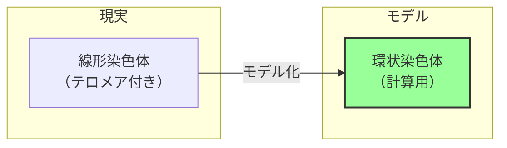
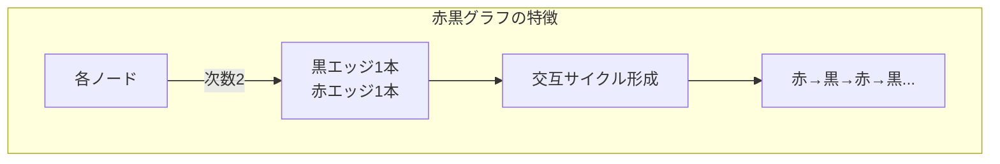
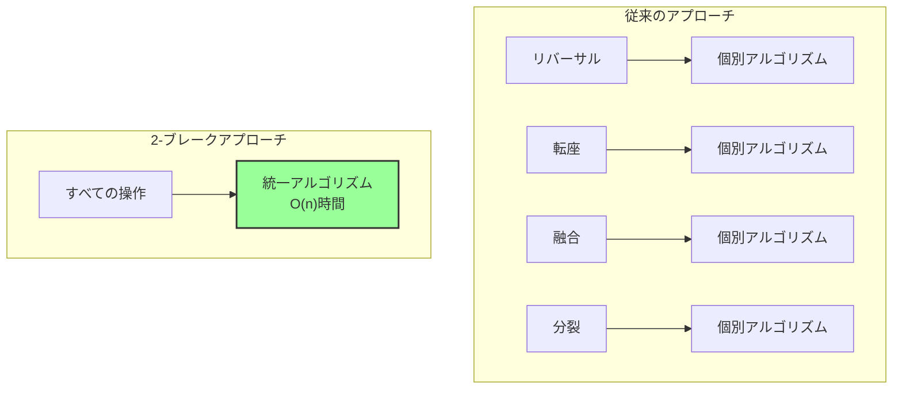

# 2-ブレーク距離：ゲノム再配列の統一理論

## 🎯 この講義で学ぶこと

- **環状染色体モデル** の採用理由とその利点
- **赤黒グラフ** による染色体の表現
- **2-ブレーク操作** による再配列の統一的表現
- すべての再配列操作（リバーサル、転座、融合、分裂）の一般化
- **2-ブレーク距離** の定義と計算

## 🔄 なぜ環状染色体モデルを使うのか？

### 驚きの選択：線形から環状へ

哺乳類の染色体は実際には線形ですが、計算上は環状として扱います。



### 環状モデルの利点

```python
class CircularChromosomeModel:
    """
    環状染色体モデルの利点を示す
    """

    def __init__(self):
        self.advantages = {
            "algorithm_simplicity": "O(n) vs O(n³)の計算量",
            "unified_operations": "すべての操作が2-ブレーク",
            "boundary_handling": "端点の特別扱いが不要",
            "biological_impact": "結果にほとんど影響なし"
        }

    def demonstrate_simplicity(self):
        """
        線形 vs 環状の複雑度比較
        """
        print("線形染色体での問題:")
        print("  - 端点の特殊処理が必要")
        print("  - リバーサルと転座で異なる扱い")
        print("  - 多染色体で極めて複雑")

        print("\n環状染色体での解決:")
        print("  - すべての位置が同等")
        print("  - 統一的な2-ブレーク操作")
        print("  - エレガントな数学的構造")
```

## 🎨 赤黒グラフによる表現

### グラフの構築

環状ゲノムを赤と黒のエッジを持つグラフとして表現：

```python
class RedBlackGraph:
    """
    ゲノムの赤黒グラフ表現
    """

    def __init__(self, genome):
        self.genome = genome
        self.black_edges = []  # シンテニーブロックを表す
        self.red_edges = []    # 隣接関係を表す

    def construct_graph(self):
        """
        ゲノムから赤黒グラフを構築

        例: ゲノム = [+a, -b, -d, +c]
        """
        # 黒いエッジ：各ブロックの頭と尾
        for block in self.genome:
            if block > 0:  # 正の向き
                self.black_edges.append((f"{block}_tail", f"{block}_head"))
            else:  # 負の向き
                abs_block = abs(block)
                self.black_edges.append((f"{abs_block}_head", f"{abs_block}_tail"))

        # 赤いエッジ：隣接するブロック間の接続
        n = len(self.genome)
        for i in range(n):
            current = self.genome[i]
            next_block = self.genome[(i + 1) % n]  # 環状なので mod n

            # 現在のブロックの終端
            if current > 0:
                current_end = f"{current}_head"
            else:
                current_end = f"{abs(current)}_tail"

            # 次のブロックの始端
            if next_block > 0:
                next_start = f"{next_block}_tail"
            else:
                next_start = f"{abs(next_block)}_head"

            self.red_edges.append((current_end, next_start))

        return self.black_edges, self.red_edges

    def visualize(self):
        """
        グラフの可視化情報を生成
        """
        print("黒いエッジ（シンテニーブロック）:")
        for edge in self.black_edges:
            print(f"  {edge[0]} -- {edge[1]}")

        print("\n赤いエッジ（隣接関係）:")
        for edge in self.red_edges:
            print(f"  {edge[0]} -- {edge[1]}")
```

### グラフの性質



## 🔧 2-ブレーク操作

### 定義

**2-ブレーク**: 2つの赤いエッジを削除し、同じ4つのノードに別の2つの赤いエッジを追加する操作

```python
def two_break_operation(graph, edge1, edge2):
    """
    2-ブレーク操作の実行

    Args:
        graph: 赤黒グラフ
        edge1, edge2: 削除する2つの赤いエッジ

    Returns:
        新しいグラフ
    """
    # エッジから4つのノードを抽出
    nodes = list(edge1) + list(edge2)

    # 元のエッジを削除
    graph.red_edges.remove(edge1)
    graph.red_edges.remove(edge2)

    # 新しい2つのエッジを追加（別の組み合わせ）
    new_edge1 = (nodes[0], nodes[2])
    new_edge2 = (nodes[1], nodes[3])

    # または別の組み合わせ
    # new_edge1 = (nodes[0], nodes[3])
    # new_edge2 = (nodes[1], nodes[2])

    graph.red_edges.append(new_edge1)
    graph.red_edges.append(new_edge2)

    return graph
```

## 🔄 すべての再配列操作の統一

### リバーサル as 2-ブレーク

```python
def reversal_as_two_break(genome, i, j):
    """
    リバーサルを2-ブレークとして表現
    """
    print(f"リバーサル({i}, {j}):")
    print("  削除: 2つの赤エッジ（区間の境界）")
    print("  追加: 2つの新しい赤エッジ（反転後の接続）")
    print("  結果: 1サイクル → 1サイクル（形状変化）")
```

### 分裂（Fission）as 2-ブレーク

```python
def fission_as_two_break(genome, position):
    """
    染色体分裂を2-ブレークとして表現
    """
    print(f"分裂（位置{position}）:")
    print("  削除: 2つの赤エッジ")
    print("  追加: 2つの新しい赤エッジ")
    print("  結果: 1サイクル → 2サイクル")

    # グラフィカルに表現
    print("""
    変換前: ○━━━━○━━━━○━━━━○
            └─────────────┘

    変換後: ○━━━━○  ○━━━━○
            └───┘  └───┘
    """)
```

### 融合（Fusion）as 2-ブレーク

```python
def fusion_as_two_break(chr1, chr2):
    """
    染色体融合を2-ブレークとして表現
    """
    print("融合:")
    print("  削除: 各染色体から1つずつ赤エッジ")
    print("  追加: 2つの染色体を接続する赤エッジ")
    print("  結果: 2サイクル → 1サイクル")
```

### 転座（Translocation）as 2-ブレーク

```python
def translocation_as_two_break(chr1, chr2, pos1, pos2):
    """
    転座を2-ブレークとして表現（線形染色体の場合）
    """
    print("転座の手順:")
    print("1. 線形染色体を一時的に環状化")
    print("2. 2-ブレーク操作を実行")
    print("3. 環状化に使用したエッジを削除して線形化")

    # 図解
    print("""
    線形: Chr1: ━━━━━━  Chr2: ━━━━━━
            ↓ 環状化
    環状: ○━━━━○  ○━━━━○
            ↓ 2-ブレーク
    交換: ○━━╲╱━○  ○━━╱╲━○
            ↓ 線形化
    結果: Chr1': ━━━━━━  Chr2': ━━━━━━
    """)
```

## 📏 2-ブレーク距離

### 定義

```python
class TwoBreakDistance:
    """
    2-ブレーク距離の計算
    """

    def __init__(self, genome1, genome2):
        self.genome1 = genome1
        self.genome2 = genome2

    def calculate_distance(self):
        """
        2つのゲノム間の2-ブレーク距離を計算

        定理: d(P, Q) = blocks - cycles
        ここで:
        - blocks: シンテニーブロックの数
        - cycles: ブレークポイントグラフのサイクル数
        """
        # ブレークポイントグラフを構築
        bp_graph = self.construct_breakpoint_graph()

        # サイクル数を数える
        cycles = self.count_cycles(bp_graph)

        # ブロック数
        blocks = len(self.genome1)

        # 2-ブレーク距離
        distance = blocks - cycles

        return distance

    def construct_breakpoint_graph(self):
        """
        ブレークポイントグラフの構築
        """
        # genome1の赤エッジとgenome2の青エッジを組み合わせる
        graph1 = RedBlackGraph(self.genome1)
        graph2 = RedBlackGraph(self.genome2)

        # ブレークポイントグラフ = 赤エッジ（genome1）+ 青エッジ（genome2）
        bp_graph = {
            'red_edges': graph1.red_edges,
            'blue_edges': graph2.red_edges  # genome2の赤エッジを青として扱う
        }

        return bp_graph
```

### 効率的なアルゴリズム

```python
def efficient_two_break_sorting(P, Q):
    """
    効率的な2-ブレークソーティング

    時間計算量: O(n)
    """
    distance = TwoBreakDistance(P, Q).calculate_distance()

    print(f"2-ブレーク距離: {distance}")
    print(f"必要な2-ブレーク操作数: {distance}")

    # 各2-ブレークは1サイクルを増やす
    # 目標: すべてのブロックを独立したサイクルに

    return distance
```

## 🎯 2-ブレークの威力

### 統一理論の利点



## 📊 実装例

```python
def complete_two_break_example():
    """
    完全な2-ブレーク距離計算の例
    """
    # マウスとヒトの染色体セグメント（簡略化）
    mouse = [[1, 2, 3, 4, 5], [6, 7, 8, 9, 10]]
    human = [[1, -3, -2, 4, 5], [6, 7, -10, -9, -8]]

    print("マウスゲノム:", mouse)
    print("ヒトゲノム:", human)

    # 2-ブレーク距離を計算
    distance = calculate_multichromosomal_distance(mouse, human)

    print(f"\n2-ブレーク距離: {distance}")
    print(f"推定進化時間: 約{distance * 2}百万年前")

def calculate_multichromosomal_distance(genome1, genome2):
    """
    多染色体ゲノム間の2-ブレーク距離
    """
    # すべての染色体を環状として扱い、統合
    all_blocks1 = [block for chr in genome1 for block in chr]
    all_blocks2 = [block for chr in genome2 for block in chr]

    # サイクル数を計算（実際のアルゴリズム）
    cycles = count_cycles_in_breakpoint_graph(all_blocks1, all_blocks2)
    blocks = len(all_blocks1)

    return blocks - cycles
```

## 📝 まとめ

### 重要なポイント

1. **環状モデルの採用理由**
   - アルゴリズムの劇的な簡略化
   - 生物学的結論への影響は最小

2. **2-ブレーク操作**
   - すべての再配列を統一的に表現
   - 2つの赤エッジ → 2つの新しい赤エッジ

3. **計算効率**
   - O(n)時間で最適解
   - 実用的な大規模ゲノム解析が可能

4. **次のステップ**
   - ブレークポイントグラフの詳細
   - サイクル数の計算方法
   - 実際の進化シナリオの推定

## 🔗 関連トピック

- [リバーサルによるソート](./sorting-by-reversals.md)
- [ブレークポイント定理](./breakpoint-theorem.md)
- [腫瘍ゲノムにおける再配列](./tumor-genome-rearrangements.md)
- ブレークポイントグラフ（次回）
