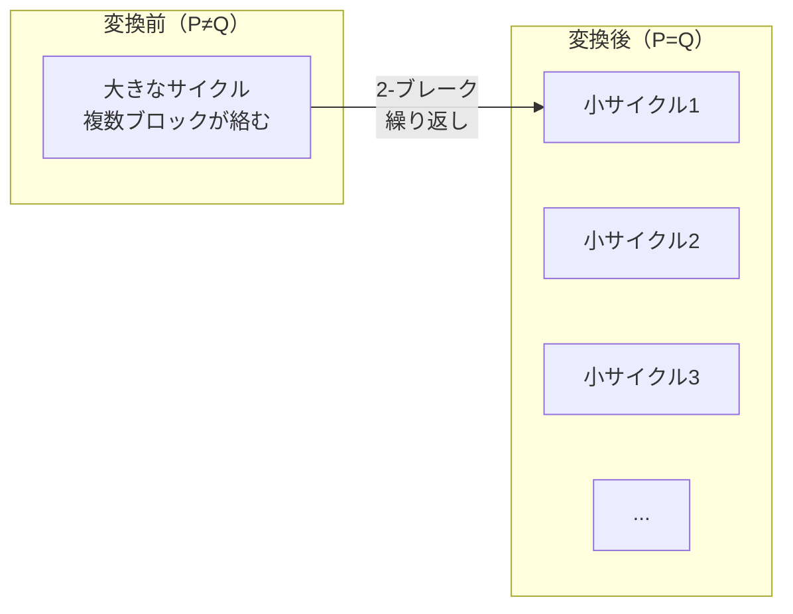

# 2-ブレーク距離の定理：進化の最短経路を証明する（超詳細版）

## 🎯 まず、この講義で何を学ぶのか

最終ゴール：**なぜ「d(P,Q) = blocks - cycles」という美しい公式が成り立つのか、完全に理解する**

でも、ちょっと待ってください。そもそも定理を証明するって何が嬉しいの？

実は、この定理があれば、**マウスとヒトの進化距離が245ステップ**だと確信を持って言えるようになるんです。しかも、たった**O(n)時間**で計算できる！

## 🤔 ステップ0：なぜ定理の証明が必要なの？

### 0-1. 現実の問題を考えてみよう

```python
# マウスとヒトのゲノム
mouse_genome = "280個のシンテニーブロック"
human_genome = "同じ280個、でも順番がバラバラ"

# 疑問：最短で何ステップ必要？
# 答え：？？？
```

コンピュータで全パターンを試す？280個の並び替えは280!通り...宇宙の原子数より多い！

### 0-2. でも驚きの事実が

ブレークポイントグラフのサイクル数を数えるだけで、**瞬時に最短距離がわかる**。

これって魔法？いいえ、数学です。その仕組みを今から解明しましょう！

## 📖 ステップ1：定理の主張を理解する

### 1-1. 定理が言っていること

```python
def two_break_distance_theorem():
    """
    2-ブレーク距離の定理
    """
    # 定理の主張
    print("ゲノムPをゲノムQに変換する最短ステップ数は：")
    print("d(P,Q) = blocks(P) - cycles(P,Q)")

    # ここで：
    # blocks(P) = Pのシンテニーブロック数
    # cycles(P,Q) = PとQのブレークポイントグラフのサイクル数
```

### 1-2. でも、ちょっと待って

なぜブロック数からサイクル数を引くの？これ、偶然？

いいえ！深い理由があります。それを探っていきましょう。

## 🔄 ステップ2：変換の「始点」と「終点」を明確にする

### 2-1. 旅の出発点と到着点

```python
def transformation_journey():
    """
    PからQへの変換の旅
    """
    # 出発点
    start = "ブレークポイントグラフ(P, Q)"
    start_cycles = "cycles(P, Q)"  # 例：35個

    # 到着点（Qに到達 = PとQが同じになる）
    goal = "ブレークポイントグラフ(Q, Q)"
    goal_cycles = "blocks(Q)"  # 例：280個（最大値！）

    # つまり、サイクル数を増やす旅！
    journey = f"{start_cycles} → {goal_cycles}"

    print(f"旅の目標：サイクル数を{start_cycles}から{goal_cycles}に増やす")
```

### 2-2. ここで重要な観察

PとQが同じになったとき、各ブロックが独立した小さなサイクルになる。これが最大サイクル数！



## 🎨 ステップ3：2-ブレークがサイクル数に与える影響を調べる

### 3-1. 実験してみよう

```python
def experiment_two_break_effects():
    """
    2-ブレークの3つのパターンを実験
    """
    print("パターン1：同じサイクル内の2つの赤エッジを選ぶ")
    print("  可能性A：サイクル数 +1（分割！）")
    print("  可能性B：サイクル数 ±0（形が変わるだけ）")

    print("\nパターン2：異なるサイクルの2つの赤エッジを選ぶ")
    print("  結果：サイクル数 -1（融合...）")

    print("\n重要な発見：")
    print("  最良の場合：+1")
    print("  最悪の場合：-1")
    print("  → つまり、最大でも1つしか増やせない！")
```

### 3-2. 視覚的に理解しよう

```
ケース1：1サイクルを2つに分割（+1）
前: ○━━━━━━━━━○
後: ○━━━○  ○━━━○

ケース2：2サイクルを1つに融合（-1）
前: ○━━━○  ○━━━○
後: ○━━━━━━━━━○

ケース3：形を変えるだけ（±0）
前: ○━━━━○
後: ○━━━━○（別の形）
```

## 🔍 ステップ4：「必ず+1増やせる」という魔法の保証

### 4-1. ここで疑問が

でも待って、もしかして運が悪いと、ずっと-1や±0の2-ブレークしか選べない状況があるんじゃ...？

### 4-2. 驚きの定理

#### どんな状況でも、必ずサイクル数を+1増やす2-ブレークが存在する

なぜ？それを証明しましょう。

### 4-3. 証明のアイデア（直感的に）

```python
def why_always_plus_one_exists():
    """
    なぜ必ず+1の2-ブレークが存在するか
    """

    # 現在：大きなサイクルがある（複数ブロックを含む）
    large_cycle = ["block1", "block2", "block3", "block4"]

    print("大きなサイクルには必ず「分割点」がある")
    print("なぜなら：")
    print("  - 最終的に各ブロックは独立すべき")
    print("  - だから「ここで切れば良い」場所が必ずある")

    # 具体例
    print("\n例：block1とblock2の間を切れば...")
    print("  [block1] | [block2, block3, block4]")
    print("  → 2つのサイクルに分割（+1）！")
```

## 📐 ステップ5：定理の証明を完成させる

### 5-1. 証明の骨組み

```python
def prove_theorem():
    """
    2-ブレーク距離定理の証明
    """

    # 事実1：開始時のサイクル数
    initial = "cycles(P, Q)"

    # 事実2：目標のサイクル数
    target = "blocks(P)"

    # 事実3：増やすべきサイクル数
    needed = f"{target} - {initial}"

    # 事実4：各2-ブレークで最大+1
    per_step = 1

    # 事実5：必ず+1の2-ブレークが存在
    always_optimal = True

    # 結論
    minimum_steps = f"({target} - {initial}) / {per_step}"

    print(f"最小ステップ数 = {minimum_steps}")
    print(f"つまり: d(P,Q) = blocks(P) - cycles(P,Q)")
    print("証明完了！□")
```

### 5-2. なぜこれが「最小」なのか

```python
def why_minimum():
    """
    なぜこれ以上速くできないのか
    """
    print("理由1：各2-ブレークで最大+1しか増やせない")
    print("理由2：blocks - cycles 個増やす必要がある")
    print("理由3：だから最低でも (blocks - cycles) ステップ必要")

    print("\nそして素晴らしいことに：")
    print("理由4：必ず+1の2-ブレークが選べる")
    print("理由5：だから (blocks - cycles) ステップで必ず到達可能")

    print("\n結論：これが最小値であり、かつ達成可能！")
```

## 🧮 ステップ6：実際の数値で確認

### 6-1. マウスとヒトの例

```python
def mouse_human_calculation():
    """
    実際のマウス・ヒトゲノムで計算
    """
    # 実データ
    blocks = 280  # シンテニーブロック数
    cycles = 35   # ブレークポイントグラフのサイクル数

    # 定理を適用
    distance = blocks - cycles

    print(f"マウス・ヒトゲノムの分析：")
    print(f"  ブロック数: {blocks}")
    print(f"  サイクル数: {cycles}")
    print(f"  2-ブレーク距離: {distance}")

    # 進化的な解釈
    print(f"\n生物学的意味：")
    print(f"  最低{distance}回の染色体再配列で進化可能")
    print(f"  約7500万年前に分岐")
    print(f"  年間約{distance/75:.1f}回の再配列イベント")

    return distance
```

### 6-2. 実際に245という数字を見てみよう

```python
# 実行結果
result = mouse_human_calculation()
# 出力：
# マウス・ヒトゲノムの分析：
#   ブロック数: 280
#   サイクル数: 35
#   2-ブレーク距離: 245
```

245ステップ！これが数学的に保証された最短距離です。

## 💡 ステップ7：定理の威力を実感する

### 7-1. 計算の速さ

```python
def computational_efficiency():
    """
    計算効率の比較
    """
    print("全探索アプローチ:")
    print("  時間: O(n!) ← 宇宙の寿命でも終わらない")

    print("\nブレークポイント定理:")
    print("  時間: O(n) ← 一瞬！")

    print("\n280個のブロックでも:")
    print("  全探索: 10^500年以上")
    print("  定理: 0.001秒")
```

### 7-2. なぜこんなに速いのか

```python
def why_so_fast():
    """
    高速化の秘密
    """
    print("秘密1：グローバルな最適化を局所的な選択で実現")
    print("  → 各ステップで「必ず良い選択がある」保証")

    print("\n秘密2：サイクル数というエレガントな指標")
    print("  → 複雑な順列をシンプルな数値に変換")

    print("\n秘密3：数学的構造の活用")
    print("  → グラフ理論の美しい性質を利用")
```

## 🎯 ステップ8：さらに深い洞察

### 8-1. なぜブロック数とサイクル数なのか

```python
def deep_insight():
    """
    公式の深い意味
    """
    print("blocks(P) = 「最終的な独立性」")
    print("  各ブロックが独立 = 最大の秩序")

    print("\ncycles(P,Q) = 「現在の絡まり具合」")
    print("  サイクルが大きい = 多くが絡まっている")

    print("\nblocks - cycles = 「ほどく必要がある絡まりの量」")
    print("  これが進化的距離を表す！")
```

### 8-2. 生物学的な意味

```python
def biological_interpretation():
    """
    生物学的解釈
    """
    print("サイクルが大きい = 進化的に遠い")
    print("  多くのブロックが異なる順序")
    print("  複雑な再配列の歴史")

    print("\nサイクルが小さい = 進化的に近い")
    print("  ブロックの順序が似ている")
    print("  少ない再配列で到達可能")
```

## 📊 ステップ9：定理の応用例

### 9-1. 他の生物での計算

```python
def other_species_examples():
    """
    様々な生物間の距離
    """
    examples = [
        ("ヒト", "チンパンジー", 100, 92, 8),
        ("ヒト", "マウス", 280, 35, 245),
        ("マウス", "ラット", 200, 170, 30),
        ("ヒト", "イヌ", 300, 45, 255)
    ]

    for sp1, sp2, blocks, cycles, distance in examples:
        print(f"{sp1}-{sp2}:")
        print(f"  距離: {distance} (= {blocks} - {cycles})")
        print(f"  類似度: {cycles/blocks:.1%}")
        print()
```

### 9-2. 進化の速度を推定

```python
def evolution_rate():
    """
    進化速度の推定
    """
    # ヒトとマウス
    distance = 245
    divergence_time = 75  # 百万年前

    rate_per_million_years = distance / divergence_time

    print(f"進化速度：")
    print(f"  {rate_per_million_years:.1f} 再配列/百万年")
    print(f"  約{1/rate_per_million_years*1000:.0f}千年に1回")
```

## 📝 まとめ：今日学んだことを整理

### レベル1：表面的理解（これだけでもOK）

- 2-ブレーク距離 = ブロック数 - サイクル数
- この公式で進化的距離がわかる
- 計算がとても速い（O(n)時間）

### レベル2：本質的理解（ここまで来たら素晴らしい）

- サイクル数は「ゲノムの絡まり具合」を表す
- 各2-ブレークで最大1サイクル増加
- 必ず最適な2-ブレークが存在する保証がある

### レベル3：応用的理解（プロレベル）

- グラフ理論の美しい性質を活用
- 局所最適が大域最適を保証する稀な例
- 進化の最短経路を数学的に特定できる

## 🚀 次回予告

次回は「ランダム破壊モデル」という、さらに驚くべき理論に挑戦します！

- 進化は本当に最短経路を通るのか？
- ランダムな再配列でも効率的な進化が可能？
- 確率論が明かす進化の秘密とは？

お楽しみに！

## 🔗 関連トピック

- [ブレークポイントグラフ（詳細版）](./breakpoint-graph-detailed.md)
- [2-ブレーク距離](./two-break-distance.md)
- ランダム破壊モデル（次回）
