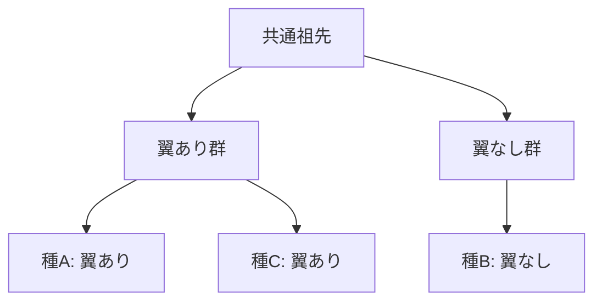

# 文字ベース系統樹再構築（超詳細版）

## 🎯 まず、この講義で何を学ぶのか

最終ゴール：**生物の「特徴」から進化の歴史を推理する方法を完全マスター**

でも、ちょっと待ってください。そもそも「特徴から進化の歴史を推理する」って何でしょう？
実は、これは**名探偵が手がかりから事件を解決するのと同じプロセス**なんです。

## 🤔 ステップ0：なぜ文字ベース系統樹が重要なの？

### 0-1. そもそもの問題を考えてみよう

想像してください。あなたの前に3種類の昆虫がいます：

- 昆虫A：翼あり、足6本
- 昆虫B：翼なし、足6本
- 昆虫C：翼あり、足8本

これらの昆虫はどのような順番で進化してきたのでしょうか？

### 0-2. 驚きの事実

実は50年前、DNAシーケンシングが発明される前は、生物学者たちはまさに**こういった目に見える特徴だけで進化の歴史を推理していた**んです！

## 📖 ステップ1：文字（Character）って何？

### 1-1. まず素朴な疑問から

「文字」と聞くと「ABC」を思い浮かべるかもしれません。でも生物学では違います。

### 1-2. なぜそうなるのか

生物学における「文字」とは、**生物が持つ測定可能な特徴**のことです。

### 1-3. 具体例で確認

```python
# 文字テーブルの例
character_table = {
    "種A": {"翼": "あり", "足の数": 6},
    "種B": {"翼": "なし", "足の数": 6},
    "種C": {"翼": "あり", "足の数": 8}
}

print("文字1（翼の有無）の状態：")
for species, traits in character_table.items():
    print(f"  {species}: {traits['翼']}")
```

### 1-4. ここがポイント

文字には2つのタイプがあります：

- **二値文字**：「ある/なし」のように2つの状態しかない（例：翼の有無）
- **多値文字**：3つ以上の状態がある（例：足の数）

## 📖 ステップ2：なぜ解剖学的特徴だけでは難しいの？

### 2-1. 直感的なアプローチ

最初に思いつくのは「同じ特徴を持つ生物は近い関係にある」という考え方です。



### 2-2. でも待って、本当にそうでしょうか？

ここで**ドロの不可逆性の原理**（Dollo's Law）という100年前の仮説が登場します。

### 2-3. ドロの原理とは？

> 「一度失われた複雑な器官は、二度と同じ形では進化しない」

つまり、進化は効率的で、同じ器官を何度も作り直したりしないという考えです。

### 2-4. 衝撃の事実

しかし！現代のDNA解析により、**ナナフシだけでも翼が7回も独立に進化・消失していた**ことが判明！

```python
def visualize_wing_evolution():
    """
    翼の進化と消失の可視化
    なぜこんなことが起きるのか理解するための実験
    """
    events = [
        "祖先（翼なし）",
        "→ 種1（翼獲得）★",
        "→ 種2（翼消失）",
        "→ 種3（翼再獲得）★",
        "→ 種4（翼再消失）",
        "→ 種5（翼再々獲得）★"
    ]

    for event in events:
        print(event)

    print("\n驚き：翼が何度も現れたり消えたりしている！")

visualize_wing_evolution()
```

## 📖 ステップ3：なぜ翼は何度も現れたり消えたりするの？

### 3-1. 魔法のような現象の種明かし

実は、進化は翼を**ゼロから作り直しているわけではない**んです！

### 3-2. 料理のレシピで考えてみよう

```python
def wing_recipe_analogy():
    """
    翼の進化を料理のレシピに例える
    """
    print("翼の作り方レシピ（遺伝子）")
    print("=" * 30)
    print("材料：タンパク質A, B, C...")
    print("手順：")
    print("1. 発生段階でタンパク質Aを発現")
    print("2. タンパク質Bで形を整える")
    print("3. タンパク質Cで強度を増す")
    print()
    print("翼なし種の場合：")
    print("→ レシピは持っているが使わない（本棚にしまってある）")
    print()
    print("翼が必要になったら：")
    print("→ レシピを本棚から取り出して使う！")

wing_recipe_analogy()
```

### 3-3. つまり、言い換えると

- 翼なし種：飛行用の遺伝子経路を**別の用途**に使用
- 翼あり種：必要になったら**同じ経路を飛行用に再活性化**

## 📖 ステップ4：DNAを文字として使う天才的発想

### 4-1. 問題の根本的解決

解剖学的特徴の問題を避けるには、**DNAそのものを文字として使えばいい**！

### 4-2. マルチプルアラインメントを文字テーブルとして見る

```python
def alignment_as_character_table():
    """
    マルチプルアラインメントを文字テーブルとして理解
    """
    # マルチプルアラインメント
    alignment = {
        "ヒト":     "ATCGATCG",
        "チンパンジー": "ATCGATGG",
        "ゴリラ":    "ACCGATCG",
        "オランウータン": "ACCGATGG"
    }

    print("マルチプルアラインメント:")
    for species, sequence in alignment.items():
        print(f"  {species:8s}: {sequence}")

    print("\n文字テーブルとして見ると:")
    print("         位置: 1 2 3 4 5 6 7 8")
    print("         " + "-" * 20)

    for species, sequence in alignment.items():
        chars = " ".join(sequence)
        print(f"  {species:8s}: {chars}")

    print("\n各位置（列）が1つの文字！")
    print("例：位置3は「C or T」という文字")

alignment_as_character_table()
```

### 4-3. ここが革命的

- 各**列**が1つの文字
- DNA配列なら各文字は4つの状態（A, T, C, G）
- タンパク質配列なら20の状態（20種類のアミノ酸）

## 📖 ステップ5：祖先の状態をどう推測する？

### 5-1. 推理ゲームの始まり

現在の生物のDNAから、絶滅した祖先のDNAを推理する！

### 5-2. 簡単な例で考えてみよう

```python
def simple_ancestor_inference():
    """
    3種の生物から祖先を推測する単純な例
    """
    # ある位置での塩基
    species_data = {
        "種A": "A",
        "種B": "A",
        "種C": "T"
    }

    print("現在の種の状態:")
    for species, base in species_data.items():
        print(f"  {species}: {base}")

    print("\n推理:")
    print("種AとBが同じ'A'を持っている")
    print("→ 彼らの共通祖先も'A'を持っていた可能性が高い")
    print("→ 種Cだけが'T'に変異した？")

    print("\n系統樹:")
    print("     祖先(A)")
    print("    /      \\")
    print("   /        \\")
    print("共通祖先(A)  種C(T)")
    print("  /    \\")
    print("種A(A) 種B(A)")

simple_ancestor_inference()
```

## 📖 ステップ6：パーシモニー（最節約）原理

### 6-1. なぜ最も単純な説明を選ぶ？

進化において、**変異は稀なイベント**です。だから、変異の数が最小となる系統樹が最も可能性が高い！

### 6-2. 実験してみましょう

```python
def parsimony_comparison():
    """
    2つの異なる系統樹仮説を比較
    どちらがより「節約的」か？
    """
    print("データ: 種A(A), 種B(A), 種C(T)")
    print("=" * 40)

    print("\n仮説1: AとBが近縁")
    print("必要な変異数: 1回（祖先→種Cで A→T）")
    print("     祖先(A)")
    print("    /      \\")
    print("  AB祖(A)   種C(T) ← 1回の変異")
    print("  /    \\")
    print("種A(A) 種B(A)")

    print("\n仮説2: AとCが近縁")
    print("必要な変異数: 2回")
    print("     祖先(?)")
    print("    /      \\")
    print("  AC祖(?)   種B(A)")
    print("  /    \\")
    print("種A(A) 種C(T)")
    print("\nAとCで違う塩基 → 最低2回の変異が必要！")

    print("\n結論: 仮説1の方が節約的（変異が少ない）")

parsimony_comparison()
```

## 📖 ステップ7：実際のアルゴリズム（小パーシモニー問題）

### 7-1. フィッチのアルゴリズム

最も有名な祖先状態推定アルゴリズムを実装してみましょう！

```python
def fitch_algorithm_demo():
    """
    フィッチのアルゴリズムの動作を可視化
    ボトムアップとトップダウンの2段階
    """
    print("フィッチのアルゴリズム")
    print("=" * 40)

    # 葉ノードのデータ
    leaves = {
        "人間": {"A"},
        "チンパンジー": {"A"},
        "ゴリラ": {"T"},
        "オランウータン": {"G"}
    }

    print("ステップ1: ボトムアップ（葉から根へ）")
    print("-" * 30)

    # 人間とチンパンジーの祖先
    hc_ancestor = leaves["人間"] & leaves["チンパンジー"]
    if not hc_ancestor:
        hc_ancestor = leaves["人間"] | leaves["チンパンジー"]
    print(f"人間∩チンパンジー = {hc_ancestor}")

    # ゴリラとオランウータンの祖先
    go_ancestor = leaves["ゴリラ"] & leaves["オランウータン"]
    if not go_ancestor:
        go_ancestor = leaves["ゴリラ"] | leaves["オランウータン"]
    print(f"ゴリラ∩オランウータン = {go_ancestor}")

    # ルート
    root = hc_ancestor & go_ancestor
    if not root:
        root = hc_ancestor | go_ancestor
    print(f"全体の祖先 = {root}")

    print("\nステップ2: トップダウン（根から葉へ）")
    print("-" * 30)
    print("各祖先ノードに最も可能性の高い塩基を割り当て")

    return root

fitch_algorithm_demo()
```

## 📖 ステップ8：より複雑な例

### 8-1. 複数の位置を同時に考える

```python
def multiple_sites_analysis():
    """
    実際のDNA配列での祖先推定
    """
    sequences = {
        "種A": "ATCG",
        "種B": "ATGG",
        "種C": "ACCG",
        "種D": "ACGG"
    }

    print("4種の生物の配列:")
    for species, seq in sequences.items():
        print(f"  {species}: {seq}")

    print("\n各位置での分析:")
    for pos in range(4):
        print(f"\n位置{pos+1}:")
        chars = {sp: seq[pos] for sp, seq in sequences.items()}
        for sp, char in chars.items():
            print(f"  {sp}: {char}")

        # 簡単な多数決
        from collections import Counter
        counts = Counter(chars.values())
        most_common = counts.most_common(1)[0][0]
        print(f"  → 推定祖先状態: {most_common} (最頻値)")

multiple_sites_analysis()
```

## 📖 ステップ9：文字ベース vs 距離ベース

### 9-1. 2つのアプローチの違い

```python
def compare_methods():
    """
    文字ベースと距離ベースの違いを理解
    """
    print("文字ベース手法:")
    print("-" * 30)
    print("✓ 個々の変異を追跡")
    print("✓ 祖先の状態を推定可能")
    print("✓ 進化のプロセスが見える")
    print("✗ 計算量が多い")

    print("\n距離ベース手法:")
    print("-" * 30)
    print("✓ 計算が高速")
    print("✓ 大規模データに適用可能")
    print("✗ 進化の詳細は不明")
    print("✗ 情報の損失がある")

    print("\n使い分け:")
    print("少数の種を詳しく → 文字ベース")
    print("多数の種を概観 → 距離ベース")

compare_methods()
```

## 📖 ステップ10：現実世界での応用

### 10-1. コロナウイルスの系統解析

```python
def covid_phylogeny_example():
    """
    実際のウイルス解析での応用例
    """
    print("COVID-19変異株の追跡")
    print("=" * 40)

    # 簡略化した例
    spike_mutations = {
        "武漢株":     "野生型",
        "アルファ株": "N501Y",
        "デルタ株":   "L452R",
        "オミクロン株": "N501Y + 他多数"
    }

    print("スパイクタンパク質の主要変異:")
    for variant, mutation in spike_mutations.items():
        print(f"  {variant}: {mutation}")

    print("\n系統推定から分かること:")
    print("• N501Yは独立に複数回出現")
    print("• 感染力と関連する重要な変異")
    print("• 次の変異を予測する手がかり")

covid_phylogeny_example()
```

## 📝 まとめ：今日学んだことを整理

### レベル1：表面的理解（これだけでもOK）

- 生物の特徴（文字）から進化の歴史を推理できる
- DNAの各位置を文字として扱うと正確
- 変異が最小となる系統樹を選ぶ（パーシモニー）

### レベル2：本質的理解（ここまで来たら素晴らしい）

- 解剖学的特徴は収斂進化により何度も現れる
- 遺伝子は「レシピ」として保存され再利用される
- フィッチのアルゴリズムで祖先状態を推定
- 文字ベースは詳細、距離ベースは概要

### レベル3：応用的理解（プロレベル）

- パーシモニーは最尤法の特殊ケース
- 複数の最適解が存在する場合の扱い
- ベイズ推定による確率的な祖先推定
- 横遺伝子移動やハイブリッドの検出

## 🔍 練習問題

```python
def practice_problem():
    """
    自分で試してみよう！
    """
    print("問題: 以下の配列から祖先を推定せよ")
    print("-" * 40)

    sequences = {
        "鳥A": "ACG",
        "鳥B": "ACG",
        "鳥C": "ATG",
        "鳥D": "TTG"
    }

    for bird, seq in sequences.items():
        print(f"{bird}: {seq}")

    print("\nヒント:")
    print("1. 各位置で最も節約的な祖先状態は？")
    print("2. 最小の変異数で説明できる系統樹は？")
    print("3. 答えは一意ではないかも？")

practice_problem()
```

## 🚀 次回予告

次回は「**最尤法による系統樹推定**」を学びます！

- なぜパーシモニーだけでは不十分？
- 確率モデルで進化を表現
- 変異の速度も考慮した精密な推定

さらに驚くべきことに、異なる遺伝子で異なる系統樹が得られることがあります。その謎に迫ります！

## 参考文献

- Dollo, L. (1893). "Les lois de l'évolution"
- Fitch, W.M. (1971). "Toward defining the course of evolution"
- Whiting et al. (2003). "Loss and recovery of wings in stick insects"
