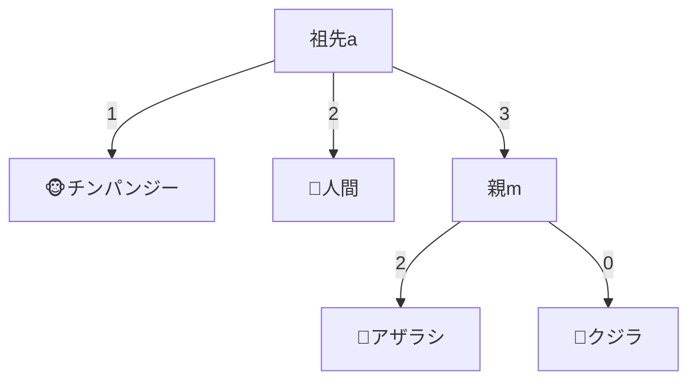

# 隣接結合法：距離から系統樹を魔法のように構築する（超詳細版）

## 🎯 まず、この講義で何を学ぶのか

最終ゴール：**距離行列から、誰も見たことのない進化の木を、数学的に正確に再構築するアルゴリズムを完全マスターする**

でも、ちょっと待ってください。そもそも、どうやって数字の表から正しい家系図が作れるの？
実は、「最も近い親戚から順番に見つけていく」という、シンプルだけど強力な戦略があるんです。

## 🔍 ステップ0：問題設定の復習

### 0-1. 私たちが持っているもの

```
距離行列（例）：
       人間  チンパンジー  ゴリラ  アザラシ  クジラ
人間     0      3         5       7      6
チンパンジー 3      0         4       6      5
ゴリラ   5      4         0       6      5
アザラシ  7      6         6       0      2
クジラ   6      5         5       2      0

これだけ！
```

### 0-2. 私たちが作りたいもの

```
進化系統樹：
        共通祖先
         /    \
        /      \
     祖先1    祖先2
      /  \     /  \
   人間 チンパンジー アザラシ クジラ
            |
          ゴリラ

でも、どうやって？
```

### 0-3. 天才的な発見

```
驚きの事実：

距離行列の最小値（2）
= アザラシとクジラの距離

これは偶然じゃない！
最も近い種は、系統樹でも隣同士！
```

## 👥 ステップ1：「隣人（Neighbors）」という概念

### 1-1. 隣人とは？

```
数学的定義：
「同じ親ノードを共有する葉」

つまり...
兄弟姉妹のような関係！

    親（共通祖先）
     /    \
アザラシ  クジラ ← 隣人！
```

### 1-2. なぜ隣人が重要？

```python
def find_neighbors(distance_matrix):
    """距離行列から隣人を見つける"""

    # 最小距離を探す
    min_distance = float('inf')
    neighbor1, neighbor2 = None, None

    for i in range(len(distance_matrix)):
        for j in range(i+1, len(distance_matrix)):
            if distance_matrix[i][j] < min_distance:
                min_distance = distance_matrix[i][j]
                neighbor1, neighbor2 = i, j

    print(f"隣人発見：{neighbor1}と{neighbor2}")
    print(f"距離：{min_distance}")
    return neighbor1, neighbor2
```

### 1-3. 隣人の性質

```
定理：
すべての系統樹には
必ず隣人のペアが存在する！

証明（直感的）：
最も最近分岐した種は
まだ近くにいるはず
```

## 🧮 ステップ2：魔法の公式

### 2-1. 問題：親までの距離は？

```
状況：
アザラシとクジラが隣人
でも親ノードmまでの距離は？

    m（親）
    / ?  \ ?
アザラシ  クジラ

?を求めたい！
```

### 2-2. 天才的な公式の導出

```
準備：
i, j：隣人（アザラシ、クジラ）
m：親ノード
k：その他の任意の種（例：チンパンジー）

観察：
i → m → k の距離 = d(i,k)
j → m → k の距離 = d(j,k)
i → j の距離 = d(i,j)

すると...
```

### 2-3. 公式の発見

```python
def distance_to_parent(i, j, k, distance_matrix):
    """隣人から親までの距離を計算"""

    # 魔法の公式！
    d_im = (distance_matrix[i][k] +
            distance_matrix[i][j] -
            distance_matrix[j][k]) / 2

    d_jm = (distance_matrix[j][k] +
            distance_matrix[i][j] -
            distance_matrix[i][k]) / 2

    return d_im, d_jm

# 実例：
# アザラシ→親 = (6 + 2 - 4) / 2 = 2
# クジラ→親 = (4 + 2 - 6) / 2 = 0
```

## 🎨 ステップ3：実際の計算例

### 3-1. 初期状態

```
距離行列：
       アザラシ  クジラ  チンパンジー  人間
アザラシ   0      2       6         7
クジラ     2      0       4         5
チンパンジー 6      4       0         3
人間      7      5       3         0

最小値：2（アザラシ-クジラ）
```

### 3-2. 親ノードmを追加

```python
# ステップ1：隣人（アザラシ、クジラ）を見つける
neighbors = ("アザラシ", "クジラ")

# ステップ2：親mまでの距離を計算
# k = チンパンジーを選択
d_seal_m = (6 + 2 - 4) / 2 = 2
d_whale_m = (4 + 2 - 6) / 2 = 0

# 結果：
#     m
#    /2 \0
# アザラシ クジラ
```

### 3-3. 新しい距離行列

```
元の行列から：
- アザラシとクジラを削除
- 親mを追加

新しい距離：
m → チンパンジー = 4
m → 人間 = 5

新行列：
       m  チンパンジー  人間
m      0      4         5
チンパンジー 4      0         3
人間    5      3         0
```

## 🔄 ステップ4：再帰的な適用

### 4-1. 2回目の反復

```python
def second_iteration():
    """2回目の反復"""

    # 新しい最小値：3（チンパンジー-人間）
    # これらが隣人！

    # 新しい親aを追加
    # k = mを選択
    d_chimp_a = (4 + 3 - 5) / 2 = 1
    d_human_a = (5 + 3 - 4) / 2 = 2

    return """
        a
       /1 \\2
    チンパンジー 人間
    """
```

### 4-2. 最終的な接続

```
残った距離：
a → m = 3

最終的な木：
      a
     /1\\2
チンパンジー 人間
     |3
     m
    /2\\0
アザラシ クジラ
```

### 4-3. 完成した系統樹



## ⚠️ ステップ5：特殊なケース

### 5-1. エッジの重みが0の場合

```
問題：
クジラ → m の距離 = 0

これは何を意味する？
→ クジラとmは実質的に同じ位置！

解決策：
内部ノードとして扱わず、
クジラを分岐点とする
```

### 5-2. ノードの圧縮

```python
def compress_zero_edges(tree):
    """重み0のエッジを圧縮"""

    for edge in tree.edges:
        if edge.weight == 0:
            if not edge.connects_to_leaf():
                # 内部ノード同士なら圧縮
                merge_nodes(edge.node1, edge.node2)
            else:
                # 葉は保持
                print("葉は現存種なので圧縮しない")
```

## 🎯 ステップ6：完全なアルゴリズム

### 6-1. 隣接結合法の疑似コード

```python
def neighbor_joining(distance_matrix, species_names):
    """隣接結合法の完全実装"""

    tree = Tree()
    active_nodes = list(species_names)

    while len(active_nodes) > 2:
        # 1. 最小距離のペアを見つける
        i, j = find_minimum_pair(distance_matrix)

        # 2. 新しい親ノードを作成
        parent = f"node_{len(tree.nodes)}"

        # 3. 親までの距離を計算
        d_i_parent = calculate_distance_to_parent(i, j, distance_matrix)
        d_j_parent = distance_matrix[i][j] - d_i_parent

        # 4. 木にエッジを追加
        tree.add_edge(active_nodes[i], parent, d_i_parent)
        tree.add_edge(active_nodes[j], parent, d_j_parent)

        # 5. 距離行列を更新
        update_distance_matrix(distance_matrix, i, j, parent)

        # 6. アクティブノードを更新
        active_nodes.remove(active_nodes[i])
        active_nodes.remove(active_nodes[j])
        active_nodes.append(parent)

    # 最後の2ノードを接続
    tree.add_edge(active_nodes[0], active_nodes[1],
                  distance_matrix[0][1])

    return tree
```

### 6-2. 計算量の分析

```
時間計算量：O(n³)

理由：
- n回の反復
- 各反復でO(n²)の最小値探索
- 合計：O(n³)

空間計算量：O(n²)
（距離行列のサイズ）
```

## 🧪 ステップ7：練習問題

### 7-1. あなたの番です

```
距離行列：
     A  B  C  D
A    0  2  6  8
B    2  0  6  8
C    6  6  0  4
D    8  8  4  0

この木を構築してください！
```

### 7-2. ヒント

```python
def solve_practice():
    """練習問題のヒント"""

    # ステップ1：最小値は？
    # ステップ2：どのペアが隣人？
    # ステップ3：公式を適用
    # ステップ4：繰り返す

    return "頑張って！"
```

## 📚 まとめ：3つの理解レベル

### レベル1：表面的理解（これだけでもOK）

```
- 最も近い種から順にグループ化
- 魔法の公式で親までの距離を計算
- 再帰的に木を構築
```

### レベル2：本質的理解（ここまで来たら素晴らしい）

```
- 隣人の数学的定義と重要性
- 距離公式の導出原理
- エッジケースの処理方法
```

### レベル3：応用的理解（プロレベル）

```
- O(n³)アルゴリズムの最適化
- 統計的信頼性の評価
- 実データへの適用と改良
```

## 🚀 実世界での応用

### COVID-19変異株の追跡

```python
def track_covid_variants():
    """COVID-19変異株の系統樹構築"""

    variants = ["武漢株", "アルファ", "デルタ", "オミクロン"]

    # ゲノム配列から距離行列を作成
    # 隣接結合法で系統樹を構築
    # 変異の起源と経路を特定

    return "パンデミック対策に貢献！"
```

## 🎬 次回予告：UPGMA法

次回は「UPGMA法」。

隣接結合法とは違うアプローチで、
「分子時計」の概念を使った
進化系統樹の構築方法を学びます！

```python
# 予告編
def next_algorithm():
    """次回のアルゴリズム"""
    print("平均距離を使う")
    print("超シンプル")
    print("でも強力な仮定が必要...")
    return "お楽しみに"
```

---

_数学の魔法で進化の歴史を再現する、あなたも系統樹マスターになる準備はできましたか？_
