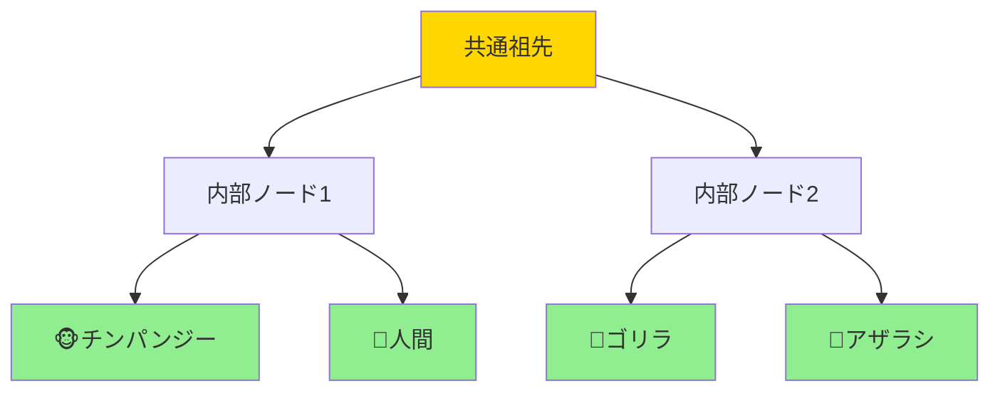

# 距離行列から進化ツリーへ：生命の家系図を描く魔法（超詳細版）

## 🎯 まず、この講義で何を学ぶのか

最終ゴール：**数字の表（距離行列）から、数十億年の進化の歴史を描いた美しい系統樹を作り出す技術を習得する**

でも、ちょっと待ってください。そもそも、どうやって数字の表が生命の樹に変わるの？
実は、これは「最短経路問題」と「グラフ理論」を組み合わせた、エレガントな数学の魔法なんです。

## 📊 ステップ0：距離行列って何？

### 0-1. 身近な例から始めよう

```
東京からの距離（km）：

       東京  大阪  名古屋  仙台
東京    0    500   350    370
大阪   500    0    150    870
名古屋 350   150    0     520
仙台   370   870   520     0

これが距離行列！
```

### 0-2. 生物学での距離行列

```
DNAの違いを数える：

人間：    ATCGATCG
チンパンジー：ATCGATGG
ゴリラ：   ATGGATGG
オランウータン：CTGGATGG

違いの数を数えると...
距離行列ができる！
```

### 0-3. なぜこれが重要？

```
距離行列があれば：
→ 進化の順番が分かる
→ 共通祖先が推定できる
→ 病気の起源が特定できる

まさに生命の歴史書！
```

## 🧬 ステップ1：マルチプルアラインメントから距離へ

### 1-1. まず配列を並べる

```python
def create_multiple_alignment():
    """複数の配列を整列させる"""

    sequences = {
        "人間":     "ACGTACGT",
        "チンパンジー": "ACGTACGG",
        "ゴリラ":    "ACGGACGG",
        "アザラシ":   "TCGGACGG"
    }

    # 同じ位置で比較できるように整列
    return aligned_sequences
```

### 1-2. 違いを数える

```python
def calculate_distance(seq1, seq2):
    """2つの配列の違いを数える"""

    distance = 0
    for i in range(len(seq1)):
        if seq1[i] != seq2[i]:
            distance += 1

    return distance

# 例：人間とチンパンジー
# ACGTACGT vs ACGTACGG
# 違い：1箇所（最後のT vs G）
```

### 1-3. 距離行列の完成

```
      人間  チンパンジー  ゴリラ  アザラシ
人間    0      1         2      4
チンパンジー 1      0         1      3
ゴリラ   2      1         0      2
アザラシ  4      3         2      0

近い数字 = 近い親戚！
```

## 🌳 ステップ2：木（ツリー）の数学的定義

### 2-1. そもそも「木」って何？

```
数学での木の定義：

1. 連結されている（バラバラじゃない）
2. 非環式（ループがない）

つまり...
「どこからでも行けるけど、
ぐるっと回って戻ってこれない」
```

### 2-2. 木の不思議な性質

```python
class Tree:
    """木の基本性質"""

    def __init__(self, n_nodes):
        self.nodes = n_nodes
        # 驚きの法則！
        self.edges = n_nodes - 1

    def minimum_leaves(self):
        """最小の葉の数"""
        if self.nodes >= 2:
            return 2  # 必ず2枚以上の葉がある！
```

### 2-3. なぜn-1本の枝？

```
証明（簡単バージョン）：

1個のノード：枝0本 ✓
2個のノード：枝1本 ✓
3個のノード：枝2本 ✓

新しいノードを追加するたび
枝を1本追加 → n個でn-1本！

エレガントな数学！
```

## 🍃 ステップ3：葉と内部ノード

### 3-1. 系統樹の構造



### 3-2. 葉 = 現在の生物

```
葉（リーフ）の特徴：
- 次数が1（枝が1本だけ）
- 現在生きている種
- 観測可能なデータ

内部ノード：
- 次数が3以上（分岐点）
- 絶滅した共通祖先
- 推定する必要がある
```

### 3-3. スパイクタンパク質の例

```
SARSコロナウイルスの系統樹：

スパイクタンパク質を使う理由：
1. 宿主への結合に重要
2. 進化が速い
3. 種の違いがよく現れる

まさに進化の指紋！
```

## 🔢 ステップ4：距離行列に「適合する」木

### 4-1. 適合するとは？

```
距離行列：
      A  B  C
A     0  3  6
B     3  0  5
C     6  5  0

適合する木：
A---1---x---2---B
        |
        3
        |
        C

パスの長さ = 距離行列の値！
```

### 4-2. 実際に確認してみよう

```python
def check_tree_fit(tree, distance_matrix):
    """木が距離行列に適合するか確認"""

    # A-B間のパス：1 + 2 = 3 ✓
    # A-C間のパス：1 + 3 = 4 ✗
    # あれ？合わない！

    return "この木は適合しない"
```

### 4-3. 重み付けの調整

```
正しい重み付け：
A---1---x---2---B
        |
        3
        |
        C

確認：
A-B: 1 + 2 = 3 ✓
A-C: 1 + 3 = 4... まだ違う！

実は、この距離行列には
適合する木が存在しない！
```

## 🎯 ステップ5：加法行列の魔法

### 5-1. 加法行列とは？

```
加法行列（Additive Matrix）：
「適合する木が存在する」距離行列

条件：4点条件
任意の4つの種について
ある不等式が成立する
（詳細は後ほど）
```

### 5-2. 加法行列の判定

```python
def is_additive(distance_matrix):
    """加法行列かどうか判定"""

    # 4点条件をチェック
    for four_species in all_combinations:
        if not four_point_condition(four_species):
            return False

    return True  # 木が作れる！
```

### 5-3. なぜ重要？

```
現実のデータ：

完璧に加法的 → まれ
ほぼ加法的 → よくある

対策：
近似的に適合する木を見つける
→ 実用的なアルゴリズム！
```

## 🌲 ステップ6：単純な木

### 6-1. 単純でない木の問題

```
悪い例：
A---x---y---z---B
    |
    C

x, y, zは次数2のノード
→ 無駄に長い！
```

### 6-2. 単純な木への変換

```python
def simplify_tree(tree):
    """木を単純化"""

    # 次数2のノードを探す
    for node in tree.nodes:
        if node.degree == 2:
            # パスを圧縮
            compress_path(node)

    return simplified_tree
```

### 6-3. 唯一性の定理

```
驚きの事実！

加法行列に対して：
- 適合する木は無数にある
- でも単純な木は1つだけ！

これが系統樹を一意に決定する鍵！
```

## 🧮 ステップ7：アルゴリズムの実装

### 7-1. 基本的なアプローチ

```python
def distance_to_tree(distance_matrix):
    """距離行列から系統樹を構築"""

    # ステップ1：加法性チェック
    if not is_additive(distance_matrix):
        print("警告：近似的な木になります")

    # ステップ2：木の構築
    tree = build_tree(distance_matrix)

    # ステップ3：単純化
    simple_tree = simplify(tree)

    return simple_tree
```

### 7-2. 計算の複雑さ

```
入力：n種の距離行列
サイズ：n×n

可能な木の数：
n=10: 約200万通り
n=20: 約10^20通り
n=50: 宇宙の原子数より多い！

だから賢いアルゴリズムが必要！
```

## 🎨 ステップ8：実例：コロナウイルスの系統樹

### 8-1. データ収集

```
収集したウイルス：
1. SARS-CoV（人間）
2. Bat-CoV（コウモリ）
3. Civet-CoV（ハクビシン）
4. MERS-CoV（ラクダ）
など...

比較部位：スパイクタンパク質
```

### 8-2. 距離行列の作成

```python
# 実際のデータ（簡略化）
corona_distances = {
    ("SARS", "Bat"): 15,
    ("SARS", "Civet"): 8,
    ("SARS", "MERS"): 120,
    ("Bat", "Civet"): 12,
    # ... など
}
```

### 8-3. 結果の解釈

```
構築された系統樹：

        共通祖先
         /    \
      Bat-CoV  \
        |       \
    Civet-CoV  MERS
        |
    SARS-CoV

結論：SARSはハクビシン経由！
```

## 📚 まとめ：3つの理解レベル

### レベル1：表面的理解（これだけでもOK）

```
- 距離行列 = 種間の違いの表
- 系統樹 = 進化の家系図
- 数学的に最適な木を見つける
```

### レベル2：本質的理解（ここまで来たら素晴らしい）

```
- 加法行列の概念と重要性
- 単純な木の一意性
- グラフ理論と生物学の融合
```

### レベル3：応用的理解（プロレベル）

```
- 4点条件の数学的証明
- 近似アルゴリズムの実装
- 統計的信頼性の評価
```

## 🚀 実践演習

### 自分で試してみよう

```python
# 簡単な例題
def practice_problem():
    """4種の動物で練習"""

    distance_matrix = [
        [0, 2, 4, 6],  # 犬
        [2, 0, 4, 6],  # 猫
        [4, 4, 0, 6],  # 牛
        [6, 6, 6, 0]   # 魚
    ]

    # この行列は加法的？
    # どんな木ができる？

    return "挑戦してみて！"
```

## 🎬 次回予告：隣接結合法

次回は「隣接結合法（Neighbor-Joining）」。

現実の「ノイズだらけ」のデータから、
最も確からしい系統樹を見つける
実用的なアルゴリズムを学びます！

```python
# 予告編
def next_algorithm():
    """次回のアルゴリズム"""
    print("O(n³)の高速計算")
    print("ノイズに強い")
    print("世界中で使われている！")
    return "お楽しみに"
```

---

_数字の表から生命の歴史を読み解く、あなたも進化の探偵になる準備はできましたか？_
