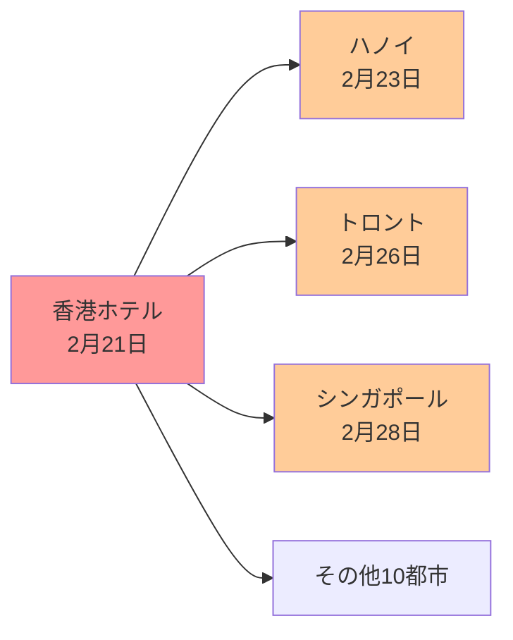

# 最速のアウトブレイク：21世紀のパンデミックと進化系統樹（超詳細版）

## 🎯 まず、この講義で何を学ぶのか

最終ゴール：**わずか7日間で世界中に広がった致死性ウイルスの起源を、進化系統樹を使って突き止める技術を習得する**

でも、ちょっと待ってください。そもそも、なぜ21世紀になって病気がこんなに速く広がるようになったの？
実は、2003年に香港の普通のホテルで起きた出来事が、現代パンデミックの恐ろしさと、それに立ち向かう科学の力を教えてくれるんです。

## 🏨 ステップ0：香港メトロポールホテル、運命の日

### 0-1. 平凡なホテルで起きた、歴史的瞬間

```
2003年2月21日、香港
メトロポールホテル911号室

一人の中国人医師がチェックイン
目的：翌日の結婚式に出席

しかし...
医師は中国農村部で謎の患者を治療中
重篤な呼吸器疾患に感染していた
```

### 0-2. 結婚式には行けなかった

```
翌日の朝：
医師は起き上がれない
結婚式どころではない
通りの向こうの病院へ緊急入院

2週間後：
医師は死亡

でも、それは始まりに過ぎなかった...
```

### 0-3. なぜこの話が重要？

```
実は、この医師の1泊が
21世紀最初の世界的パンデミックの
引き金になったんです

でも、どうやって？
なぜそんなに速く広がった？
```

## ⚡ ステップ1：14世紀 vs 21世紀の病気の速度

### 1-1. 黒死病の「のんびり」した拡散

```
14世紀のペスト（黒死病）：

死者数：ヨーロッパ人口の1/3
恐ろしさ：★★★★★

でも拡散速度は...
コンスタンティノープル → キエフ
距離：約1,500km
所要時間：4年！

1日あたり：約1km
```

### 1-2. 現代の移動速度

```
21世紀の同じ距離：

車：1日で到着
飛行機：2時間で到着

つまり...
病気の拡散速度が1,460倍に！
```

### 1-3. 衝撃の事実

```python
def compare_disease_spread():
    """病気の拡散速度を比較"""

    # 14世紀
    plague_speed = 1  # km/日

    # 21世紀
    airplane_speed = 750  # km/時
    daily_travel = airplane_speed * 24  # 18,000 km/日

    acceleration = daily_travel / plague_speed
    print(f"病気の潜在的拡散速度：{acceleration:,}倍")
    # 結果：18,000倍！
```

## 🌍 ステップ2：9階の廊下から世界へ

### 2-1. たった1つのフロアで起きた恐怖

```
メトロポールホテル9階
2003年2月21日〜22日

中国人医師が感染させた人数：13人
出身国：
- カナダ
- シンガポール
- ベトナム
- アメリカ
- 香港（地元）
- etc...

全員が同じ階に宿泊
```

### 2-2. 驚異的な拡散速度

```
感染のタイムライン：

2月21日：医師チェックイン
2月23日：ハノイで発症（2日後）
2月26日：トロントで発症（5日後）
2月28日：シンガポールで発症（7日後）

わずか1週間で3大陸に拡散！
```

### 2-3. グラフで見る恐怖



## 🦠 ステップ3：名前もない病気

### 3-1. 世界的流行なのに誰も気づかない

```
驚くべき事実：

病気が世界中に広がっているのに
誰もそれが同じ病気だと気づかない！

なぜ？
- 各国で別々に患者が発生
- 症状が普通の肺炎に似ている
- 情報共有が遅れた
```

### 3-2. SARS（重症急性呼吸器症候群）の誕生

```
2003年3月：
WHO（世界保健機関）が気づく
「これ、全部同じ病気じゃない？」

病名決定：SARS
Severe Acute Respiratory Syndrome
重症急性呼吸器症候群

ついに敵の正体が判明！
```

### 3-3. ポップカルチャーの反応

```
SARSの影響：

映画界の反応（信じられないけど本当）：
- 「SARS Wars」（タイ製ゾンビ映画）
- スター・ウォーズのパロディ
- ゾンビとSARSを組み合わせた作品

人類の恐怖がエンタメ化される速度も
21世紀品質...
```

## 🔬 ステップ4：21世紀の武器

### 4-1. 顕微鏡で見えた犯人

```
研究者の発見：

顕微鏡で観察すると...
「これはコロナウイルスだ！」

なぜコロナ（王冠）？
→ 日食の時の太陽のコロナに似ている
→ ウイルスの表面にトゲトゲの突起
```

### 4-2. RNAウイルスの恐怖

```python
class CoronaVirus:
    """コロナウイルスの特徴"""

    def __init__(self):
        self.genetic_material = "RNA"  # DNAではない！
        self.genome_size = 29_751  # ヌクレオチド
        self.mutation_rate = "非常に高い"

    def why_dangerous(self):
        """なぜ危険か"""
        reasons = [
            "RNA複製はエラーが多い",
            "DNAより100倍変異しやすい",
            "ワクチン開発が困難"
        ]
        return reasons
```

### 4-3. 高速シーケンシング

```
2003年の科学技術：

SARSウイルスの全ゲノム解読
29,751ヌクレオチド
所要時間：わずか数週間！

比較：
1918年スペイン風邪 → 原因特定に数十年
2003年SARS → 数週間で全ゲノム解読

科学の進歩がパンデミックと戦う！
```

## 🐾 ステップ5：犯人は誰だ？動物起源説

### 5-1. 最初の容疑者：鳥

```
なぜ鳥が疑われた？

1997年：鳥インフルエンザ
- ニワトリから人間へ感染
- 初めての種の壁越え
- 香港で発生（同じ場所！）

研究者の推理：
「SARSも鳥から来たのでは？」
```

### 5-2. でも、本当の犯人は？

```
疑問の数々：

1. どの動物が感染源？
2. どうやって人間に感染？
3. 感染経路は追跡できる？

答えを見つける方法：
進化系統樹！
```

### 5-3. ダーウィンからの贈り物

```
1837年：チャールズ・ダーウィン
世界初の進化系統樹を描く

2003年：現代の科学者
ウイルスの進化系統樹で起源を探る

166年の時を超えた
同じアイデアの応用！
```

## 🌳 ステップ6：進化系統樹という探偵ツール

### 6-1. HIVの教訓

```
HIVの進化系統樹が教えてくれたこと：

発見：
サルからヒトへ5回独立に感染！
（系統樹の★マーク5箇所）

結果：
HIV-1グループM、N、O、P
HIV-2

つまり...
進化系統樹で起源が分かる！
```

### 6-2. SARSの系統樹を作ろう

```python
def build_phylogenetic_tree():
    """SARS起源を探る系統樹構築"""

    # 各種のコロナウイルスを収集
    viruses = {
        "SARS_human": "ATCG...",  # ヒトSARS
        "corona_bat": "ATCG...",   # コウモリ
        "corona_civet": "ATCG...", # ハクビシン
        "corona_bird": "ATCG..."   # 鳥
    }

    # 遺伝的距離を計算
    # 最も近い種が感染源！

    return "起源判明！"
```

### 6-3. なぜこれが重要？

```
進化系統樹で分かること：

1. 感染源の動物
   → 市場規制、接触回避

2. ウイルスの進化速度
   → 次の変異予測

3. 感染経路
   → 封じ込め戦略

未来のパンデミック対策の基礎！
```

## 🧬 ステップ7：変異の速度競争

### 7-1. RNAウイルスの恐るべき能力

```
変異速度の比較：

DNAウイルス：
- 1年で0.01%変異
- 比較的安定

RNAウイルス（SARS、インフルエンザ、HIV）：
- 1年で1%変異
- 100倍の速度！

だから...
- インフルエンザワクチンは毎年更新
- HIVワクチンはいまだに開発困難
```

### 7-2. リアルタイムの進化

```
講義中の30分間でも...

SARSウイルス（仮定）：
- 10億個のウイルス粒子
- 各複製で0.001%のエラー率
- 30分で数千の変異体が誕生

まさに目の前で進化が起きている！
```

## 🎯 ステップ8：アルゴリズムの課題

### 8-1. 系統樹構築の難しさ

```
課題：

入力：
- 数十種のウイルスゲノム
- 各30,000文字の配列

求めるもの：
- 最も確からしい進化の道筋
- 分岐の時期
- 共通祖先

可能な木の数：
10種類でも200万通り以上！
```

### 8-2. 次回予告

```python
def next_lecture():
    """次回学ぶアルゴリズム"""

    topics = [
        "距離ベースの系統樹構築",
        "最節約法",
        "最尤法",
        "ベイズ推定"
    ]

    print("これらの手法で")
    print("SARSの起源が明らかに！")
    return "お楽しみに"
```

## 📚 まとめ：3つの理解レベル

### レベル1：表面的理解（これだけでもOK）

```
- 2003年、香港のホテルから7日で世界へ
- 21世紀は病気の拡散が超高速
- 進化系統樹で起源が分かる
```

### レベル2：本質的理解（ここまで来たら素晴らしい）

```
- グローバリゼーションとパンデミックの関係
- RNAウイルスの高い変異率の意味
- 系統樹による感染経路の追跡原理
```

### レベル3：応用的理解（プロレベル）

```
- コロナウイルスの分子進化
- 系統樹構築アルゴリズムの実装
- 次のパンデミック予測モデル
```

## 🚨 現代への警告

### COVID-19との比較

```
SARS（2003年）：
- 感染者：8,096人
- 死者：774人
- 期間：8ヶ月

COVID-19（2019年〜）：
- 感染者：7億人以上
- 死者：700万人以上
- 期間：4年以上継続

教訓：
早期検出と系統樹解析の重要性！
```

## 🎬 次回予告：系統樹構築アルゴリズム

次回は「進化系統樹を描く魔法のアルゴリズム」。

数十億年の進化の歴史を、
わずか数分で再構築する方法を学びます！

```python
# 予告編
def preview():
    """次回の内容"""
    print("30,000文字の配列から")
    print("進化の歴史を再現")
    print("SARSの真の起源が明らかに！")
    return "Coming soon..."
```

---

_21世紀のパンデミックと戦う、あなたもウイルスハンターになる準備はできましたか？_
