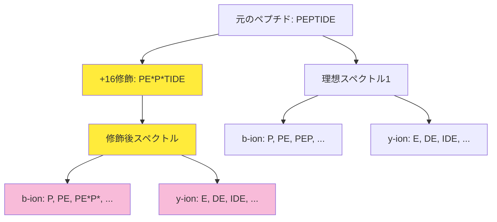
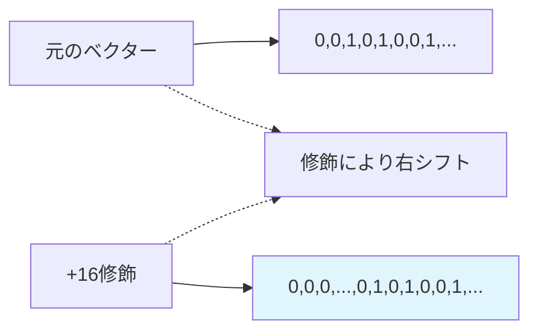

# 翻訳後修飾ペプチドの検索（超詳細版）

## 🎯 まず、この講義で何を学ぶのか

最終ゴール：**翻訳後修飾されたペプチドを質量分析スペクトルから効率的に検索する手法を完全に理解する**

でも、ちょっと待ってください。そもそも「翻訳後修飾」って何でしょう？そして、なぜそれがペプチド検索を複雑にするのでしょうか？

実は、この問題を解決することで、**6800万年前のT-Rexのコラーゲンに含まれるヒドロキシプロリン**のような貴重な生物学的発見が可能になるんです。

## 🤔 ステップ0：なぜ翻訳後修飾の検索が重要なの？

### 0-1. T-Rexの化石から驚きの発見

2007年、研究者のAsaraチームがT-Rexの化石から抽出したペプチドを質量分析で解析しました。

その結果、驚くべき事実が判明したのです：

- T-Rexペプチド中のほとんどのプロリン（Pro）は、実は**ヒドロキシプロリン**という修飾版だった
- もし修飾を考慮しなければ、このペプチドは「未知のペプチド」として片付けられてしまった
- 修飾を考慮することで、現代のコラーゲンとの類似性が明らかになった

### 0-2. セントラルドグマでは語られない真実

生物学の授業で習うセントラルドグマ（DNA → RNA → タンパク質）は、実は物語の半分でしかありません。

なぜなら：

- **ほとんどのタンパク質は翻訳後に修飾される**
- 現在知られている修飾は**600種類以上**
- これらの修飾は細胞シグナル伝達と代謝調節に極めて重要

つまり、修飾を無視したペプチド検索は「片目をつぶって物を見る」のと同じなのです。

## 📖 ステップ1：翻訳後修飾って、そもそも何？

### 1-1. 修飾の正体を探ってみよう

翻訳後修飾とは、**タンパク質が作られた後に、特定のアミノ酸に化学的な変化が加えられること**です。

これを身近な例で考えてみましょう：

```
普通の料理（未修飾タンパク質）
↓ 調味料を加える（修飾）
美味しい料理（修飾タンパク質）
```

でも、ちょっと待ってください。「調味料を加える」という比喩だと、修飾がどのように質量分析に影響するかが分からないですね。

### 1-2. 修飾を「質量の変化」として理解する

質量分析の観点から見ると、修飾とは**アミノ酸の質量を変化させること**です。

具体的には：

```python
# 修飾による質量変化の例
modifications = {
    'リン酸化': +80,      # PO3が付く
    'ヒドロキシプロリン': +16,  # OH基が付く
    'リジンのアリシン化': -1     # 小さな化学変化
}

def apply_modification(amino_acid_mass, modification_delta):
    """修飾によるアミノ酸質量の変化を計算"""
    return amino_acid_mass + modification_delta

# 例：プロリンのヒドロキシ化
proline_mass = 97.05  # 通常のプロリン
hydroxyproline_mass = apply_modification(proline_mass, 16)
print(f"ヒドロキシプロリンの質量: {hydroxyproline_mass}")
```

### 1-3. なぜ修飾がペプチド検索を複雑にするのか

ここで重要な観察をしてみましょう。

修飾があると：

1. **アミノ酸アルファベットの文字数が増える**
   - 通常：20種類のアミノ酸
   - 修飾考慮：20 × 修飾パターン数 → 膨大な数

2. **検索空間が爆発的に拡大する**
   - ペプチド長10、修飾2個まで考慮 → 組み合わせは数百万通り

3. **どこに修飾があるか事前に分からない**

つまり、**修飾を考慮したペプチド検索は、巨大な迷路で宝物を探すようなもの**なのです。

## 📖 ステップ2：ペプチドベクターに修飾はどう影響する？

### 2-1. まず、普通のペプチドベクターを思い出そう

ペプチド`PEPTIDE`のペプチドベクターを思い出してください：

```
P-E-P-T-I-D-E のアミノ酸質量：
P: 97, E: 129, P: 97, T: 101, I: 113, D: 115, E: 129

累積質量：
位置0: 0
位置1: 97
位置2: 226 (97+129)
位置3: 323 (226+97)
...
```

ペプチドベクターは、各累積質量の位置に1を立てたベクトルでしたね。

### 2-2. 修飾があると何が変わるか？

では、3番目のP（プロリン）がヒドロキシプロリン（+16）になったとしましょう：

```
修飾前: P-E-P-T-I-D-E
修飾後: P-E-[P+16]-T-I-D-E

質量変化:
位置3以降の累積質量が全て+16される
```

これをペプチドベクターで表現すると：

```python
def create_modified_peptide_vector(peptide, modification_position, delta_mass, max_mass):
    """修飾を考慮したペプチドベクターを作成"""
    vector = [0] * max_mass
    cumulative_mass = 0

    amino_acid_masses = {'P': 97, 'E': 129, 'T': 101, 'I': 113, 'D': 115}

    for i, aa in enumerate(peptide):
        # 修飾位置の場合、質量を変更
        if i == modification_position:
            mass = amino_acid_masses[aa] + delta_mass
        else:
            mass = amino_acid_masses[aa]

        cumulative_mass += mass
        if cumulative_mass < max_mass:
            vector[cumulative_mass] = 1

    return vector

# 例：3番目のPを+16修飾
original_vector = create_peptide_vector("PEPTIDE")
modified_vector = create_modified_peptide_vector("PEPTIDE", 2, 16, 1000)
```

### 2-3. 修飾がペプチドベクターに与える影響の法則

ここで天才的な発見があります！

**正の質量修飾（+Δ）**の場合：

- i番目のアミノ酸に+Δの修飾
- → ペプチドベクターでは、i番目の1の前にΔ個の0を挿入

**負の質量修飾（-Δ）**の場合：

- i番目のアミノ酸に-Δの修飾
- → ペプチドベクターでは、i番目の1の前からΔ個の0を削除

```python
def visualize_modification_effect():
    """修飾によるペプチドベクターの変化を視覚化"""
    print("元のペプチドベクター:")
    print("0001000100100...") # 仮の例

    print("\n+3の修飾を2番目のアミノ酸に適用:")
    print("000000100100100...") # 3つの0が挿入された

    print("\n-2の修飾を2番目のアミノ酸に適用:")
    print("0100100...")  # 2つの0が削除された

visualize_modification_effect()
```

すごいですね！これで修飾がペプチドベクターにどのような数学的変換を加えるかが明確になりました。

## 📖 ステップ3：スペクトルアライメント問題を定式化しよう

### 3-1. まず問題設定を整理してみよう

でも、ちょっと待ってください。修飾されたペプチドをどうやって効率的に検索するのでしょうか？

まず、**Variants_K(Peptide)**という概念を導入しましょう：

```python
def variants_k(peptide, k):
    """
    ペプチドに最大k個の修飾を加えた全ての変異体の集合

    Args:
        peptide: 元のペプチド配列
        k: 最大修飾数

    Returns:
        全ての可能な修飾変異体のリスト
    """
    # これは実際には膨大な数になる！
    pass
```

### 3-2. スペクトルアライメント問題の定式化

では、スペクトルアライメント問題を正式に定義してみましょう：

**入力**：

- ペプチド配列 `Peptide`
- スペクトルベクター `Spectrum`
- 最大修飾数 `k`

**出力**：

- `Variants_K(Peptide)`の中で、`Spectrum`に対するスコアが最大となる修飾変異体

**ナイーブな解法**：

```python
def naive_spectrum_alignment(peptide, spectrum, k):
    """ナイーブなスペクトルアライメント"""
    best_score = -1
    best_variant = None

    # 全ての可能な修飾変異体を調べる
    for variant in variants_k(peptide, k):
        variant_vector = create_peptide_vector(variant)
        score = calculate_score(variant_vector, spectrum)

        if score > best_score:
            best_score = score
            best_variant = variant

    return best_variant, best_score
```

でも、これは遅すぎます！なぜなら、`variants_k`の要素数が膨大だからです。

### 3-3. 組み合わせ爆発の恐怖

具体的にどれくらい膨大かを計算してみましょう：

```python
def calculate_search_space(peptide_length, k, num_modifications=10):
    """
    検索空間のサイズを計算

    Args:
        peptide_length: ペプチドの長さ
        k: 最大修飾数
        num_modifications: 考慮する修飾タイプ数
    """
    from math import comb

    total = 0
    for i in range(k + 1):  # 0個から k個まで
        # i個の修飾を配置する方法数
        positions = comb(peptide_length, i)
        # 各位置での修飾タイプの選択数
        modifications = num_modifications ** i
        total += positions * modifications

    return total

# 例：長さ10のペプチド、最大2個の修飾
space_size = calculate_search_space(10, 2, 10)
print(f"検索空間のサイズ: {space_size:,}")  # 数十万通り！
```

これでは、プロテオーム全体を検索するのは現実的ではありませんね。

## 📖 ステップ4：修飾検索問題 - より大きな挑戦

### 4-1. 本当に解きたい問題は何か？

実は、スペクトルアライメント問題は序章に過ぎません。私たちの真の目標は**修飾検索問題**です：

**修飾検索問題**：

- **入力**：スペクトル `S`、プロテオーム `P`
- **出力**：プロテオーム中の全修飾ペプチドの中で、スペクトル `S` に対するスコアが最大のもの

```python
def modification_search(spectrum, proteome, k):
    """
    修飾検索問題の解法

    Args:
        spectrum: 検索対象のスペクトル
        proteome: プロテオームデータベース
        k: 最大修飾数

    Returns:
        最高スコアの修飾ペプチド
    """
    best_score = -1
    best_peptide = None

    for peptide in proteome:
        # 各ペプチドに対してスペクトルアライメントを実行
        variant, score = spectrum_alignment(peptide, spectrum, k)

        if score > best_score:
            best_score = score
            best_peptide = variant

    return best_peptide, best_score
```

### 4-2. 効率化の必要性

でも待ってください。プロテオームには数百万のペプチドが含まれています。各ペプチドに対してナイーブなスペクトルアライメントを実行したら：

```python
# 概算計算
proteome_size = 1_000_000  # 百万ペプチド
avg_search_space_per_peptide = 10_000  # 一つのペプチドあたりの検索空間
total_operations = proteome_size * avg_search_space_per_peptide
print(f"総計算回数: {total_operations:,}")  # 100億回！
```

これは現実的ではありません。**高速なスペクトルアライメントアルゴリズムが絶対に必要**です。

## 📖 ステップ5：効率的なアルゴリズムへの道筋

### 5-1. 突然変異検索との類似性

ここで興味深い観察をしてみましょう。修飾検索問題は、実は**突然変異検索問題**とほぼ同じ構造を持っています：

```python
# 修飾検索問題
def modification_search_problem():
    """
    プロテオーム中の全ての修飾ペプチドから
    スペクトルに最もマッチするものを見つける
    """
    pass

# 突然変異検索問題
def mutation_search_problem():
    """
    プロテオーム中の全ての突然変異ペプチドから
    スペクトルに最もマッチするものを見つける
    """
    pass
```

つまり、修飾検索のアルゴリズムを開発すれば、突然変異検索も同じ手法で解けるのです！

### 5-2. 次のステップ：動的プログラミングの活用

効率的な解法のヒントは**動的プログラミング**にあります。

基本的なアイデア：

1. ペプチドベクターと修飾の関係を数学的に定式化する
2. 部分問題の最適解を記録する
3. 記録した結果を再利用して全体の最適解を求める

```python
def efficient_spectrum_alignment(peptide, spectrum, k):
    """
    動的プログラミングによる効率的なスペクトルアライメント
    （詳細は次回の講義で！）
    """
    # dp[i][j][m] = ペプチドのi番目まで、スペクトルのj番目まで、
    #                m個の修飾を使った場合の最大スコア
    dp = {}

    # TODO: 動的プログラミングのロジックを実装
    return best_variant, best_score
```

## 📖 ステップ6：実装例 - 基本的な修飾検索

### 6-1. シンプルな実装から始めよう

理論は分かりましたが、実際にコードで動かしてみましょう：

```python
class ModificationSearch:
    def __init__(self):
        # 一般的な修飾のリスト
        self.modifications = {
            'phosphorylation': 79.966,      # リン酸化
            'oxidation': 15.995,            # 酸化
            'deamidation': 0.984,           # 脱アミド化
            'hydroxylation': 15.995,        # ヒドロキシ化（T-Rex事例）
        }

    def generate_modified_peptides(self, peptide, max_modifications=2):
        """
        ペプチドの修飾変異体を生成（小規模な例）
        """
        variants = [peptide]  # 元のペプチドも含む

        # 1個の修飾
        for pos in range(len(peptide)):
            for mod_name, delta_mass in self.modifications.items():
                modified = self.apply_modification(peptide, pos, delta_mass)
                variants.append(modified)

        # 2個の修飾（必要に応じて）
        if max_modifications >= 2:
            # 組み合わせ論的に生成（簡略版）
            pass

        return variants

    def apply_modification(self, peptide, position, delta_mass):
        """
        指定位置に修飾を適用（データ構造として）
        """
        return {
            'sequence': peptide,
            'modifications': [(position, delta_mass)]
        }

    def calculate_modified_mass(self, modified_peptide):
        """修飾を考慮した質量を計算"""
        # アミノ酸の基本質量辞書
        aa_masses = {
            'A': 71.037, 'C': 103.009, 'D': 115.027, 'E': 129.043,
            'F': 147.068, 'G': 57.021, 'H': 137.059, 'I': 113.084,
            'K': 128.095, 'L': 113.084, 'M': 131.040, 'N': 114.043,
            'P': 97.053, 'Q': 128.059, 'R': 156.101, 'S': 87.032,
            'T': 101.047, 'V': 99.068, 'W': 186.079, 'Y': 163.063
        }

        total_mass = sum(aa_masses[aa] for aa in modified_peptide['sequence'])

        # 修飾による質量変化を加算
        for position, delta_mass in modified_peptide.get('modifications', []):
            total_mass += delta_mass

        return total_mass

# 使用例
search_engine = ModificationSearch()
variants = search_engine.generate_modified_peptides("PEPTIDE")

print("修飾変異体の例:")
for variant in variants[:5]:  # 最初の5個だけ表示
    mass = search_engine.calculate_modified_mass(variant)
    print(f"配列: {variant['sequence']}, 質量: {mass:.3f}")
```

### 6-2. T-Rex事例の再現

では、実際にT-Rexの事例を再現してみましょう：

```python
def trex_collagen_analysis():
    """T-Rexコラーゲンペプチドの修飾解析の再現"""

    # T-Rexから発見されたペプチド（例）
    trex_peptide = "GPPGPPGPP"  # コラーゲン様配列

    print("=== T-Rex コラーゲン解析 ===")
    print(f"元の配列: {trex_peptide}")

    # ヒドロキシプロリン修飾を適用
    modified_peptide = {
        'sequence': trex_peptide,
        'modifications': [
            (1, 15.995),  # 2番目のP（プロリン）をヒドロキシ化
            (4, 15.995),  # 5番目のPをヒドロキシ化
            (7, 15.995),  # 8番目のPをヒドロキシ化
        ]
    }

    # 質量計算
    original_mass = sum(97.053 for p in trex_peptide if p == 'P') + sum(57.021 for g in trex_peptide if g == 'G')
    modified_mass = search_engine.calculate_modified_mass(modified_peptide)

    print(f"元の質量: {original_mass:.3f}")
    print(f"修飾後質量: {modified_mass:.3f}")
    print(f"質量差: {modified_mass - original_mass:.3f}")
    print("\n→ この質量差により、T-Rexコラーゲンと現代コラーゲンの類似性が判明！")

trex_collagen_analysis()
```

## 📖 ステップ7：視覚的理解 - 修飾の影響を図で見る

### 7-1. 修飾によるスペクトル変化の可視化



### 7-2. ペプチドベクターの変化



### 7-3. 検索空間の可視化

```python
import matplotlib.pyplot as plt

def visualize_search_space():
    """検索空間の増大を可視化"""
    peptide_lengths = range(5, 21)
    max_mods = [0, 1, 2, 3]

    plt.figure(figsize=(10, 6))

    for k in max_mods:
        search_spaces = []
        for length in peptide_lengths:
            space = calculate_search_space(length, k, 10)
            search_spaces.append(space)

        plt.plot(peptide_lengths, search_spaces, label=f'最大{k}個修飾', marker='o')

    plt.yscale('log')
    plt.xlabel('ペプチド長')
    plt.ylabel('検索空間サイズ（対数スケール）')
    plt.title('修飾数による検索空間の爆発的増大')
    plt.legend()
    plt.grid(True, alpha=0.3)

    # 注釈
    plt.annotate('指数的増大！', xy=(15, 1000000), xytext=(12, 10000000),
                arrowprops=dict(arrowstyle='->', color='red'))

    plt.tight_layout()
    plt.show()

# visualize_search_space()  # 実行時にグラフが表示される
```

## 📝 まとめ：今日学んだことを整理

### レベル1：表面的理解（これだけでもOK）

- **翻訳後修飾**とは、タンパク質が作られた後のアミノ酸の化学的変化
- 修飾は**アミノ酸の質量を変える**ため、質量分析での検索が複雑になる
- T-Rexの化石から発見されたヒドロキシプロリンは修飾の重要性を示す実例

### レベル2：本質的理解（ここまで来たら素晴らしい）

- 修飾は**ペプチドベクターに数学的な変換**を加える（0の挿入/削除）
- **スペクトルアライメント問題**：1つのペプチドの最適修飾を見つける
- **修飾検索問題**：プロテオーム全体から最適修飾ペプチドを見つける
- ナイーブな解法は**組み合わせ爆発**により実用的でない

### レベル3：応用的理解（プロレベル）

- 修飾検索と突然変異検索は**同じ数学的構造**を持つ
- 効率的な解法には**動的プログラミング**が必要
- プロテオミクス解析の実用化には**アルゴリズムの工夫**が不可欠

## 🔮 次回予告：効率的な修飾検索アルゴリズム

次回は、いよいよ**動的プログラミングによる効率的な修飾検索アルゴリズム**について学びます！

- なぜ動的プログラミングが効果的なのか？
- 部分問題をどう定義するか？
- 計算量をどこまで削減できるか？

数百万のペプチドを含むプロテオームから、秒単位で修飾ペプチドを検索する「魔法」の種明かしをお楽しみに！

---

_最終更新: 2025年9月_
_参考文献: Bioinformatics Algorithms (Compeau & Pevzner)_
