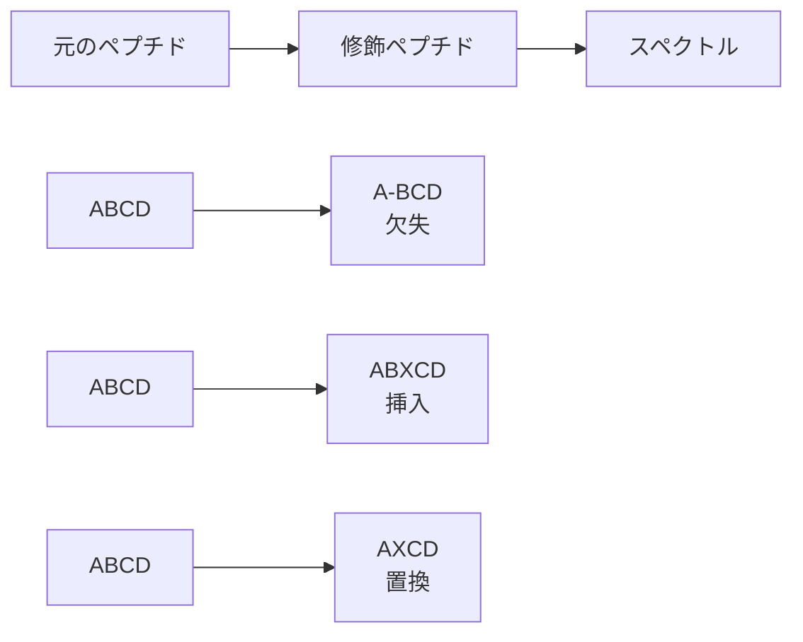
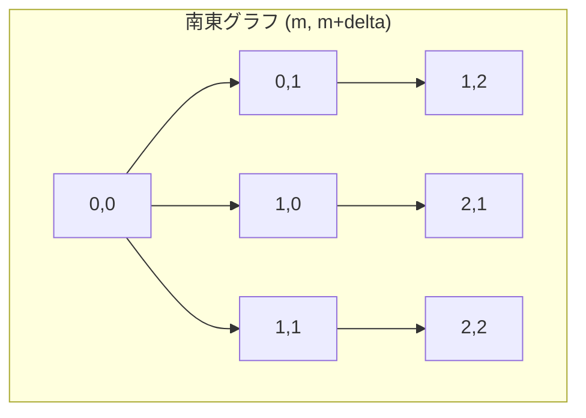
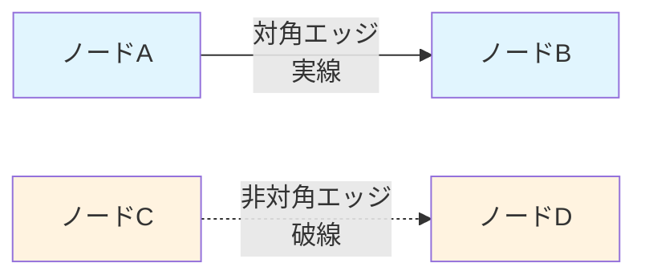
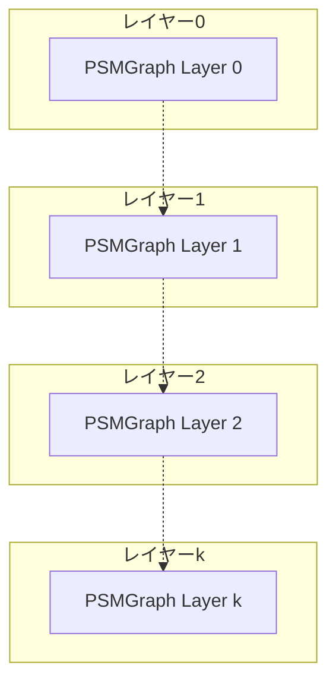
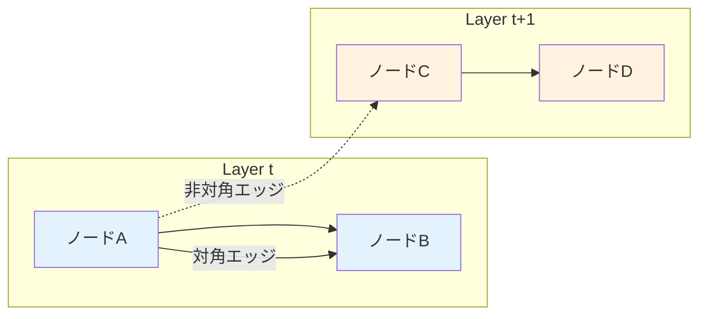

# スペクトルアライメントアルゴリズム（超詳細版）

## 🎯 まず、この講義で何を学ぶのか

最終ゴール：**ペプチドベクターとスペクトラムベクターの間の最適なアライメントを見つけるアルゴリズムを理解し、実装できるようになること**

でも、ちょっと待ってください。そもそも「アライメント」って何でしょう？
実は、これまで学んできた配列アライメントの概念を、質量分析の世界に応用した画期的な手法なんです。

## 🤔 ステップ0：なぜスペクトルアライメントが重要なの？

### 0-1. そもそもの問題を考えてみよう

これまでの講義で、私たちはペプチド同定やスペクトル解析について学んできました。
でも、現実のタンパク質には「翻訳後修飾」という厄介な問題があります。

想像してみてください。あなたが図書館で本を探しているとします。
でも、その本のタイトルの一部が変更されていたり、章が追加・削除されていたら？
これがまさに、翻訳後修飾を受けたペプチドを同定する際の問題です。

### 0-2. 驚きの発見

なんと！ペプチドベクターの変化は、主に「ブロックの挿入」または「ブロックの削除」に対応することが判明しました。
これは革命的な発見です。なぜなら、配列アライメントの概念を使って解決できるからです！

## 📖 ステップ1：配列アライメントとの類推を理解しよう

### 1-1. そもそもアライメントって何？

アライメントとは、「アミノ酸の挿入、欠失、置換の最小コストに相当する操作」です。

でも、これをスペクトルの世界に応用するとどうなるでしょう？



### 1-2. 重要な観察

ペプチドベクターの変更は、主に以下の2つのパターンです：

- **ブロック挿入**：新しい質量ピークが追加される
- **ブロック削除**：既存の質量ピークが消失する

つまり、私たちの目標は明確です：
**適切に構成されたスペクトルアライメントグラフで最長の経路を見つけること**

## 📖 ステップ2：南東(SE)グラフの構築

### 2-1. まず基本形から始めよう

最初に、**南東(m, m+delta)グラフ**と呼ばれるグラフを作ってみましょう。



このグラフの構造：

- **行数**: m+1行
- **列数**: m+delta+1列
- **エッジ**: 南東方向のすべてのエッジ

### 2-2. ペプチドの経路を表現してみよう

質量mの未修飾ペプチド a₁, a₂, ..., aₘ があるとします。
そして、質量m+deltaの修飾ペプチド a'₁, a'₂, ..., a'ₙ があるとします。

これらのペプチドは、南東グラフ内で異なる経路として表現されます：

```python
def visualize_peptide_paths():
    """
    ペプチドの経路を視覚化する例
    """
    # 青い経路：2つの修飾を受けたペプチド
    blue_path = [(0,0), (1,1), (2,3), (3,4)]

    # 赤い経路：3つの修飾を受けたペプチド
    red_path = [(0,0), (1,2), (2,3), (3,5)]

    # 緑の経路：未修飾ペプチド
    green_path = [(0,0), (1,1), (2,2), (3,3)]

    return blue_path, red_path, green_path
```

### 2-3. でも、どうやって経路を構築するの？

重要なポイントがここにあります！

経路は以下のルールで構築されます：

1. ノード(0,0)から開始
2. ペプチドの長さ1の接頭辞の質量に等しい座標のノードに移動
3. 長さ2の接頭辞の質量に対応する座標のノードに移動
4. 最終的に、未修飾ペプチドと修飾ペプチド全体の質量に対応するノードに到達

## 📖 ステップ3：エッジの種類を理解しよう

### 3-1. 2種類のエッジがあります

グラフには2種類のエッジが存在します：

```python
class EdgeType:
    def __init__(self):
        self.diagonal = "対角エッジ"      # 修飾なし
        self.non_diagonal = "非対角エッジ"  # 修飾あり

    def explain_diagonal(self):
        """
        対角エッジ：未修飾ペプチドと修飾ペプチドで
        アミノ酸の質量が同じ場合
        """
        return "質量変化なし → 対角線移動"

    def explain_non_diagonal(self):
        """
        非対角エッジ：修飾により質量が変化した場合
        破線で表示される
        """
        return "質量変化あり → 非対角線移動"
```

### 3-2. 視覚的な表現



## 📖 ステップ4：スペクトルベクターへの拡張

### 4-1. 重要な観察をしてみましょう

ここで天才的な発想が登場します！

**異なる経路は、異なる質量m+deltaのペプチドに対応します。**
**さらに、これらの経路を、質量m+deltaのスペクトルベクターに置き換えることができます！**

つまり：

- ペプチドの経路 → スペクトルの経路
- ペプチドのマッチング → スペクトルのマッチング

### 4-2. グラフ名の変更

そこで、南東グラフの名前を以下のように変更します：

#### 南東(Peptide, Spectrum)グラフ

```python
def create_spectrum_graph(peptide, spectrum):
    """
    ペプチドとスペクトルのアライメントグラフを作成
    """
    # 明るい行（不要な行）をすべて削除
    # 修飾ペプチドのペアに対応する経路のみを残す

    dark_rows_only = filter_relevant_paths(peptide, spectrum)
    return dark_rows_only
```

### 4-3. なぜ明るい行を削除するの？

**修正されていないペプチドと修正されたペプチドのペアに対応するすべての経路は、グラフの暗い行のみを通過します。**

したがって、明るい行はすべて安全に削除できます。これにより計算効率が大幅に向上します！

## 📖 ステップ5：PSMグラフの登場

### 5-1. PSMGraphとは何か？

結果として得られるグラフを**PSMGraph(Peptide, Spectrum)**と呼びます。

PSMGraphの特徴：

- **i列のすべてのノードの重み** = スペクトルベクトルのi番目の座標
- **行のインデックス** = 未修飾ペプチドの接頭辞の質量

```python
class PSMGraph:
    def __init__(self, peptide, spectrum):
        self.peptide = peptide
        self.spectrum = spectrum
        self.node_weights = self._calculate_weights()

    def _calculate_weights(self):
        """
        各ノードの重みを計算
        """
        weights = {}
        for i, mass in enumerate(self.spectrum):
            # i列のすべてのノードの重み = spectrum[i]
            weights[i] = mass
        return weights

    def calculate_score(self, modified_peptide):
        """
        修飾ペプチドとスペクトラムの間のスコア
        = 修飾ペプチドの経路の重み
        """
        path_weight = sum(self.get_path_weights(modified_peptide))
        return path_weight
```

### 5-2. ここで重要な定式化

#### 修飾ペプチドとスペクトラムの間のスコア = 修飾ペプチドの経路の重み

これにより、スペクトルアライメント問題を以下のように削減できます：

#### PSMGraph(Peptide, Spectrum)と整数kが与えられたとき、このグラフの中で最大でk個の非対角エッジをもつ最大重みの経路を求める

## 📖 ステップ6：制約付き最適化の課題

### 6-1. 新しい課題が登場

最大重みの経路を探す方法はすでに知っています。
でも、**非対角エッジが最大でk個**という制約を追加するとどうでしょう？

これは新しい挑戦です！

### 6-2. 解決のアイデア

制約を扱うために、**スペクトルアライメントグラフ**という新しいグラフを作成します。



## 📖 ステップ7：スペクトルアライメントグラフの構築

### 7-1. グラフの構造

スペクトルアライメントグラフの特徴：

- **k+1個の層**：各層はPSMGraphと同じ構造
- **ノードの重み**：PSMGraphから継承
- **層間の接続**：特別なルールで接続

### 7-2. 層間接続のルール

```python
def connect_layers(psm_graph, k):
    """
    スペクトルアライメントグラフの層を接続
    """
    rules = {
        "diagonal_edges": "同じレイヤー上にとどまる",
        "non_diagonal_edges": "次のレイヤーに移動"
    }

    # 例：青いエッジ（対角）は同じレイヤー
    # 例：赤いエッジ（非対角）は次のレイヤーへ

    return rules
```

### 7-3. 視覚的な理解



## 📖 ステップ8：実装の詳細 - diff配列

### 8-1. diff配列の概念

実装を効率化するために、**diff配列**という概念を導入します。

```python
def create_diff_array(peptide_masses):
    """
    diff配列の作成例

    PSMGraphの連続する行のインデックスの違いを表す
    """
    # 例：行インデックスが [0, 2, 5, 8, 11] の場合
    masses = [0, 2, 5, 8, 11]

    diff = []
    for i in range(1, len(masses)):
        diff.append(masses[i] - masses[i-1])

    # diff = [2, 3, 3, 3]
    # diff[2] = 5-2 = 3
    # diff[5] = 8-5 = 3

    return diff

# 使用例
diff_array = create_diff_array([0, 2, 5, 8, 11])
print(f"diff配列: {diff_array}")  # [2, 3, 3, 3]
```

### 8-2. なぜdiff配列が必要？

diff配列により、**前任ノードの座標を効率的に計算**できます：

```python
def find_predecessors(node_position, diff_array):
    """
    ノード(i, j, t)の前任ノードを計算
    """
    i, j, t = node_position

    # 同じレイヤーの前任ノード（1つのみ）
    same_layer_pred = calculate_same_layer_predecessor(i, j, diff_array)

    # 前のレイヤーの前任ノード（複数）
    prev_layer_preds = calculate_prev_layer_predecessors(i, j, diff_array)

    return same_layer_pred, prev_layer_preds
```

## 📖 ステップ9：動的プログラミングによる解法

### 9-1. score関数の定義

最長経路問題を解くために、変数**score(i, j, t)**を定義します：

```python
def calculate_score(i, j, t, spectrum, diff_array):
    """
    score(i, j, t):
    ソース(0,0,0)からノード(i, j, t)までの経路の最大重み
    """
    if i == 0 and j == 0 and t == 0:
        return 0  # ベースケース

    # 前任ノードからの最大スコアを計算
    max_score = 0

    # 同じレイヤーの前任ノード
    same_layer_pred = get_same_layer_predecessor(i, j, diff_array)
    if same_layer_pred:
        max_score = max(max_score,
                       calculate_score(*same_layer_pred, spectrum, diff_array))

    # 前のレイヤーの前任ノード
    prev_layer_preds = get_prev_layer_predecessors(i, j, diff_array)
    for pred in prev_layer_preds:
        max_score = max(max_score,
                       calculate_score(*pred, spectrum, diff_array))

    # 現在のノードの重みを追加
    return max_score + spectrum[j]
```

### 9-2. 最終的な答え

最大でk個の修飾を加えたすべてのペプチドの最大スコアは：

```python
def find_maximum_score(peptide, spectrum, k):
    """
    最大スコアを計算
    """
    m = len(peptide)
    delta = len(spectrum) - m

    max_score = 0

    # すべての可能なt値でスコアを計算
    for t in range(k + 1):
        score = calculate_score(m, m + delta, t, spectrum, diff_array)
        max_score = max(max_score, score)

    return max_score
```

## 📖 ステップ10：実際の挑戦 - マストドン分析

### 10-1. 古代ペプチドの謎

Azara氏がティラノサウルスのペプチドを発表したのと同じ論文で、**マストドンペプチド**も紹介されました。

でも、ちょっと待ってください。マストドンって何でしょう？

```python
class MastodonAnalysis:
    def __init__(self):
        self.extinction_time = "10,000年前"
        self.cause_of_extinction = ["気候変動", "人間による乱獲"]
        self.expected_proteins = ["コラーゲン", "ヘモグロビン"]

    def why_collagen_expected(self):
        """
        なぜコラーゲンペプチドが見つかることが期待されるか
        """
        return """
        マストドンが地球を歩き回ったのはほんの1万年前。
        コラーゲンは比較的安定なタンパク質なので、
        この時代のサンプルからでも検出可能。
        """
```

### 10-2. 分析の課題

私たちの課題：

1. **統計的有意性の観点から再分析**（これまで実際に行われたことがない！）
2. **統計的に有意な他のマストドンペプチドを発見**
3. **マストドンのスペクトルと一致するヘモグロビンペプチドを発見**

```python
def mastodon_challenge():
    """
    マストドン分析チャレンジの実装フレームワーク
    """
    tasks = {
        1: "報告されたマストドンペプチドの統計的有意性を判定",
        2: "論文で見逃された統計的に有意なペプチドを発見",
        3: "ヘモグロビンペプチドとスペクトルのマッチングを実行"
    }

    for task_id, description in tasks.items():
        print(f"タスク{task_id}: {description}")
        implement_spectral_alignment_algorithm()

    return "古代プロテオーム解析の新展開"
```

## 📝 まとめ：今日学んだことを整理

### レベル1：表面的理解（これだけでもOK）

- スペクトルアライメントは配列アライメントの概念をスペクトル解析に応用
- PSMGraphで最適な経路を探すことで、ペプチド同定が可能
- 非対角エッジの数を制限することで、修飾の数を制御

### レベル2：本質的理解（ここまで来たら素晴らしい）

- 南東グラフからPSMGraphへの変換過程
- スペクトルアライメントグラフの層構造とその意味
- diff配列を使った効率的な前任ノード計算
- 動的プログラミングによる最適解の探索

### レベル3：応用的理解（プロレベル）

- 計算複雑度の最適化手法
- 実際の古代DNA/プロテオーム解析への応用
- 統計的有意性評価との組み合わせ
- 大規模データセットでの実装上の工夫

## 🔧 実装のポイント

```python
# 完全な実装例の骨格
class SpectralAlignmentSolver:
    def __init__(self, peptide, spectrum, max_modifications):
        self.peptide = peptide
        self.spectrum = spectrum
        self.k = max_modifications
        self.diff_array = self._create_diff_array()

    def solve(self):
        """
        スペクトルアライメント問題の解決
        """
        return self._find_optimal_path()

    def _create_diff_array(self):
        # diff配列の作成
        pass

    def _find_optimal_path(self):
        # 動的プログラミングによる最適経路探索
        pass
```

## 🚀 次回予告

次回は、さらに驚くべき**統計的有意性評価**の世界に踏み込みます！

- どうやって偶然のマッチングと真のマッチングを区別するのか？
- p値の計算方法とその解釈
- 古代ペプチド分析における統計的落とし穴

このスペクトルアライメントアルゴリズムが、古代生物学に革命をもたらす瞬間を目撃しましょう！

---

### 重要な概念チェックリスト

- [ ] 南東グラフの構造を理解している
- [ ] PSMGraphの定義と特徴を説明できる
- [ ] スペクトルアライメントグラフの層構造を理解している
- [ ] diff配列の役割と計算方法を把握している
- [ ] 動的プログラミングによる解法を実装できる
- [ ] マストドン分析の課題を理解している
