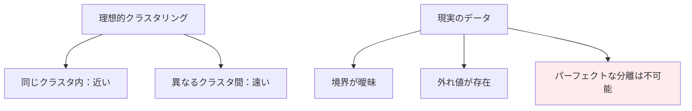
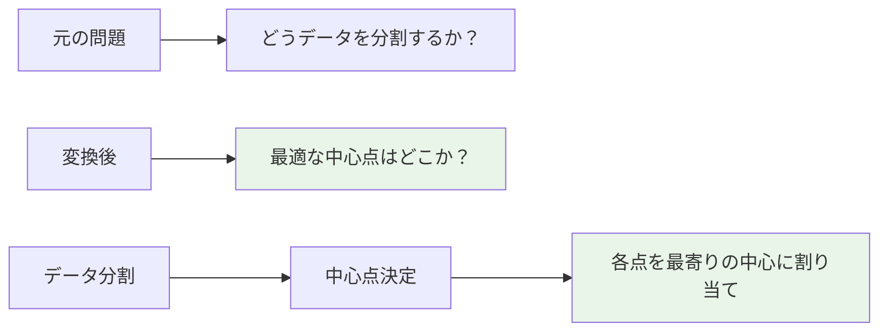
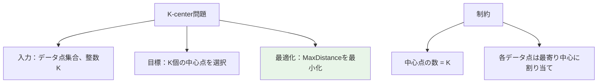
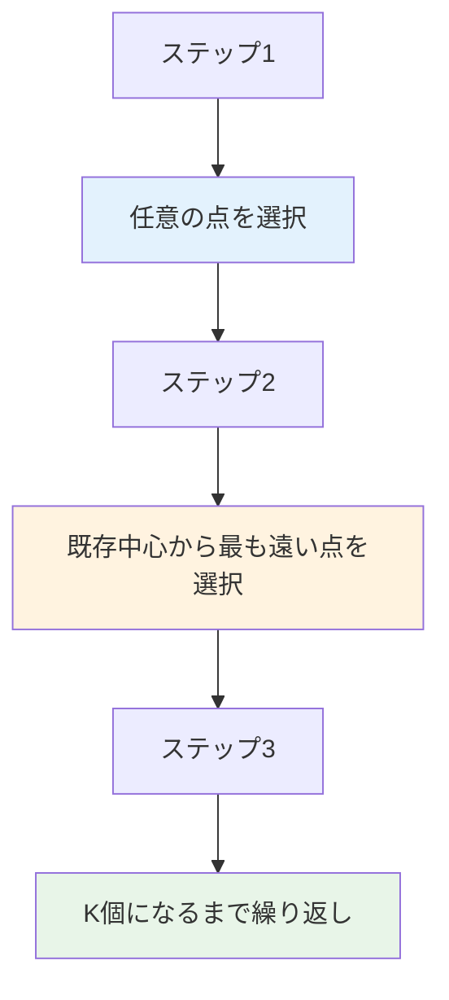
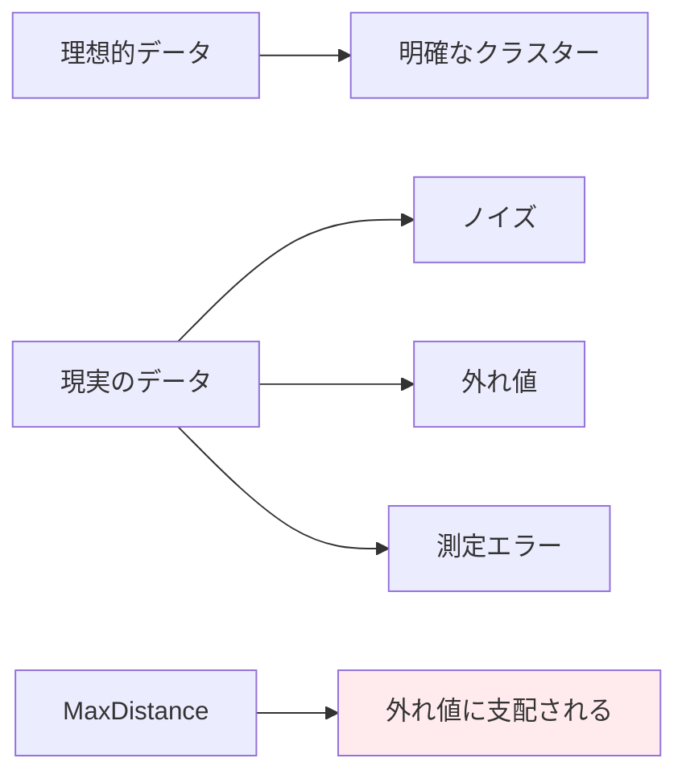
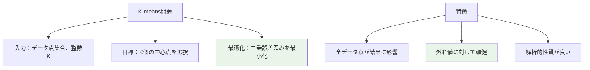
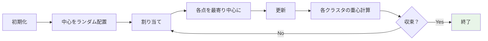

# 最適化問題としてのクラスタリング（超詳細版）

## 🎯 まず、この講義で何を学ぶのか

最終ゴール：**クラスタリングを厳密な数学的最適化問題として定式化し、K-centerやK-meansなど代表的アルゴリズムの理論と実装を理解すること**

でも、ちょっと待ってください。これまでクラスタリングを「直感的」に理解してきましたが、コンピュータに解かせるには数学的に厳密な定義が必要です。
実は、この定式化こそが現代データサイエンスの核心なのです！

## 🤔 ステップ0：なぜ厳密な定式化が必要なのか？

### 0-1. これまでの「直感」から「数学」へ

これまでの講義では直感的に理解してきました：

- 似た遺伝子は近くに配置
- 異なる遺伝子は遠くに配置
- 視覚的に「明らかな」クラスター

でも、コンピュータには「直感」がありません！

```python
class IntuitionToMath:
    def __init__(self):
        self.human_approach = "視覚的に「なんとなく」分かる"
        self.computer_approach = "厳密な数学的定義が必要"
        self.challenge = "人間の直感をどう数式に変換するか？"

    def why_formalization_needed(self):
        """
        なぜ定式化が必要か
        """
        return """
        理由：
        1. コンピュータは曖昧さを理解できない
        2. 最適解を数学的に保証したい
        3. アルゴリズムの性能を比較したい
        4. 大規模データで自動化したい

        → 厳密な「目的関数」の設計が必要
        """
```

### 0-2. 前回の復習と今回の発展

前回：遺伝子発現マトリックス、多次元空間での表現
今回：その数学的基盤を築き、実際に計算可能にする

## 📖 ステップ1：理想的なクラスタリングの原則

### 1-1. 良いクラスタリングとは何か？

まず、**良いクラスタリングの原則**を定義してみましょう：

```python
class GoodClusteringPrinciple:
    def __init__(self):
        self.principle_1 = "同じクラスタ内の要素は互いに近い"
        self.principle_2 = "異なるクラスタの要素は互いに遠い"

    def mathematical_definition(self):
        """
        数学的定義
        """
        return """
        パラメータdが存在して：

        条件1：同じクラスタ内の要素間距離 < d
        条件2：異なるクラスタ間の要素間距離 > d

        この2つを同時に満たすクラスタリング = 良いクラスタリング
        """

    def example_check(self, clustering_data):
        """
        例でチェック
        """
        # 実際のクラスタリング例で確認
        same_cluster_distances = [1.2, 0.8, 1.5]
        different_cluster_distances = [0.9, 2.1, 1.1]

        return "条件を満たさない例も多い..."
```

### 1-2. 現実の厳しさ

理想的な原則を定義しましたが...



**残酷な事実**：ほとんどの実用的なデータセットでは、この理想的な原則を満たすクラスタリングは存在しません！

## 📖 ステップ2：現実との向き合い方

### 2-1. 完璧さを諦めて実用性を追求

理想的な分離は不可能なので、**新しいアプローチ**が必要です：

```python
class PracticalApproach:
    def __init__(self):
        self.ideal = "完璧な分離"
        self.reality = "妥協点を見つける最適化"
        self.solution = "目的関数を設計して最適化する"

    def new_objective(self):
        """
        新しい目標
        """
        return """
        完璧ではないが「最良」のクラスタリングを見つける

        そのために：
        1. 「良さ」を数値で測る目的関数を設計
        2. その目的関数を最大化/最小化するアルゴリズム
        3. 現実的な時間で計算可能な近似解法
        """
```

### 2-2. 4つの点の例で考えてみよう

シンプルな例から始めましょう：

```python
def simple_clustering_example():
    """
    4点のクラスタリング問題
    """
    points = [(1, 1), (2, 2), (8, 8), (9, 9)]

    possible_clusterings = [
        "2-2分割: {(1,1), (2,2)} vs {(8,8), (9,9)}",
        "1-3分割: {(1,1)} vs {(2,2), (8,8), (9,9)}",
        "3-1分割: {(1,1), (2,2), (8,8)} vs {(9,9)}",
        "1-1-2分割: {(1,1)} vs {(2,2)} vs {(8,8), (9,9)}"
    ]

    question = "どれが最良のクラスタリング？"
    answer = "数学的な基準が必要！"

    return possible_clusterings, question, answer
```

## 📖 ステップ3：問題の変換 - クラスター中心の概念

### 3-1. 天才的なアイデア

クラスタリング問題を**クラスター中心を求める問題**に変換します：



```python
class CenterBasedApproach:
    def __init__(self):
        self.original_problem = "データ点の分割方法を決める"
        self.transformed_problem = "最適なクラスター中心を見つける"
        self.assignment_rule = "各点を最も近い中心に割り当て"

    def why_this_works(self):
        """
        なぜこの変換が有効か
        """
        return """
        利点：
        1. 中心点の最適化は数学的に扱いやすい
        2. 微分などの解析的手法が使える
        3. 効率的なアルゴリズムが開発可能
        4. 収束性の理論的保証が得やすい
        """
```

### 3-2. 距離の概念を定義

次に、**データから中心までの距離**を定義します：

```python
def distance_definition():
    """
    データから中心までの距離の定義
    """
    # ステップ1：単一データ点から中心までの距離
    def point_to_centers_distance(point, centers):
        distances = [euclidean_distance(point, center) for center in centers]
        return min(distances)  # 最も近い中心までの距離

    # ステップ2：全データから中心までの距離
    def data_to_centers_distance(data, centers):
        all_distances = [point_to_centers_distance(p, centers) for p in data]
        return all_distances

    return "各点は最寄りの中心までの距離で評価"
```

## 📖 ステップ4：K-center問題とMaxDistance目的関数

### 4-1. 最初の目的関数：MaxDistance

**MaxDistance目的関数**を定義します：

```python
class MaxDistanceObjective:
    def __init__(self):
        self.name = "MaxDistance目的関数"
        self.definition = "全データ点から最寄り中心までの距離の最大値"
        self.goal = "この最大距離を最小化"

    def calculate_max_distance(self, data_points, centers):
        """
        MaxDistance目的関数の計算
        """
        distances = []
        for point in data_points:
            min_dist_to_center = min([
                self.euclidean_distance(point, center)
                for center in centers
            ])
            distances.append(min_dist_to_center)

        max_distance = max(distances)
        return max_distance

    def euclidean_distance(self, p1, p2):
        """ユークリッド距離"""
        return ((p1[0] - p2[0])**2 + (p1[1] - p2[1])**2)**0.5
```

### 4-2. K-center クラスタリング問題

正式な問題定義：



## 📖 ステップ5：Farthest First Traversal アルゴリズム

### 5-1. 貪欲法による近似解法

K-center問題は**NP完全**なので、近似アルゴリズムが必要です：

```python
class FarthestFirstTraversal:
    def __init__(self):
        self.name = "Farthest First Traversal"
        self.type = "貪欲アルゴリズム"
        self.complexity = "多項式時間"

    def algorithm_steps(self):
        """
        アルゴリズムのステップ
        """
        return [
            "1. 任意の点を最初の中心として選択",
            "2. 既存中心から最も遠い点を次の中心として選択",
            "3. K個の中心が選ばれるまで繰り返し"
        ]

    def implementation(self, data_points, k):
        """
        実装例
        """
        centers = [data_points[0]]  # 最初の中心

        for i in range(1, k):
            max_distance = 0
            farthest_point = None

            for point in data_points:
                # この点から既存中心までの最短距離
                min_dist = min([
                    self.euclidean_distance(point, center)
                    for center in centers
                ])

                # 最も遠い点を記録
                if min_dist > max_distance:
                    max_distance = min_dist
                    farthest_point = point

            centers.append(farthest_point)

        return centers
```

### 5-2. 視覚的理解



## 📖 ステップ6：外れ値問題の発見

### 6-1. Farthest First Traversalの落とし穴

アルゴリズムには重大な問題があります：

```python
class OutlierProblem:
    def __init__(self):
        self.issue = "外れ値に過度に敏感"
        self.cause = "MaxDistance目的関数の性質"
        self.consequence = "明らかなクラスター構造を見逃す"

    def demonstrate_problem(self):
        """
        問題の実演
        """
        return """
        例：明らかに3つのクラスターがあるデータ + 1つの外れ値

        人間の目：3つの自然なクラスターを認識
        Farthest First：外れ値を含む不自然な分割

        原因：MaxDistanceは最大の1つの距離のみに注目
        → 外れ値が結果を支配してしまう
        """

    def real_world_analogy(self):
        """
        現実世界での例
        """
        return """
        遺伝子発現データでの問題：
        - 実験エラーによる異常値
        - 測定ノイズ
        - サンプル調製の失敗

        これらが結果を歪めてしまう
        """
```

### 6-2. 生物学的現実との乖離



生物学者は**外れ値よりも全体の傾向**に関心があります！

## 📖 ステップ7：K-means問題と二乗誤差歪み

### 7-1. 新しい目的関数の設計

外れ値問題を解決するために、**二乗誤差歪み（Squared Error Distortion）**を導入：

```python
class SquaredErrorDistortion:
    def __init__(self):
        self.name = "二乗誤差歪み"
        self.definition = "全データ点から最寄り中心までの距離の二乗の平均"
        self.advantage = "すべてのデータ点が目的関数に寄与"

    def calculate_distortion(self, data_points, centers):
        """
        二乗誤差歪みの計算
        """
        total_squared_distance = 0

        for point in data_points:
            min_distance = min([
                self.euclidean_distance(point, center)
                for center in centers
            ])
            total_squared_distance += min_distance ** 2

        distortion = total_squared_distance / len(data_points)
        return distortion

    def why_better_than_max_distance(self):
        """
        MaxDistanceより優れている理由
        """
        return """
        MaxDistance：1つの点のみが目的関数に影響
        Distortion：すべての点が目的関数に影響

        結果：
        - 外れ値の影響が相対的に小さくなる
        - 全体的な品質が向上
        - より安定したクラスタリング
        """
```

### 7-2. K-means クラスタリング問題

新しい問題定義：



## 📖 ステップ8：計算複雑度の現実

### 8-1. 理論的困難性

残念ながら、K-means問題も計算的に困難：

```python
class ComputationalComplexity:
    def __init__(self):
        self.k_center_complexity = "NP完全"
        self.k_means_complexity = "NP困難（k=2でも）"
        self.polynomial_case = "k=1の場合のみ"

    def complexity_comparison(self):
        """
        複雑度の比較
        """
        return {
            "k=1": "多項式時間で解ける（重心計算）",
            "k=2": "すでにNP困難",
            "k≥3": "さらに困難",
            "現実的解法": "近似アルゴリズムが必要"
        }

    def why_k_equals_1_useful(self):
        """
        k=1がなぜ有用か
        """
        return """
        一見無意味に思える「1つのクラスター」だが実は重要：

        1. 他のアルゴリズムの構成要素
        2. 初期化に利用
        3. 品質評価の基準
        4. 理論解析の出発点
        """
```

### 8-2. k=1の場合の厳密解：重心定理

唯一の多項式時間解法：

```python
class CentroidTheorem:
    def __init__(self):
        self.theorem = "重心定理"
        self.statement = "k=1のK-means問題の最適解は重心"

    def centroid_calculation(self, data_points):
        """
        重心の計算
        """
        n = len(data_points)
        dimensions = len(data_points[0])

        centroid = []
        for dim in range(dimensions):
            coord_sum = sum(point[dim] for point in data_points)
            centroid.append(coord_sum / n)

        return centroid

    def mathematical_proof_sketch(self):
        """
        証明のスケッチ
        """
        return """
        証明概要：
        1. 目的関数は各点からの距離の二乗和
        2. これは中心座標について凸関数
        3. 微分してゼロとおくと重心が得られる
        4. 二階微分は正定値なので最小値

        → 重心が唯一の最適解
        """
```

## 📖 ステップ9：K-meansアルゴリズムの導入

### 9-1. 反復改善によるアプローチ

k≥2の場合の近似解法：

```python
class KMeansAlgorithm:
    def __init__(self, k):
        self.k = k
        self.name = "K-meansアルゴリズム"
        self.type = "反復改善法"

    def algorithm_outline(self):
        """
        アルゴリズムの概要
        """
        return [
            "1. K個の初期中心をランダムに選択",
            "2. 各点を最寄りの中心に割り当て",
            "3. 各クラスターの重心を新しい中心とする",
            "4. 中心が変化しなくなるまで2-3を繰り返し"
        ]

    def convergence_guarantee(self):
        """
        収束の保証
        """
        return """
        理論的性質：
        - 各反復で目的関数値は単調減少
        - 有限ステップで収束（局所最適解）
        - 大域最適解の保証はない

        実用性：
        - 高速で実装が容易
        - 大規模データに適用可能
        - 多くの場合良好な解を発見
        """
```

### 9-2. アルゴリズムの視覚的理解



## 📖 ステップ10：実装と応用への架け橋

### 10-1. アルゴリズム選択の指針

```python
class AlgorithmSelection:
    def __init__(self):
        self.algorithms = {
            "Farthest First Traversal": {
                "目的関数": "MaxDistance",
                "利点": "簡単、高速",
                "欠点": "外れ値に敏感",
                "用途": "初期探索、外れ値が少ない場合"
            },
            "K-means": {
                "目的関数": "二乗誤差歪み",
                "利点": "外れ値に頑健、理論的基盤",
                "欠点": "局所最適解のみ",
                "用途": "一般的なクラスタリング"
            }
        }

    def practical_considerations(self):
        """
        実用的考慮事項
        """
        return """
        選択基準：
        1. データの性質（外れ値の有無）
        2. 計算時間の制約
        3. 解の品質要求
        4. 解釈のしやすさ

        組み合わせ戦略：
        - Farthest Firstで初期化
        - K-meansで refinement
        """
```

### 10-2. 次回への展開

```python
class NextSteps:
    def __init__(self):
        self.current_achievement = "クラスタリングの数学的基盤"
        self.next_challenge = "実際の遺伝子データへの応用"

    def what_comes_next(self):
        """
        次回の内容
        """
        return """
        実践編：
        1. K-meansアルゴリズムの詳細実装
        2. 初期化戦略の比較
        3. クラスター数Kの決定方法
        4. 高次元データでの注意点
        5. 実際の遺伝子発現データでの応用例

        最終目標：MammaPrintの70遺伝子発見プロセスの理解
        """
```

## 📝 まとめ：今日学んだことを整理

### レベル1：表面的理解（これだけでもOK）

- クラスタリングは数学的最適化問題として定式化可能
- K-center問題（MaxDistance）とK-means問題（二乗誤差歪み）
- Farthest First TraversalとK-meansアルゴリズムの基本概念
- どちらもNP困難だが実用的近似解法が存在

### レベル2：本質的理解（ここまで来たら素晴らしい）

- 良いクラスタリング原則の限界と現実的妥協点
- 目的関数設計の重要性と外れ値問題
- 重心定理とk=1の場合の厳密解
- 局所最適解と大域最適解の違い

### レベル3：応用的理解（プロレベル）

- 計算複雑度理論との関連
- アルゴリズムの収束性と性能保証
- 実用的な組み合わせ戦略
- 高次元データでの課題と対策

## 🚀 次回予告

次回は、ついに**K-meansアルゴリズムの実装と応用**に踏み込みます！

- **詳細実装**：ステップバイステップのコーディング
- **初期化戦略**：K-means++など改良法
- **クラスター数決定**：エルボー法、シルエット分析
- **実遺伝子データ**：DeRisiの酵母データで実験
- **MammaPrint**：70遺伝子発見の実際のプロセス

理論から実践へ、そして医療応用への道筋が見えてきます。数学が現実世界を変える瞬間を体験しましょう！

---

### 重要な概念チェックリスト

- [ ] 良いクラスタリング原則とその現実的限界を理解している
- [ ] MaxDistanceと二乗誤差歪みの違いを説明できる
- [ ] K-center問題とK-means問題を定式化できる
- [ ] Farthest First Traversalの手順を実行できる
- [ ] 外れ値問題とその対策を把握している
- [ ] 重心定理の意味と重要性を理解している
- [ ] K-meansアルゴリズムの基本構造を把握している
