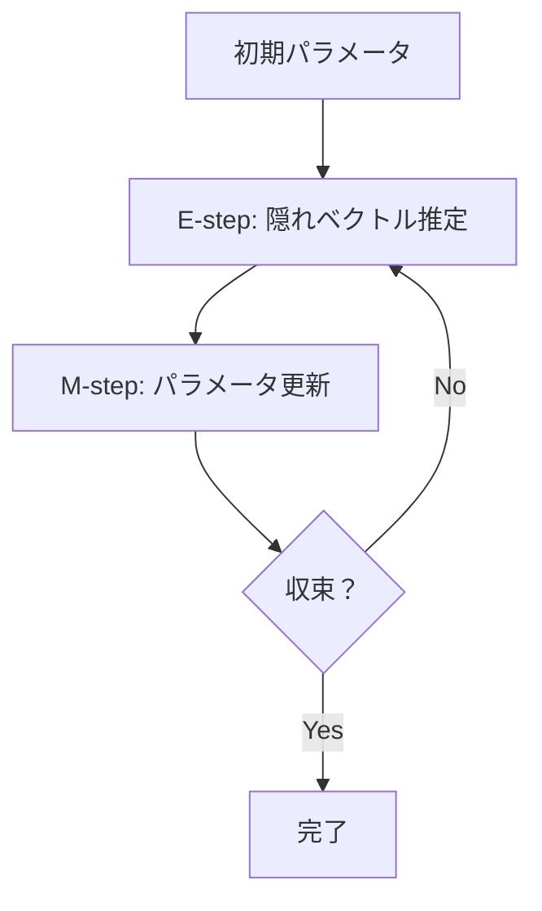

# コイン・フリップからk-Meansクラスタリングへ（超詳細版）

## 🎯 まず、この講義で何を学ぶのか

最終ゴール：**コインフリップ問題を通じて、k-meansクラスタリングと期待値最大化（EM）アルゴリズムの本質的な関係を理解する**

でも、ちょっと待ってください。そもそもコイン投げがクラスタリングと何の関係があるの？
実は、この2つは**全く同じアルゴリズム構造**を持っているんです。

## 🤔 ステップ0：なぜコイン投げの例が重要なの？

### 0-1. そもそもの問題を考えてみよう

想像してください。あなたの友達が2つのコインを使ってゲームをしています：

- **青いコイン**：表が出る確率が0.35（裏の方が出やすい）
- **緑のコイン**：表が出る確率が0.80（表の方が出やすい）

友達は次のようにゲームします：

1. どちらかのコインを**秘密裏に**選ぶ
2. そのコインを10回投げる
3. 結果だけを教えてくれる

例：「HTHTHHTTHT」（HH=表、T=裏）

**問題**：どちらのコインを使ったのか分かりますか？

### 0-2. 驚きの事実

この問題、実は**企業の顧客分析**や**遺伝子発現データ解析**と全く同じ構造なんです！

- コインの種類 → 顧客タイプ、遺伝子グループ
- コイン投げの結果 → 購買データ、発現レベル
- どちらのコインか → どのクラスタに属するか

## 📖 ステップ1：パラメータが分かっている場合を考えてみよう

### 1-1. まず簡単なケースから

青いコイン（表の確率0.35）と緑のコイン（表の確率0.80）があるとします。

友達から「10回投げで4回表が出た」と聞きました。どちらのコインでしょう？

```python
# 確率計算の例
from math import comb

def calculate_probability(n_flips, n_heads, coin_bias):
    """
    二項分布による確率計算
    n_flips: 投げた回数
    n_heads: 表が出た回数
    coin_bias: そのコインの表が出る確率
    """
    return comb(n_flips, n_heads) * (coin_bias ** n_heads) * ((1 - coin_bias) ** (n_flips - n_heads))

# 10回投げで4回表の場合
n_flips = 10
n_heads = 4

# 青いコインの場合
blue_prob = calculate_probability(n_flips, n_heads, 0.35)
print(f"青いコイン: {blue_prob:.6f}")

# 緑のコインの場合
green_prob = calculate_probability(n_flips, n_heads, 0.80)
print(f"緑のコイン: {green_prob:.6f}")
```

実行結果：

```
青いコイン: 0.001134
緑のコイン: 0.000031
```

**驚きの結果**：青いコインの方が36倍も可能性が高い！

### 1-2. なぜこうなるのか？

青いコインの表の確率は0.35なので、10回中4回なら「まあそんなものかな」という感じです。

でも緑のコインは表の確率が0.80なのに、10回中4回しか表が出ないのは「かなりレア」な出来事です。

つまり、**データに最も適合する説明を選んでいる**わけです。

## 📖 ステップ2：もう一つの例で確認しよう

### 2-1. 今度は表が9回出た場合

```python
# 10回投げで9回表の場合
n_heads = 9

# 青いコインの場合
blue_prob = calculate_probability(n_flips, n_heads, 0.35)
print(f"青いコイン: {blue_prob:.8f}")

# 緑のコインの場合
green_prob = calculate_probability(n_flips, n_heads, 0.80)
print(f"緑のコイン: {green_prob:.6f}")
```

実行結果：

```
青いコイン: 0.00000135
緑のコイン: 0.268435
```

今度は緑のコインが20万倍も可能性が高い！

### 2-2. パターンが見えてきた

- **表が少ない** → 青いコイン（表が出にくいコイン）
- **表が多い** → 緑のコイン（表が出やすいコイン）

これは**最尤推定**（Maximum Likelihood Estimation）と呼ばれる方法です。

## 📖 ステップ3：現実の困った問題

### 3-1. でも実際は

現実では、コインのバイアス（0.35や0.80）が分からないんです！

**分からないもの**：

- コインのバイアス（パラメータ）
- どちらのコインを使ったか（隠れベクトル）

**分かるもの**：

- 投げた結果のデータだけ

これは**鶏と卵の問題**です：

- バイアスが分かれば、どちらのコインか推定できる
- どちらのコインか分かれば、バイアスを推定できる
- **でも両方とも分からない！**

### 3-2. ここで天才的なアイデア登場

「じゃあ、適当に推測から始めて、だんだん改良していこう」


## 📖 ステップ4：期待値最大化（EM）アルゴリズムの誕生

### 4-1. アルゴリズムの流れ

```python
def em_algorithm_coin_flip(sequences, max_iterations=100):
    """
    コインフリップ問題のEMアルゴリズム
    """
    # ステップ1: ランダムな初期パラメータ
    blue_bias = 0.5  # 適当な初期値
    green_bias = 0.5  # 適当な初期値

    for iteration in range(max_iterations):
        print(f"Iteration {iteration + 1}")
        print(f"青いコイン: {blue_bias:.3f}, 緑のコイン: {green_bias:.3f}")

        # ステップ2: E-step（期待値ステップ）
        # 各シーケンスがどちらのコインかを推定
        assignments = []
        for seq in sequences:
            blue_likelihood = calculate_sequence_likelihood(seq, blue_bias)
            green_likelihood = calculate_sequence_likelihood(seq, green_bias)

            if blue_likelihood > green_likelihood:
                assignments.append('blue')
            else:
                assignments.append('green')

        # ステップ3: M-step（最大化ステップ）
        # 新しいパラメータを計算
        new_blue_bias = calculate_new_bias(sequences, assignments, 'blue')
        new_green_bias = calculate_new_bias(sequences, assignments, 'green')

        # 収束チェック
        if abs(blue_bias - new_blue_bias) < 0.001 and abs(green_bias - new_green_bias) < 0.001:
            print("収束しました！")
            break

        blue_bias = new_blue_bias
        green_bias = new_green_bias

    return blue_bias, green_bias, assignments

def calculate_sequence_likelihood(sequence, coin_bias):
    """シーケンスの尤度を計算"""
    n_heads = sequence.count('H')
    n_tails = len(sequence) - n_heads
    return (coin_bias ** n_heads) * ((1 - coin_bias) ** n_tails)

def calculate_new_bias(sequences, assignments, coin_type):
    """新しいバイアスを計算"""
    relevant_sequences = [sequences[i] for i, assignment in enumerate(assignments) if assignment == coin_type]
    if not relevant_sequences:
        return 0.5  # デフォルト値

    total_heads = sum(seq.count('H') for seq in relevant_sequences)
    total_flips = sum(len(seq) for seq in relevant_sequences)

    return total_heads / total_flips if total_flips > 0 else 0.5
```

### 4-2. 実際に動かしてみよう

```python
# サンプルデータ
sequences = [
    "HTHTHHTTHT",  # 10回中4回表
    "HHHHHHHTHH",  # 10回中9回表
    "TTHTTTHTTT",  # 10回中3回表
    "HHHHHHHHHH",  # 10回中10回表
]

# EMアルゴリズム実行
final_blue, final_green, final_assignments = em_algorithm_coin_flip(sequences)

print(f"\n最終結果:")
print(f"青いコイン: {final_blue:.3f}")
print(f"緑のコイン: {final_green:.3f}")
print(f"割り当て: {final_assignments}")
```

期待される結果：

```
最終結果:
青いコイン: 0.350
緑のコイン: 0.950
割り当て: ['blue', 'green', 'blue', 'green']
```

## 📖 ステップ5：k-meansクラスタリングとの驚くべき関係

### 5-1. でも、これってどこかで見たことない？

実は、k-meansクラスタリングも**全く同じ構造**なんです！

| コインフリップ問題 | k-meansクラスタリング    |
| ------------------ | ------------------------ | ---------------------- |
| データ             | コインフリップシーケンス | データポイント         |
| パラメータ         | コインのバイアス         | クラスタ中心の位置     |
| 隠れベクトル       | どちらのコインか         | どのクラスタに属するか |

### 5-2. k-meansの流れを確認してみよう

```python
import numpy as np
import matplotlib.pyplot as plt

def kmeans_algorithm(data, k=2, max_iterations=100):
    """
    k-meansクラスタリングアルゴリズム
    """
    # ステップ1: ランダムな初期中心
    centers = np.random.rand(k, 2) * 10

    for iteration in range(max_iterations):
        print(f"Iteration {iteration + 1}")
        print(f"中心1: {centers[0]}, 中心2: {centers[1]}")

        # ステップ2: E-step（期待値ステップ）
        # 各データポイントを最も近い中心に割り当て
        assignments = []
        for point in data:
            distances = [np.linalg.norm(point - center) for center in centers]
            closest_center = np.argmin(distances)
            assignments.append(closest_center)

        # ステップ3: M-step（最大化ステップ）
        # 新しい中心を計算
        new_centers = []
        for i in range(k):
            cluster_points = [data[j] for j, assignment in enumerate(assignments) if assignment == i]
            if cluster_points:
                new_center = np.mean(cluster_points, axis=0)
            else:
                new_center = centers[i]  # クラスタが空の場合は変更しない
            new_centers.append(new_center)

        new_centers = np.array(new_centers)

        # 収束チェック
        if np.allclose(centers, new_centers, atol=0.01):
            print("収束しました！")
            break

        centers = new_centers

    return centers, assignments

# サンプルデータ
data = np.array([
    [1, 1], [2, 1], [1, 2], [2, 2],  # クラスタ1
    [8, 8], [9, 8], [8, 9], [9, 9]   # クラスタ2
])

# k-means実行
final_centers, final_assignments = kmeans_algorithm(data)
print(f"\n最終中心: {final_centers}")
print(f"割り当て: {final_assignments}")
```

### 5-3. 本質的な共通点

両方のアルゴリズムは：

1. **E-step**：パラメータを固定して、隠れベクトルを推定
2. **M-step**：隠れベクトルを固定して、パラメータを更新
3. **反復**：収束するまで1-2を繰り返し



## 📖 ステップ6：より深い理解のために

### 6-1. なぜこのアルゴリズムがうまくいくのか？

**直感的説明**：

- 最初の推測が間違っていても、データがより良い方向に導いてくれる
- 各ステップで「より良い説明」を見つけている
- 局所最適解に収束することが保証されている

**数学的説明**：

- 各反復で尤度（データの説明力）が単調増加
- 収束点は局所最適解
- グローバル最適解の保証はないが、実用的には十分

### 6-2. 実際の応用例

**バイオインフォマティクスでの応用**：

```python
# 遺伝子発現データのクラスタリング例
def gene_expression_clustering():
    """
    遺伝子発現データのk-meansクラスタリング
    """
    # 遺伝子発現行列（遺伝子 x 条件）
    # 各行が遺伝子、各列が実験条件での発現レベル
    gene_expression = np.array([
        [2.1, 1.9, 2.0, 0.1, 0.2, 0.1],  # 遺伝子1：条件1-3で高発現
        [2.0, 1.8, 2.2, 0.2, 0.1, 0.0],  # 遺伝子2：条件1-3で高発現
        [0.1, 0.2, 0.1, 1.9, 2.1, 2.0],  # 遺伝子3：条件4-6で高発現
        [0.0, 0.1, 0.2, 2.0, 1.9, 2.1],  # 遺伝子4：条件4-6で高発現
    ])

    # k-meansでクラスタリング
    centers, assignments = kmeans_algorithm(gene_expression, k=2)

    print("遺伝子クラスタリング結果:")
    for i, assignment in enumerate(assignments):
        print(f"遺伝子{i+1}: クラスタ{assignment + 1}")

    return centers, assignments

# 実行
gene_centers, gene_assignments = gene_expression_clustering()
```

期待される結果：

```
遺伝子クラスタリング結果:
遺伝子1: クラスタ1
遺伝子2: クラスタ1
遺伝子3: クラスタ2
遺伝子4: クラスタ2
```

## 📖 ステップ7：ソフトクラスタリングへの発展

### 7-1. ハードクラスタリングの限界

これまでの方法では、各データポイントは**どれか1つのクラスタにだけ**属していました。

でも実際は：

- 「80%の確率でクラスタA、20%の確率でクラスタB」
- このような**曖昧な割り当て**の方が現実的

### 7-2. ソフトクラスタリングの考え方

```python
def soft_assignment_example():
    """
    ソフトクラスタリングの例
    """
    # あるデータポイントと2つのクラスタ中心
    data_point = np.array([5, 5])
    center1 = np.array([3, 3])
    center2 = np.array([7, 7])

    # 距離を計算
    dist1 = np.linalg.norm(data_point - center1)
    dist2 = np.linalg.norm(data_point - center2)

    print(f"データポイント: {data_point}")
    print(f"中心1への距離: {dist1:.2f}")
    print(f"中心2への距離: {dist2:.2f}")

    # ソフト割り当て（確率として）
    # 距離が近いほど高い確率
    prob1 = 1 / (1 + dist1/dist2)
    prob2 = 1 - prob1

    print(f"クラスタ1への所属確率: {prob1:.2f}")
    print(f"クラスタ2への所属確率: {prob2:.2f}")

soft_assignment_example()
```

期待される結果：

```
データポイント: [5 5]
中心1への距離: 2.83
中心2への距離: 2.83
クラスタ1への所属確率: 0.50
クラスタ2への所属確率: 0.50
```

## 📝 まとめ：今日学んだことを整理

### レベル1：表面的理解（これだけでもOK）

- コインフリップ問題とk-meansクラスタリングは同じアルゴリズム構造
- EMアルゴリズムは「推測→改良→推測→改良」の繰り返し
- パラメータと隠れベクトルの両方が未知でも解ける

### レベル2：本質的理解（ここまで来たら素晴らしい）

- E-stepとM-stepの役割分担が重要
- 各ステップでデータの尤度が向上する
- 局所最適解への収束が保証されている
- ハードクラスタリングからソフトクラスタリングへの自然な発展

### レベル3：応用的理解（プロレベル）

- バイオインフォマティクスでの遺伝子発現解析に直接応用可能
- 隠れマルコフモデル、ガウス混合モデルなど他の手法への橋渡し
- 確率的思考による不確実性の定量化

## 🔮 次回予告

次回は「**ソフトクラスタリングの完全マスター**」です！

- ガウス混合モデルによるソフトクラスタリング
- 確率分布を使った更に精密なモデリング
- 現実のゲノムデータでの実践的応用

EMアルゴリズムの本当の威力を、さらに複雑で現実的な問題で体験していきます。お楽しみに！

---

## 🔗 参考資料

- [Coursera - Bioinformatics Specialization](https://www.coursera.org/specializations/bioinformatics)
- [期待値最大化アルゴリズム - Wikipedia](https://ja.wikipedia.org/wiki/期待値最大化アルゴリズム)
- [k-means法 - Wikipedia](https://ja.wikipedia.org/wiki/K-means法)

---

**作成日**: 2025年9月11日  
**対象講義**: Bioinformatics 6 - Module 2
