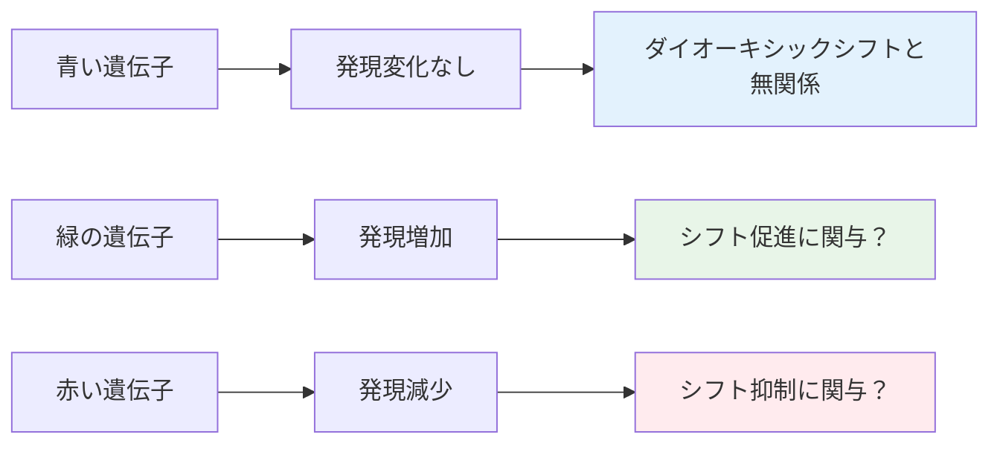
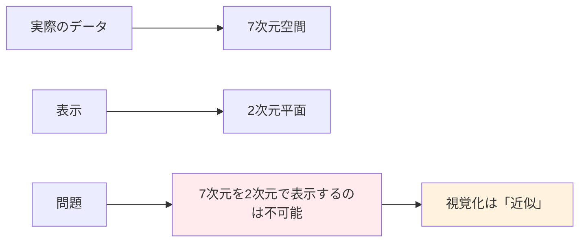
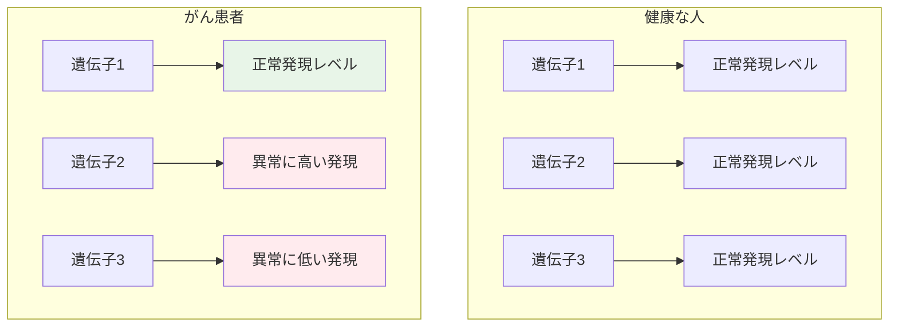

# 遺伝子発現マトリックスの世界（超詳細版）

## 🎯 まず、この講義で何を学ぶのか

最終ゴール：**遺伝子発現マトリックスの構造と解釈方法を理解し、ダイオーキシックシフトやがん診断など実世界問題への応用方法を習得すること**

でも、ちょっと待ってください。そもそも「遺伝子発現マトリックス」って何でしょう？
実は、これは生命の活動を数値で記録した「生命の設計図の活用記録」なのです！

## 🤔 ステップ0：なぜ遺伝子発現を測定するのか？

### 0-1. 生命活動の本質を理解しよう

遺伝子は生命の設計図ですが、設計図があるだけでは何も起きません。
重要なのは「設計図がいつ、どのくらい使われているか」です。

```python
class GeneExpressionAnalogy:
    def __init__(self):
        self.genome = "生命の設計図全体"
        self.gene_expression = "設計図の各部分の使用量"
        self.analogy = "図書館での本の貸出記録"

    def explain_analogy(self):
        """
        図書館のアナロジーで説明
        """
        return """
        図書館（細胞）には多くの本（遺伝子）がある
        ↓
        どの本がいつ、どのくらい借りられているか？
        ↓
        これが「遺伝子発現レベル」の概念
        """

    def why_important(self):
        """
        なぜ重要か
        """
        return """
        設計図の使用パターンを知ることで：
        - 細胞の状態を理解
        - 病気のメカニズムを解明
        - 治療法を開発
        """
```

### 0-2. 前回の復習

前回学んだダイオーキシックシフトを思い出してください：

- 酵母がグルコース代謝からエタノール代謝に切り替える現象
- この切り替えに関わる遺伝子を特定したい

**でも、どうやって特定するのでしょうか？**

## 📖 ステップ1：シンプルな実験から始めよう

### 1-1. 最初の実験設計

まず、シンプルな実験を設計してみましょう：

```python
class SimpleExperiment:
    def __init__(self):
        self.genes_studied = 3  # 3つの遺伝子
        self.time_points = 7    # 7つのチェックポイント
        self.matrix_size = (3, 7)  # 3行 × 7列
        self.purpose = "ダイオーキシックシフト前後での遺伝子発現変化を観察"

    def experimental_design(self):
        """
        実験設計の詳細
        """
        timeline = [
            "Time 0: グルコース豊富",
            "Time 1-3: グルコース減少",
            "Time 4: グルコース枯渇（ダイオーキシックシフト）",
            "Time 5-6: エタノール代謝モード"
        ]
        return timeline

    def what_we_measure(self):
        """
        何を測定するか
        """
        return "各時点での各遺伝子の転写産物（mRNA）の数"
```

### 1-2. 結果のマトリックス構造

実験結果は**3行7列のマトリックス**になります：

```mermaid
graph TB
    A[遺伝子発現マトリックス<br/>3行 × 7列] --> B[行 = 遺伝子]
    A --> C[列 = 時間ポイント]

    D[要素(i,j)] --> E[遺伝子iの時点jでの発現レベル]

    style A fill:#e3f2fd
    style E fill:#e8f5e8
```

各要素は「チェックポイントjにおける遺伝子iの発現レベル」を表します。

## 📖 ステップ2：発現レベルとは何か？

### 2-1. 生物学的な意味

発現レベルを理解するために、細胞内で何が起きているかを見てみましょう：

```python
class GeneExpressionProcess:
    def __init__(self):
        self.dna = "遺伝子（設計図）"
        self.transcription = "転写（DNA → mRNA）"
        self.mrna = "転写産物（メッセンジャーRNA）"
        self.expression_level = "細胞内のmRNA数"

    def biological_process(self):
        """
        生物学的プロセス
        """
        return [
            "1. DNA（遺伝子）が存在",
            "2. 必要に応じて遺伝子が「読み取られる」（転写）",
            "3. mRNA（転写産物）が作られる",
            "4. mRNAの数 = その遺伝子の「発現レベル」"
        ]

    def expression_variation(self):
        """
        発現レベルの変動
        """
        return """
        遺伝子Aは多くの転写産物を生成 → 高発現
        遺伝子Bはほとんど転写産物を作らない → 低発現

        これが「発現レベルの違い」
        """
```

### 2-2. 測定の技術的側面

発現レベルは「細胞内の転写産物の数の関連測定値」です。

現代の測定技術：

- RNA-seq（RNA配列解読）
- マイクロアレイ
- qPCR（定量PCR）

## 📖 ステップ3：データの視覚化と解釈

### 3-1. 発現ベクトルをプロットで見る

7つの時点での発現データは「7次元ベクトル」として表現できます：

```python
def visualize_expression_vectors():
    """
    発現ベクトルの視覚化例
    """
    import numpy as np

    # 例：3つの遺伝子の7時点での発現データ
    gene_blue = [5, 5, 5, 5, 5, 5, 5]      # 変化なし
    gene_green = [2, 3, 4, 6, 8, 9, 10]    # 増加
    gene_red = [10, 9, 8, 6, 4, 3, 2]      # 減少

    time_points = list(range(7))

    return {
        "blue_gene": (time_points, gene_blue),
        "green_gene": (time_points, gene_green),
        "red_gene": (time_points, gene_red)
    }
```

### 3-2. パターンの解釈

プロットを見ると、遺伝子の役割が見えてきます：



## 📖 ステップ4：対数変換の魔法

### 4-1. なぜ対数を使うのか？

生物学者は発現レベルを直接使うより、**対数変換**を好みます。

```python
import math

class LogTransformation:
    def __init__(self):
        self.reason = "発現レベルの動的範囲が非常に広いため"
        self.example_range = "1倍〜10,000倍の変化"

    def why_log_transformation(self):
        """
        なぜ対数変換が必要か
        """
        original_values = [1, 10, 100, 1000, 10000]
        log_values = [math.log2(x) for x in original_values]

        return {
            "元の値": original_values,      # [1, 10, 100, 1000, 10000]
            "対数値": log_values,          # [0, 3.3, 6.6, 9.9, 13.3]
            "利点": "巨大な値の差を扱いやすい範囲に圧縮"
        }

    def biological_interpretation(self):
        """
        生物学的解釈
        """
        return """
        正の対数値 → 発現増加
        負の対数値 → 発現減少
        ゼロ付近   → 変化なし

        これにより増加と減少が対称的に扱える
        """
```

### 4-2. 対数変換後の解釈

対数変換により：

- **正の値**：遺伝子発現の増加
- **負の値**：遺伝子発現の減少
- **ゼロ付近**：発現レベルの変化なし

## 📖 ステップ5：より現実的なマトリックス

### 5-1. 10×7マトリックスの例

実際の研究では、もっと多くの遺伝子を調べます：

```python
class LargerMatrix:
    def __init__(self):
        self.genes = 10
        self.time_points = 7
        self.matrix_size = (10, 7)
        self.total_data_points = 70

    def gene_behavior_patterns(self):
        """
        観察される遺伝子の行動パターン
        """
        return {
            "上昇型": "時間とともに発現が増加（緑色）",
            "下降型": "時間とともに発現が減少（赤色）",
            "平坦型": "発現レベルが一定（青色）"
        }

    def clustering_insight(self):
        """
        クラスタリングの洞察
        """
        return """
        視覚的に見ても、3つの明確なグループに分かれる：
        1. 似た行動をする遺伝子同士は近くに配置
        2. 異なる行動の遺伝子は離れて配置

        これがクラスタリングの基本原理
        """
```

### 5-2. 視覚パターンの発見

10個の遺伝子のプロットを見ると、**明らかに3種類の行動**が分かります：

- 勾配に応じて発現が増加（緑色）
- フラット（青色）
- 発現が減少（赤色）

## 📖 ステップ6：歴史的な大発見 - DeRisi 1997

### 6-1. 科学史に残る実験

1997年、Joseph DeRisiは画期的な実験を行いました：

```python
class DeRisiExperiment1997:
    def __init__(self):
        self.researcher = "Joseph DeRisi"
        self.year = 1997
        self.genes_studied = 6400
        self.organism = "酵母（Saccharomyces cerevisiae）"
        self.coverage = "ほぼすべての酵母遺伝子"
        self.significance = "ゲノムワイド遺伝子発現解析の先駆け"

    def experimental_scale(self):
        """
        実験規模の比較
        """
        return {
            "従来研究": "数個〜数十個の遺伝子",
            "DeRisi研究": "6,400遺伝子",
            "革新性": "全ゲノムレベルでの初の包括的解析"
        }

    def research_goal(self):
        """
        研究目標
        """
        return """
        酵母のすべての遺伝子をクラスターに分割：
        - 同じクラスター内の遺伝子 → 似た振る舞い
        - 異なるクラスターの遺伝子 → 異なる振る舞い

        これによりダイオーキシックシフトの全貌を解明
        """
```

### 6-2. この研究の歴史的意義

DeRisiの研究は**ゲノム時代の幕開け**を告げました：

- 従来：個別遺伝子の研究
- 以降：全遺伝子を同時に解析

## 📖 ステップ7：多次元空間での遺伝子表現

### 7-1. 数学的な視点

遺伝子は**多次元空間の点**として表現できます：

```python
class MultidimensionalRepresentation:
    def __init__(self, n_genes, m_timepoints):
        self.n_genes = n_genes
        self.m_timepoints = m_timepoints
        self.space_dimension = m_timepoints

    def space_transformation(self):
        """
        空間変換の説明
        """
        return f"""
        {self.n_genes}個の遺伝子 × {self.m_timepoints}個の時点のマトリックス
        ↓
        {self.m_timepoints}次元空間の{self.n_genes}個の点

        各遺伝子 = 空間内の1つの点
        各次元 = 1つの時間ポイントでの発現レベル
        """

    def clustering_in_space(self):
        """
        空間でのクラスタリング
        """
        return """
        似た発現パターンの遺伝子 → 空間内で近い位置
        異なる発現パターンの遺伝子 → 空間内で遠い位置

        クラスタリング = 空間内の点をグループ分け
        """
```

### 7-2. 視覚化の限界と「ごまかし」

ここで重要な問題があります：



**私たちは実際には7次元空間の点を2次元で表現している**
これは「ごまかし」ですが、理解のために必要な近似です。

## 📖 ステップ8：次元の呪い（Curse of Dimensionality）

### 8-1. 高次元空間の不思議な性質

**次元の呪い**という現象が、クラスタリングを困難にします：

```python
class CurseOfDimensionality:
    def __init__(self):
        self.name = "次元の呪い"
        self.english_name = "Curse of Dimensionality"
        self.discovery = "高次元空間では距離の概念が崩壊"

    def strange_properties(self):
        """
        高次元空間の奇妙な性質
        """
        return {
            "距離の均一化": "すべての点が等距離に見える",
            "体積の集中": "データが空間の端に集中",
            "近傍の消失": "「近い」「遠い」の区別が困難"
        }

    def practical_implications(self):
        """
        実用的な含意
        """
        return """
        7次元空間でも既に問題が発生：
        - 遺伝子間の「類似度」が曖昧
        - クラスタリング結果が不安定
        - より高度な手法が必要

        現実のデータは数百〜数千次元！
        """
```

### 8-2. なぜ見た目より難しいのか

クラスタリングの問題は**見た目よりもずっと難しい**理由：

1. 高次元空間では直感が効かない
2. 距離の概念が変化する
3. 計算量が爆発的に増加

## 📖 ステップ9：がん研究への応用

### 9-1. Uri Alonの1999年研究

ダイオーキシックシフトの研究手法をがんに応用：

```python
class AlonCancerStudy1999:
    def __init__(self):
        self.researcher = "Uri Alon"
        self.year = 1999
        self.cancer_type = "結腸がん"
        self.genes_studied = 2000
        self.cancer_samples = 40
        self.healthy_samples = 40
        self.matrix_dimensions = (2000, 80)  # 2000遺伝子 × 80サンプル

    def research_question(self):
        """
        研究の問い
        """
        return """
        どの遺伝子ががん患者と健康な人で
        発現パターンが有意に異なるか？

        → がんバイオマーカー候補の発見
        """

    def experimental_setup(self):
        """
        実験セットアップ
        """
        return {
            "がん患者": "40人の結腸腫瘍サンプル",
            "健康対照": "40人の正常組織サンプル",
            "測定対象": "各サンプルで2000遺伝子の発現",
            "目標": "がん特異的発現パターンの発見"
        }
```

### 9-2. がんバイオマーカーの発見

多次元空間での視覚化：



**発見**：

- **青色遺伝子**：がん患者と健常者で発現レベルがほぼ同じ
- **緑・赤色遺伝子**：発現レベルが大きく異なる → **潜在的がんバイオマーカー**

## 📖 ステップ10：実用化の奇跡 - MammaPrint

### 10-1. 現実の医療への応用

研究成果が実際の医療に応用された驚くべき例：

```python
class MammaPrint:
    def __init__(self):
        self.name = "MammaPrint"
        self.type = "乳がん診断検査"
        self.genes_used = 70
        self.purpose = "乳がん再発リスクの評価"
        self.approval_status = "FDA承認済み"
        self.clinical_use = "世界中で実用化"

    def how_it_works(self):
        """
        仕組み
        """
        return """
        たった70個の遺伝子の発現レベルに基づいて
        乳がんの再発可能性を予測

        プロセス：
        1. 患者の腫瘍組織から70遺伝子の発現を測定
        2. 発現パターンを解析
        3. 再発リスク（高・低）を判定
        4. 治療方針の決定支援
        """

    def revolutionary_impact(self):
        """
        革命的な影響
        """
        return """
        従来：医師の経験と一般的な指標に依存
        現在：患者固有の遺伝子発現パターンで個別判定

        → 個別化医療の実現
        """
```

### 10-2. 70遺伝子発見の謎

**興味深い疑問**が浮かび上がります：

科学者はどのようにして、乳がんに関係する**70個のヒト遺伝子**を発見したのでしょうか？

```python
class BiomarkerDiscovery:
    def __init__(self):
        self.total_human_genes = 20000
        self.selected_genes = 70
        self.selection_rate = 70/20000  # 0.35%
        self.challenge = "20,000個から最適な70個を選ぶ"

    def mathematical_challenge(self):
        """
        数学的な挑戦
        """
        import math
        combinations = math.comb(20000, 70)  # 組み合わせの数

        return f"""
        20,000個の遺伝子から70個を選ぶ組み合わせ数：
        {combinations} 通り

        これは天文学的な数字！
        全ての組み合わせを試すのは不可能
        """

    def need_for_optimization(self):
        """
        最適化手法の必要性
        """
        return """
        この問題を解決するには：
        最適化問題としてクラスタリングを正式に定式化

        → 次回の講義内容へ続く
        """
```

## 📝 まとめ：今日学んだことを整理

### レベル1：表面的理解（これだけでもOK）

- 遺伝子発現マトリックスは遺伝子の活動記録
- 行が遺伝子、列が時間や条件を表す
- 対数変換により解釈が容易になる
- 似た発現パターンの遺伝子をクラスタリングで発見

### レベル2：本質的理解（ここまで来たら素晴らしい）

- DeRisiの1997年研究がゲノム時代を開いた
- 多次元空間での遺伝子表現の数学的概念
- 次元の呪いがクラスタリングを困難にする
- がん研究への応用とバイオマーカー発見

### レベル3：応用的理解（プロレベル）

- MammaPrintなど実用化された診断法の仕組み
- 組み合わせ爆発問題と最適化の必要性
- 個別化医療の技術的基盤
- 生物学的発見から臨床応用までの道筋

## 🚀 次回予告

次回は、ついに**最適化問題としてのクラスタリング**に踏み込みます！

- **組み合わせ最適化**：20,000個から70個を選ぶ数学
- **目的関数の設計**：何を最適化するのか？
- **アルゴリズムの選択**：k-means vs 階層クラスタリング
- **評価指標**：結果の良し悪しをどう判定？

MammaPrintの70遺伝子がどのようにして発見されたのか、その数学的・計算的秘密を解き明かしましょう！

生命科学と数学が融合し、人類の健康に貢献する瞬間を体験する準備をしてください。

---

### 重要な概念チェックリスト

- [ ] 遺伝子発現マトリックスの構造を理解している
- [ ] 発現レベルの生物学的意味を説明できる
- [ ] 対数変換の必要性と効果を把握している
- [ ] 多次元空間での遺伝子表現を理解している
- [ ] 次元の呪いの概念と影響を知っている
- [ ] 実用化例（MammaPrint）の仕組みを理解している
- [ ] 最適化問題としてのクラスタリングの必要性を認識している
