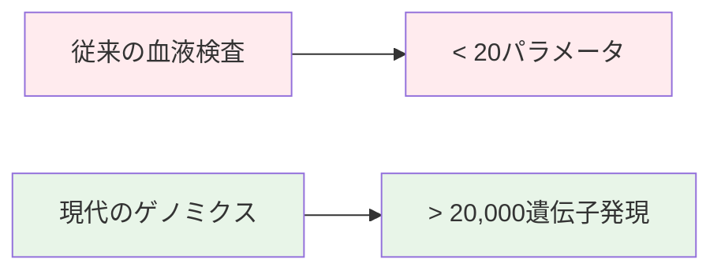
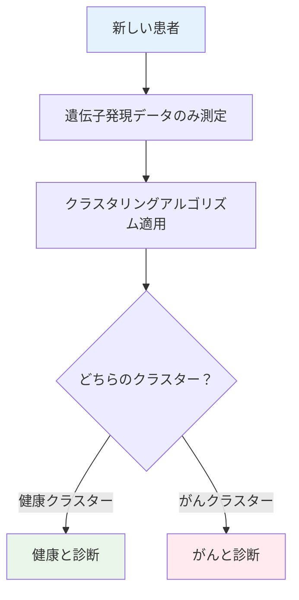
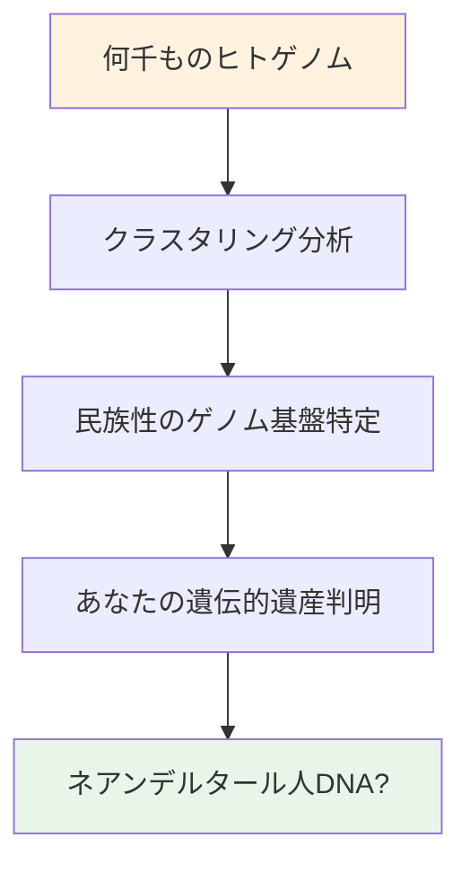
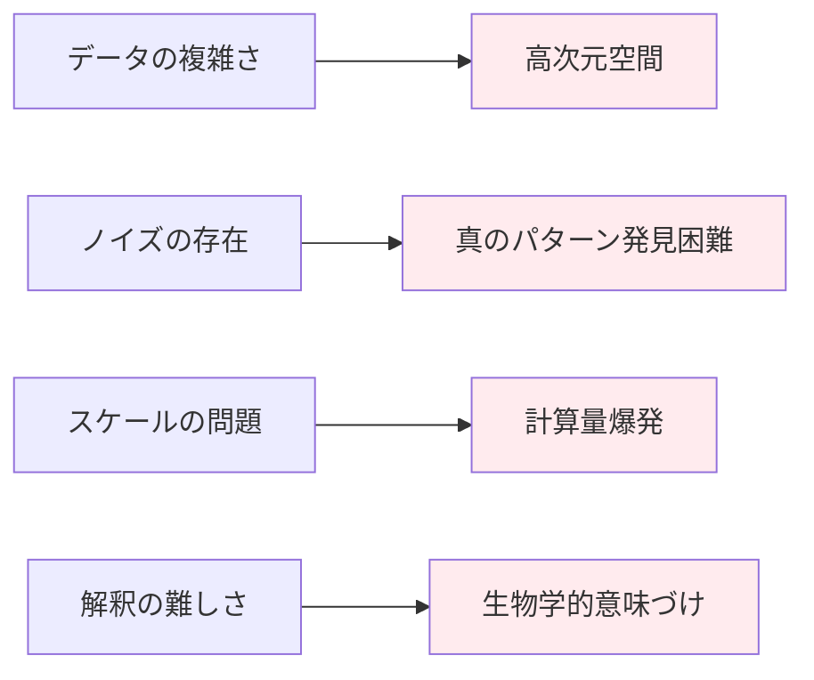
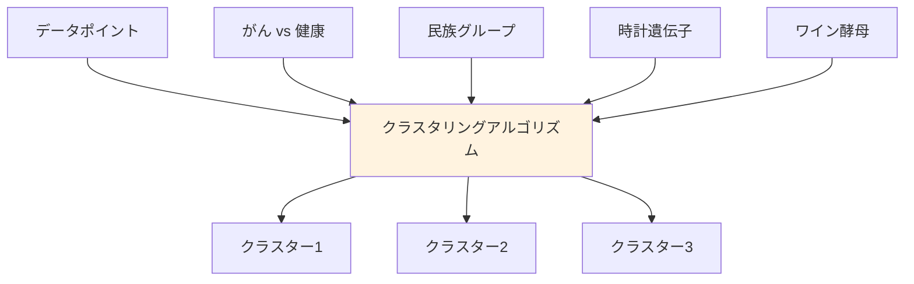
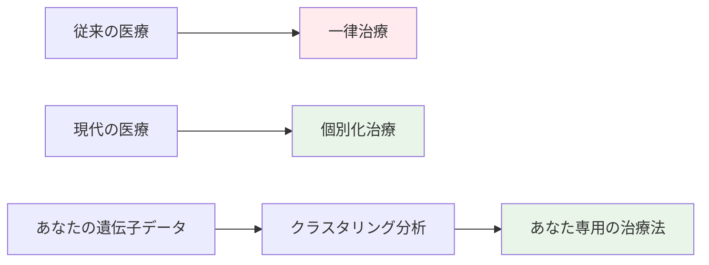
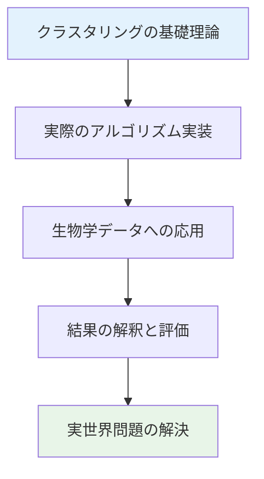

# ゲノムデータサイエンスとクラスタリング入門（超詳細版）

## 🎯 まず、この講義で何を学ぶのか

最終ゴール：**現代のゲノミクス技術で得られる膨大なデータから、生物学的に意味のあるパターンを発見し、医療・科学に応用できるクラスタリング手法を理解すること**

でも、ちょっと待ってください。そもそも「クラスタリング」って何でしょう？
実は、これは21世紀の医療革命を支える最重要技術の一つなんです。

## 🤔 ステップ0：なぜゲノムデータサイエンスが革命的なのか？

### 0-1. まず身近な例から考えてみよう

あなたが病院で血液検査を受けたとします。
医師が注文する標準的な血液検査では、返ってくる分析パラメータは**20未満**です。

でも、現代のゲノミクス技術では何ができるでしょう？



なんと！**1回の実験で20,000を超えるヒト遺伝子の発現を測定**できるんです！

### 0-2. でも、ここで大きな問題が

医師にとってこれは喜ばしい進歩でしょうか？
実は、**大きな問題**があります。

```python
def doctor_dilemma():
    """
    医師が直面するジレンマを表現
    """
    traditional_test = {
        "parameters": 20,
        "interpretation": "経験と教科書で判断可能",
        "decision_time": "数分"
    }

    genomic_test = {
        "parameters": 20000,
        "interpretation": "???",
        "decision_time": "???"
    }

    print("医師はこの膨大な情報をどう処理すればいいの？")
    return "これがゲノムデータサイエンスが必要な理由"
```

患者の治療方法を決定することは言うまでもなく、医師がこれらすべての情報を処理するにはどうすればよいでしょうか？

## 📖 ステップ1：盲検実験の天才的アイデア

### 1-1. 想像してみてください

50人のがん患者と50人の健康な人を対象に、**すべてのヒト遺伝子の発現**を測定する医師がいるとします。

医師はこのデータをコンピューター科学者（あなた）に渡します。
でも、**重要な情報**を隠します。

```python
class BlindExperiment:
    def __init__(self):
        self.cancer_patients = 50
        self.healthy_controls = 50
        self.total_datasets = 100
        self.genes_measured = 20000

    def what_doctor_gives_you(self):
        """
        医師があなたに渡すデータ
        """
        return {
            "datasets": 100,
            "gene_expression_data": "完全",
            "labels": "隠されている！"  # これが重要
        }

    def challenge(self):
        return "どのデータががん患者に対応するかを当てることができるか？"
```

### 1-2. なぜ医師は情報を隠すの？

これは意地悪ではありません。**科学的に非常に重要**な理由があります！

もしあなたが盲検実験で、すべてのデータを**健康なクラスター**と**がんクラスター**に正しく分離できれば...

**革命的なことが起きます！**

## 📖 ステップ2：革命的な可能性の発見

### 2-1. 成功した場合の驚異的な結果

盲検実験でクラスタリングに成功すると：



つまり：

- **症状が出る前**でも診断可能
- **遺伝子発現データだけ**で判断
- **早期発見・早期治療**が実現

### 2-2. これは空想ではありません

実は、このような革新的ながん診断法が**今まさに開発されています**！

```python
class RealWorldApplication:
    def __init__(self):
        self.name = "Mammo Prep"
        self.type = "乳がん診断薬"
        self.genes_used = 70
        self.capability = "乳がん再発の可能性を予測"

    def how_it_works(self):
        """
        実際の診断薬の仕組み
        """
        return f"""
        わずか{self.genes_used}個の遺伝子発現に基づいて
        {self.capability}できる！

        これがクラスタリング技術の実用化例
        """

mammo_prep = RealWorldApplication()
print(mammo_prep.how_it_works())
```

## 📖 ステップ3：さらに驚くべき応用分野

### 3-1. あなたの遺伝的ルーツを探る

クラスタリング技術は医療だけではありません。
**あなた自身の遺伝的遺産**についても教えてくれます。



想像してみてください：

- あなたの祖先がどこから来たのか
- どの民族グループと遺伝的に近いのか
- **ネアンデルタール人のDNA**を持っているかどうか！

### 3-2. 生物学的発見の宝庫

クラスタリングの応用範囲は驚くほど広大です：

```python
class ClusteringApplications:
    def __init__(self):
        self.applications = {
            "概日時計": "体内時計の原因遺伝子を発見",
            "ワイン製造": "酵母遺伝子のクラスタリングで品質向上",
            "がん診断": "早期発見・個別化治療",
            "遺伝的祖先": "民族性とルーツの解明",
            "創薬": "薬剤効果の個人差予測"
        }

    def show_diversity(self):
        """
        応用分野の多様性を表示
        """
        for field, description in self.applications.items():
            print(f"🧬 {field}: {description}")

        return "すべて同じクラスタリングフレームワークで解決！"
```

## 📖 ステップ4：クラスタリングの本質を理解しよう

### 4-1. シンプルに見えて奥が深い

クラスタリングの基本概念は実はシンプルです：

```python
def clustering_essence():
    """
    クラスタリングの本質
    """
    principle = {
        "同じクラスター内": "類似した要素",
        "異なるクラスター間": "異なる要素"
    }

    return principle
```

でも、この「シンプルな」問題が、実際にやってみると**大きな挑戦**になります。

### 4-2. なぜ難しいの？



理由：

1. **高次元データ**（20,000次元の空間！）
2. **ノイズ**の存在
3. **計算量**の爆発
4. **生物学的解釈**の困難さ

## 📖 ステップ5：実際の挑戦例を見てみよう

### 5-1. 概日時計の遺伝子発見

体内時計（概日リズム）はどのように制御されているのでしょう？

```python
class CircadianClockStudy:
    def __init__(self):
        self.problem = "概日時計の原因遺伝子を特定"
        self.approach = "時間経過での遺伝子発現パターンをクラスタリング"
        self.challenge = "24時間周期のパターンをノイズから抽出"

    def method(self):
        """
        研究手法
        """
        steps = [
            "24時間にわたり遺伝子発現を測定",
            "類似パターンの遺伝子をクラスタリング",
            "概日リズムに関連するクラスターを特定",
            "新しい時計遺伝子を発見"
        ]
        return steps
```

### 5-2. ワイン製造の科学

美味しいワインを作る秘密も、クラスタリングで解明できます！

```python
class WineYeastStudy:
    def __init__(self):
        self.question = "なぜある酵母株は美味しいワインを作るのか？"
        self.data = "酵母の全遺伝子発現プロファイル"
        self.goal = "ワイン品質に関連する遺伝子群を特定"

    def process(self):
        """
        ワイン酵母クラスタリングプロセス
        """
        return """
        1. 異なる酵母株の遺伝子発現を測定
        2. ワイン品質別にクラスタリング
        3. 高品質ワイン株に特徴的な遺伝子群を発見
        4. ワイン製造プロセスの最適化
        """
```

## 📖 ステップ6：同じフレームワークの魔法

### 6-1. 驚きの統一性

医療、遺伝的祖先、概日時計、ワイン製造...
これらすべて異なる分野に見えますが、実は**同じ計算フレームワーク**で解決できます！



### 6-2. フレームワークの共通構造

```python
class UnifiedClusteringFramework:
    def __init__(self, data, similarity_metric):
        self.data = data
        self.similarity_metric = similarity_metric

    def cluster(self):
        """
        統一クラスタリングフレームワーク
        """
        steps = [
            "データの前処理",
            "類似度の計算",
            "クラスタリングアルゴリズムの適用",
            "結果の評価と解釈"
        ]
        return steps

    def applications(self):
        """
        同じフレームワークの多様な応用
        """
        return {
            "医療": "疾患分類",
            "人類学": "民族分類",
            "生理学": "機能遺伝子分類",
            "食品科学": "品質分類"
        }
```

## 📖 ステップ7：なぜこれが「革命」なのか？

### 7-1. パラダイムシフトの理解

従来の生物学研究と現代のアプローチを比較してみましょう：

```python
class ResearchParadigmShift:
    def __init__(self):
        self.traditional = {
            "approach": "仮説駆動",
            "scale": "少数遺伝子",
            "method": "実験室での個別検証",
            "time": "数年～数十年"
        }

        self.modern = {
            "approach": "データ駆動",
            "scale": "全ゲノム",
            "method": "計算による大規模解析",
            "time": "数日～数週間"
        }

    def compare(self):
        """
        パラダイムシフトの比較
        """
        return "仮説を立ててから検証 → データから仮説を発見"
```

### 7-2. 個別化医療への道



これにより実現されること：

- **あなたに最適な薬**の選択
- **副作用の予測**
- **治療効果の事前評価**
- **早期診断**の実現

## 📖 ステップ8：挑戦の規模を理解しよう

### 8-1. データの規模感

現代のゲノムデータの規模を実感してみましょう：

```python
def data_scale_visualization():
    """
    データ規模の視覚化
    """
    traditional_experiment = {
        "genes": 10,
        "samples": 50,
        "data_points": 500
    }

    modern_experiment = {
        "genes": 20000,
        "samples": 1000,
        "data_points": 20000000  # 2千万データポイント！
    }

    scale_difference = modern_experiment["data_points"] / traditional_experiment["data_points"]

    return f"現代の実験は従来の {scale_difference:,.0f} 倍のデータを扱う"

print(data_scale_visualization())  # 現代の実験は従来の 40,000 倍のデータを扱う
```

### 8-2. 計算の挑戦

このような規模のデータでクラスタリングを行うことの困難さ：

```python
class ComputationalChallenges:
    def __init__(self):
        self.challenges = {
            "次元の呪い": "20,000次元空間での距離計算の困難",
            "計算複雑度": "組み合わせ爆発による計算時間の増大",
            "メモリ制約": "大規模データの同時処理",
            "ノイズ": "真のシグナルとノイズの分離",
            "解釈": "生物学的意味のある結果の抽出"
        }

    def why_difficult(self):
        """
        なぜ困難なのか
        """
        explanation = """
        従来の統計手法は数十〜数百の変数を想定
        ↓
        20,000変数では全く異なる数学的性質
        ↓
        新しいアルゴリズムと理論が必要
        """
        return explanation
```

## 📖 ステップ9：この分野のパイオニアたち

### 9-1. 講師紹介：現代のバイオインフォマティクス保安官

**Pavel Pevzner博士**：

- カリフォルニア大学サンディエゴ校の著名教授
- バイオインフォマティクスの第一人者
- 「バイオインフォマティクスの保安官」を自認

```python
class PavelPevzner:
    def __init__(self):
        self.title = "Distinguished Professor"
        self.institution = "UC San Diego"
        self.field = "Computer Science & Bioinformatics"
        self.mission = "デジタル革命を生物学と個別化医療に橋渡し"
        self.costume = "保安官の格好"  # フロンティア精神の象徴

    def why_sheriff(self):
        """
        なぜ保安官の格好？
        """
        return """
        バイオインフォマティクスはフロンティア分野
        新しい技術で未開の生物学的領域を開拓
        → まさに現代の「保安官」として法と秩序（科学的手法）を確立
        """
```

### 9-2. 若きアルゴリズムの天才

**Phillip Compeau博士**：

- カーネギーメロン大学助教授
- 教育イノベーションの専門家
- 謎の衣装の理由は...このコースを受講すれば分かります！

```python
class PhillipCompeau:
    def __init__(self):
        self.title = "Assistant Professor"
        self.institution = "Carnegie Mellon University"
        self.specialty = "Computer Science Education"
        self.book = "バイオインフォマティクスアルゴリズム：アクティブラーニングアプローチ"
        self.costume_mystery = "コース受講で解明される謎"

    def collaborative_work(self):
        """
        共同研究の成果
        """
        return "教科書を共著し、複雑なアルゴリズムを直感的に理解できる教育法を開発"
```

## 📖 ステップ10：あなたが学ぶこと

### 10-1. このコースで身につくスキル



具体的な学習内容：

1. **理論的基礎**：距離測定、類似度計算
2. **アルゴリズム**：k-means、階層クラスタリング等
3. **実装技術**：効率的なデータ処理
4. **応用例**：医療、遺伝学、生物学
5. **評価方法**：結果の妥当性検証

### 10-2. 修了後のあなた

```python
class CourseGraduate:
    def __init__(self):
        self.skills = [
            "大規模ゲノムデータの解析",
            "クラスタリングアルゴリズムの実装",
            "生物学的意味の解釈",
            "研究結果の批判的評価"
        ]

    def career_opportunities(self):
        """
        キャリア機会
        """
        return {
            "バイオテック企業": "創薬・診断薬開発",
            "医療機関": "精密医療・個別化治療",
            "研究機関": "基礎生物学研究",
            "IT企業": "ヘルスケアAI開発"
        }

    def impact(self):
        """
        社会への貢献
        """
        return """
        あなたが学ぶ技術は、今後10年で医療を変革し、
        何百万人もの命を救う可能性があります
        """
```

## 📝 まとめ：今日学んだことを整理

### レベル1：表面的理解（これだけでもOK）

- 現代のゲノミクス技術は20,000遺伝子を同時測定可能
- クラスタリングにより医療診断が革命的に改善
- 多様な生物学的問題が同じフレームワークで解決可能

### レベル2：本質的理解（ここまで来たら素晴らしい）

- 盲検実験の設計思想とその重要性
- データ駆動アプローチによるパラダイムシフト
- 高次元データ解析の挑戦と可能性
- 個別化医療への技術的基盤

### レベル3：応用的理解（プロレベル）

- 計算複雑度とスケーラビリティの問題
- 生物学的解釈と統計的妥当性のバランス
- 実世界データの特徴（ノイズ、欠損値、バッチ効果）
- 倫理的考慮事項（プライバシー、データ共有）

## 🚀 次回予告

次回からは、いよいよクラスタリングアルゴリズムの詳細に踏み込みます！

- **距離と類似度**：高次元空間での「近さ」とは？
- **k-meansアルゴリズム**：最も基本的で強力な手法
- **階層クラスタリング**：系統樹的なアプローチ
- **実データでの挑戦**：ノイズとの戦い

この革命的な技術があなたの手で、医療と科学の未来を切り拓く瞬間を目撃しましょう！

---

### 重要な概念チェックリスト

- [ ] 現代ゲノミクス技術の革新性を理解している
- [ ] 盲検実験の設計思想を説明できる
- [ ] クラスタリングの多様な応用例を知っている
- [ ] 高次元データ解析の挑戦を理解している
- [ ] 個別化医療の技術的基盤を把握している
- [ ] データ駆動科学のパラダイムシフトを認識している
