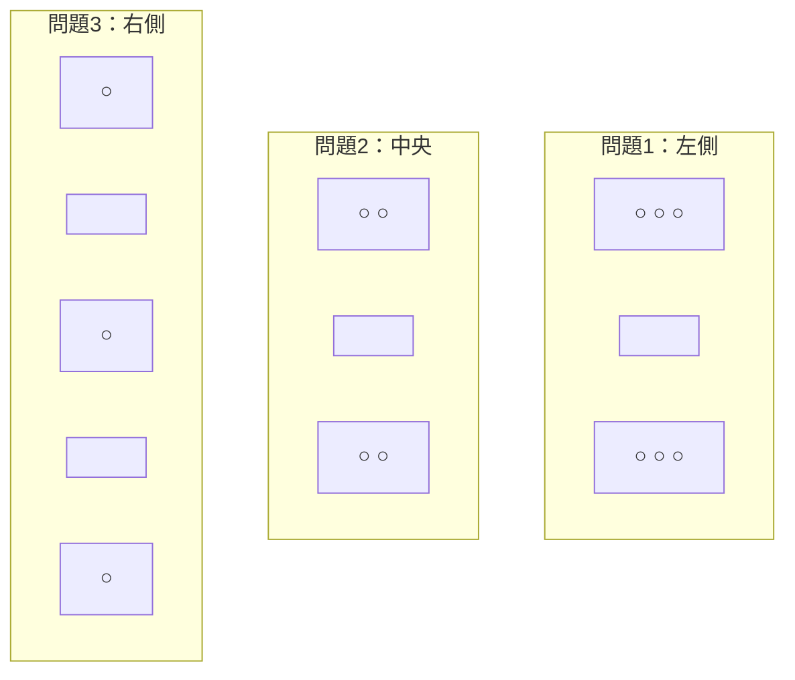
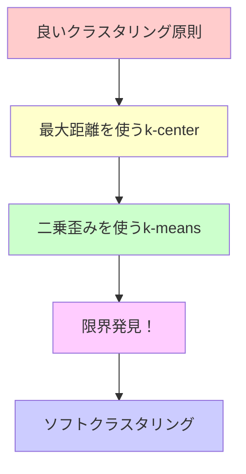

# ハードクラスタリングからソフトクラスタリングへ（超詳細版）

## 🎯 まず、この講義で何を学ぶのか

最終ゴール：**「なぜクラスタリングを『柔軟』にする必要があるのか、そしてその数学的基盤」を理解する**

でも、ちょっと待ってください。「柔軟なクラスタリング」って何でしょう？
実は、これまでのハードクラスタリングには**致命的な弱点**があったんです。

## 🤔 ステップ0：なぜソフトクラスタリングが重要なの？

### 0-1. そもそもの問題を考えてみよう

レストランに入ったとき、どのテーブルに座るかを決める場面を想像してください。

**人間なら**：「あ、この3つのテーブルはそれぞれ別々のグループだな」と一瞬で判断
**従来のアルゴリズム**：「うーん...どれも微妙で決められない」

### 0-2. 驚きの事実

実は、**人間の直感とアルゴリズムの判断が大きく違う**ことが頻繁に起こります！
なぜこんなことになるのでしょうか？

## 📖 ステップ1：人間の目 vs 機械の限界を実感してみよう

### 1-1. 3つの「簡単な」クラスタリング問題



**人間の解答**：

- 左の問題：2つのクラスター（上下に分離）
- 中央の問題：2つのクラスター（上下に分離）
- 右の問題：3つのクラスター（三角形配置）

でも実際に、Lloyd（k-means）アルゴリズムは**全く違う答え**を出してしまいます。

### 1-2. なぜこんなことが起こるの？

**Lloyd アルゴリズムの「思考回路」**：

```python
# Lloyd アルゴリズムの考え方
def lloyd_thinking():
    """
    1. 中心点を仮置き
    2. 各点を「最も近い中心」に強制的に割り当て
    3. 中心を再計算
    4. 繰り返し
    """
    print("でも、『どちらとも言えない点』はどうするの？")
    print("→ 無理やりどちらかに決める（これが問題！）")
```

ここに**致命的な問題**があります！

## 📖 ステップ2：クラスタリング手法の進化史を振り返ろう

### 2-1. これまでの旅路



**各手法の限界**：

1. **k-center**：最大距離だけ見る→細かいニュアンスを無視
2. **k-means**：二乗歪みを最小化→でも根本的な問題は残る

### 2-2. でも、二乗歪みの「真の限界」って何？

実は、まだ正確には分かっていませんでした。
だからこそ、**新しいアプローチ**が必要だったんです。

## 📖 ステップ3：ハードアサインメントの致命的弱点を発見

### 3-1. 究極の困った状況


**状況**：青と赤のクラスターのちょうど中間にある点

**ハードアサインメント（従来の方法）の選択肢**：

- 選択肢1：赤クラスターに割り当て → 間違い！
- 選択肢2：青クラスターに割り当て → これも間違い！

### 3-2. ここで天才的な発想が

「**無理やりどちらか一つに決めるから問題なんだ！**」

だったら...
**「50%は赤、50%は青」という割り当て**はどうでしょう？

これが**ソフトアサインメント（責任の概念）**の誕生です！

## 📖 ステップ4：ソフトアサインメントの革命的アイデア

### 4-1. ハード vs ソフト：視覚的比較

```python
# ハードアサインメント（従来）
def hard_assignment():
    points = ["A", "B", "C", "D", "E"]
    assignments = [
        "青", "青", "赤", "赤", "青"  # 各点は必ずどちらか一つ
    ]
    return assignments

# ソフトアサインメント（新方式）
def soft_assignment():
    points = ["A", "B", "C", "D", "E"]
    responsibilities = [
        {"赤": 0.9, "青": 0.1},   # A点：90%赤、10%青
        {"赤": 0.1, "青": 0.9},   # B点：10%赤、90%青
        {"赤": 0.5, "青": 0.5},   # C点：50%赤、50%青（中間点！）
        {"赤": 0.8, "青": 0.2},   # D点：80%赤、20%青
        {"赤": 0.1, "青": 0.9}    # E点：10%赤、90%青
    ]
    return responsibilities
```

### 4-2. 「責任」という概念の理解

**責任（Responsibility）**とは：

- 各点が各クラスターに「どの程度属しているか」の度合い
- 合計は必ず1.0（100%）
- 0.0〜1.0の連続値で表現

これは「**帰属感のパーセンテージ**」のようなものです！

### 4-3. でも、疑問が残ります

「具体的に、その責任の数値はどうやって決めるの？」

ここで登場するのが、シェイクスピアの『ハムレット』から借用した2人のキャラクター、
**ローゼンクランツとギルデンスターン**です。

## 📖 ステップ5：コインのバイアス推定問題で基礎を理解

### 5-1. 不思議なコイン事件

トム・ストッパードの戯曲のように、コインを投げ続けたら...

```
結果：H H H H H H H H H H ... (100回以上連続で表！)
```

**2人の反応**：

- ローゼンクランツ：「魔法だ！」
- ギルデンスターン：「いや、単にバイアス（偏り）があるコインだ」

### 5-2. 数学的説明

**偏ったコインの確率モデル**：

```python
import numpy as np

def biased_coin_probability(bias, heads, total_flips):
    """
    バイアス付きコインの確率計算

    bias: コインが表になる確率（0.0-1.0）
    heads: 表が出た回数
    total_flips: 総投げ回数
    """
    probability = (bias ** heads) * ((1 - bias) ** (total_flips - heads))
    return probability

# 例：バイアス0.8のコインで、10回中8回表が出る確率
prob = biased_coin_probability(0.8, 8, 10)
print(f"確率: {prob:.4f}")
```

### 5-3. 最尤推定の基本

**問題**：コインのバイアスθ（表になる確率）を推定したい
**観測データ**：n回投げて、i回表が出た

**解答**：最も尤もらしいバイアスは？

```python
def maximum_likelihood_bias(heads, total_flips):
    """最尤推定によるバイアス計算"""
    return heads / total_flips

# 例：100回投げて70回表 → バイアス = 0.7
bias = maximum_likelihood_bias(70, 100)
print(f"推定バイアス: {bias}")
```

**結果**：θ = i/n（表の回数÷総回数）

これは最初から予想できたことですが、**数学的に厳密に導出**できました！

## 📖 ステップ6：2つのコインの複雑な世界

### 6-1. より複雑なシナリオ

今度は**2つの異なるバイアスを持つコイン**があります：

- コインA（青）：バイアス不明
- コインB（緑）：バイアス不明
- **どのコインがどれか分からない**（見た目は同じ）

### 6-2. 観測データの例

```python
# 5回の実験結果（各実験で10回コインを投げる）
experiment_data = [
    {"heads": 4, "total": 10, "ratio": 0.4},  # 実験1
    {"heads": 9, "total": 10, "ratio": 0.9},  # 実験2
    {"heads": 8, "total": 10, "ratio": 0.8},  # 実験3
    {"heads": 3, "total": 10, "ratio": 0.3},  # 実験4
    {"heads": 7, "total": 10, "ratio": 0.7}   # 実験5
]

# データベクトル（比率のみに注目）
data_vector = [0.4, 0.9, 0.8, 0.3, 0.7]
```

### 6-3. 隠れベクトルという概念

**各実験でどのコインを使ったか**を隠れベクトルでエンコード：

```python
# 隠れベクトル（Hidden Vector）の例
# 1 = 青コイン、0 = 緑コイン
hidden_vector = [1, 0, 0, 1, 0]

# 意味：
# 実験1: 青コイン使用（比率0.4）
# 実験2: 緑コイン使用（比率0.9）
# 実験3: 緑コイン使用（比率0.8）
# 実験4: 青コイン使用（比率0.3）
# 実験5: 緑コイン使用（比率0.7）
```

## 📖 ステップ7：隠れベクトルがわかれば簡単

### 7-1. バイアス推定の計算

**隠れベクトルが既知の場合**：

```python
def estimate_coin_bias(data_vector, hidden_vector):
    """
    コインのバイアスを推定
    """
    # 青コインのデータを抽出
    blue_data = [data_vector[i] for i, h in enumerate(hidden_vector) if h == 1]
    # 緑コインのデータを抽出
    green_data = [data_vector[i] for i, h in enumerate(hidden_vector) if h == 0]

    # バイアス計算
    blue_bias = sum(blue_data) / len(blue_data)
    green_bias = sum(green_data) / len(green_data)

    return blue_bias, green_bias

# 実際の計算
data = [0.4, 0.9, 0.8, 0.3, 0.7]
hidden = [1, 0, 0, 1, 0]

blue_bias, green_bias = estimate_coin_bias(data, hidden)
print(f"青コインのバイアス: {blue_bias:.2f}")  # (0.4+0.3)/2 = 0.35
print(f"緑コインのバイアス: {green_bias:.2f}")  # (0.9+0.8+0.7)/3 = 0.8
```

### 7-2. 結果

**パラメータベクトル**: (0.35, 0.8)

- 青コイン：35%の確率で表
- 緑コイン：80%の確率で表

## 📖 ステップ8：ドット積による数学的表現の魔法

### 8-1. なぜドット積で表現するの？

数学的な計算を**統一的に扱う**ためです。
これにより、後でアルゴリズム化が簡単になります！

### 8-2. 青コインのバイアスをドット積で表現

```python
import numpy as np

def bias_as_dot_product():
    """バイアス計算をドット積で表現"""

    # データベクトル
    data = np.array([0.4, 0.9, 0.8, 0.3, 0.7])

    # 隠れベクトル（青コイン）
    hidden_blue = np.array([1, 0, 0, 1, 0])

    # 全部1のベクトル
    ones = np.array([1, 1, 1, 1, 1])

    # 青コインのバイアス = (データ・隠れベクトル) / (全部1・隠れベクトル)
    numerator = np.dot(data, hidden_blue)      # 0.4×1 + 0.9×0 + ... = 0.7
    denominator = np.dot(ones, hidden_blue)    # 1×1 + 1×0 + ... = 2

    blue_bias = numerator / denominator
    print(f"青コインのバイアス: {blue_bias:.2f}")

    return blue_bias

bias_as_dot_product()
```

### 8-3. 緑コインのバイアスも同様に

```python
def green_bias_dot_product():
    """緑コインのバイアスをドット積で表現"""

    data = np.array([0.4, 0.9, 0.8, 0.3, 0.7])
    hidden_blue = np.array([1, 0, 0, 1, 0])
    ones = np.array([1, 1, 1, 1, 1])

    # 緑コインの隠れベクトル = 1 - 青コインの隠れベクトル
    hidden_green = ones - hidden_blue  # [0, 1, 1, 0, 1]

    # 緑コインのバイアス
    numerator = np.dot(data, hidden_green)
    denominator = np.dot(ones, hidden_green)

    green_bias = numerator / denominator
    print(f"緑コインのバイアス: {green_bias:.2f}")

    return green_bias

green_bias_dot_product()
```

### 8-4. 統一的な表現

```python
def unified_bias_calculation(data, hidden_vector):
    """
    統一的なバイアス計算の表現
    """
    ones = np.ones(len(data))

    # 青コインのバイアス
    blue_bias = np.dot(data, hidden_vector) / np.dot(ones, hidden_vector)

    # 緑コインのバイアス
    green_hidden = ones - hidden_vector
    green_bias = np.dot(data, green_hidden) / np.dot(ones, green_hidden)

    return blue_bias, green_bias
```

## 🤔 ここで重要な観察をしてみましょう

ドット積として表現することの**真の価値**は何でしょうか？

**答え**：数学的好奇心を満たすためだけではありません！
実は、これが次のセクションで学ぶ**EMアルゴリズム**の基礎になるのです。

## 📝 まとめ：今日学んだことを整理

### レベル1：表面的理解（これだけでもOK）

- ハードクラスタリングには「中間的な点」を扱えない限界がある
- ソフトクラスタリングでは「責任」（0-1の連続値）で帰属度を表現
- コインのバイアス推定は最尤推定で解ける

### レベル2：本質的理解（ここまで来たら素晴らしい）

- ソフトアサインメントは「不確実性」を定量化する手法
- 隠れ変数（どのコインを使ったか）が分かれば、パラメータ推定は簡単
- ドット積による統一表現は、アルゴリズム化を容易にする

### レベル3：応用的理解（プロレベル）

- 最尤推定の背後にある確率論的思考
- 隠れ変数モデルの数学的構造
- EMアルゴリズムへの準備（次回につながる）

## 🔮 次回予告

## 🔮 次回への疑問

「でも待って...隠れベクトルが分からない場合はどうするの？」

実際のクラスタリング問題では、隠れベクトル（どの点がどのクラスターに属するか）こそが**知りたいこと**です。

次回は、この「卵が先か鶏が先か」問題を解決する
**EMアルゴリズムの驚くべき仕組み**に迫ります！

---

## 📖 次回予告

次回：「EMアルゴリズムによる奇跡の収束メカニズム（超詳細版）」
