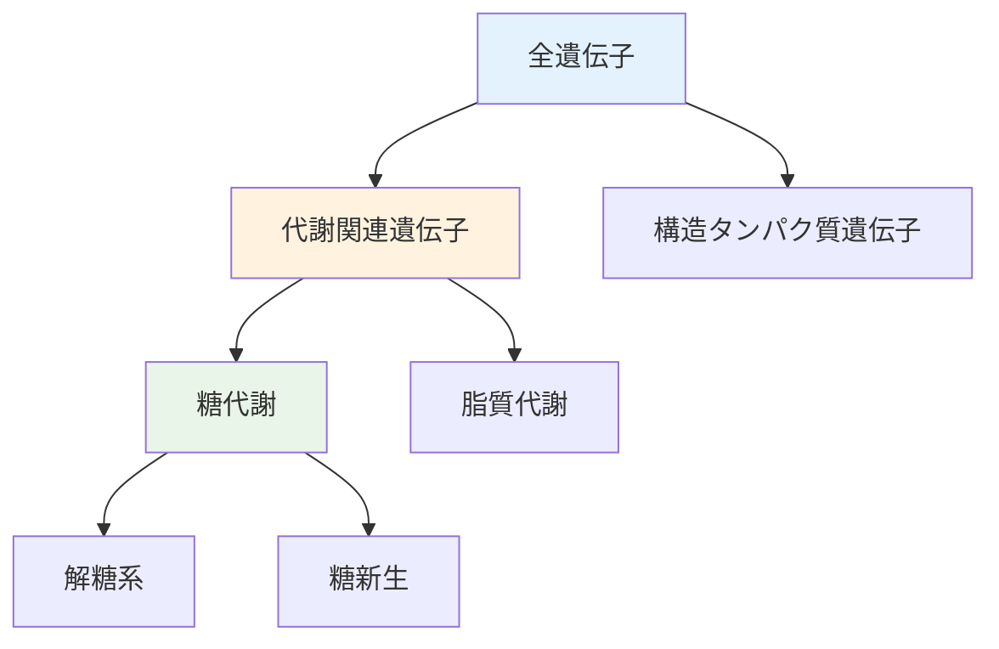
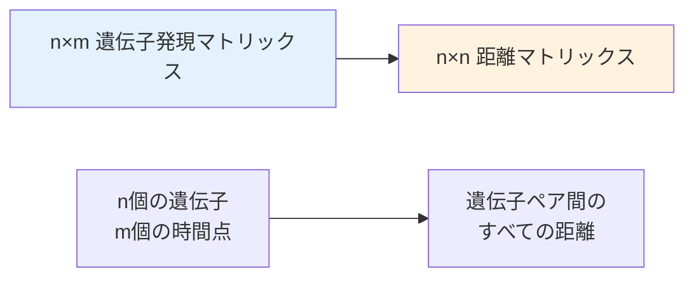
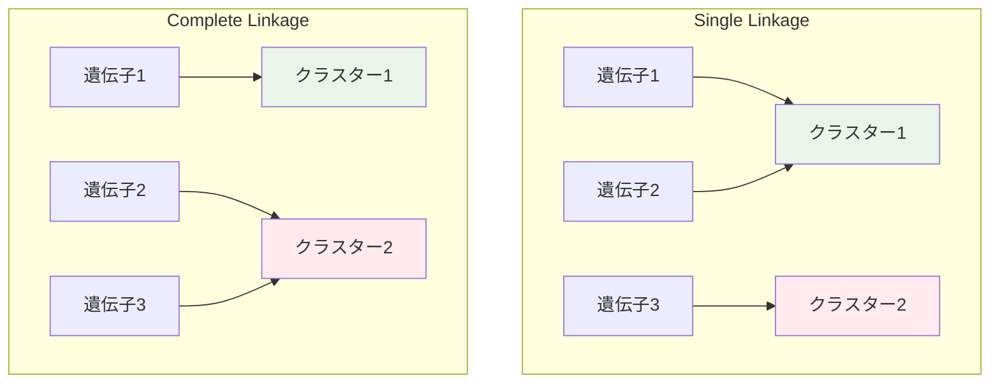

# 階層的クラスタリング（超詳細版）

## 🎯 まず、この講義で何を学ぶのか

最終ゴール：**階層的クラスタリングの仕組みを理解し、デンドログラム（樹状図）の構築アルゴリズムから生物学的応用まで、系統樹的なクラスタリング手法を完全習得すること**

でも、ちょっと待ってください。これまでk-meansクラスタリングを学んできましたが、そもそもなぜ「階層的」なクラスタリングが必要なのでしょうか？
実は、クラスターには**階層構造**があることが多く、この構造を捉えることで生物学的に深い洞察が得られるんです！

## 🤔 ステップ0：なぜ階層的クラスタリングが必要なの？

### 0-1. まず身近な例で考えてみよう

想像してみてください。あなたが図書館の司書として、本を分類する作業をしているとします。

```python
class LibraryAnalogy:
    def __init__(self):
        self.books = [
            "犬の飼い方", "猫の世話", "金魚の育て方",
            "バラの栽培", "トマトの育て方", "蘭の手入れ",
            "日本史", "世界史", "古代文明"
        ]
        self.simple_clustering = {
            "動物": ["犬の飼い方", "猫の世話", "金魚の育て方"],
            "植物": ["バラの栽培", "トマトの育て方", "蘭の手入れ"],
            "歴史": ["日本史", "世界史", "古代文明"]
        }

    def why_hierarchy_needed(self):
        """
        なぜ階層が必要か
        """
        return """
        でも待って...もっと詳しく分類できるのでは？

        動物クラスター内で：
        - 哺乳類（犬、猫）
        - 魚類（金魚）

        植物クラスター内で：
        - 花（バラ、蘭）
        - 野菜（トマト）

        つまり、クラスター内にサブクラスターが存在！
        """
```

### 0-2. 生物学データでの階層性

遺伝子発現データでも同じことが起きます：



k-meansでは「○個のクラスター」と事前に決める必要がありますが、**実際の生物学的構造はもっと複雑**です。

## 📖 ステップ1：デンドログラム（樹状図）の魔法

### 1-1. 階層的クラスタリングの結果表現

階層的クラスタリングの結果は**デンドログラム**という樹状図で表現されます：

```python
class Dendrogram:
    def __init__(self):
        self.structure = "二分木"
        self.leaves = "個々のデータポイント"
        self.internal_nodes = "クラスターの合併点"
        self.root = "全データを含む最上位クラスター"

    def magic_property(self):
        """
        デンドログラムの魔法的性質
        """
        return """
        任意の高さで水平線を引くと：

        線がツリーと交差する点の数 = クラスター数

        例：
        - 4箇所で交差 → 4つのクラスター
        - 6箇所で交差 → 6つのクラスター
        - 10箇所で交差 → 10つのクラスター

        つまり、1つの分析結果から任意のクラスター数を選択可能！
        """
```

### 1-2. k-meansとの違い

```python
def compare_clustering_methods():
    """
    k-meansと階層的クラスタリングの比較
    """
    comparison = {
        "k-means": {
            "事前設定": "クラスター数kを指定",
            "結果": "k個の独立したクラスター",
            "階層性": "なし",
            "柔軟性": "再実行が必要"
        },
        "階層的クラスタリング": {
            "事前設定": "クラスター数は不要",
            "結果": "デンドログラム（樹状図）",
            "階層性": "完全な階層構造",
            "柔軟性": "後から任意のクラスター数を選択可能"
        }
    }
    return comparison
```

## 📖 ステップ2：距離行列という出発点

### 2-1. なぜ距離行列が必要？

階層的クラスタリングは、まずデータを**距離行列**に変換することから始まります：

```python
import numpy as np

class DistanceMatrix:
    def __init__(self, data_points):
        self.n_points = len(data_points)
        self.matrix_size = (self.n_points, self.n_points)

    def create_distance_matrix(self, data):
        """
        距離行列の作成例
        """
        n = len(data)
        distance_matrix = np.zeros((n, n))

        for i in range(n):
            for j in range(n):
                # ユークリッド距離を計算
                distance = np.sqrt(sum((data[i][k] - data[j][k])**2
                                     for k in range(len(data[i]))))
                distance_matrix[i][j] = distance

        return distance_matrix

    def properties(self):
        """
        距離行列の性質
        """
        return {
            "対称性": "D[i,j] = D[j,i]",
            "対角線": "D[i,i] = 0（自分との距離は0）",
            "三角不等式": "D[i,k] ≤ D[i,j] + D[j,k]",
            "非負性": "すべての要素 ≥ 0"
        }
```

### 2-2. 発現行列から距離行列への変換



この変換により、「遺伝子間の類似度」を定量化できます。

## 📖 ステップ3：階層的クラスタリングのアルゴリズム

### 3-1. アルゴリズムの基本ステップ

階層的クラスタリングは驚くほどシンプルな原理で動作します：

```python
class HierarchicalClustering:
    def __init__(self, distance_matrix):
        self.distance_matrix = distance_matrix
        self.n_points = len(distance_matrix)

    def algorithm_steps(self):
        """
        階層的クラスタリングのアルゴリズム
        """
        steps = [
            "ステップ1: 各データポイントを個別のクラスター（リーフ）として開始",
            "ステップ2: 距離行列から最小距離を見つける",
            "ステップ3: 最小距離のクラスターペアを結合",
            "ステップ4: 新しいクラスターとの距離を再計算",
            "ステップ5: 距離行列を更新",
            "ステップ6: 1つのクラスターになるまでステップ2-5を繰り返し"
        ]
        return steps

    def visual_example(self):
        """
        視覚的な例
        """
        return """
        初期状態: [遺伝子1] [遺伝子2] [遺伝子3] [遺伝子4] [遺伝子5]
                     ↓
        第1回結合: [遺伝子1] [遺伝子2] [遺伝子3] [(遺伝子4+遺伝子5)]
                     ↓
        第2回結合: [遺伝子1] [(遺伝子2+遺伝子3)] [(遺伝子4+遺伝子5)]
                     ↓
        第3回結合: [(遺伝子1+(遺伝子2+遺伝子3))] [(遺伝子4+遺伝子5)]
                     ↓
        最終結合: [全遺伝子が1つのクラスター]
        """
```

### 3-2. 詳細な擬似コード

```python
def hierarchical_clustering_pseudocode():
    """
    階層的クラスタリングの詳細な擬似コード
    """
    pseudocode = """
    function HierarchicalClustering(DistanceMatrix D):
        # 初期化
        Clusters = {各データポイントを個別のクラスターとして設定}
        Tree = EmptyTree()

        while Clusters.size() > 1:
            # 最小距離を見つける
            (i, j) = findMinDistance(D)

            # 新しいクラスターを作成
            newCluster = merge(Clusters[i], Clusters[j])

            # ツリーに追加
            Tree.addNode(newCluster, Clusters[i], Clusters[j])

            # クラスターリストを更新
            Clusters.remove(i, j)
            Clusters.add(newCluster)

            # 距離行列を更新
            D = updateDistanceMatrix(D, newCluster, i, j)

        return Tree
    """
    return pseudocode

def distance_tree_construction():
    """
    距離行列からツリーを構築する詳細アルゴリズム
    """
    algorithm = """
    アルゴリズム：HierarchicalClusteringFromDistance
    入力：n×n距離行列 D
    出力：階層的クラスタリングツリー T

    1. 初期化:
       - 各データポイントi (1≤i≤n) を単一要素クラスター C_i として設定
       - 現在のクラスター集合 S = {C_1, C_2, ..., C_n}
       - ツリー T を空で初期化

    2. while |S| > 1 do:
       a. 距離行列 D から最小値 d_min を持つクラスターペア (C_i, C_j) を見つける
          ここで d_min = min{D[C_a, C_b] : C_a, C_b ∈ S, a ≠ b}

       b. 新しいクラスター C_new = C_i ∪ C_j を作成

       c. ツリー T に新しいノードを追加:
          - 親ノード: C_new (高さ = d_min)
          - 子ノード: C_i と C_j

       d. クラスター集合を更新:
          - S から C_i と C_j を削除
          - S に C_new を追加

       e. 距離行列 D を更新:
          すべての C_k ∈ S (k ≠ new) に対して:
          D[C_new, C_k] = LinkageFunction(D[C_i, C_k], D[C_j, C_k])

          ここで LinkageFunction は:
          - Single: min(D[C_i, C_k], D[C_j, C_k])
          - Complete: max(D[C_i, C_k], D[C_j, C_k])
          - Average: (|C_i|*D[C_i, C_k] + |C_j|*D[C_j, C_k]) / (|C_i| + |C_j|)

    3. return T
    """
    return algorithm
```

## 📖 ステップ4：距離計算方法の選択肢

### 4-1. クラスター間距離の計算方法

新しくクラスターが形成された時、そのクラスターと他のクラスターとの距離をどう計算するかが重要です：

```python
class LinkageMethods:
    def __init__(self):
        self.methods = {
            "single_linkage": "最短距離法",
            "complete_linkage": "最長距離法",
            "average_linkage": "平均距離法",
            "ward_linkage": "ウォード法"
        }

    def single_linkage(self, cluster1, cluster2):
        """
        単連結法（Single Linkage）
        """
        return """
        クラスター間距離 = 2つのクラスター間の最小距離

        利点: 連鎖したクラスターを発見しやすい
        欠点: ノイズに敏感

        例: d(A∪B, C) = min(d(A,C), d(B,C))
        """

    def complete_linkage(self, cluster1, cluster2):
        """
        完全連結法（Complete Linkage）
        """
        return """
        クラスター間距離 = 2つのクラスター間の最大距離

        利点: コンパクトなクラスターを形成
        欠点: 大きさが異なるクラスターを作りにくい

        例: d(A∪B, C) = max(d(A,C), d(B,C))
        """

    def average_linkage(self, cluster1, cluster2):
        """
        平均連結法（Average Linkage）
        """
        return """
        クラスター間距離 = 2つのクラスター間の平均距離

        利点: バランスの取れた結果
        欠点: 計算コストが高い

        例: d(A∪B, C) = average(d(A,C), d(B,C))
        """
```

### 4-2. 方法による結果の違い



同じデータでも、連結法によって異なるクラスタリング結果が得られます。

## 📖 ステップ5：実際の計算例で理解しよう

### 5-1. 5個の遺伝子の例

簡単な例で実際の計算過程を追ってみましょう：

```python
import numpy as np

class ClusteringExample:
    def __init__(self):
        # 5個の遺伝子の距離行列（例）
        self.initial_matrix = np.array([
            [0.0, 2.0, 6.0, 10.0, 9.0],  # 遺伝子1
            [2.0, 0.0, 5.0, 9.0, 8.0],   # 遺伝子2
            [6.0, 5.0, 0.0, 4.0, 5.0],   # 遺伝子3
            [10.0, 9.0, 4.0, 0.0, 3.0],  # 遺伝子4
            [9.0, 8.0, 5.0, 3.0, 0.0]    # 遺伝子5
        ])
        self.gene_names = ["遺伝子1", "遺伝子2", "遺伝子3", "遺伝子4", "遺伝子5"]

    def step_1_find_minimum(self):
        """
        ステップ1: 最小距離を見つける
        """
        min_val = np.inf
        min_i, min_j = -1, -1

        for i in range(len(self.initial_matrix)):
            for j in range(i+1, len(self.initial_matrix)):
                if self.initial_matrix[i][j] < min_val:
                    min_val = self.initial_matrix[i][j]
                    min_i, min_j = i, j

        return f"""
        距離行列から最小値を探索...

        最小距離: {min_val}
        位置: {self.gene_names[min_i]} と {self.gene_names[min_j]}

        → 遺伝子1と遺伝子2を結合！
        """

    def step_2_merge_clusters(self):
        """
        ステップ2: クラスターの結合
        """
        return """
        結合後のクラスター状況:
        - クラスター1: (遺伝子1, 遺伝子2)
        - クラスター2: 遺伝子3
        - クラスター3: 遺伝子4
        - クラスター4: 遺伝子5

        新しい距離行列を計算する必要がある
        """
```

### 5-2. 距離行列の更新

```python
def update_distance_matrix_example():
    """
    距離行列更新の具体例
    """
    return """
    Average Linkageを使用した場合：

    元の行列:
    [0, 2, 6, 10, 9]
    [2, 0, 5, 9, 8]
    ...

    遺伝子1と2を結合後:
    d((1,2), 3) = average(d(1,3), d(2,3)) = (6+5)/2 = 5.5
    d((1,2), 4) = average(d(1,4), d(2,4)) = (10+9)/2 = 9.5
    d((1,2), 5) = average(d(1,5), d(2,5)) = (9+8)/2 = 8.5

    新しい行列:
    [0, 5.5, 9.5, 8.5]  # (遺伝子1,2)
    [5.5, 0, 4, 5]      # 遺伝子3
    [9.5, 4, 0, 3]      # 遺伝子4
    [8.5, 5, 3, 0]      # 遺伝子5
    """

def complete_clustering_process():
    """
    完全なクラスタリングプロセスの例
    """
    process = """
    🔄 全体のプロセス（5遺伝子の例）:

    ラウンド1:
    - 最小距離: 2.0 (遺伝子1-遺伝子2間)
    - 結合: (遺伝子1, 遺伝子2) → クラスター12
    - 残りクラスター: [クラスター12, 遺伝子3, 遺伝子4, 遺伝子5]

    ラウンド2:
    - 最小距離: 3.0 (遺伝子4-遺伝子5間)
    - 結合: (遺伝子4, 遺伝子5) → クラスター45
    - 残りクラスター: [クラスター12, 遺伝子3, クラスター45]

    ラウンド3:
    - 最小距離: 4.5 (遺伝子3-クラスター45間)
    - 結合: (遺伝子3, クラスター45) → クラスター345
    - 残りクラスター: [クラスター12, クラスター345]

    ラウンド4:
    - 最小距離: 7.0 (クラスター12-クラスター345間)
    - 結合: (クラスター12, クラスター345) → ルートクラスター
    - 完了！

    生成されたデンドログラム:
              ルート(7.0)
             /          \
        クラスター12(2.0)  クラスター345(4.5)
         /     \            /        \
      遺伝子1  遺伝子2   遺伝子3   クラスター45(3.0)
                                    /       \
                               遺伝子4    遺伝子5
    """
    return process
```

## 📖 ステップ6：生物学的発見の実例

### 6-1. 酵母のダイオーキシックシフト研究

階層的クラスタリングが生物学的発見に繋がった素晴らしい例を見てみましょう：

```python
class YeastDiauxicShift:
    def __init__(self):
        self.experiment = "酵母の代謝切り替え実験"
        self.genes_studied = 6400
        self.time_points = 7
        self.biological_question = "グルコースからエタノール代謝への切り替えメカニズム"

    def clustering_discovery(self):
        """
        クラスタリングによる発見
        """
        discovery = """
        階層的クラスタリングにより発見されたパターン:

        🔍 特異的なクラスター発見:
        最終チェックポイントで突然発現が急増する遺伝子群

        🧬 生物学的調査:
        このクラスター内の遺伝子の上流領域を詳しく調べた結果...

        💡 驚きの発見:
        多くの遺伝子に共通の配列モチーフを発見！
        → CSRE (Carbon Source Response Element)

        📊 CSREモチーフの特徴:
        配列パターン: 5'-CGGNNNTAAA-3'
        位置: 転写開始点から-100～-150bp上流
        機能: グルコース枯渇時の遺伝子活性化
        """
        return discovery

    def six_clusters_finding(self):
        """
        階層的クラスタリングで発見された6つのクラスター
        """
        return """
        k-meansと同じデータセットでの階層的クラスタリング結果:

        🔬 発見された6つの生物学的クラスター:

        クラスター1: 初期応答遺伝子群
        - 代謝切り替えの最初期に活性化
        - ストレス応答関連

        クラスター2: グルコース代謝遺伝子群
        - グルコース存在下で高発現
        - 解糖系酵素が中心

        クラスター3: 移行期遺伝子群
        - 代謝切り替え中に一過性発現
        - シグナル伝達関連

        クラスター4: エタノール代謝遺伝子群【重要な発見】
        - 最終チェックポイントで急激に発現上昇
        - CSREモチーフを持つ

        クラスター5: 恒常的発現遺伝子群
        - ハウスキーピング遺伝子
        - 発現レベル一定

        クラスター6: 後期応答遺伝子群
        - エタノール代謝確立後に発現
        - ミトコンドリア機能関連
        """

    def biological_insight(self):
        """
        生物学的洞察
        """
        return """
        CSREの機能解明:

        1. 酵母はグルコースをエタノールよりも好むエネルギー源として使用
        2. グルコース存在下では、エタノール代謝遺伝子は抑制される
        3. グルコース枯渇 → CSREが活性化 → エタノール代謝遺伝子群を一斉発現

        つまり、CSREは「代謝切り替えのマスタースイッチ」！

        🍷 ワインで例えると:
        酵母がワイン作りでアルコール発酵を行う際、まずブドウ糖を消費し、
        その後エタノール代謝に切り替わる。この切り替えを制御しているのが
        CSREであり、階層的クラスタリングがこの発見を可能にした！
        """
```

### 6-2. クラスタリングから生物学的発見へのプロセス


これがデータ駆動科学の威力です！

## 📖 ステップ7：がん研究への応用

### 7-1. がん診断における階層的クラスタリング

階層的クラスタリングは、がんの分類と診断にも革命をもたらしました：

```python
class CancerClassification:
    def __init__(self):
        self.application = "がんのサブタイプ分類"
        self.advantage = "未知のがんサブタイプの発見"

    def traditional_vs_hierarchical(self):
        """
        従来法と階層的手法の比較
        """
        return {
            "従来の病理診断": {
                "基準": "組織学的特徴",
                "分類数": "既知のタイプのみ",
                "新発見": "困難"
            },
            "階層的クラスタリング": {
                "基準": "遺伝子発現プロファイル",
                "分類数": "データから自動決定",
                "新発見": "新しいサブタイプの発見可能"
            }
        }

    def clinical_impact(self):
        """
        臨床的インパクト
        """
        return """
        実際の成果例:

        🔬 乳がんの新しいサブタイプ発見
        → より精密な治療方針の決定

        🧪 白血病の細分化
        → 形態学的に同一でも遺伝学的に異なるタイプを区別
        → 治療成績の向上

        💊 個別化治療の実現
        → 患者固有の発現パターンに基づく治療選択
        """
```

### 7-2. 精度の重要性

しかし、医療応用には極めて高い精度が要求されます：

```python
class MedicalAccuracyRequirements:
    def __init__(self):
        self.false_positive_risk = "不要な手術"
        self.false_negative_risk = "がんの見逃し"
        self.required_accuracy = "> 99%"

    def accuracy_challenges(self):
        """
        精度に関する課題
        """
        challenges = """
        医療応用での特殊な要件:

        ⚠️ 極めて低い偽陽性率が必要
        - 偽陽性 → 健康な人への不要な治療
        - 患者の身体的・精神的負担

        ⚠️ 極めて低い偽陰性率が必要
        - 偽陰性 → がんの早期段階を見逃し
        - 治療機会の逸失

        ⚠️ サンプル調製の標準化
        - 腫瘍採取・保存方法の一貫性
        - 再現性の確保
        """
        return challenges

    def current_status(self):
        """
        現在の開発状況
        """
        return """
        現在の状況:
        - 研究段階では有望な結果
        - 臨床応用には更なる精度向上が必要
        - 標準化プロトコルの確立が進行中

        → 医療への本格応用はこれからの課題
        """
```

## 📖 ステップ8：階層的クラスタリングの長所と短所

### 8-1. 長所の整理

```python
class HierarchicalClusteringAdvantages:
    def __init__(self):
        self.advantages = {
            "クラスター数の事前指定不要": "データから自然な分割数を発見",
            "階層構造の可視化": "デンドログラムで関係性を直感的に理解",
            "柔軟なクラスター選択": "後から任意のクラスター数を選択可能",
            "決定論的結果": "同じデータで常に同じ結果",
            "距離の解釈": "クラスター間の類似度が定量化"
        }

    def detailed_advantages(self):
        """
        詳細な利点
        """
        return """
        🌟 科学的発見に最適:
        - 未知の生物学的グループを発見
        - 仮説生成に優秀
        - 結果の解釈が直感的

        🌟 探索的データ解析に強い:
        - 事前知識なしでパターン発見
        - 複数のレベルでの解析可能
        - 外れ値の検出も容易
        """
```

### 8-2. 短所と制約

```python
class HierarchicalClusteringLimitations:
    def __init__(self):
        self.limitations = {
            "計算複雑度": "O(n³) - 大規模データに不向き",
            "ノイズ感度": "外れ値に敏感",
            "連結法依存": "結果が距離計算方法に大きく依存",
            "メモリ使用量": "n×n距離行列の保存が必要",
            "修正不可": "一度結合したクラスターは分離不可"
        }

    def scalability_issues(self):
        """
        スケーラビリティの問題
        """
        return """
        🚨 大規模データでの問題:

        10,000遺伝子の場合:
        - 距離行列: 10,000 × 10,000 = 1億要素
        - メモリ使用量: 約800MB（倍精度）
        - 計算時間: 数時間～数日

        → 現代のゲノムデータ（20,000+ 遺伝子）には不適切

        解決策:
        - サンプリング
        - 次元削減の前処理
        - 近似アルゴリズム
        """
```

## 📖 ステップ9：実装のベストプラクティス

### 9-1. 効率的な実装のポイント

```python
class ImplementationTips:
    def __init__(self):
        self.best_practices = [
            "対称行列の性質を利用（上三角行列のみ計算）",
            "最小値探索の効率化（優先度付きキュー使用）",
            "メモリ効率的な距離計算（逐次計算）",
            "並列化可能な部分の特定",
            "適切なデータ構造の選択"
        ]

    def efficient_min_finding(self):
        """
        効率的な最小値探索
        """
        code_example = """
        import heapq

        def efficient_hierarchical_clustering(distance_matrix):
            n = len(distance_matrix)

            # 優先度付きキューで最小距離を管理
            heap = []
            for i in range(n):
                for j in range(i+1, n):
                    heapq.heappush(heap, (distance_matrix[i][j], i, j))

            clusters = list(range(n))  # 初期クラスター

            while len(clusters) > 1:
                # 最小距離のペアを効率的に取得
                min_dist, i, j = heapq.heappop(heap)

                # クラスター結合処理...
                merge_clusters(clusters, i, j)

            return clusters
        """
        return code_example

    def memory_optimization(self):
        """
        メモリ最適化のテクニック
        """
        return """
        💡 メモリ削減テクニック:

        1. 対称行列の活用:
           - 上三角部分のみ保存
           - メモリ使用量を半減

        2. スパース行列の活用:
           - ゼロ要素の多い行列で有効
           - scipy.sparse の活用

        3. オンデマンド計算:
           - 必要な時に距離を計算
           - 大規模データで有効
        """
```

### 9-2. 実用的なコード例

```python
import numpy as np
from scipy.cluster.hierarchy import linkage, dendrogram
import matplotlib.pyplot as plt

class PracticalHierarchicalClustering:
    def __init__(self, data):
        self.data = data

    def perform_clustering(self, method='average'):
        """
        実用的な階層クラスタリングの実行
        """
        # scipyを使用した効率的な実装
        linkage_matrix = linkage(self.data, method=method)
        return linkage_matrix

    def plot_dendrogram(self, linkage_matrix, labels=None):
        """
        デンドログラムの可視化
        """
        plt.figure(figsize=(12, 8))
        dendrogram(linkage_matrix, labels=labels)
        plt.title('階層的クラスタリングのデンドログラム')
        plt.xlabel('データポイント')
        plt.ylabel('距離')
        plt.xticks(rotation=45)
        plt.tight_layout()
        return plt

    def get_clusters(self, linkage_matrix, n_clusters):
        """
        指定したクラスター数での分割
        """
        from scipy.cluster.hierarchy import fcluster
        clusters = fcluster(linkage_matrix, n_clusters, criterion='maxclust')
        return clusters
```

## 📖 ステップ10：現代の応用と未来展望

### 10-1. 現代の大規模データへの対応

```python
class ModernApplications:
    def __init__(self):
        self.modern_challenges = {
            "シングルセル解析": "数万〜数十万細胞の個別解析",
            "マルチオミクス": "ゲノム・転写・プロテオームの統合",
            "時系列解析": "動的な生物学的プロセスの追跡",
            "空間解析": "組織内での細胞配置の考慮"
        }

    def single_cell_revolution(self):
        """
        シングルセル解析革命
        """
        return """
        🔬 シングルセル技術の衝撃:

        従来: 組織全体の平均的遺伝子発現
        現在: 個々の細胞レベルでの遺伝子発現

        課題:
        - データ規模: 10,000細胞 × 20,000遺伝子
        - スパース性: 多くのゼロ値
        - ノイズ: 技術的ばらつきの増大

        解決策:
        - 特殊な前処理手法
        - 次元削減の組み合わせ
        - 階層的クラスタリングの改良版
        """

    def future_directions(self):
        """
        未来の方向性
        """
        return """
        🚀 次世代の階層的クラスタリング:

        1. AI統合型クラスタリング
           - 深層学習との融合
           - 自動パラメータ調整

        2. リアルタイム解析
           - ストリーミングデータ対応
           - オンライン学習

        3. マルチモーダル統合
           - 異種データの同時クラスタリング
           - 複数の類似度指標の統合

        4. 説明可能AI (XAI)
           - クラスタリング結果の説明性向上
           - 生物学的解釈の自動化
        """
```

### 10-2. 医療応用の現在と未来

```python
class MedicalFuture:
    def __init__(self):
        self.current_applications = [
            "がんサブタイプの分類",
            "薬剤反応性の予測",
            "疾患進行の予測",
            "バイオマーカーの発見"
        ]

    def precision_medicine_revolution(self):
        """
        精密医療革命
        """
        vision = """
        🏥 未来の医療現場:

        患者来院
        ↓
        血液・組織サンプル採取
        ↓
        マルチオミクス解析（1時間以内）
        ↓
        階層的クラスタリングによる患者分類
        ↓
        個別化治療計画の自動生成
        ↓
        治療効果のリアルタイム監視

        これがすべて自動化される未来
        """
        return vision

    def ethical_considerations(self):
        """
        倫理的考慮事項
        """
        return """
        🤔 重要な倫理的課題:

        1. データプライバシー
           - 遺伝情報の機密性
           - 家族への影響

        2. アルゴリズムバイアス
           - 特定集団でのデータ不足
           - 公平な医療アクセス

        3. 説明責任
           - AI判断の透明性
           - 医療従事者の役割

        → 技術発展と並行した倫理フレームワークの構築が必要
        """
```

## 📝 まとめ：今日学んだことを整理

### レベル1：表面的理解（これだけでもOK）

- 階層的クラスタリングはデンドログラム（樹状図）を作成する
- 距離行列から出発し、最も近いペアを順次結合する
- k-meansと違い、事前にクラスター数を指定する必要がない
- 水平線の位置で任意のクラスター数を選択できる

### レベル2：本質的理解（ここまで来たら素晴らしい）

- 連結法（single, complete, average）により結果が変わる
- 計算複雑度O(n³)のため大規模データには不向き
- 酵母研究でCSREを発見するなど生物学的発見に貢献
- がん診断への応用が期待されるが精度の課題がある

### レベル3：応用的理解（プロレベル）

- 距離行列の効率的な管理と最小値探索の最適化
- シングルセル解析など現代的応用での技術的挑戦
- 医療応用での精度要件と倫理的考慮事項
- AI統合による次世代クラスタリング手法の展望

## 🚀 次回予告

次回は、クラスタリングの評価と検証について学びます！

- **クラスター妥当性指標**：結果の良し悪しをどう判定？
- **統計的検定**：偶然ではない有意なクラスターの発見
- **生物学的検証**：in vitroでの実験による確認
- **臨床応用の課題**：研究から実用化への壁

あなたが学んだクラスタリング技術が、実際に科学と医療を変革する瞬間を目撃する準備をしてください！

---

### 重要な概念チェックリスト

- [ ] デンドログラムの構造と解釈方法を理解している
- [ ] 階層的クラスタリングのアルゴリズムを説明できる
- [ ] 異なる連結法の特徴と使い分けを知っている
- [ ] 計算複雑度とスケーラビリティの課題を把握している
- [ ] 生物学的発見への貢献事例を理解している
- [ ] 医療応用の可能性と制約を認識している
- [ ] 現代的応用（シングルセル解析等）の挑戦を知っている
