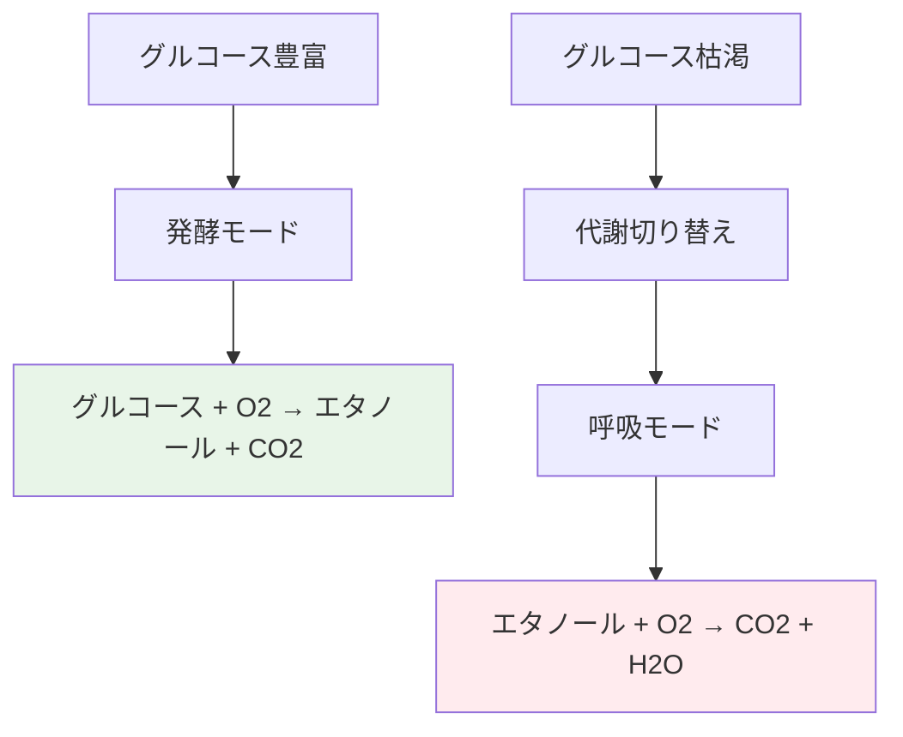
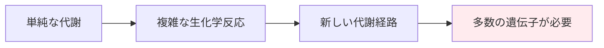
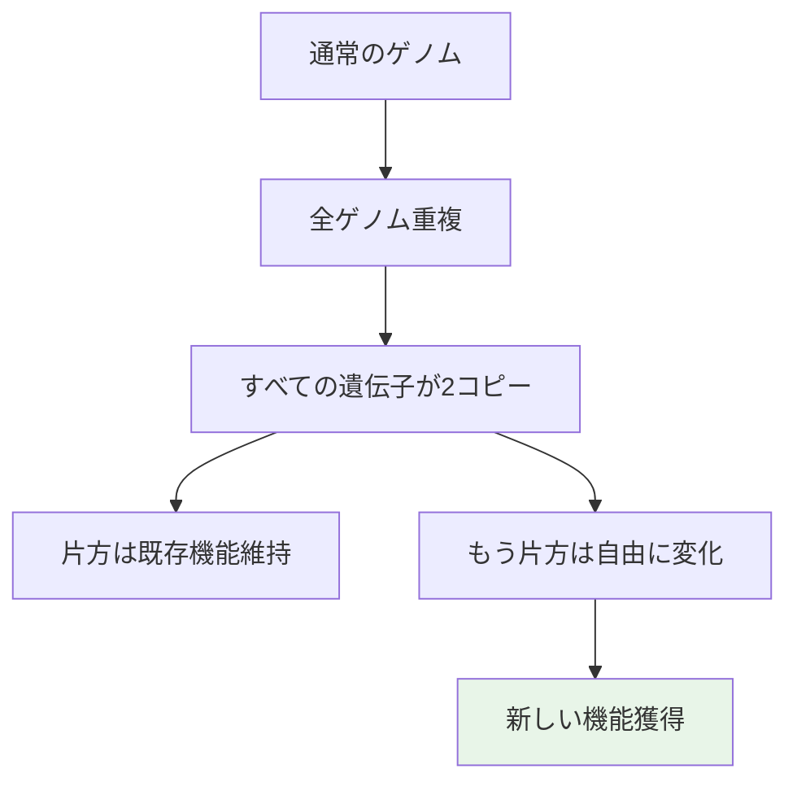
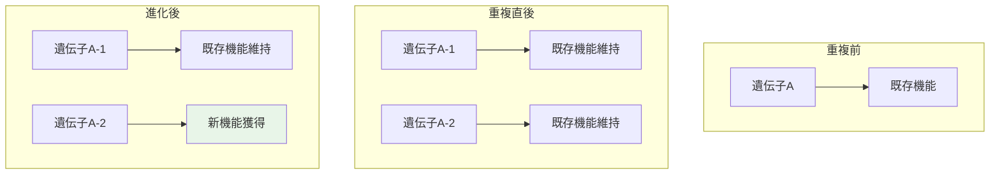

# ワイン造りを担う酵母遺伝子の謎（超詳細版）

## 🎯 まず、この講義で何を学ぶのか

最終ゴール：**酵母がワイン製造という複雑なプロセスを成し遂げるメカニズムを理解し、ダイオーキシックシフトに関わる遺伝子をクラスタリングで発見する方法を習得すること**

でも、ちょっと待ってください。ワイン造りって何千年も前からあるのに、なぜ今さら研究するのでしょう？
実は、ワイン造りの真の主役である「酵母」の遺伝的メカニズムは、つい最近まで全くの謎だったのです！

## 🤔 ステップ0：なぜワイン造りを研究するのか？

### 0-1. そもそもの誤解を解こう

多くの人が思っているワイン造り：

- ロバート・モンダヴィのような名人が作る芸術
- ブドウの品質と職人技が全て
- 人間の技術が決定的

でも、**これは大きな誤解**です。

```python
class WineMakingReality:
    def __init__(self):
        self.common_belief = "人間がワインを作る"
        self.scientific_truth = "酵母がワインを作る"
        self.human_role = "酵母に適切な環境を提供するだけ"

    def reveal_truth(self):
        """
        ワイン造りの真実を明かす
        """
        return """
        ワイン造りの最大の主役は酵母です！
        人間はただの脇役に過ぎません。
        """
```

### 0-2. 驚きの事実

**ワイン造りの最大の主役は酵母です。**

人類が何千年もワインを作ってきたのは事実ですが、そのメカニズムを理解したのはごく最近のことなのです。

## 📖 ステップ1：6000年前の驚異的発見

### 1-1. タイムマシンで古代へ

まず、クイズから始めましょう。
この古代の家畜リストに**欠けている動物**は何でしょう？


答えは...実は動物ではありません！**酵母**です！

### 1-2. アルメニアの洞窟の奇跡

10年前、科学者たちは信じられないものを発見しました：

```python
class ArmenianCaveDiscovery:
    def __init__(self):
        self.location = "アルメニア"
        self.age = "6000年前"
        self.artifacts = [
            "古いワイン製造設備",
            "発酵用の密閉容器",
            "ワインを飲むための石杯"
        ]

    def significance(self):
        """
        この発見の重要性
        """
        return """
        人類は6000年前から組織的なワイン製造を行っていた！
        しかし、その生物学的メカニズムは最近まで謎だった。
        """

    def what_it_proves(self):
        return "酵母は人類最古の「家畜化された微生物」である"
```

想像してみてください。6000年前の人々が、酵母という目に見えない生命体を「飼いならして」いたのです！

## 📖 ステップ2：酵母の奇妙な行動の謎

### 2-1. 素朴な疑問から始めよう

なぜワインを作るためにブドウを**密閉容器**に入れて保管するのでしょう？

普通に考えれば：

- ブドウには天然の酵母がついている
- 酵母はブドウ糖をエタノールに変換できる
- だから、ブドウを潰して放っておけばワインになるはず


でも、現実はそう簡単ではありません！

### 2-2. 酵母の裏切り行為

酵母は**驚くべき能力**を持っていることが判明しました：

```python
class YeastBetrayal:
    def __init__(self):
        self.phase1 = "グルコース → エタノール変換"
        self.phase2 = "エタノール消費"
        self.result = "せっかく作ったワインが台無し"

    def explain_diauxic_shift(self):
        """
        ダイオーキシックシフトの説明
        """
        return """
        1. 酵母がグルコースをエタノールに変換（発酵）
        2. グルコースがなくなると...
        3. 代謝を切り替えて、作ったばかりのエタノールを食べ始める！
        4. ワインのアルコール度数が下がってしまう

        この代謝の切り替えを「ダイオーキシックシフト」と呼ぶ
        """
```

これは大問題です！酵母が自分で作ったアルコールを食べてしまうなんて！

## 📖 ステップ3：ダイオーキシックシフトの謎

### 3-1. この現象の正式名称

酵母の代謝切り替え現象を**ダイオーキシックシフト**と呼びます。



### 3-2. 今日の探究目標

#### どの遺伝子がダイオーキシックシフトに関係しているのかを解明すること

これを理解すれば：

- より良いワインが作れる
- 酵母の代謝制御ができる
- バイオ燃料生産に応用可能
- 生命の代謝メカニズムが理解できる

## 📖 ステップ4：進化的な大きな謎

### 4-1. 1億年前の革命

時を1億年前に戻してみましょう。
初めて実をつける植物が地球上に出現した時代です。

```python
class FruitEvolutionMystery:
    def __init__(self):
        self.timeline = "1億年前"
        self.event = "初めての果実植物の出現"
        self.evolutionary_advantage = "グルコース → エタノール変換能力"
        self.mystery = "どうやってこんな複雑な能力を獲得したのか？"

    def why_ethanol_production_beneficial(self):
        """
        なぜエタノール産生が有利だったか
        """
        return """
        エタノールは他のほとんどの競合者にとって毒性がある
        ↓
        エタノール産生能力 = 競争上の大きな優位性
        ↓
        生存・繁殖に有利
        """
```

### 4-2. 進化の難しい問題

でも、ここで大きな疑問が浮かびます。

グルコースをエタノールに変換するのは簡単なことではありません。
さらに、エタノールを代謝する能力も必要です。



## 📖 ステップ5：遺伝子突然変異では説明できない

### 5-1. 従来の進化論の限界

通常の進化メカニズムでは説明困難：

```python
class TraditionalEvolution:
    def __init__(self):
        self.mechanism = "遺伝子の突然変異"
        self.typical_scope = "1〜数個の遺伝子"
        self.problem = "新しい代謝経路には数十〜数百の遺伝子が必要"

    def why_insufficient(self):
        """
        なぜ従来の進化論では不十分か
        """
        return """
        1つ、2つ、3つ、さらには10個の遺伝子を開発しても、
        新しい代謝経路を構築するという課題は達成されない。

        必要なのは：
        - 数十〜数百の遺伝子の協調
        - 複雑な調節メカニズム
        - 統合されたシステム
        """
```

### 5-2. 進化の謎の登場

ここである進化論の謎が浮かび上がります。

どうやって酵母は、これほど複雑で精巧な代謝システムを獲得したのでしょうか？

## 📖 ステップ6：大野進の登場

### 6-1. 天才的な洞察の持ち主

ここで、**大野進**という日本の偉大な科学者が登場します。

```python
class SusumuOhno:
    def __init__(self):
        self.name = "大野進（Susumu Ohno）"
        self.nationality = "日本"
        self.field = "進化生物学・遺伝学"
        self.famous_theories = [
            "ランダム破壊モデル",
            "全ゲノム重複理論"
        ]
        self.controversy = "30年間批判され続けた理論が最終的に証明された"

    def scientific_legacy(self):
        """
        科学的遺産
        """
        return """
        ゲノム再配列を形作った研究を行い、
        進化における大きなパラダイムシフトを提唱
        """
```

### 6-2. 運命の皮肉

面白いことに、大野進の**ランダム破壊モデル**は30年後に間違いであることが証明されました。

でも、なぜ彼を紹介するのでしょう？

**彼がもう一つの革命的理論を提唱したからです！**

## 📖 ステップ7：全ゲノム重複の奇跡

### 7-1. 革命的な理論の提唱

大野進は驚くべき理論を提唱しました：

#### 「全ゲノム重複なしに、進化における飛躍は不可能だった」



### 7-2. 全ゲノム重複の仕組み

基本的なプロセス：

```python
class WholeGenomeDuplication:
    def __init__(self):
        self.process = "染色体と遺伝子の数を2倍にする"
        self.result = "すべての遺伝子が2つのコピーを持つ"
        self.advantage = "一方で既存機能保持、他方で新機能開発"

    def evolutionary_advantage(self):
        """
        進化上の利点
        """
        return """
        全ゲノム重複直後の状況：
        1. すべての遺伝子が2コピー存在
        2. 生存に必要な機能は1コピーで維持
        3. もう1コピーは「実験用」として自由に変化可能
        4. 新しい代謝経路の開発が可能に
        """

    def why_revolutionary(self):
        """
        なぜ革命的か
        """
        return """
        既存の生命機能を維持しながら、
        同時に新しい革新的機能を開発できる！

        これが複雑な代謝経路進化の秘密
        """
```

### 7-3. 30年間の闘い

この理論も最初は強く批判されました：

```python
class ScientificControversy:
    def __init__(self):
        self.theory = "全ゲノム重複による進化"
        self.initial_reception = "生物学者から強い批判"
        self.duration_of_doubt = "30年間"
        self.final_outcome = "証明され、受け入れられる"

    def lesson_learned(self):
        """
        学ぶべき教訓
        """
        return """
        革新的な理論は最初必ず批判される
        ↓
        しかし、データと証拠が蓄積されると
        ↓
        科学界の見解が変わる

        これが科学の進歩プロセス
        """
```

## 📖 ステップ8：新しい代謝経路の誕生

### 8-1. 全ゲノム重複の魔法

全ゲノム重複がもたらす奇跡：



### 8-2. ダイオーキシックシフトの進化

この理論で酵母の能力が説明できます：

```python
class DiauxicShiftEvolution:
    def __init__(self):
        self.ancestral_state = "単純なグルコース代謝のみ"
        self.duplication_event = "全ゲノム重複"
        self.evolved_capability = "グルコース代謝 + エタノール代謝"

    def evolutionary_timeline(self):
        """
        進化のタイムライン
        """
        return [
            "古代：単純な糖代謝のみ",
            "全ゲノム重複イベント",
            "既存代謝遺伝子の複製",
            "複製遺伝子の一部が新機能獲得",
            "エタノール産生能力の開発",
            "エタノール消費能力の開発",
            "ダイオーキシックシフト能力の完成"
        ]

    def wine_making_implication(self):
        """
        ワイン製造への含意
        """
        return """
        酵母の複雑な代謝能力は、
        何百万年もかけた全ゲノム重複の結果！

        人類はこの生命現象を利用して
        ワインという文化を創り上げた
        """
```

## 📖 ステップ9：現代科学のアプローチ

### 9-1. 生物学的背景の理解完了

これで、ダイオーキシックシフトの生物学的背景を理解できました：

1. **酵母の二面性**：グルコース代謝 ↔ エタノール代謝
2. **進化的起源**：全ゲノム重複による新機能獲得
3. **ワイン製造への影響**：代謝切り替えタイミングが品質を決定

### 9-2. 次のステップ：遺伝子発現解析

次の目標は、**生物学者がダイオーキシックシフトを研究するために遺伝子発現を測定する方法**を理解することです。

```python
class GeneExpressionStudy:
    def __init__(self):
        self.research_question = "どの遺伝子がダイオーキシックシフトに関与するか？"
        self.approach = "遺伝子発現プロファイリング"
        self.method = "時系列遺伝子発現測定"
        self.analysis = "クラスタリングによるパターン発見"

    def experimental_design(self):
        """
        実験デザイン
        """
        return """
        1. 培養条件を変化させる（グルコース豊富 → 枯渇）
        2. 時間経過で遺伝子発現を測定
        3. 発現パターンをクラスタリング
        4. ダイオーキシックシフトに関連する遺伝子群を特定
        """
```

## 📖 ステップ10：クラスタリングへの架け橋

### 10-1. 生物学から計算科学へ

これまでの学習で理解したこと：

- ワイン製造の真の主役は酵母
- 酵母の代謝切り替え（ダイオーキシックシフト）の重要性
- 全ゲノム重複による進化メカニズム

### 10-2. データサイエンスの出番

次回からは、このような生物学的現象を**データサイエンス**で解析します：


```python
class BioinformaticsApproach:
    def __init__(self):
        self.input = "酵母遺伝子発現データ"
        self.method = "時系列クラスタリング"
        self.goal = "ダイオーキシックシフト関連遺伝子の同定"
        self.impact = "ワイン品質向上・バイオ燃料開発"

    def workflow(self):
        """
        バイオインフォマティクスワークフロー
        """
        return [
            "実験データの収集",
            "データ前処理・正規化",
            "時系列クラスタリングの実行",
            "生物学的解釈",
            "仮説の検証",
            "新たな発見の報告"
        ]

    def broader_implications(self):
        """
        より広い含意
        """
        return """
        この手法は酵母だけでなく、
        あらゆる生命現象の理解に応用可能：

        - がん細胞の代謝変化
        - 植物の環境応答
        - 微生物の工業利用
        - 創薬ターゲットの発見
        """
```

## 📝 まとめ：今日学んだことを整理

### レベル1：表面的理解（これだけでもOK）

- ワイン造りの主役は酵母
- 酵母はダイオーキシックシフトという代謝切り替えを行う
- 全ゲノム重複が複雑な能力進化を可能にした
- 現代科学は遺伝子発現データで生命現象を解析する

### レベル2：本質的理解（ここまで来たら素晴らしい）

- 6000年前から人類は微生物を「家畜化」していた
- 進化における全ゲノム重複の重要性
- 大野進の理論と科学的論争の歴史
- 生物学的疑問をデータサイエンスで解決するアプローチ

### レベル3：応用的理解（プロレベル）

- 代謝工学への応用可能性
- 時系列遺伝子発現解析の設計思想
- 進化生物学と現代バイオテクノロジーの接点
- 文化（ワイン）と科学技術の相互作用

## 🚀 次回予告

次回は、いよいよ実際の**遺伝子発現データ**を使って、ダイオーキシックシフトに関わる遺伝子群をクラスタリングで発見します！

- **時系列データの特徴**：時間経過での遺伝子発現変化
- **クラスタリング手法**：類似パターン遺伝子の発見
- **生物学的解釈**：データから生命現象への洞察
- **実世界への応用**：より良いワイン・バイオ燃料への道

古代アルメニア人の知恵と現代データサイエンスが出会い、生命の謎を解き明かす感動の瞬間を体験しましょう！

---

### 重要な概念チェックリスト

- [ ] 酵母がワイン製造の主役であることを理解している
- [ ] ダイオーキシックシフトの生物学的意味を説明できる
- [ ] 全ゲノム重複による進化メカニズムを理解している
- [ ] 大野進の理論とその歴史的意義を把握している
- [ ] 遺伝子発現解析の基本的アプローチを知っている
- [ ] 生物学的疑問をデータサイエンスで解決する流れを理解している
