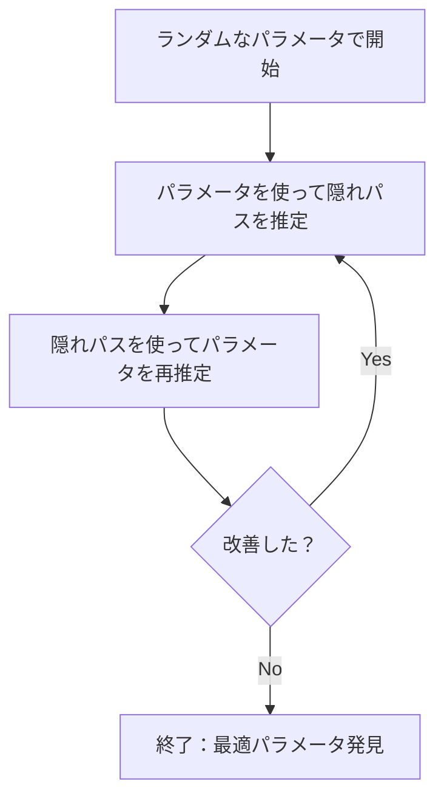

# モジュール7-8 ビタビ学習によるHMMパラメータ推定（超詳細版）

## 🎯 まず、この講義で何を学ぶのか

最終ゴール：**隠れた道が分からない状況で、HMMのパラメータ（遷移確率と放出確率）を自動的に学習する方法をマスタする**

でも、ちょっと待ってください。そもそもなぜパラメータを「学習」する必要があるのでしょうか。

実は、現実世界では**HMMのパラメータが事前に分からない**ことがほとんどなんです。次のような例があります。

- 新しいタンパク質ファミリーのプロファイルHMMを作るとき
- カジノのディーラーの不正を暴くとき（コインの偏りが分からない）
- 遺伝子の構造を予測するとき（どこでどう変化するか分からない）

## 🤔 ステップ0：パラメータ学習問題の本質を理解する

### 0-1. カジノの例で考えてみよう

次の状況を想像してください。

- カジノに入って、ディーラーのコイン投げを観察
- 結果の列：`HHTTHHTHHTTTH...`
- でも、今回は何も分からない

**分からないこと**：

1. フェアコインとバイアスコインのそれぞれの偏り
2. ディーラーがコインを交換する確率
3. いつどちらのコインを使っているか

### 0-2. これがパラメータ学習問題

```python
# 観察できるもの
observations = "HHTTHHTHHTTTH..."  # コイン投げの結果だけ

# 知りたいもの
unknown_parameters = {
    "fair_coin_heads_prob": "?",      # フェアコインの表の確率
    "biased_coin_heads_prob": "?",    # バイアスコインの表の確率
    "switch_probability": "?",        # コイン交換確率
    "hidden_path": "?"                # どちらのコインをいつ使ったか
}
```

まるで**「鶏と卵」問題**のようです。

- パラメータが分かれば → 隠れパスを推定できる
- 隠れパスが分かれば → パラメータを推定できる

でも、どちらも分からない状況です。どのように解決すればよいのでしょうか。

## 📖 ステップ1：まず簡単な問題から - 隠れパスが既知の場合

### 1-1. もしディーラーが正直だったら

驚くべきシナリオを考えてみましょう。ディーラーが**「どのコインをいつ使ったか」を全部教えてくれた**とします。

```python
# ディーラーが教えてくれた情報
hidden_path = "FFFFBBBBBFFF..."  # F: フェアコイン, B: バイアスコイン
emissions = "HHTTHHTHHTTTH..."

# この場合、パラメータ推定は簡単になる
```

### 1-2. カウントベースの推定

```python
def estimate_parameters_with_known_path(emissions, hidden_path):
    """
    隠れパスが分かっているときのパラメータ推定
    これは単純に「数える」だけで済む
    """
    # 遷移回数をカウント
    transitions = {"FF": 0, "FB": 0, "BF": 0, "BB": 0}
    for i in range(len(hidden_path) - 1):
        trans = hidden_path[i] + hidden_path[i+1]
        transitions[trans] += 1

    # 放出回数をカウント
    emissions_count = {
        "F": {"H": 0, "T": 0},
        "B": {"H": 0, "T": 0}
    }
    for i in range(len(hidden_path)):
        state = hidden_path[i]
        symbol = emissions[i]
        emissions_count[state][symbol] += 1

    # 確率を計算（頻度から）
    print("遷移確率:")
    print(f"  F→F: {transitions['FF']} / {transitions['FF'] + transitions['FB']}")
    print(f"  F→B: {transitions['FB']} / {transitions['FF'] + transitions['FB']}")

    print("放出確率:")
    total_F = emissions_count["F"]["H"] + emissions_count["F"]["T"]
    print(f"  F(H): {emissions_count['F']['H']} / {total_F}")
```

**ポイント**：隠れパスが分かっていれば、パラメータ推定は**単純な数え上げ問題**になります。

## 📖 ステップ2：本当の問題 - 隠れパスが未知の場合

### 2-1. 現実の状況

```python
# 現実の問題設定
observations = "HHTTHHTHHTTTH..."  # これだけが与えられる
hidden_path = "????????????..."    # これは分からない
parameters = {                     # これも分からない
    "transition": "?",
    "emission": "?"
}
```

### 2-2. 天才的なアイデア：反復的アプローチ

ここで**「鶏が先か卵が先か」問題を解く天才的アイデア**が登場します：



これが**ビタビ学習**の基本アイデアです。

## 📖 ステップ3：ビタビ学習アルゴリズムの詳細

### 3-1. アルゴリズムの全体像

```python
def viterbi_learning(observations, states, max_iterations=100):
    """
    ビタビ学習：観察データからHMMパラメータを学習

    魔法のような反復アルゴリズム：
    1. 適当にパラメータを初期化
    2. そのパラメータでビタビアルゴリズムを実行（隠れパス推定）
    3. その隠れパスからパラメータを再推定
    4. 収束するまで2-3を繰り返す
    """

    # ステップ1: ランダム初期化
    parameters = initialize_random_parameters(states)

    for iteration in range(max_iterations):
        print(f"\n=== 反復 {iteration + 1} ===")

        # ステップ2: 現在のパラメータで隠れパスを推定
        hidden_path = viterbi_algorithm(observations, parameters)
        print(f"推定された隠れパス: {hidden_path[:20]}...")

        # ステップ3: 隠れパスからパラメータを再推定
        new_parameters = estimate_parameters(observations, hidden_path)

        # ステップ4: 収束チェック
        if parameters_converged(parameters, new_parameters):
            print("収束しました")
            break

        parameters = new_parameters

    return parameters
```

### 3-2. 具体例で実験してみよう

```python
def simple_viterbi_learning_demo():
    """
    簡単な例でビタビ学習を体験
    """
    observations = "HHTTHHTHHTTTHHHHTTTHHHT"

    # 反復1: ランダムな初期値
    params_1 = {
        "transition": {"F→F": 0.5, "F→B": 0.5, "B→F": 0.5, "B→B": 0.5},
        "emission": {"F(H)": 0.5, "F(T)": 0.5, "B(H)": 0.5, "B(T)": 0.5}
    }

    # ビタビアルゴリズムで隠れパス推定
    path_1 = "FFFFFFFFFFFBBBBBBBBBBFF"  # 仮の結果

    # パラメータ再推定
    # F→F: 10回, F→B: 1回 → P(F→F) = 10/11 ≈ 0.91
    # B→B: 10回, B→F: 1回 → P(B→B) = 10/11 ≈ 0.91

    params_2 = {
        "transition": {"F→F": 0.91, "F→B": 0.09, "B→F": 0.09, "B→B": 0.91},
        "emission": {"F(H)": 0.45, "F(T)": 0.55, "B(H)": 0.7, "B(T)": 0.3}
    }

    print("反復1後のパラメータ改善:")
    print("  コイン交換確率: 50％ → 9％（より安定的に）")
    print("  バイアスコインの偏り: 50％ → 70％（より明確に）")
```

### 3-3. なぜこれが動作するのか

**驚きの事実**：各反復で、観察データの**尤度（もっともらしさ）が必ず改善**されます。

```python
def why_viterbi_works():
    """
    ビタビ学習が動作する理由を理解
    """
    # 各反復での尤度の変化
    iterations = [1, 2, 3, 4, 5]
    likelihoods = [0.001, 0.01, 0.05, 0.08, 0.09]  # 必ず増加

    print("尤度の変化:")
    for i, likelihood in zip(iterations, likelihoods):
        print(f"  反復{i}: {'■' * int(likelihood * 100)} {likelihood}")

    print("\n重要な性質:")
    print("1. 尤度は単調増加（必ず良くなる）")
    print("2. 上界がある（1を超えない）")
    print("3. したがって必ず収束する")
```

## 📖 ステップ4：ビタビ学習の実装詳細

### 4-1. パラメータの初期化

```python
def initialize_parameters_smartly():
    """
    賢い初期化の方法

    ランダムすぎると収束が遅い
    → ドメイン知識を使って賢く初期化
    """
    # 悪い初期化（完全ランダム）
    bad_init = {
        "transition": random_matrix(),
        "emission": random_matrix()
    }

    # 良い初期化（ドメイン知識を活用）
    good_init = {
        "transition": {
            # 状態は比較的安定と仮定
            "stay": 0.8,
            "switch": 0.2
        },
        "emission": {
            # 観察データの頻度を参考に
            "based_on_observations": count_frequencies(observations)
        }
    }

    return good_init
```

### 4-2. 収束の判定

```python
def check_convergence(old_params, new_params, threshold=1e-6):
    """
    収束判定：パラメータがほとんど変化しなくなったら終了
    """
    max_change = 0

    # すべてのパラメータの変化量を計算
    for key in old_params:
        change = abs(old_params[key] - new_params[key])
        max_change = max(max_change, change)

    converged = max_change < threshold

    if converged:
        print(f"✓ 収束しました 最大変化量: {max_change:.8f}")
    else:
        print(f"  まだ収束していません。変化量: {max_change:.6f}")

    return converged
```

## 📖 ステップ5：ビタビ学習の限界と課題

### 5-1. ハードな決定の問題

```python
def viterbi_limitation():
    """
    ビタビ学習の根本的な限界
    """
    # ビタビアルゴリズムは「0か1か」の決定
    viterbi_decision = {
        "時刻1": "状態F（100%確信）",
        "時刻2": "状態B（100%確信）",
        "時刻3": "状態F（100%確信）"
    }

    # でも実際は...
    reality = {
        "時刻1": "たぶん状態F（でも30%くらいBかも）",
        "時刻2": "おそらく状態B（でも40%くらいFかも）",
        "時刻3": "微妙...（F:51%, B:49%）"
    }

    print("問題：ビタビは確率的な不確実性を無視してしまう")
```

### 5-2. ローカル最適解の罠

```python
def local_optimum_problem():
    """
    ビタビ学習はローカル最適解に陥りやすい
    """
    # 山登り法のアナロジー
    print("ビタビ学習は山登り法のようなもの：")
    print("  1. 今いる場所から一番急な方向に登る")
    print("  2. 頂上に着いたと思ったら止まる")
    print("  3. でもそれは「局所的な頂上」かもしれない")

    # 複数回の実行で異なる結果
    results = []
    for i in range(5):
        result = viterbi_learning_with_random_init()
        results.append(result)

    print("\n5回実行した結果:")
    for i, r in enumerate(results):
        print(f"  試行{i+1}: 尤度 = {r['likelihood']:.4f}")

    print("\n→ 初期値によって異なる局所最適解に収束")
```

## 📖 ステップ6：実践的な実装例

### 6-1. 完全なビタビ学習の実装

```python
class ViterbiLearning:
    """
    ビタビ学習の完全実装
    """

    def __init__(self, states, alphabet):
        self.states = states
        self.alphabet = alphabet
        self.transition = {}
        self.emission = {}

    def learn(self, observations, max_iter=100, convergence_threshold=1e-6):
        """
        メインの学習ループ
        """
        # 初期化
        self._initialize_parameters()

        prev_likelihood = float('-inf')

        for iteration in range(max_iter):
            # ステップ1: ビタビで隠れパス推定
            hidden_path, likelihood = self._viterbi_decoding(observations)

            # ステップ2: パラメータ更新
            self._update_parameters(observations, hidden_path)

            # ステップ3: 収束チェック
            if abs(likelihood - prev_likelihood) < convergence_threshold:
                print(f"収束しました（反復{iteration}回）")
                break

            prev_likelihood = likelihood

            # 進捗表示
            if iteration % 10 == 0:
                print(f"反復{iteration}: 尤度 = {likelihood:.6f}")

        return self.transition, self.emission

    def _initialize_parameters(self):
        """
        パラメータの賢い初期化
        """
        n_states = len(self.states)
        n_symbols = len(self.alphabet)

        # 対角優位な遷移行列（状態が安定的）
        for s1 in self.states:
            for s2 in self.states:
                if s1 == s2:
                    self.transition[s1, s2] = 0.8
                else:
                    self.transition[s1, s2] = 0.2 / (n_states - 1)

        # ランダムな放出行列
        import random
        for state in self.states:
            for symbol in self.alphabet:
                self.emission[state, symbol] = random.random()

            # 正規化
            total = sum(self.emission[state, s] for s in self.alphabet)
            for symbol in self.alphabet:
                self.emission[state, symbol] /= total

    def _viterbi_decoding(self, observations):
        """
        ビタビアルゴリズムで最適パスを見つける
        """
        # ここに標準的なビタビアルゴリズムを実装
        # （前の講義で学んだ内容）
        pass

    def _update_parameters(self, observations, hidden_path):
        """
        隠れパスからパラメータを再推定
        """
        # 遷移をカウント
        trans_counts = {}
        for i in range(len(hidden_path) - 1):
            key = (hidden_path[i], hidden_path[i+1])
            trans_counts[key] = trans_counts.get(key, 0) + 1

        # 放出をカウント
        emit_counts = {}
        for i in range(len(hidden_path)):
            key = (hidden_path[i], observations[i])
            emit_counts[key] = emit_counts.get(key, 0) + 1

        # 確率に変換
        self._normalize_parameters(trans_counts, emit_counts)
```

### 6-2. 使用例：CpGアイランド検出への応用

```python
def cpg_island_viterbi_learning():
    """
    実際の生物学的問題への応用
    CpGアイランドの検出
    """
    # DNAシーケンス（CpGアイランドが含まれる）
    dna_sequence = "ACGTCGACGTACGTCG" * 100

    # ビタビ学習でパラメータを推定
    learner = ViterbiLearning(
        states=['CpG', 'Normal'],
        alphabet=['A', 'C', 'G', 'T']
    )

    transition, emission = learner.learn(dna_sequence)

    print("\n学習されたパラメータ:")
    print("CpGアイランドの特徴:")
    print(f"  CG出現率: {emission['CpG', 'CG']:.3f}")
    print(f"  通常領域のCG出現率: {emission['Normal', 'CG']:.3f}")
    print(f"  CpGアイランドの平均長: {1/(1-transition['CpG', 'CpG']):.1f}塩基")
```

## 📝 まとめ：今日学んだことを整理

### レベル1：表面的理解（これだけでもOK）

#### ビタビ学習は観察データからHMMパラメータを自動学習

基本手順：

1. 適当にパラメータを決める
2. ビタビアルゴリズムで隠れパスを推定
3. 隠れパスからパラメータを再計算
4. 収束するまで繰り返す

### レベル2：本質的理解（ここまで来たら素晴らしい）

#### 「鶏と卵」問題の解決策

- パラメータ → 隠れパス → パラメータ → ... の反復
- 各ステップで尤度が必ず改善（単調増加）
- 上界があるので必ず収束

**限界の理解**：

- ハード決定（確率的不確実性を無視）
- ローカル最適解の問題

### レベル3：応用的理解（プロレベル）

**実装上の工夫**：

- 賢い初期化（ドメイン知識の活用）
- 収束判定の適切な設定
- 複数回実行して最良解を選択

**発展的話題**：

- ソフトな決定を使うBaum-Welch学習への道
- EMアルゴリズムとの関係
- プロファイルHMM構築での実用

## 🚀 次回予告

「ソフトデコーディング：確率的な不確実性を扱う」

次回は、ビタビ学習の限界を克服する画期的な手法を学びます。

- Forward-Backwardアルゴリズム
- ソフトデコーディング（確率的な状態推定）
- Baum-Welch学習（EMアルゴリズムの一種）

「この時刻の状態は60％ F、40％ B」のような**確率的な答え**を出せるようになります。

さらに驚くべきことに、この手法は**グローバル最適解**により近づける可能性があるんです。どうやってそんなことが可能なのか、次回その秘密が明かされます。
