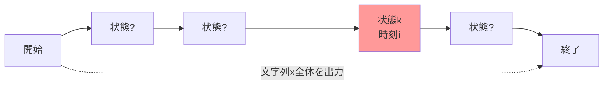

# モジュール7-9 ソフトデコーディング問題とForward-Backwardアルゴリズム（超詳細版）

## 🎯 まず、この講義で何を学ぶのか

最終ゴール：**HMMが「たぶん」どの状態にいたか確率的に判定できるようになる！**

でも、ちょっと待ってください。そもそも「たぶん」ってどういうことでしょう？
実は、Viterbiアルゴリズムの「絶対にこの状態だ！」という決めつけから、「この状態である確率は70%」というような**柔軟な判定**ができるようになるんです。

## 🤔 ステップ0：なぜソフトデコーディングが必要なの？

### 0-1. そもそもの問題を考えてみよう

イカサマカジノの例で考えてみましょう。

```
観測結果：HHTHHH（H=表、T=裏）
```

Viterbiアルゴリズム（ハードデコーディング）では：

- 5回目のコイン投げ：「フェアコインを使った」か「イカサマコインを使った」か、どちらか一つに決めつける

でも現実では：

- 「たぶんフェアコインだったと思うけど、30%くらいはイカサマコインかも...」

### 0-2. 驚きの事実

**ハードな答え（0か1）よりも、ソフトな答え（0.7とか0.3）の方が、実はより多くの情報を含んでいるんです！**

これがパラメータ学習で重要になります。

## 📖 ステップ1：問題設定を理解しよう

### 1-1. ハードからソフトへの転換

#### ハードデコーディング（Viterbiアルゴリズム）

```
質問：「時刻iで状態kにいたか？」
答え：「YES」または「NO」（二者択一）
```

#### ソフトデコーディング（今回学ぶ方法）

```
質問：「時刻iで状態kにいた確率は？」
答え：「0.7」（0から1の間の値）
```

### 1-2. イカサマカジノでの具体例

```python
# ハードな答え
def viterbi_answer(observation, position):
    """5回目でフェアコインを使ったか？"""
    return "YES" or "NO"  # どちらか一つ

# ソフトな答え（今回学ぶ）
def soft_answer(observation, position):
    """5回目でフェアコインを使った確率は？"""
    return 0.7  # 70%の確率でフェアコイン
```

## 📖 ステップ2：新しい確率の概念を導入

### 2-1. 無条件確率 P(πᵢ = k, x)

まず、**無条件確率**という概念を導入します。

```
P(πᵢ = k, x) = 「隠れ経路が時刻iで状態kを通過して、かつ文字列xを出力する確率」
```

これを図で理解しましょう：



### 2-2. この確率の計算方法

```python
def unconditional_probability(i, k, x):
    """
    時刻iで状態kを通過してxを出力する確率

    実は、Viterbiグラフで：
    - 状態kを通過するすべての経路
    - それらの確率の合計
    """
    total_prob = 0

    # 状態kを通過するすべての経路について
    for path in all_paths_through_node(i, k):
        # その経路の確率を足し合わせる
        total_prob += probability_of_path(path, x)

    return total_prob
```

## 📖 ステップ3：条件付き確率への変換

### 3-1. 本当に知りたい確率

実は、私たちが本当に知りたいのは：

```
P(πᵢ = k | x) = 「文字列xが観測されたとき、時刻iで状態kにいた確率」
```

### 3-2. ベイズの定理を使った変換

```python
def conditional_probability(i, k, x):
    """
    xが観測されたときに時刻iで状態kにいた確率
    """
    # ベイズの定理より
    numerator = P(πᵢ = k, x)   # 分子：同時確率
    denominator = P(x)          # 分母：xの確率

    return numerator / denominator
```

つまり：

```
P(πᵢ = k | x) = P(πᵢ = k, x) / P(x)
```

## 📖 ステップ4：経路の分解という天才的発想

### 4-1. ここで天才的な発想が

Viterbiグラフで状態kを通る経路を、**2つの部分に分解**できることに気づきます。


### 4-2. 経路の分解による計算

```python
def decompose_path_probability(i, k, x):
    """
    経路を前半と後半に分解して計算
    """
    # 前半：開始から状態kまでの全経路の確率和
    forward_sum = sum_of_paths_to_node(i, k)  # Forward

    # 後半：状態kから終了までの全経路の確率和
    backward_sum = sum_of_paths_from_node(i, k)  # Backward

    # 全体の確率は掛け算
    return forward_sum * backward_sum
```

## 📖 ステップ5：Forwardアルゴリズム（前向き計算）

### 5-1. Forward確率の定義

```
Forward(k, i) = 「開始から時刻iの状態kまでの全経路の確率和」
```

### 5-2. 再帰的な計算

```python
def forward_algorithm(x, states, transitions, emissions):
    """
    Forward確率を動的計画法で計算
    """
    n = len(x)
    forward = {}

    # 初期化（時刻0）
    for state in states:
        forward[state, 0] = initial_prob[state] * emission[state, x[0]]

    # 再帰的計算
    for i in range(1, n):
        for k in states:
            forward[k, i] = 0
            for l in states:
                # 前の状態lから状態kへの遷移
                forward[k, i] += (
                    forward[l, i-1] *
                    transition[l, k] *
                    emission[k, x[i]]
                )

    return forward
```

### 5-3. イメージで理解

```
時刻:    0    1    2    3    4
        ━━━━━━━━━━━━━━━━━━━━━━━
Fair:    ○────○────○────○────○
          ╲  ╱ ╲  ╱ ╲  ╱ ╲  ╱
           ╲╱   ╲╱   ╲╱   ╲╱
           ╱╲   ╱╲   ╱╲   ╱╲
          ╱  ╲ ╱  ╲ ╱  ╲ ╱  ╲
Biased:  ○────○────○────○────○
        ━━━━━━━━━━━━━━━━━━━━━━━

Forward(Fair, 3) = すべての「○」への経路の確率の合計
```

## 📖 ステップ6：Backwardアルゴリズム（後ろ向き計算）

### 6-1. なぜ「後ろ向き」が必要？

実は、状態kから**終了までの経路**も計算する必要があります。

```
Backward(k, i) = 「時刻iの状態kから終了までの全経路の確率和」
```

### 6-2. 後ろ向きの再帰計算

```python
def backward_algorithm(x, states, transitions, emissions):
    """
    Backward確率を動的計画法で計算（逆向き）
    """
    n = len(x)
    backward = {}

    # 初期化（最後の時刻）
    for state in states:
        backward[state, n-1] = 1.0

    # 逆向きに再帰的計算
    for i in range(n-2, -1, -1):
        for k in states:
            backward[k, i] = 0
            for l in states:
                # 状態kから次の状態lへの遷移
                backward[k, i] += (
                    transition[k, l] *
                    emission[l, x[i+1]] *
                    backward[l, i+1]
                )

    return backward
```

### 6-3. ここがポイント

Backwardは**時間を逆向き**に計算します：

- Forwardは 0 → 1 → 2 → ... の順
- Backwardは ... ← 2 ← 1 ← 0 の順

## 📖 ステップ7：Forward-Backwardアルゴリズムの統合

### 7-1. 魔法の公式

ついに、すべてを組み合わせます！

```python
def forward_backward(x, i, k):
    """
    時刻iで状態kにいる確率を計算
    """
    # 前向き確率
    fw = forward[k, i]

    # 後ろ向き確率
    bw = backward[k, i]

    # xの全体確率（正規化のため）
    total_prob = sum(forward[state, len(x)-1] for state in states)

    # 最終的な確率
    return (fw * bw) / total_prob
```

### 7-2. 式で表すと

```
P(πᵢ = k | x) = Forward(k,i) × Backward(k,i) / P(x)
```

ここで、P(x) = Forward(sink) です。

## 📖 ステップ8：エッジの確率も計算できる

### 8-1. さらに応用：状態遷移の確率

「時刻iで状態lから、時刻i+1で状態kに遷移した確率は？」

```python
def edge_probability(x, i, l, k):
    """
    エッジ(l→k)を通る確率
    """
    # 3つの要素の積
    numerator = (
        forward[l, i] *           # lまでの確率
        transition[l, k] *        # l→kの遷移確率
        emission[k, x[i+1]] *     # kでの出力確率
        backward[k, i+1]          # kからの確率
    )

    # 正規化
    total_prob = sum(forward[state, len(x)-1] for state in states)

    return numerator / total_prob
```

## 📖 ステップ9：実装例を試してみよう

### 9-1. 簡単な例で実験

```python
import numpy as np

class SoftHMM:
    def __init__(self, states, transitions, emissions, initial):
        self.states = states
        self.transitions = transitions
        self.emissions = emissions
        self.initial = initial

    def forward_backward(self, x):
        """
        Forward-Backwardアルゴリズムの完全実装
        """
        n = len(x)
        n_states = len(self.states)

        # Forward計算
        forward = np.zeros((n_states, n))
        for s in range(n_states):
            forward[s, 0] = self.initial[s] * self.emissions[s][x[0]]

        for t in range(1, n):
            for s in range(n_states):
                for prev_s in range(n_states):
                    forward[s, t] += (
                        forward[prev_s, t-1] *
                        self.transitions[prev_s, s] *
                        self.emissions[s][x[t]]
                    )

        # Backward計算
        backward = np.zeros((n_states, n))
        backward[:, -1] = 1.0

        for t in range(n-2, -1, -1):
            for s in range(n_states):
                for next_s in range(n_states):
                    backward[s, t] += (
                        self.transitions[s, next_s] *
                        self.emissions[next_s][x[t+1]] *
                        backward[next_s, t+1]
                    )

        # 事後確率の計算
        posterior = np.zeros((n_states, n))
        total_prob = np.sum(forward[:, -1])

        for t in range(n):
            for s in range(n_states):
                posterior[s, t] = (forward[s, t] * backward[s, t]) / total_prob

        return posterior

# 使用例
def demo():
    """イカサマカジノの例"""
    # 設定
    states = ['Fair', 'Biased']
    transitions = np.array([[0.9, 0.1],    # Fair -> Fair/Biased
                            [0.1, 0.9]])    # Biased -> Fair/Biased
    emissions = np.array([[0.5, 0.5],      # Fair: H=0.5, T=0.5
                          [0.75, 0.25]])    # Biased: H=0.75, T=0.25
    initial = np.array([0.5, 0.5])

    # HMMの作成
    hmm = SoftHMM(states, transitions, emissions, initial)

    # 観測列（0=H, 1=T）
    observation = [0, 0, 1, 0, 0]  # HHTTH

    # ソフトデコーディング
    posterior = hmm.forward_backward(observation)

    # 結果の表示
    for t in range(len(observation)):
        print(f"時刻{t}: Fair={posterior[0,t]:.3f}, Biased={posterior[1,t]:.3f}")

# 実行
demo()
```

### 9-2. 結果の解釈

```
時刻0: Fair=0.428, Biased=0.572  # 最初のHで少しBiasedが疑われる
時刻1: Fair=0.359, Biased=0.641  # 連続のHでさらにBiased寄り
時刻2: Fair=0.643, Biased=0.357  # TでFairの可能性が上昇
時刻3: Fair=0.412, Biased=0.588  # またHでBiased寄りに
時刻4: Fair=0.367, Biased=0.633  # 最後のHでBiasedが優勢
```

## 📖 ステップ10：なぜこれが重要なのか

### 10-1. パラメータ学習への応用

Forward-Backwardアルゴリズムは、**Baum-Welchアルゴリズム**（EMアルゴリズムの一種）の核心部分です。

```python
def parameter_update(observations, current_hmm):
    """
    パラメータ更新でForward-Backwardを使用
    """
    # 各観測列でForward-Backward実行
    posteriors = []
    for obs in observations:
        posterior = current_hmm.forward_backward(obs)
        posteriors.append(posterior)

    # これらの確率を使ってパラメータを更新
    new_transitions = estimate_transitions(posteriors)
    new_emissions = estimate_emissions(posteriors, observations)

    return new_transitions, new_emissions
```

### 10-2. Viterbiとの使い分け

```python
def when_to_use_what():
    """
    使い分けの指針
    """
    situations = {
        "最も可能性の高い経路を知りたい": "Viterbi",
        "各時点での状態確率を知りたい": "Forward-Backward",
        "パラメータを学習したい": "Forward-Backward",
        "曖昧性を残したい": "Forward-Backward",
        "計算速度重視": "Viterbi"
    }
    return situations
```

## 📝 まとめ：今日学んだことを整理

### レベル1：表面的理解（これだけでもOK）

- **ソフトデコーディング** = 状態を確率で表現
- **Forward** = 前からの確率計算
- **Backward** = 後ろからの確率計算
- **統合** = Forward × Backward で状態確率がわかる

### レベル2：本質的理解（ここまで来たら素晴らしい）

- Viterbiは「最適な1つの経路」、Forward-Backwardは「すべての経路の重み付き平均」
- 経路を「前半」と「後半」に分解する発想が鍵
- 動的計画法を前向きと後ろ向きの両方で使う
- 確率的な答えは、パラメータ学習で重要

### レベル3：応用的理解（プロレベル）

- Forward-BackwardはEMアルゴリズムの期待値（E）ステップ
- エッジ確率の計算により、遷移確率の更新が可能
- 計算量はO(n × m²)で、Viterbiと同じオーダー
- 数値的な安定性のため、実装では対数確率を使うことが多い

## 🚀 実践課題

1. **基本課題**：上記のコードを実行して、異なる観測列で試してみよう
2. **応用課題**：3状態のHMMでForward-Backwardを実装してみよう
3. **発展課題**：対数確率版を実装して、長い観測列でも計算できるようにしよう

## 🔮 次回予告

次回は「**モジュール7-10：Baum-Welchアルゴリズム**」です！

Forward-Backwardアルゴリズムを使って、実際にHMMのパラメータ（遷移確率と出力確率）を**データから自動的に学習**する方法を学びます。これで、HMMの完全な理論体系が完成します！

---

_この講義ノートは、Coursera "Biology Meets Programming" Week 4の内容を基に作成されました。_
