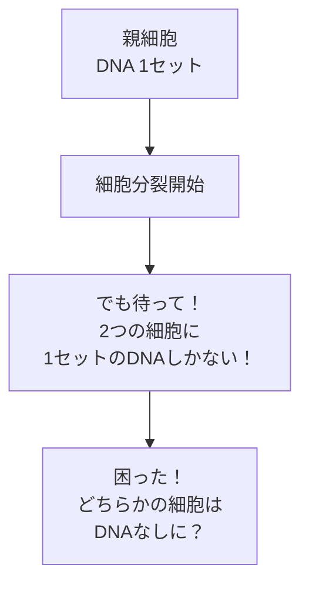
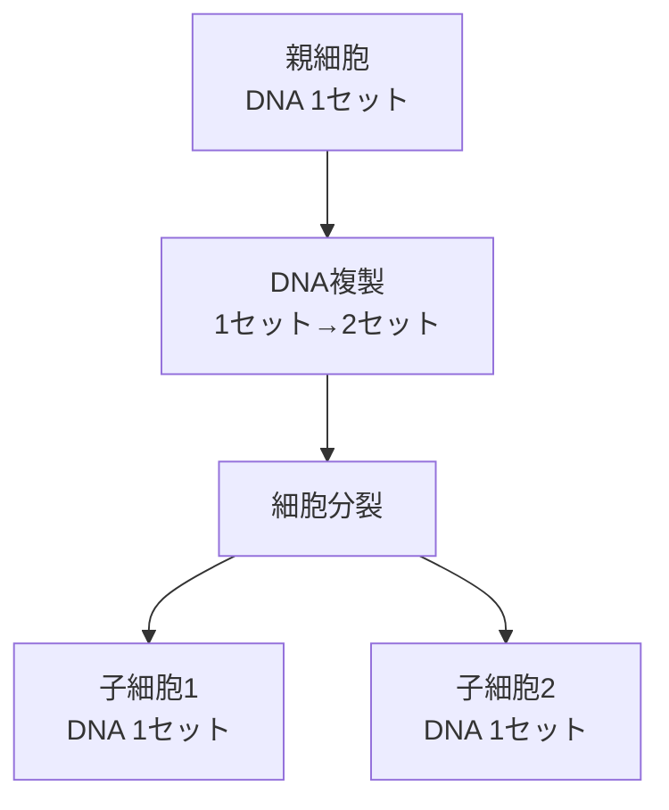
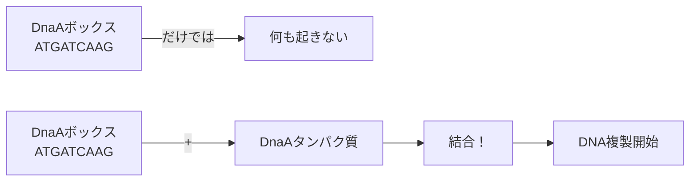
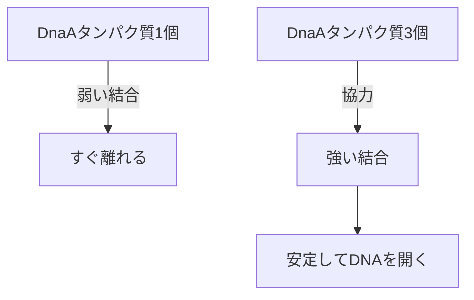
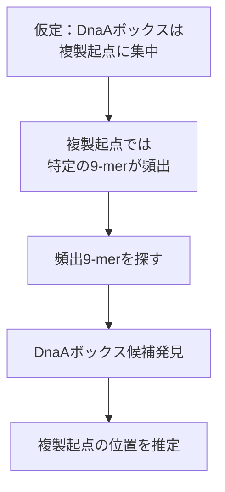

# DNA複製はゲノムのどこで始まるのか（超詳細版）

## 🎯 まず、この講義で何を学ぶのか

最終ゴール：コンピュータを使って、DNA配列の中から「複製が始まる場所」を見つける方法を学びます。

でも、ちょっと待ってください。そもそも...

## 🤔 ステップ0：なぜこの問題が重要なの？

### 理由1：医学への応用

```
もし複製開始位置が分かれば...
↓
その場所を狙って薬を作れる
↓
細菌の増殖を止められる
↓
新しい抗生物質の開発！
```

### 理由2：生命の根本的な仕組みの理解

```
全ての生物は細胞分裂で増える
↓
細胞分裂にはDNAの複製が必要
↓
複製の仕組みを理解 = 生命の根本を理解
```

## 📖 ステップ1：そもそもDNA複製って何？

### 1-1. 細胞分裂を理解しよう

あなたの体は約37兆個の細胞でできています。最初は1個の受精卵でした。

```
1個 → 2個 → 4個 → 8個 → ... → 37兆個
```

ここで疑問：細胞が2個に分かれるとき、DNAはどうなる？

### 1-2. DNAも2倍必要



答え：分裂する前にDNAをコピー（複製）する！



### 1-3. なぜ「どこから」複製が始まるかが重要？

質問：DNAの端から順番にコピーすればいいのでは？

答え：それだと問題があります！

#### 問題1：時間がかかりすぎる

```python
# 人間のDNAの場合
dna_length = 3_000_000_000  # 30億文字
copy_speed = 1000  # 1秒に1000文字コピー

time_needed = dna_length / copy_speed / 3600
print(f"必要な時間：{time_needed}時間")
# 結果：833時間（約35日）！

# 実際は8時間で終わる。なぜ？
# → 複数の場所から同時に複製を始めるから！
```

#### 問題2：エラーが起きやすい

```
端から順番に複製：
開始 ----------------→ 終了
     もしここでエラー → 全部やり直し？

複数箇所から複製：
  →---←  →---←  →---←
  エラーがあっても局所的
```

## 🔍 ステップ2：複製起点（OriC）とは

### 2-1. 複製起点の定義

複製起点（Origin of replication、略してOriC）
= DNA複製が始まる特別な場所

でも、「特別な場所」って何が特別？

### 2-2. なぜ特定の場所でなければならない？

#### アナロジー：本を読むとき

```
ランダムなページから読み始める？
↓
いいえ、普通は1ページ目から
↓
なぜ？
↓
そこが「始まり」だと決まっているから
```

#### DNAも同じ

```
ランダムな場所から複製？
↓
いいえ、決まった場所から
↓
なぜ？
↓
1. 確実に全体をコピーするため
2. 必要なタンパク質を集めやすくするため
3. タイミングを制御するため
```

### 2-3. 複製起点はどんな場所？

重要な事実：複製起点には特別なDNA配列がある

```
普通のDNA：ATCGATCGATCGATCG...（ランダムな配列）
複製起点：...ATGATCAAG...ATGATCAAG...ATGATCAAG...
          ↑同じパターンが繰り返し出現！
```

なぜ繰り返し？：後で詳しく説明します（ステップ4）

## 🧬 ステップ3：DnaAボックスを理解する

### 3-1. DnaAボックスとは

DnaAボックス = 複製起点にある特別な9文字の配列

```
例：ATGATCAAG（9文字）
```

疑問：なぜちょうど9文字？

### 3-2. なぜ9文字なのか

#### 短すぎる場合（例：3文字）

```python
# 3文字の場合
pattern_length = 3
possible_patterns = 4  3  # 64通り

genome_length = 4_600_000  # 大腸菌
expected_occurrences = genome_length / possible_patterns
print(f"3文字パターンの予想出現回数：{expected_occurrences:.0f}回")
# 結果：71,875回 → 多すぎる！偶然でも頻繁に現れる
```

#### 長すぎる場合（例：20文字）

```python
# 20文字の場合
pattern_length = 20
possible_patterns = 4  20  # 約1兆通り

# 問題1：見つかる確率が低すぎる
# 問題2：少し変異しただけで機能しなくなる
```

#### ちょうど良い長さ（9文字）

```python
pattern_length = 9
possible_patterns = 4  9  # 262,144通り

genome_length = 4_600_000
expected_occurrences = genome_length / possible_patterns
print(f"9文字パターンの予想出現回数：{expected_occurrences:.1f}回")
# 結果：17.5回 → 適度にレア！
```

### 3-3. DnaAタンパク質の役割

ここが重要！：DnaAボックスだけでは何も起きません



#### なぜタンパク質が必要？

```
アナロジー：鍵と鍵穴

DnaAボックス = 鍵穴
DnaAタンパク質 = 鍵

鍵穴だけあっても扉は開かない
鍵を差し込んで初めて開く
```

### 3-4. なぜ複数のDnaAボックスが必要？

実験的事実：複製起点には通常3〜4個のDnaAボックスがある

疑問：1個じゃダメなの？

#### 理由1：偶然の防止

```python
# 1個だけの場合
prob_single = 1 / (4  9)  # 1/262,144
# → 偶然でも起こりうる

# 3個が250塩基以内に集まる確率
prob_triple = prob_single  3 * (250 / 4_600_000)  2
# → ほぼ0！偶然では起こらない
```

#### 理由2：協調的な働き



## 🔬 ステップ4：生物学的な実験からの知見

### 4-1. 実験で分かったこと

科学者たちは実験で以下を発見しました：

1. 大腸菌の複製起点：約250塩基対の領域
2. その中に9塩基のパターンが複数存在
3. そのパターンにDnaAタンパク質が結合

### 4-2. でも、他の細菌では？

問題：全ての細菌で実験するのは大変！

```
細菌の種類：数万種
1種類の実験：数ヶ月
全部実験したら：数千年！？
```

解決策：コンピュータで予測しよう！

## 💻 ステップ5：頻出語問題への変換

### 5-1. 生物学の問題をプログラミングの問題に

```
生物学の問題：
「複製起点にDnaAボックスが集まっている」

↓ 言い換え

プログラミングの問題：
「ある領域に特定のパターンが頻繁に出現する」

↓ さらに具体的に

アルゴリズム問題：
「文字列の中で最も頻繁に出現するk文字を見つける」
```

### 5-2. なぜこの変換が妥当か

```
仮定1：DnaAボックスは複製起点に集中している
↓
仮定2：DnaAボックスは9文字のパターン
↓
結論：複製起点では特定の9文字が頻出するはず
```

## 🎯 ステップ6：頻出語問題（Frequent Words Problem）

### 6-1. 問題の正式な定義

入力：

- テキスト（DNA配列）
- 整数k（探すパターンの長さ）

出力：

- 最も頻繁に出現するk文字のパターン全て

### 6-2. 簡単な例で理解

```python
text = "ATAATA"
k = 3

# ステップ1：全ての3文字を抜き出す
# 位置0: ATA
# 位置1: TAA
# 位置2: AAT
# 位置3: ATA

# ステップ2：数える
# ATA: 2回
# TAA: 1回
# AAT: 1回

# ステップ3：最大のものを選ぶ
# 答え：ATA（2回）
```

### 6-3. なぜ全てを調べる必要があるか

疑問：最初に見つかった頻出パターンでいいのでは？

答え：同じ頻度のパターンが複数ある可能性

```python
text = "ATGATGCCCC"
k = 2

# 頻度を数える
# AT: 2回
# TG: 2回
# CC: 2回

# 全て同じ頻度！全部重要かもしれない
```

## 💡 ステップ7：アルゴリズムの実装

### 7-1. 最も単純なアプローチ

```python
def FrequentWords(Text, k):
    """
    最頻出のk-merを全て見つける

    なぜこの方法？：
    1. 確実に全てを調べられる
    2. 理解しやすい
    3. バグが入りにくい
    """
    FrequentPatterns = []  # 結果を入れるリスト
    Count = []  # 各位置での出現回数

    # ステップ1：各位置からのk-merの出現回数を数える
    for i in range(len(Text) - k + 1):
        # なぜ len(Text) - k + 1？
        # 例：Text="ATCG"(4文字), k=2の場合
        # i=0: AT (OK)
        # i=1: TC (OK)
        # i=2: CG (OK)
        # i=3: G? (文字が足りない！)
        # だから i は 0 から 4-2=2 まで（つまり3回）

        Pattern = Text[i:i+k]
        Count.append(PatternCount(Text, Pattern))

    # ステップ2：最大値を見つける
    maxCount = max(Count)

    # ステップ3：最大値と同じ回数のパターンを全て集める
    for i in range(len(Text) - k + 1):
        if Count[i] == maxCount:
            Pattern = Text[i:i+k]
            # 重複を避ける
            if Pattern not in FrequentPatterns:
                FrequentPatterns.append(Pattern)

    return FrequentPatterns
```

### 7-2. PatternCount関数の詳細

```python
def PatternCount(Text, Pattern):
    """
    TextにPatternが何回出現するか数える

    なぜ必要？：
    FrequentWords内で各パターンの出現回数を知る必要がある
    """
    count = 0
    k = len(Pattern)

    # 全ての位置でチェック
    for i in range(len(Text) - k + 1):
        # Text[i:i+k]とPatternが同じか確認
        if Text[i:i+k] == Pattern:
            count += 1
            # なぜcontinue不要？
            # 重複を許すから
            # 例："AAA"の中で"AA"を探す
            # 位置0: AA ✓
            # 位置1: AA ✓ （重複OK）

    return count
```

## 🧪 ステップ8：実例で確認

### 8-1. コレラ菌での検証

```python
# コレラ菌の複製起点領域（一部）
vibrio_cholerae_oriC = """
ATCAATGATCAACGTAAGCTTCTAAGCATGATCAAGGTGCTCACACAGTTTATCCACAAC
CTGAGTGGATGACATCAAGATAGGTCGTTGTATCTCCTTCCTCTCGTACTCTCATGACCA
CGGAAAGATGATCAAGAGAGGATGATTTCTTGGCCATATCGCAATGAATACTTGTGACTT
GTGCTTCCAATTGACATCTTCAGCGCCATATTGCGCTGGCCAAGGTGACGGAGCGGGATT
ACGAAAGCATGATCATGGCTGTTGTTCTGTTTATCTTGTTTTGACTGAGACTTGTTAGGA
TAGACGGTTTTTCATCACTGACTAGCCAAAGCCTTACTCTGCCTGACATCGACCGTAAAT
TGATAATGAATTTACATGCTTCCGCGACGATTTACCTCTTGATCATCGATCCGATTGAAG
ATCTTCAATTGTTAATTCTCTTGCCTCGACTCATAGCCATGATGAGCTCTTGATCATGTT
TCCTTAACCCTCTATTTTTTACGGAAGAATGATCAAGCTGCTGCTCTTGATCATCGTTTC
"""

# 9文字のパターンを探す（DnaAボックスの長さ）
result = FrequentWords(vibrio_cholerae_oriC.replace('\n', ''), 9)
print(f"見つかったパターン：{result}")
# 結果：['ATGATCAAG', 'CTCTTGATC', 'TCTTGATCA', 'CTTGATCAT']
```

### 8-2. 結果の解釈

```
見つかったパターン：
1. ATGATCAAG
2. CTCTTGATC
3. TCTTGATCA
4. CTTGATCAT

あれ？全部違うパターン？
↓
よく見ると...
↓
CTCTTGATC
 TCTTGATCA
  CTTGATCAT
↑ずれているだけで、ほぼ同じ！

これは CTTGATCAT が連続している証拠
```

## 🤔 ステップ9：なぜこの方法で見つかるのか

### 9-1. 頻度の意味

```
ランダムな配列での9文字の出現期待値：
4,600,000 ÷ 262,144 ≈ 17.5回

実際にDnaAボックスが出現する回数：
3〜4回（でも狭い領域に集中）

500塩基の領域で考えると：
期待値：500 ÷ 262,144 ≈ 0.002回
実際：3〜4回

1500倍以上の濃縮！
```

### 9-2. アルゴリズムの妥当性



## 📊 ステップ10：計算量の分析

### 10-1. 時間計算量

```python
def analyze_time_complexity(n, k):
    """
    n: テキストの長さ
    k: パターンの長さ
    """
    # FrequentWords の処理
    positions = n - k + 1  # 調べる位置の数

    # 各位置でPatternCountを呼ぶ
    # PatternCount: O(n)
    # それを positions 回
    total = positions * n

    print(f"概算：O(n²)")
    print(f"n=500の場合：{5002:,} ステップ")
    print(f"n=4,600,000の場合：{4_600_0002:,} ステップ")
```

### 10-2. なぜ効率が悪くても最初はOK？

```
理由1：正確性が最優先
- まず正しく動くものを作る
- 後で高速化

理由2：理解しやすさ
- 複雑な最適化は後回し
- アルゴリズムの本質を理解

理由3：小さいデータでは十分速い
- 500塩基程度なら一瞬
```

## 🎓 まとめ：何を学んだか

### レベル1：生物学的理解

```
DNA複製は特定の場所（複製起点）から始まる
↓
複製起点にはDnaAボックスという特別な配列がある
↓
DnaAボックスは9文字で、複数集まっている
```

### レベル2：問題の変換

```
生物学の問題：DnaAボックスを見つけたい
↓
情報科学の問題：頻出パターンを見つけたい
↓
アルゴリズム：頻出語問題
```

### レベル3：実装の理解

```
1. 全ての k-mer を抽出
2. それぞれの出現回数を数える
3. 最大のものを選ぶ
```

## 🚀 次のステップへの準備

次回学ぶこと：

1. 逆相補鎖の考慮（なぜ必要？）
2. より大きな範囲での探索（塊探し問題）
3. 実際のゲノムでの challenges

準備のための質問：

- なぜ単純な頻出語探索だけでは不十分？
- どんな生物学的な要因を見落としている？

これらの答えは次回の講義で！
