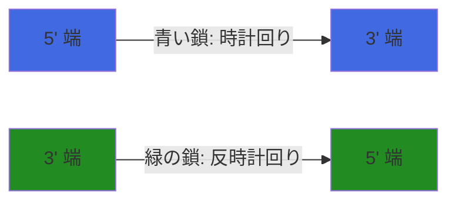
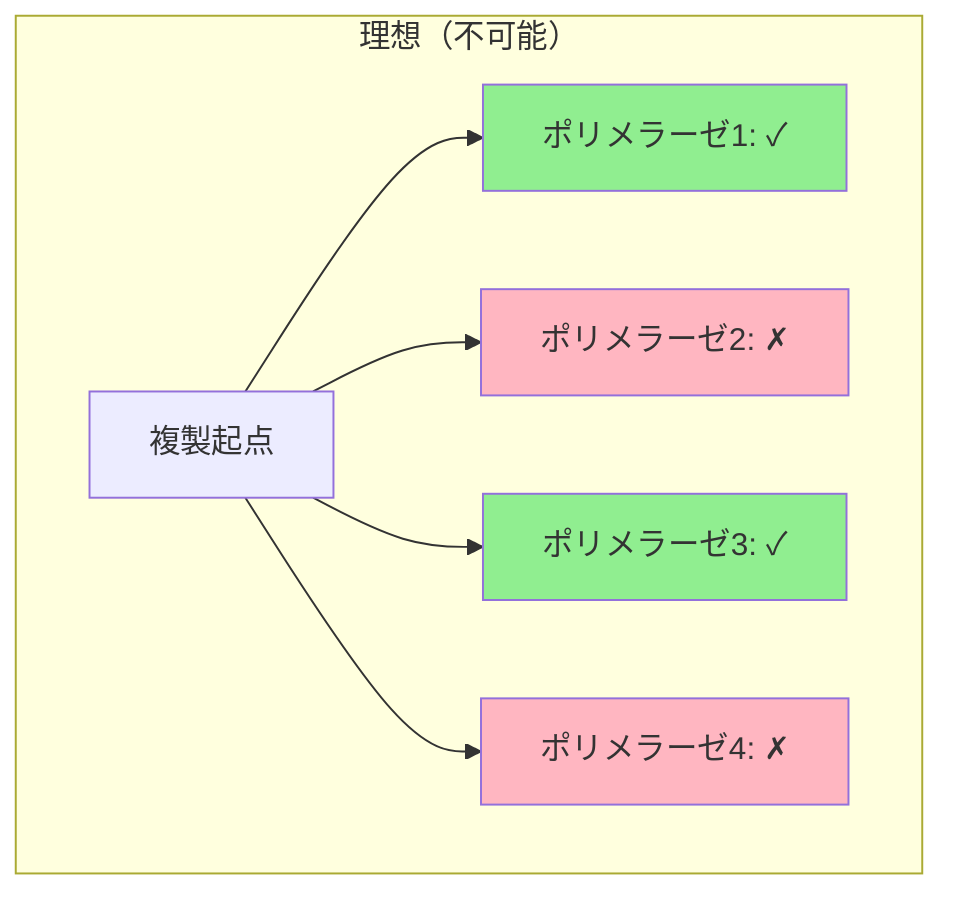
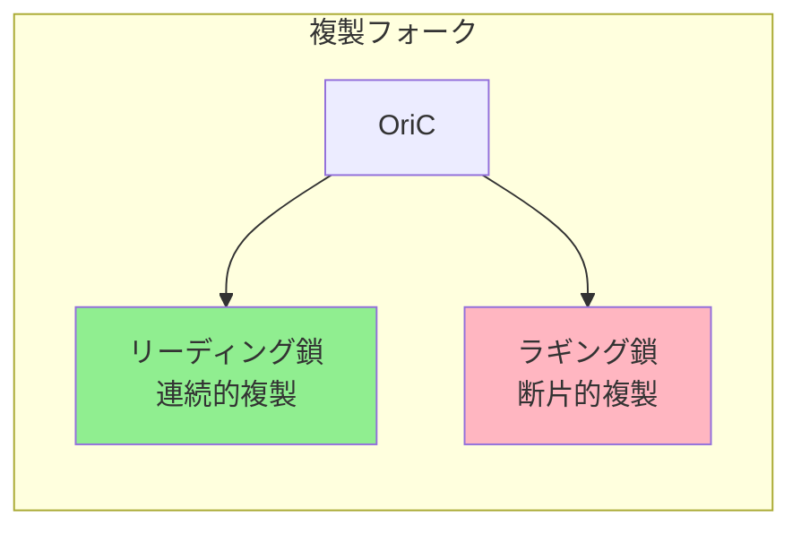
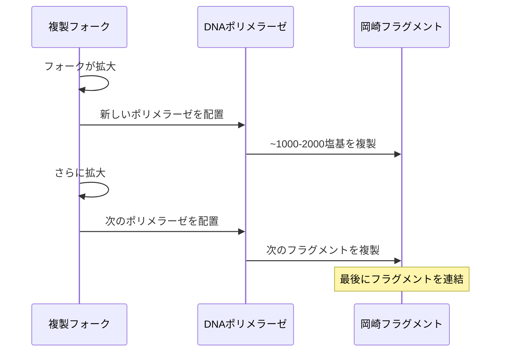
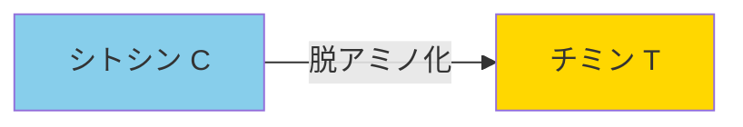
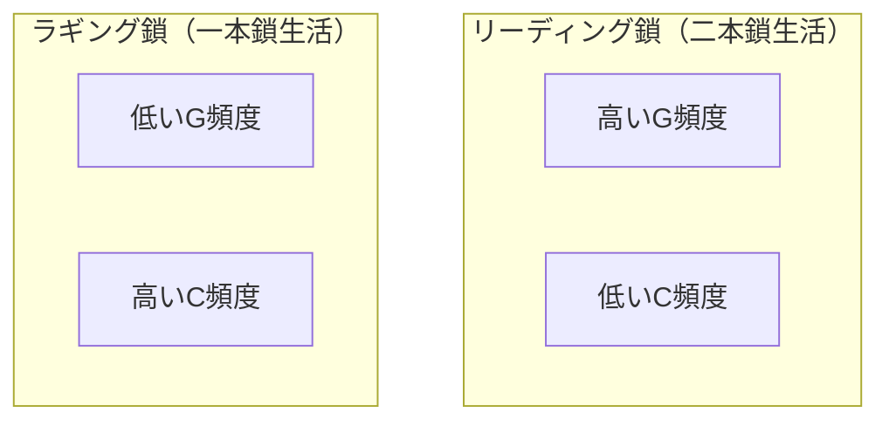
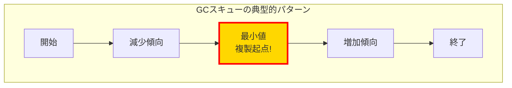
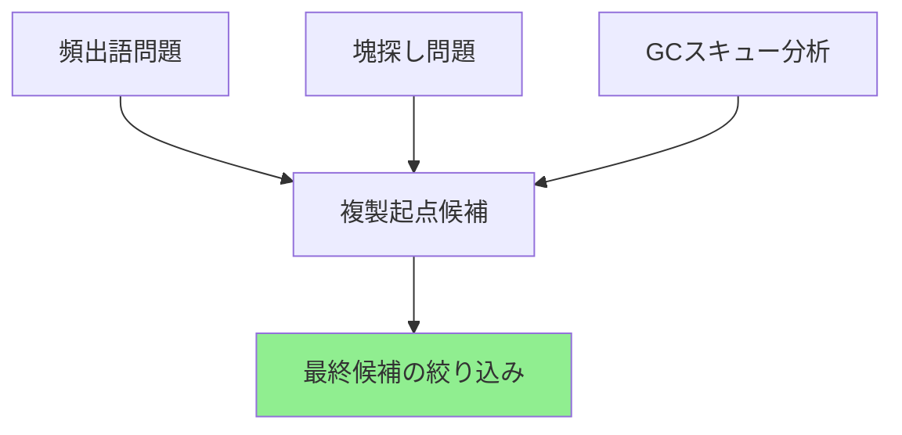

# DNA複製はゲノムのどこで始まるのか（その3：GCスキュー）

## 🎯 学習目標

この講義では、以下について学びます：

- DNA複製の非対称性
- DNAポリメラーゼの一方向性
- リーディング鎖とラギング鎖の違い
- 岡崎フラグメント
- 突然変異率とヌクレオチド頻度の関係
- GCスキュー（G-C skew）による複製起点の特定

## 🧬 DNA複製の非対称性

### なぜ前回のアプローチは不十分だったか

前回、塊探し問題で約2,000個の候補が見つかりました。
この状況を打開するには、生物学的な知識をさらに活用する必要があります。

### DNAの方向性



重要な事実：

- DNA鎖には方向性がある（5'→3'）
- 2本の鎖は反対方向に走っている（逆並行）

## 🔬 DNAポリメラーゼの制約

### 一方向性の問題

もしあなたがDNAポリメラーゼだったら？

理想的なシナリオ（しかし間違い）：

1. DNAがほどける
2. 4つのDNAポリメラーゼを配置
3. 両方向に複製を進める

なぜこれは不可能か？

> DNAポリメラーゼは一方向性：DNAの方向とは逆方向（3'→5'）にしか読めない



## 🧩 リーディング鎖とラギング鎖

### DNA鎖の分類



### リーディング鎖（逆半鎖）

- 連続的な複製が可能
- 1つのDNAポリメラーゼで複製
- 常に二本鎖状態を維持

### ラギング鎖（前半鎖）

- 断片的な複製が必要
- 多数のDNAポリメラーゼが必要
- 長時間一本鎖状態で存在

## 🔄 岡崎フラグメント

### ラギング鎖の複製メカニズム



岡崎フラグメント：

- ラギング鎖で形成される短いDNA断片
- 各フラグメントは約1000-2000塩基
- 後でDNAリガーゼによって連結される

## 💔 突然変異率の違い

### 一本鎖DNAと二本鎖DNAの違い

| 状態      | 突然変異率 | 理由             |
| --------- | ---------- | ---------------- |
| 二本鎖DNA | 低い       | 相補鎖による保護 |
| 一本鎖DNA | 100倍高い  | 化学的に不安定   |

### シトシンの脱アミノ化



重要な事実：

- シトシン（C）は自然に脱アミノ化してチミン（T）に変異
- 一本鎖DNAでは変異率が100倍上昇

## 📊 ヌクレオチド頻度への影響

### 鎖による偏り



理由：

- ラギング鎖：長時間一本鎖 → Cが多くTに変異 → C減少
- リーディング鎖：常に二本鎖 → 相補鎖のCがTに変異 → G減少

## 📈 GCスキュー（G-C Skew）

### 定義

GCスキュー = #G - #C（Gの数 - Cの数）

### ゲノムに沿った変化

```python
def calculate_gc_skew(genome):
    """
    ゲノムに沿ったGCスキューを計算

    Args:
        genome: DNA配列

    Returns:
        各位置でのGCスキュー値のリスト
    """
    skew = [0]  # 開始位置のスキューは0

    for nucleotide in genome:
        if nucleotide == 'G':
            skew.append(skew[-1] + 1)
        elif nucleotide == 'C':
            skew.append(skew[-1] - 1)
        else:
            # AまたはTの場合は変化なし
            skew.append(skew[-1])

    return skew
```

### スキューパターンと複製起点



## 🎯 複製起点の特定

### アルゴリズムのアイデア

1. ゲノム全体のGCスキューを計算
2. スキューが最小となる位置を見つける
3. その位置が複製起点の候補

```python
def find_minimum_skew(genome):
    """
    GCスキューが最小となる位置を見つける

    Args:
        genome: DNA配列

    Returns:
        最小スキューの位置のリスト
    """
    skew = calculate_gc_skew(genome)
    min_skew = min(skew)

    # 最小値を持つすべての位置を返す
    positions = []
    for i, value in enumerate(skew):
        if value == min_skew:
            positions.append(i)

    return positions
```

## 🚀 統合的アプローチ

### 複数の手法を組み合わせる



### 実装例

```python
def find_ori_integrated(genome, k=9, L=500, t=3):
    """
    複数の手法を統合して複製起点を探す

    Args:
        genome: ゲノム配列
        k: k-merの長さ
        L: ウィンドウサイズ
        t: 最小出現回数

    Returns:
        複製起点の候補位置
    """
    # 1. GCスキューで大まかな位置を特定
    skew_minima = find_minimum_skew(genome)

    # 2. スキュー最小値周辺で塊を探す
    candidates = []
    for position in skew_minima:
        start = max(0, position - L//2)
        end = min(len(genome), position + L//2)
        window = genome[start:end]

        # 3. 頻出語を探す
        frequent_patterns = FrequentWords(window, k)

        # 4. 条件を満たすパターンを収集
        for pattern in frequent_patterns:
            if PatternCount(window, pattern) >= t:
                candidates.append({
                    'position': position,
                    'pattern': pattern,
                    'count': PatternCount(window, pattern)
                })

    return candidates
```

## 🤔 なぜコンピュータ科学者が気にすべきか

### 生物学的知識の重要性

1. 単純なアルゴリズムの限界
   - 頻出語問題だけでは候補が多すぎる
   - 生物学的制約を理解することで効率的な解法が可能

2. データの背後にある原理
   - DNA複製の非対称性がデータパターンを生む
   - 原理を理解することでより良いアルゴリズムを設計

3. 学際的アプローチの価値
   - 生物学 + 統計学 + アルゴリズム = 強力な解法
   - 実世界の問題解決には複数の視点が必要

## 📊 まとめ

1. DNA複製は非対称的プロセス
   - リーディング鎖とラギング鎖で複製メカニズムが異なる

2. 突然変異率の違いがパターンを生む
   - 一本鎖DNAでの高い変異率
   - GCスキューという観測可能なパターン

3. GCスキューは複製起点の強力な指標
   - スキューの最小値が複製起点を示唆
   - 他の手法と組み合わせることで精度向上

## 🚀 次のステップ

- [GCスキュー分析の詳細](../../algorithms/gc-skew)

## 📚 参考文献

- Lobry, J.R. (1996) "Asymmetric substitution patterns in the two DNA strands of bacteria"
- Frank, A.C. & Lobry, J.R. (1999) "Asymmetric substitution patterns: a review of possible underlying mutational or selective mechanisms"
- [Rosalind - Computing GC Content](http://rosalind.info/problems/gc/)
