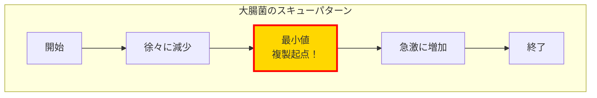
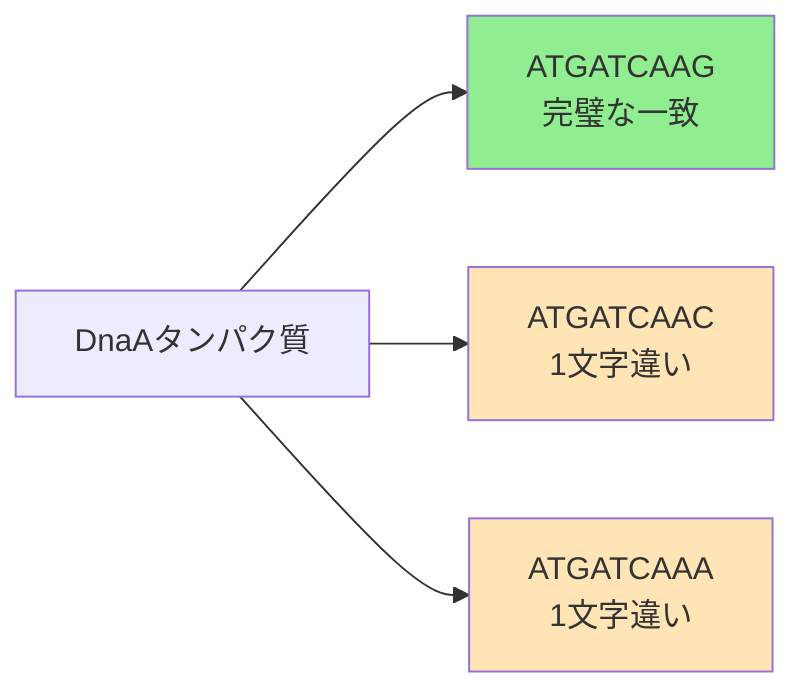
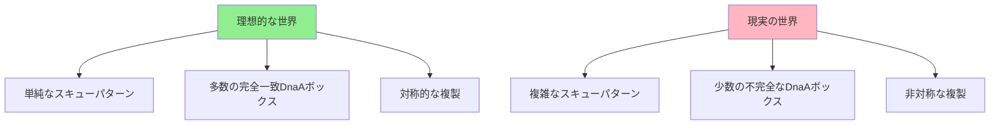

# DNA複製はゲノムのどこで始まるのか（その4：実践と課題）

## 🎯 学習目標

この講義では、以下について学びます：

- GCスキューの数学的定義
- 大腸菌ゲノムでの実践
- 理論と現実のギャップ
- ミスマッチを許容する頻出語問題
- 実際のゲノム解析の複雑性

## 📐 GCスキューの数学的フレームワーク

### 正式な定義

```
Skew(k) = #G[0:k] - #C[0:k]
```

ここで：

- `k`：ゲノム内の位置
- `#G[0:k]`：位置0からkまでのグアニン（G）の個数
- `#C[0:k]`：位置0からkまでのシトシン（C）の個数

### スキューダイアグラム

スキューダイアグラムは、Skew(k)をkに対してプロットしたグラフです。

```python
def plot_skew_diagram(genome):
    """
    ゲノムのスキューダイアグラムを描画

    Args:
        genome: DNA配列

    Returns:
        スキュー値のリストとグラフ
    """
    skew = [0]

    for nucleotide in genome:
        if nucleotide == 'G':
            skew.append(skew[-1] + 1)
        elif nucleotide == 'C':
            skew.append(skew[-1] - 1)
        else:
            skew.append(skew[-1])

    # グラフを描画
    import matplotlib.pyplot as plt
    plt.figure(figsize=(12, 6))
    plt.plot(range(len(skew)), skew)
    plt.xlabel('ゲノム位置')
    plt.ylabel('GCスキュー')
    plt.title('スキューダイアグラム')
    plt.grid(True)
    plt.show()

    return skew
```

## 🔬 大腸菌ゲノムでの実践

### スキューダイアグラムの観察

大腸菌（E. coli）のゲノムでスキューダイアグラムを作成すると、美しいパターンが現れます：



### 複製起点の特定

スキューが：

1. **減少していた**後に
2. **急激に増加し始める**

この転換点が複製起点（OriC）です！

## 😔 理論と現実のギャップ

### 予想外の結果

大腸菌の複製起点を特定した後、その領域で頻出語を探すと...

> **驚きの結果**：3回以上出現する頻出語が存在しない！

```python
def analyze_ecoli_ori(ori_region, k=9):
    """
    大腸菌の複製起点領域を分析

    Args:
        ori_region: 複製起点周辺の配列
        k: k-merの長さ

    Returns:
        頻出語とその出現回数
    """
    pattern_count = {}

    for i in range(len(ori_region) - k + 1):
        pattern = ori_region[i:i+k]
        pattern_count[pattern] = pattern_count.get(pattern, 0) + 1

    # 3回以上出現するパターンを探す
    frequent = {p: c for p, c in pattern_count.items() if c >= 3}

    if not frequent:
        print("頻出語が見つかりません！")

    return frequent
```

## 🤔 なぜ失敗したのか？

### 可能性1：位置の不正確さ

スキューダイアグラムが示す位置が、実際の複製起点と完全に一致しない可能性：

- スキュー最小値は「おおよその」位置
- 実際の複製起点は近傍にある

### 可能性2：隠れたメッセージの複雑性

DnaAボックスが私たちが想定していたより「とらえどころがない」可能性：

- 完全一致する頻出語だけでは不十分
- より微妙なパターンが存在

## 💡 新たな発見：ミスマッチの重要性

### コレラ菌での観察

コレラ菌の複製起点を再度詳しく観察すると：

```
標準的なDnaAボックス: ATGATCAAG (6回出現)

追加で発見されたパターン:
- ATGATCAAC (1文字違い)
- ATGATCAAA (1文字違い)
```

### 重要な洞察

> DnaAタンパク質は完璧なDnaAボックスだけでなく、わずかに異なるバリエーションにも結合できる！



## 🔧 ミスマッチを許容する頻出語問題

### 問題定義

**入力**：

- テキスト（DNA配列）
- 整数k（k-merの長さ）
- 整数d（許容するミスマッチ数）

**出力**：

- 最大d個のミスマッチで最も頻繁に出現するk-mer

### アルゴリズムの概要

```python
def frequent_words_with_mismatches(text, k, d):
    """
    ミスマッチを許容する頻出語を見つける

    Args:
        text: DNA配列
        k: k-merの長さ
        d: 許容するミスマッチ数

    Returns:
        最頻出のk-merのリスト
    """
    patterns = []
    freq_map = {}

    # すべての可能なk-merを生成
    for i in range(len(text) - k + 1):
        pattern = text[i:i+k]
        neighborhood = generate_neighborhood(pattern, d)

        for neighbor in neighborhood:
            if neighbor not in freq_map:
                freq_map[neighbor] = 0
            freq_map[neighbor] += 1

    # 最大頻度を見つける
    max_count = max(freq_map.values())

    # 最大頻度を持つパターンを収集
    for pattern, count in freq_map.items():
        if count == max_count:
            patterns.append(pattern)

    return patterns

def generate_neighborhood(pattern, d):
    """
    パターンのd-neighborhoodを生成

    Args:
        pattern: 元のパターン
        d: 許容するミスマッチ数

    Returns:
        d個以下のミスマッチを持つすべてのパターン
    """
    if d == 0:
        return [pattern]
    if len(pattern) == 1:
        return ['A', 'C', 'G', 'T']

    neighborhood = []
    suffix_neighbors = generate_neighborhood(pattern[1:], d)

    for text in suffix_neighbors:
        if hamming_distance(pattern[1:], text) < d:
            for nucleotide in ['A', 'C', 'G', 'T']:
                neighborhood.append(nucleotide + text)
        else:
            neighborhood.append(pattern[0] + text)

    return neighborhood

def hamming_distance(p, q):
    """ハミング距離を計算"""
    return sum(1 for i in range(len(p)) if p[i] != q[i])
```

## 🎉 大腸菌での成功

### ミスマッチを考慮した結果

ミスマッチを許容する頻出語問題を大腸菌ゲノムに適用すると：

```python
# 大腸菌の複製起点周辺で実行
result = frequent_words_with_mismatches(ecoli_ori_region, k=9, d=1)

# 結果：とらえどころのない頻出語が発見された！
# これらが実際のDnaAボックスであることが判明
```

## ⚠️ 現実世界の複雑性

### 残された課題

1. **DnaAボックスが少ない細菌**
   - 一部の細菌では頻出語アルゴリズムでは見つけられない
   - より洗練された手法が必要

2. **複製終端の位置**
   - 複製起点の真向かいにないことが多い
   - ゲノム構造がより複雑

3. **複雑なスキューダイアグラム**
   - 大腸菌のような単純なパターンは稀
   - 複数の要因が影響



## 🚀 今後の方向性

### より高度なアプローチ

1. **機械学習の活用**
   - パターン認識の改善
   - 複雑な特徴の統合

2. **比較ゲノミクス**
   - 複数の種を比較
   - 進化的に保存された領域の特定

3. **実験データとの統合**
   - ChIP-seqデータの活用
   - 生化学的知見の組み込み

## 📊 まとめ

1. **GCスキューは強力なツール**
   - 大腸菌では美しく機能
   - 複製起点の大まかな位置を特定

2. **完全一致だけでは不十分**
   - ミスマッチを許容する必要性
   - 生物学的な柔軟性を反映

3. **理論と実践のギャップ**
   - 理想的なモデルと現実の違い
   - より洗練されたアプローチの必要性

4. **継続的な改善**
   - アルゴリズムの改良
   - 新しい生物学的知見の統合

## 🚀 次のステップ

- [ミスマッチ頻出語問題の詳細](../../algorithms/frequent-words-mismatches)
- [実際のゲノム解析](../week2/real-genome-analysis)
- [高度な複製起点予測](../../algorithms/advanced-ori-prediction)

## 📚 参考文献

- Mackiewicz, P., et al. (1999) "Where does bacterial replication start?"
- Freeman, J.M., et al. (1998) "Patterns of genome organization in bacteria"
- [Rosalind - Frequent Words with Mismatches](http://rosalind.info/problems/ba1i/)
