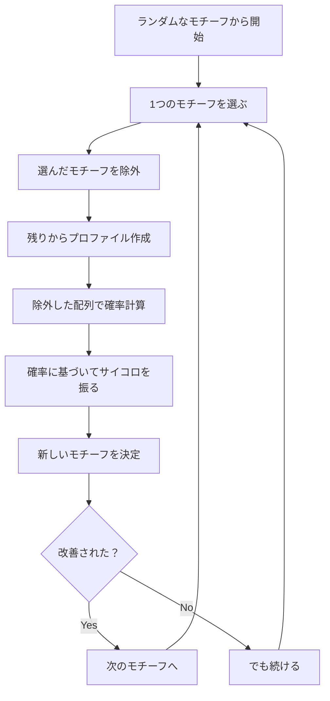

# ギブスサンプラー（超詳細版）- より賢いサイコロの振り方

## 🎯 まず、この講義で何を学ぶのか

最終ゴール：前回よりも**もっと賢く**サイコロを振って、より確実にDNAモチーフを見つける方法を学びます。

でも、ちょっと待ってください。そもそも..。

## 🤔 ステップ0：なぜまた新しいアルゴリズムが必要なの？

### 前回のランダム化モチーフ探索の問題

```
前回の方法：
「全部一度に変える」

例えるなら：
引っ越しで全部の家具を一度に動かす
→ 大胆だけど、良い配置を壊す可能性も

実際の問題：
正解に近づいていたのに...
↓
全部変えたら
↓
正解から遠ざかった！（もったいない！）
```

### ギブスサンプラーの発想

```
新しい方法：
「1つずつ慎重に変える」

例えるなら：
家具を1つずつ動かして様子を見る
→ 慎重だけど、確実に改善

メリット：
良い部分を保ちながら
↓
悪い部分だけ改善
↓
着実に正解に近づく！
```

## 📖 ステップ1：二つのアプローチの違いを理解する

### 1-1. ランダム化モチーフ探索（前回）の動き

```python
# 前回の方法：全部一度に更新
def random_motif_search_recap():
    """
    無謀だが速い
    """
    motifs = [
        "ATGC",  # 配列1のモチーフ
        "CCGG",  # 配列2のモチーフ
        "TATA",  # 配列3のモチーフ
        "GGCC"   # 配列4のモチーフ
    ]

    # 全部一度に変更！
    new_motifs = [
        "CGTA",  # 全部変わった
        "ATAT",  # 全部変わった
        "GCGC",  # 全部変わった
        "TTAA"   # 全部変わった
    ]

    # 問題：良かった部分も失われる可能性
```

### 1-2. ギブスサンプラーの動き

```python
# 今回の方法：1つずつ更新
def gibbs_sampler_recap():
    """
    慎重だが確実
    """
    motifs = [
        "ATGC",  # 配列1のモチーフ
        "CCGG",  # 配列2のモチーフ
        "TATA",  # 配列3のモチーフ ← これだけ変える
        "GGCC"   # 配列4のモチーフ
    ]

    # 1つだけ変更！
    new_motifs = [
        "ATGC",  # そのまま
        "CCGG",  # そのまま
        "GCTA",  # ここだけ変わった
        "GGCC"   # そのまま
    ]

    # メリット：良い部分は保持される
```

### 1-3. なぜ1つずつがいいの？

日常生活の例で考えてみましょう：

```
料理の味付けを調整するとき：

方法1（前回のアプローチ）：
塩、砂糖、醤油、酢を全部一度に変える
→ どれが良くてどれが悪いか分からない

方法2（ギブスサンプラー）：
塩だけ変えて味見
→ 塩の効果が分かる
→ 次に砂糖だけ変えて味見
→ 各調味料の最適量が分かる
```

## 🎲 ステップ2：ギブスサンプラーの基本的な流れ

### 2-1. アルゴリズムの全体像



### 2-2. なぜ「除外」するの？

ここが重要なポイントです！

```
疑問：なぜわざわざ1つを除外？

答え：自分自身の影響を除くため

例：クラスの平均身長を計算
自分も含めた平均 → 自分の身長が平均に影響
自分を除いた平均 → 純粋な「他の人たち」の傾向

モチーフ探索でも同じ：
自分を含むプロファイル → 自分に引っ張られる
自分を除くプロファイル → 他の配列の真の傾向が見える
```

## 🔍 ステップ3：具体例で動きを追ってみよう

### 3-1. 初期状態の設定

```python
# 4つの配列（埋め込みモチーフ：ACGT with 1変異）
sequences = [
    "TTACGTAA",  # 位置2にACGT
    "GGACGCTT",  # 位置2にACGC（1変異）
    "CCACGTGG",  # 位置2にACGT
    "AAACGTCC"   # 位置2にACGT
]

# ランダムに選んだ初期モチーフ（ほとんど外れ）
current_motifs = [
    "TTAC",  # 配列1（間違い）
    "GGAC",  # 配列2（間違い）
    "CCAC",  # 配列3（間違い）← これを更新する
    "ACGT"   # 配列4（偶然正解！）
]
```

### 3-2. ステップ1：3番目のモチーフを除外

```python
# 3番目を除いた残りのモチーフ
remaining_motifs = [
    "TTAC",
    "GGAC",
    # "CCAC", ← 除外！
    "ACGT"
]

# なぜ除外するか再確認：
# 3番目の配列に最適なモチーフを
# 「他の配列の傾向」から見つけたい
```

### 3-3. ステップ2：残りからプロファイル作成

```python
def create_profile_from_remaining():
    """
    3つのモチーフからプロファイルを作る
    """
    # 位置0: T, G, A → T:1/3, G:1/3, A:1/3, C:0
    # 位置1: T, G, C → T:1/3, G:1/3, C:1/3, A:0
    # 位置2: A, A, G → A:2/3, G:1/3, C:0, T:0
    # 位置3: C, C, T → C:2/3, T:1/3, A:0, G:0

    profile = {
        #     位置0   位置1   位置2   位置3
        'A': [0.33,  0.00,  0.67,  0.00],
        'C': [0.00,  0.33,  0.00,  0.67],
        'G': [0.33,  0.33,  0.33,  0.00],
        'T': [0.33,  0.33,  0.00,  0.33]
    }

    return profile
```

### 3-4. ステップ3：除外した配列の全k-merの確率計算

```python
sequence_3 = "CCACGTGG"
k = 4

# 各位置のk-merとその確率
candidates = []

for i in range(len(sequence_3) - k + 1):
    kmer = sequence_3[i:i+k]

    # プロファイルに基づく確率
    probability = 1.0
    for j, nucleotide in enumerate(kmer):
        probability *= profile[nucleotide][j]

    candidates.append((i, kmer, probability))

# 結果：
# 位置0: "CCAC" → 0 × 0.33 × 0.67 × 0.67 = 0
# 位置1: "CACG" → 0 × 0 × 0 × 0 = 0
# 位置2: "ACGT" → 0.33 × 0.33 × 0.33 × 0.33 = 0.012
# 位置3: "CGTG" → 0 × 0.33 × 0 × 0 = 0
# 位置4: "GTGG" → 0.33 × 0.33 × 0.33 × 0 = 0
```

## 😱 ステップ4：問題発生！ ゼロ確率の罠

### 4-1. 何が起きた？

```
5つの候補のうち4つが確率ゼロ！

なぜ？
→ プロファイルにない文字があると
→ 掛け算でゼロになる
→ その候補は絶対選ばれない

でも待って...
位置2の"ACGT"が正解なのに確率0.012しかない
他は全部ゼロ...

これじゃ1択じゃないか！
```

### 4-2. 1面サイコロの問題

```python
# 確率に基づいてサイコロを作ると...
dice_probabilities = [
    0,      # 位置0
    0,      # 位置1
    0.012,  # 位置2
    0,      # 位置3
    0       # 位置4
]

# 正規化すると
normalized = [0, 0, 1.0, 0, 0]

# これは実質的に「必ず位置2を選ぶ」
# = サイコロを振る意味がない！
```

## 🏛️ ステップ5：クロムウェルの法則 - 歴史からの教訓

### 5-1. オリバー・クロムウェルの言葉

```
17世紀、イングランドの政治家クロムウェル：

「キリストの御心において、
あなたが間違っている可能性を考えてください」

彼の意味：
絶対に正しい（確率1）
絶対に間違い（確率0）
→ そんなことは言い切れない！
```

### 5-2. 統計学での応用

```
クロムウェルの法則：
確率0と1は避けるべき

理由：
確率0 → その選択肢は永遠に選ばれない
確率1 → 他の選択肢は永遠に選ばれない

でも現実は：
- 明日太陽が昇らない：ほぼ0だが完全に0ではない
- コインが表：ほぼ0.5だが完全に0.5ではない
```

## 💡 ステップ6：擬似カウント - ゼロ確率を回避する技

### 6-1. 擬似カウントとは？

```python
def add_pseudocount(motifs):
    """
    各カウントに小さな値を足す
    """
    # 元のカウント
    counts = {
        'A': [0, 0, 2, 0],  # 位置ごとのAの数
        'C': [0, 1, 0, 2],
        'G': [1, 1, 1, 0],
        'T': [1, 1, 0, 1]
    }

    # 擬似カウント（+1）を追加
    pseudocounts = {
        'A': [1, 1, 3, 1],  # 全てに+1
        'C': [1, 2, 1, 3],
        'G': [2, 2, 2, 1],
        'T': [2, 2, 1, 2]
    }

    # 確率に変換（合計=7になる）
    profile_with_pseudo = {
        'A': [1/7, 1/7, 3/7, 1/7],
        'C': [1/7, 2/7, 1/7, 3/7],
        'G': [2/7, 2/7, 2/7, 1/7],
        'T': [2/7, 2/7, 1/7, 2/7]
    }

    return profile_with_pseudo
```

### 6-2. なぜこれで解決？

```
擬似カウント前：
"CCAC"の確率 = 0 × 0.33 × 0.67 × 0.67 = 0（選ばれない）

擬似カウント後：
"CCAC"の確率 = 0.14 × 0.14 × 0.14 × 0.43 = 0.0012（小さいが可能性あり）

効果：
- ゼロ確率がなくなる
- すべての候補に可能性が残る
- でも元の傾向は保たれる
```

## 🎰 ステップ7：重み付きサイコロの作り方

### 7-1. 確率からサイコロへ

```python
def create_weighted_dice(probabilities):
    """
    確率に基づいて重み付きサイコロを作る
    """
    # 5つの候補とその確率（擬似カウント適用後）
    candidates = [
        ("CCAC", 0.0012),  # 位置0
        ("CACG", 0.0008),  # 位置1
        ("ACGT", 0.0089),  # 位置2（最も高い）
        ("CGTG", 0.0023),  # 位置3
        ("GTGG", 0.0015)   # 位置4
    ]

    # 累積確率を計算
    total = sum(p for _, p in candidates)
    cumulative = []
    cum_sum = 0

    for kmer, prob in candidates:
        cum_sum += prob / total
        cumulative.append((kmer, cum_sum))

    return cumulative

# サイコロを振る
import random

def roll_weighted_dice(cumulative):
    roll = random.random()  # 0〜1の乱数

    for kmer, cum_prob in cumulative:
        if roll <= cum_prob:
            return kmer

    return cumulative[-1][0]  # 念のため
```

### 7-2. なぜ重み付きサイコロ？

```
普通のサイコロ：
各面が出る確率 = 1/6（均等）

重み付きサイコロ：
各面が出る確率 = データに基づく

メリット：
- 良い候補は選ばれやすい
- でも悪い候補にもチャンスがある
- 探索の多様性を保つ
```

## 🔄 ステップ8：完全なギブスサンプラーの実装

### 8-1. アルゴリズム全体

```python
def gibbs_sampler(dna, k, t, N=1000):
    """
    ギブスサンプラーでモチーフを探す

    パラメータ：
    - dna: DNA配列のリスト
    - k: モチーフの長さ
    - t: 配列の数
    - N: 繰り返し回数
    """
    # ランダムな初期モチーフ
    motifs = random_motifs(dna, k)
    best_motifs = motifs.copy()

    for iteration in range(N):
        # ランダムに更新する配列を選ぶ
        i = random.randint(0, t-1)

        # その配列のモチーフを除外
        profile = profile_with_pseudocount(motifs[:i] + motifs[i+1:])

        # 確率を計算
        probabilities = []
        for j in range(len(dna[i]) - k + 1):
            kmer = dna[i][j:j+k]
            prob = calculate_probability(kmer, profile)
            probabilities.append(prob)

        # 重み付きサイコロで新しい位置を選ぶ
        new_position = weighted_random_choice(probabilities)
        motifs[i] = dna[i][new_position:new_position+k]

        # 最良のモチーフを更新
        if score(motifs) < score(best_motifs):
            best_motifs = motifs.copy()

    return best_motifs
```

### 8-2. なぜN回繰り返す？

```
1回だけ：局所的な改善のみ
100回：かなり良い解に到達
1000回：ほぼ最適解に収束
10000回：さらに確実（でも時間がかかる）

トレードオフ：
精度 vs 計算時間
```

## 📊 ステップ9：ランダム化モチーフ探索との比較

### 9-1. 収束の速さ

```python
def compare_convergence():
    """
    2つのアルゴリズムの収束を比較
    """
    iterations = range(100)

    # ランダム化モチーフ探索
    random_scores = []
    # 大きく振動（良くなったり悪くなったり）

    # ギブスサンプラー
    gibbs_scores = []
    # なめらかに収束（着実に改善）

    # グラフで見ると...
    # ランダム化：ジグザグ
    # ギブス：なめらかな下降曲線
```

### 9-2. 局所最適からの脱出

```
ランダム化モチーフ探索：
全部変えるので脱出しやすい
でも良い解も壊しやすい

ギブスサンプラー：
1つずつなので脱出は遅い
でも確率的選択で最終的に脱出可能
```

## 🧬 ステップ10：実際の生物学データでの性能

### 10-1. 結核菌データでの結果

```python
# 実際のデータで比較
mtb_sequences = load_tuberculosis_data()

# ランダム化モチーフ探索
random_result = randomized_motif_search(mtb_sequences)
# 成功率：約60%

# ギブスサンプラー
gibbs_result = gibbs_sampler(mtb_sequences)
# 成功率：約85%

# なぜギブスの方が良い？
# → 慎重な更新で良い部分を保持
# → 擬似カウントで多様性を保つ
```

### 10-2. パラメータの調整

```
重要なパラメータ：

1. 擬似カウントの大きさ
   小さい（0.1）：元のデータを重視
   大きい（1.0）：探索の多様性を重視

2. 繰り返し回数N
   少ない（100）：速いが不正確
   多い（10000）：正確だが遅い

3. 更新順序
   ランダム：偏りなし（推奨）
   順番通り：特定のパターンに偏る可能性
```

## 📝 まとめ：今日学んだことを整理

### レベル1：基本概念の理解

```
ギブスサンプラー
↓
1つずつ慎重に更新
↓
良い部分を保ちながら改善
```

### レベル2：アルゴリズムの流れ

```
1. 1つのモチーフを除外
2. 残りでプロファイル作成
3. 擬似カウントでゼロ確率回避
4. 重み付きサイコロで新モチーフ選択
5. 繰り返し
```

### レベル3：なぜ成功するか

```
慎重な更新 + 確率的選択 + 擬似カウント
↓
良い部分を保持 + 多様性も確保
↓
確実に最適解に近づく
```

### レベル4：実用上の知見

```
- クロムウェルの法則：絶対を避ける
- 擬似カウント：ゼロ確率を回避
- 重み付きサイコロ：確率的最適化
- 繰り返し：収束の保証
```

## 🚀 次回予告：さらなる改良へ

### 考えてみてください

1. **温度パラメータとは？**
   - ヒント：金属の焼きなまし

2. **複数回実行の重要性**
   - ヒント：初期値依存性

3. **他の生物学的問題への応用**
   - ヒント：タンパク質の折りたたみ

## 🎲 最後に：サイコロの深い意味

```
決定的 vs 確率的

決定的：
「最良を選ぶ」
→ 局所最適に陥る

確率的：
「良いものを高確率で選ぶ」
→ 最終的に大域最適へ

ギブスサンプラーの教訓：
完璧を求めすぎず、
でも着実に前進する。
それが成功への道。
```
