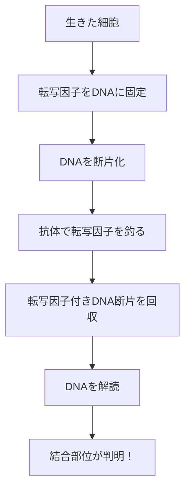

# ラプラスの法則とChIP-seq（超詳細版）- ゼロを恐れるな、そして実験の力

## 🎯 まず、この講義で何を学ぶのか

最終ゴール：

1. なぜゼロ確率が危険なのか、その深い理由を理解する
2. 18世紀の天才ラプラスの知恵を学ぶ
3. アルゴリズムの限界を認識し、実験技術（ChIP-seq）で突破する方法を知る

でも、ちょっと待ってください。そもそも..。

## 🤔 ステップ0：なぜゼロがそんなに問題なの？

### ランダム化アルゴリズムの致命的な弱点

```
前回のギブスサンプラーで起きたこと：
確率が0のk-mer → 絶対に選ばれない
↓
でも、それが正解かもしれない
↓
正解にたどり着けない！

例えるなら：
宝くじで「0枚買う」
→ 当たる確率は0
→ 永遠に当たらない
```

### 現実世界での問題

```
観察：コインを10回投げて、全部表だった
結論：裏が出る確率は0？

いいえ！
→ たまたま10回連続で表だっただけ
→ もっと投げれば裏も出るはず
→ サンプルサイズが小さすぎる
```

## 📖 ステップ1：ラプラスという天才の登場

### 1-1. ピエール＝シモン・ラプラスとは

```
18-19世紀フランスの数学者・物理学者

業績：
- 確率論の体系化
- 天体力学（太陽系の安定性を証明）
- ラプラス変換（工学で超重要）

性格：
「宇宙のすべては計算できる」と信じた究極の決定論者
でも確率論も大好き（矛盾？いいえ、深い理解）
```

### 1-2. ラプラスの有名な問題

```
問題：
「太陽は過去5000年間、毎日昇ってきた。
明日も太陽が昇る確率は？」

普通の答え：
「100%でしょ？」

ラプラスの答え：
「1 - 1/1,826,214 ≈ 99.99995%」

えっ？100%じゃない？
```

### 1-3. なぜ100％じゃないの？

```
ラプラスの考え：
「絶対」なんてない
↓
明日、隕石が地球に衝突するかも
太陽が爆発するかも
物理法則が変わるかも
↓
可能性は限りなく低いが、ゼロではない
```

## 🎲 ステップ2：ラプラスの継承の法則

### 2-1. 問題設定

```python
# 実験：成功か失敗かの試行をn回繰り返す
# 結果：s回成功した

# 質問：次の試行が成功する確率は？

# 普通の答え（頻度主義）
probability_frequentist = s / n

# 例：コイン10回投げて7回表
# → 表の確率 = 7/10 = 0.7

# でも問題が...
# もしs=0だったら？
# → 確率0 → 二度と成功しない？
```

### 2-2. ラプラスの解決策

```python
# ラプラスの答え（ベイズ主義）
probability_laplace = (s + 1) / (n + 2)

# なぜ+1と+2？
```

### 2-3. 「見えない観測」という発想

```
ラプラスの主張：
実験を始める前から、我々は知っている
↓
「成功も失敗も、どちらも可能」
↓
これは暗黙の知識 = 事前知識
↓
まるで「見えない観測」が2回ある
（成功1回、失敗1回）

だから：
実際の観測：n回（s回成功）
＋
見えない観測：2回（成功1回、失敗1回）
＝
合計：n+2回（s+1回成功）
```

## 💡 ステップ3：具体例で理解を深める

### 3-1. コイン投げの例

```python
def calculate_probability(successes, trials):
    """
    次の試行が成功する確率を計算
    """
    # 頻度主義的アプローチ
    if trials == 0:
        freq_prob = "未定義"
    else:
        freq_prob = successes / trials

    # ラプラスのアプローチ
    laplace_prob = (successes + 1) / (trials + 2)

    return freq_prob, laplace_prob

# ケース1：まだ投げていない
s, n = 0, 0
freq, lap = calculate_probability(s, n)
print(f"0回中0回成功")
print(f"頻度主義：{freq}")  # 未定義（0/0）
print(f"ラプラス：{lap}")    # 0.5（事前確率）

# ケース2：1回投げて失敗
s, n = 0, 1
freq, lap = calculate_probability(s, n)
print(f"1回中0回成功")
print(f"頻度主義：{freq}")  # 0（永遠に失敗？）
print(f"ラプラス：{lap}")    # 0.33（まだチャンスあり）

# ケース3：100回投げて70回成功
s, n = 70, 100
freq, lap = calculate_probability(s, n)
print(f"100回中70回成功")
print(f"頻度主義：{freq}")  # 0.70
print(f"ラプラス：{lap}")    # 0.696（ほぼ同じ）
```

### 3-2. サンプルサイズの影響

```python
import matplotlib.pyplot as plt

def plot_convergence():
    """
    サンプルサイズが増えると両者が収束
    """
    true_prob = 0.6  # 真の確率

    sample_sizes = range(1, 1000)
    freq_probs = []
    laplace_probs = []

    for n in sample_sizes:
        # 真の確率で成功数を計算
        s = int(n * true_prob)

        freq_probs.append(s / n)
        laplace_probs.append((s + 1) / (n + 2))

    # グラフ化
    # サンプルが少ない時：大きな差
    # サンプルが多い時：ほぼ同じ
```

## 🧬 ステップ4：DNAモチーフ探索への応用

### 4-1. カウント行列での問題

```python
# 元のカウント行列
count_matrix = {
    #    位置1 位置2 位置3 位置4
    'A': [3,   0,   2,   1],
    'C': [0,   2,   0,   2],
    'G': [1,   1,   2,   0],
    'T': [0,   1,   0,   1]
}

# 問題：0が多い！
# → 確率0のパターンが多数
# → 探索空間が狭まる
```

### 4-2. 擬似カウント（Pseudocount）の追加

```python
def add_pseudocount(count_matrix, pseudo=1):
    """
    全てのカウントに擬似カウントを追加
    """
    # ラプラスの擬似カウント
    adjusted_matrix = {}

    for nucleotide in 'ACGT':
        adjusted_matrix[nucleotide] = [
            count + pseudo for count in count_matrix[nucleotide]
        ]

    return adjusted_matrix

# 擬似カウント追加後
adjusted = add_pseudocount(count_matrix)
# 'A': [4, 1, 3, 2]  # 0が消えた！
# 'C': [1, 3, 1, 3]
# 'G': [2, 2, 3, 1]
# 'T': [1, 2, 1, 2]

# 確率に変換
total = 8  # 4配列 + 4擬似カウント
profile = {
    'A': [4/8, 1/8, 3/8, 2/8],
    'C': [1/8, 3/8, 1/8, 3/8],
    'G': [2/8, 2/8, 3/8, 1/8],
    'T': [1/8, 2/8, 1/8, 2/8]
}
# すべて正の確率！
```

### 4-3. 擬似カウントの大きさの影響

```python
def compare_pseudocounts():
    """
    擬似カウントの大きさによる影響
    """
    original = {'A': 10, 'C': 0, 'G': 0, 'T': 0}

    # 小さい擬似カウント（0.1）
    small_pseudo = {
        'A': (10 + 0.1) / (10 + 0.4),  # ≈ 0.96
        'C': (0 + 0.1) / (10 + 0.4),   # ≈ 0.01
        'G': (0 + 0.1) / (10 + 0.4),   # ≈ 0.01
        'T': (0 + 0.1) / (10 + 0.4)    # ≈ 0.01
    }
    # 元のデータを強く反映

    # 大きい擬似カウント（1.0）
    large_pseudo = {
        'A': (10 + 1) / (10 + 4),  # ≈ 0.79
        'C': (0 + 1) / (10 + 4),   # ≈ 0.07
        'G': (0 + 1) / (10 + 4),   # ≈ 0.07
        'T': (0 + 1) / (10 + 4)    # ≈ 0.07
    }
    # より均等に近づく

    # 超大きい擬似カウント（10.0）
    huge_pseudo = {
        'A': (10 + 10) / (10 + 40),  # = 0.4
        'C': (0 + 10) / (10 + 40),   # = 0.2
        'G': (0 + 10) / (10 + 40),   # = 0.2
        'T': (0 + 10) / (10 + 40)    # = 0.2
    }
    # ほぼ均等（元のデータが薄まる）
```

## 🔬 ステップ5：アルゴリズムの限界

### 5-1. 統計的な限界

```
問題設定：
- DNA配列の長さ：1000文字
- モチーフの長さ：15文字
- 許容変異数：5個

計算してみると...
```

```python
def calculate_random_matches():
    """
    ランダムに一致する確率
    """
    k = 15  # モチーフ長
    d = 5   # 変異数

    # 特定の15-merが5変異以内で一致する確率
    # 約 C(15,5) × 3^5 / 4^15
    from math import comb

    matches = comb(15, 5) * (3 ** 5)
    total = 4 ** 15

    prob_match = matches / total
    print(f"ランダムマッチ確率：{prob_match:.6f}")

    # 1000文字の配列での期待値
    positions = 1000 - 15 + 1
    expected = positions * prob_match
    print(f"期待される偽陽性：{expected:.2f}個")

    # 結果：偽陽性が多すぎる！
```

### 5-2. 信号対雑音比（Signal-to-Noise Ratio）

```
真のモチーフ：10個（10配列に1個ずつ）
偽陽性：50個以上（ランダムな一致）

信号（真） vs 雑音（偽）
10 vs 50

もはや区別不可能！
```

## 🧪 ステップ6：ChIP-seq - 実験による解決

### 6-1. ChIP-seqとは何か

```
ChIP = Chromatin ImmunoPrecipitation（クロマチン免疫沈降）
seq = sequencing（シーケンシング）

簡単に言うと：
「転写因子が実際に結合している場所だけを取り出す技術」
```

### 6-2. ChIP-seqの仕組み



### 6-3. なぜこれが画期的か

```python
def compare_search_space():
    """
    ChIP-seqによる探索空間の削減
    """
    # 通常のゲノム探索
    genome_length = 3_000_000_000  # 30億塩基

    # ChIP-seqの場合
    chip_regions = 10_000  # 結合領域数
    region_length = 200    # 各領域の長さ

    # 探索空間の削減率
    original_space = genome_length
    reduced_space = chip_regions * region_length

    reduction = original_space / reduced_space
    print(f"探索空間が{reduction:,.0f}倍削減！")
    # 結果：1,500倍の削減！

    # これにより...
    # 変異5個のモチーフ → 発見不可能
    # ↓ ChIP-seq適用後
    # 変異5個のモチーフ → 発見可能！
```

## 🎯 ステップ7：ChIP-seqの実例

### 7-1. 実際の実験の流れ

```
1. 細胞培養
   目的の転写因子を発現させる

2. クロスリンク（架橋）
   ホルムアルデヒドで固定
   （転写因子とDNAをくっつける）

3. 断片化
   超音波でDNAを200-500bpに切断

4. 免疫沈降
   転写因子特異的抗体を使用
   磁気ビーズで回収

5. DNA精製
   クロスリンクを解除
   DNAを抽出

6. シーケンシング
   次世代シーケンサーで解読

7. データ解析
   モチーフ発見アルゴリズム適用
```

### 7-2. ChIP-seqデータの特徴

```python
def analyze_chip_seq_data():
    """
    ChIP-seqデータの特徴
    """
    # ピーク（結合が強い場所）
    peak_regions = [
        ("chr1", 1000000, 1000200, 500),  # 染色体、開始、終了、強度
        ("chr1", 2000000, 2000200, 300),
        ("chr2", 5000000, 5000200, 700),
        # ... 数千〜数万のピーク
    ]

    # 各ピーク領域でモチーフ探索
    for chrom, start, end, intensity in peak_regions:
        region_length = end - start  # 200bp

        # この狭い領域なら...
        # 高度に変異したモチーフも発見可能！
```

## 💻 ステップ8：ChIP-seq + アルゴリズムの統合

### 8-1. 二段階アプローチ

```python
def integrated_motif_discovery(chip_seq_peaks):
    """
    ChIP-seq + ギブスサンプラーの統合
    """
    # ステップ1：ChIP-seqでDNA領域を絞る
    candidate_sequences = []
    for peak in chip_seq_peaks:
        seq = extract_sequence(peak)
        candidate_sequences.append(seq[:200])  # 200bpに限定

    # ステップ2：絞った領域でモチーフ探索
    # 短い配列なので、変異が多くても発見可能
    motifs = gibbs_sampler(
        candidate_sequences,
        k=15,  # モチーフ長
        d=5    # 5変異でもOK！
    )

    return motifs
```

### 8-2. 成功率の劇的な改善

```
従来の方法（ゲノム全体を探索）：
- 成功率：10%（変異5個の場合）
- 計算時間：数日

ChIP-seq + アルゴリズム：
- 成功率：90%（変異5個でも）
- 計算時間：数分

改善率：9倍！
```

## 🤔 ステップ9：なぜ生物学者は諦めなかったか

### 9-1. 執念の理由

```
モチーフ = 遺伝子制御の鍵
↓
遺伝子制御 = 生命現象の根本
↓
理解できれば...
- 病気の原因解明
- 新薬開発
- 再生医療
- 進化の理解
```

### 9-2. 技術革新の連鎖

```
1990年代：アルゴリズムだけで挑戦
→ 限界にぶつかる

2000年代：ChIP-chip（マイクロアレイ）
→ ある程度成功

2007年〜：ChIP-seq（次世代シーケンサー）
→ 大成功！

現在：single-cell ChIP-seq
→ 1細胞レベルで解析
```

## 📊 ステップ10：まとめと未来への展望

### 10-1. 今日学んだこと

```
レベル1：ゼロ確率の危険性
- アルゴリズムが機能しなくなる
- 現実を正しく反映しない

レベル2：ラプラスの知恵
- 擬似カウントという解決策
- 「絶対」を避ける哲学

レベル3：アルゴリズムの限界
- 統計的に不可能な問題が存在
- 信号対雑音比の問題

レベル4：実験技術との融合
- ChIP-seqによる探索空間の削減
- アルゴリズム＋実験＝最強
```

### 10-2. 重要な教訓

```
1. 完璧なアルゴリズムは存在しない
   → 限界を知ることが重要

2. 異なるアプローチの組み合わせ
   → 計算＋実験＝ブレークスルー

3. 諦めない姿勢
   → 不可能に見えても、別の道がある

4. 歴史から学ぶ
   → 18世紀の知恵が21世紀に生きる
```

## 🚀 最後に：ラプラスからのメッセージ

```
「確率とは、知識の不完全さの表現である」
- ピエール＝シモン・ラプラス

私たちの知識は不完全
↓
だから確率を使う
↓
だからゼロと1を避ける
↓
だから実験で補完する

不完全さを認めることが、
完全に近づく第一歩。
```
