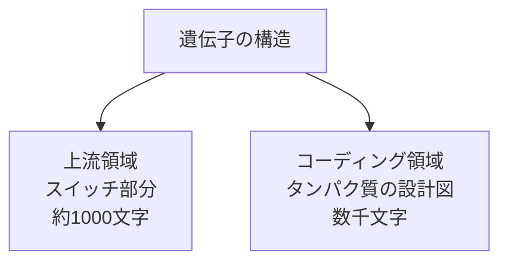

# モチーフ発見問題（超詳細版）- 遺伝子のON/OFFスイッチを探す

## 🎯 まず、この講義で何を学ぶのか

最終ゴール：コンピュータを使って、複数のDNA配列に共通して現れる「特別なパターン（モチーフ）」を見つける方法を学びます。

でも、ちょっと待ってください。そもそも..。

## 🤔 ステップ0：なぜモチーフを見つけたいの？

### あなたの体の不思議な現象

```
朝になると目が覚める
夜になると眠くなる
お昼頃にお腹が空く
```

これ、偶然じゃないんです。実は..。

### 体内時計の正体

```
あなたの体の中には「時計」がある
↓
でも、機械の時計じゃない
↓
「遺伝子」でできた時計
↓
約1000個の遺伝子が24時間周期でON/OFFを繰り返す
```

### ここで重要な疑問

```
疑問：1000個もの遺伝子を、誰が制御してるの？
↓
答え：たった3つのタンパク質！
↓
新たな疑問：どうやって3つで1000個を制御？
↓
答え：それが今日学ぶ「モチーフ」の話
```

## 📖 ステップ1：遺伝子のON/OFFスイッチの仕組み

### 1-1. まず遺伝子って何？

簡単に言うと：タンパク質の設計図


でも、すべての設計図を常に使うわけじゃない：

```
家の設計図に例えると：
- キッチンの設計図 → 料理するときだけ見る
- 寝室の設計図 → 寝るときだけ見る
- お風呂の設計図 → お風呂に入るときだけ見る

遺伝子も同じ：
- 消化酵素の遺伝子 → 食事のときだけON
- メラトニンの遺伝子 → 夜だけON
- 成長ホルモンの遺伝子 → 寝ているときだけON
```

### 1-2. 遺伝子のON/OFFスイッチはどこにある？



重要：スイッチは遺伝子の「前」にある！

### 1-3. スイッチはどうやって動く？

```
スイッチの仕組み：
1. 特別なタンパク質（転写因子）が来る
2. スイッチ部分の特定の配列を認識
3. その配列に結合
4. 遺伝子がONになる
```

でも、ここで問題が..。

## 🧩 ステップ2：転写因子はどうやって結合場所を見つける？

### 2-1. 人間のDNAの長さを考えてみよう

```python
# 人間のDNA
total_length = 3_000_000_000  # 30億文字

# 転写因子が認識する配列
motif_length = 10  # 約10文字

# ランダムに10文字を選ぶと...
possible_patterns = 4 ** 10  # 1,048,576通り

# 同じパターンが偶然現れる回数
random_occurrences = total_length / possible_patterns
print(f"偶然の出現回数：{random_occurrences:.0f}回")
# 結果：2,861回！
```

つまり、ただの10文字パターンだけでは、偶然でも約3000回出現してしまう！

### 2-2. じゃあ、どうやって正しい場所を見つける？

```
答え：複数の遺伝子に共通するパターンを探す！

理由を考えてみましょう：
同じタイミングでONになる遺伝子群
↓
同じ転写因子で制御される
↓
同じ結合パターン（モチーフ）を持つはず
```

### 2-3. 具体例：植物の概日時計遺伝子

```python
# 朝に活性化する3つの遺伝子の上流配列（仮想例）
gene1_upstream = "...AAATATCTAAAA..."  # 光合成遺伝子
gene2_upstream = "...CGAAATTTCTTG..."  # 気孔開閉遺伝子
gene3_upstream = "...TTAAATATCTCC..."  # 葉の動き遺伝子

# よく見ると...
# gene1: AAATATCT
# gene2: AAATTTCT (2文字違い)
# gene3: AAATATCT

# 共通パターン：AAATATCT（少しの変異あり）
```

## 🎮 ステップ3：モチーフ発見を簡単なゲームで理解する

### 3-1. パターン埋め込みゲーム

まず、現実より簡単な問題から始めましょう：

```
ゲームのルール：
1. 10個のランダムなDNA配列を用意（各600文字）
2. 同じ15文字のパターンを各配列のどこかに埋め込む
3. そのパターンを見つけ出せ！
```

### 3-2. 最初の発想：全部つなげて頻出語を探す

```python
def simple_motif_finding(sequences, k=15):
    """
    最も単純な方法：連結して頻出語を探す
    """
    # ステップ1：全部つなげる
    combined = ''.join(sequences)
    # 10配列 × 600文字 = 6000文字

    # ステップ2：すべての15-merを数える
    kmer_counts = {}
    for i in range(len(combined) - k + 1):
        kmer = combined[i:i+k]
        kmer_counts[kmer] = kmer_counts.get(kmer, 0) + 1

    # ステップ3：最頻出を見つける
    max_count = max(kmer_counts.values())

    # なぜこれで見つかる？
    # 埋め込んだパターン：10回出現（各配列に1回）
    # ランダムな15-mer：期待値 = 6000 / (4^15) ≈ 0.0000057回
    # 10回 vs 0.0000057回 → 圧倒的に目立つ！

    return [kmer for kmer, count in kmer_counts.items()
            if count == max_count]
```

### 3-3. でも現実は...変異がある

```
理想：
配列1: ...ATGCATGCATGCATG...（完全一致）
配列2: ...ATGCATGCATGCATG...（完全一致）
配列3: ...ATGCATGCATGCATG...（完全一致）

現実：
配列1: ...ATGCATGCATGCATG...（元のパターン）
配列2: ...ATACATACATGCATG...（2文字変異）
配列3: ...ATGCATGCTTGCTTG...（3文字変異）
```

変異があると、単純な頻出語探索では見つからない！

## 🔬 ステップ4：(k,d)モチーフという考え方

### 4-1. (k,d)モチーフの定義

```
k = パターンの長さ
d = 許容する変異の数

(15,3)モチーフ = 15文字で、最大3文字まで違ってもOK
```

### 4-2. なぜ変異を許容する必要がある？

生物学的な理由：

```
進化の過程で...
↓
DNAに変異が起きる（1世代あたり約100箇所）
↓
でも、少しの変異なら機能は保たれる
↓
だから、転写因子も「だいたい合ってればOK」という認識をする
```

### 4-3. ハミング距離で変異を測る

```python
def hamming_distance(s1, s2):
    """
    2つの文字列の違いを数える
    """
    distance = 0
    for i in range(len(s1)):
        if s1[i] != s2[i]:
            distance += 1
    return distance

# 例
pattern1 = "ATGCATGC"
pattern2 = "ATACATGC"  # 2文字違い
print(f"ハミング距離：{hamming_distance(pattern1, pattern2)}")
# 結果：2
```

## 🤯 ステップ5：変異があるとなぜ難しくなる？

### 5-1. 直感的に考えてみる

```
2人の変異体を比較すると...

元のパターン：ATGCATGCATGCATG
     ↓ 4箇所変異
変異体A：    ATACATACATCCATA
     ↓ 別の4箇所変異
変異体B：    TTGCTTGCATGCTTG

変異体AとBを比較すると...
最悪の場合：8箇所も違う！

元のパターンが見えなくなる...
```

### 5-2. 数学的に考える

```python
def worst_case_distance(d):
    """
    d個の変異を持つ2つの変異体間の最大距離
    """
    # 最悪の場合：全く違う場所が変異
    return 2 * d

# 例：各変異体が4箇所変異
print(f"最大距離：{worst_case_distance(4)}")
# 結果：8

# つまり、元は同じパターンでも
# 変異体同士は全く違って見える可能性がある！
```

## 💡 ステップ6：モチーフ列挙アルゴリズム - 力技で解く

### 6-1. 基本的な考え方

```
アイデア：可能性のあるパターンを全部試す！

1. 各配列から全てのk-merを取り出す
2. 各k-merから、d個以内の変異を持つ全パターンを生成
3. 生成したパターンが全配列に存在するか確認
```

### 6-2. まず「近傍」を理解する

```python
# 「近傍」= ハミング距離d以内の全ての文字列

def generate_1_neighbors(pattern):
    """
    ハミング距離1の全ての文字列を生成
    """
    neighbors = []
    for i in range(len(pattern)):
        for nucleotide in ['A', 'C', 'G', 'T']:
            if nucleotide != pattern[i]:
                # i番目を変える
                neighbor = pattern[:i] + nucleotide + pattern[i+1:]
                neighbors.append(neighbor)
    return neighbors

# 例
pattern = "ATG"
neighbors = generate_1_neighbors(pattern)
print(f"ATGの1-近傍：{neighbors}")
# 結果：['CTG', 'GTG', 'TTG', 'ACG', 'AGG', 'ATG', 'ATA', 'ATC', 'ATT']
# 3文字 × 3通りの変更 = 9個
```

### 6-3. d-近傍の数を計算

```python
def count_d_neighbors(k, d):
    """
    k文字のパターンのd-近傍の数を概算
    """
    total = 0
    for i in range(d + 1):
        # i個の位置を選んで変える
        from math import comb
        positions = comb(k, i)  # k個からi個選ぶ組み合わせ
        variants = 3 ** i       # 各位置で3通りの変更
        total += positions * variants
    return total

# 例：15文字で3変異まで許容
k, d = 15, 3
print(f"(15,3)-近傍の数：{count_d_neighbors(k, d):,}")
# 結果：46,516個

# これを10配列分チェック...大変だけど可能！
```

### 6-4. アルゴリズムの実装

```python
def motif_enumeration_detailed(dna_list, k, d):
    """
    モチーフ列挙アルゴリズム（詳細版）

    なぜこの方法？
    1. 確実に全てのモチーフを見つける（見逃しなし）
    2. 理解しやすい
    3. デバッグしやすい
    """
    patterns = set()
    t = len(dna_list)  # 配列の数

    print(f"ステップ1：最初の配列から候補を生成")
    first_seq = dna_list[0]

    # 各位置のk-merを調べる
    for i in range(len(first_seq) - k + 1):
        kmer = first_seq[i:i+k]
        print(f"  位置{i}: {kmer}")

        # このk-merのd-近傍を全て生成
        neighbors = generate_neighbors(kmer, d)
        print(f"    → {len(neighbors)}個の近傍を生成")

        # 各近傍が全配列に存在するかチェック
        for neighbor in neighbors:
            appears_in_all = True

            for j, seq in enumerate(dna_list[1:], 1):
                if not appears_with_mismatches(neighbor, seq, d):
                    appears_in_all = False
                    break

            if appears_in_all:
                patterns.add(neighbor)
                print(f"    ✓ {neighbor}は全配列に存在！")

    return patterns
```

## 🧮 ステップ7：計算量を詳しく分析

### 7-1. 時間計算量の計算

```python
def analyze_complexity(n, t, k, d):
    """
    n: 各配列の長さ
    t: 配列の数
    k: モチーフの長さ
    d: 許容変異数
    """
    # ステップごとの計算量
    kmers_per_seq = n - k + 1
    neighbors_per_kmer = count_d_neighbors(k, d)
    checks_per_neighbor = t * n  # t配列 × n文字

    total_operations = kmers_per_seq * neighbors_per_kmer * checks_per_neighbor

    print(f"解析：")
    print(f"  各配列のk-mer数：{kmers_per_seq}")
    print(f"  各k-merの近傍数：{neighbors_per_kmer:,}")
    print(f"  各近傍のチェック：{checks_per_neighbor}")
    print(f"  総演算数：{total_operations:,}")

    # 実時間の推定（1秒間に10億演算と仮定）
    seconds = total_operations / 1_000_000_000
    if seconds < 60:
        print(f"  推定時間：{seconds:.1f}秒")
    elif seconds < 3600:
        print(f"  推定時間：{seconds/60:.1f}分")
    else:
        print(f"  推定時間：{seconds/3600:.1f}時間")

# 実例
analyze_complexity(n=600, t=10, k=15, d=3)
```

### 7-2. なぜ指数的に増える？

```
k=10, d=2: 約1,000個の近傍
k=15, d=3: 約46,000個の近傍
k=20, d=4: 約250,000個の近傍

kが5増えるごとに、チェックすべきパターンが50倍に！
```

## 🌍 ステップ8：実際の生物学データへの応用

### 8-1. 実データの課題

理想と現実のギャップ：

```
理想的な仮定：
✓ 全ての配列にモチーフが存在
✓ 変異の数が一定（d個以内）
✓ モチーフの長さが分かっている

現実：
✗ 一部の遺伝子にはモチーフがないかも
✗ 変異の数がバラバラ（0〜10個など）
✗ モチーフの長さが不明（8〜20文字？）
✗ 偽陽性（偶然似たパターン）の存在
```

### 8-2. ノイズの問題

```python
def calculate_false_positives(n, t, k):
    """
    偽陽性の期待値を計算
    """
    # ランダムにk-merが全配列に現れる確率
    prob_one_seq = n / (4 ** k)  # 1配列に現れる確率
    prob_all_seq = prob_one_seq ** t  # 全配列に現れる確率

    total_kmers = 4 ** k  # 可能なk-merの総数
    expected_false = total_kmers * prob_all_seq

    print(f"パラメータ：n={n}, t={t}, k={k}")
    print(f"偽陽性の期待値：{expected_false:.6f}")

    if expected_false > 0.01:
        print("⚠️ 偽陽性が多すぎる！")
    else:
        print("✓ 偽陽性は少ない")

# 例
calculate_false_positives(n=600, t=10, k=8)   # 短すぎる
calculate_false_positives(n=600, t=10, k=15)  # ちょうど良い
```

## 🎯 ステップ9：より賢いアプローチへの道

### 9-1. モチーフ列挙の限界

```
問題点：
1. 計算量が膨大（指数的）
2. ノイズに弱い
3. 部分的なモチーフを見逃す
```

### 9-2. 次に学ぶアルゴリズムの予告

```
改善のアイデア：

1. メディアン文字列
   → 「平均的に」全配列に近いパターンを探す

2. グリーディアルゴリズム
   → 少しずつ改善していく

3. ランダム化アルゴリズム
   → 確率的に良い解を見つける
```

## 📊 まとめ：今日学んだことを整理

### レベル1：生物学的理解

```
遺伝子にはON/OFFスイッチがある
↓
転写因子がスイッチを制御
↓
転写因子は特定のDNAパターン（モチーフ）を認識
↓
同じタイミングで働く遺伝子は同じモチーフを持つ
```

### レベル2：問題の定式化

```
生物学の問題：共通の制御モチーフを見つけたい
↓
情報科学の問題：複数配列に共通するパターンを見つけたい
↓
(k,d)モチーフ問題：変異を考慮したパターン探索
```

### レベル3：アルゴリズムの理解

```
1. 各配列から全k-merを抽出
2. 各k-merのd-近傍を生成
3. 全配列に存在する近傍を探す
```

### レベル4：計算量の理解

```
O(n × t × Σ(k,d) × n)
- 実用的なのはk≤15程度
- より効率的なアルゴリズムが必要
```

## 🚀 次回への準備

### 考えてみてください

1. **完全一致を求めない方法は？**
   - ヒント：「平均」という考え方

2. **全配列になくても良いとしたら？**
   - ヒント：「多数決」という考え方

3. **ランダムサーチは使える？**
   - ヒント：良い初期値の選び方

これらの答えは次回の講義で明らかに！

## 💭 最後に：なぜこれが重要か

```
モチーフ発見ができると...
↓
遺伝子の制御ネットワークが分かる
↓
病気のメカニズムが分かる
↓
新薬の標的が見つかる
↓
個別化医療への道
```

たった10〜15文字のパターンが、生命の謎を解く鍵になるのです！
