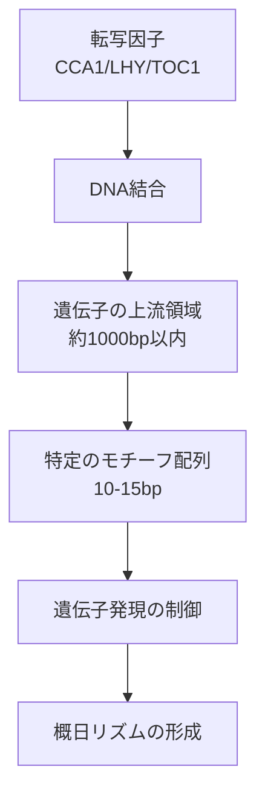

# 移植パターンから規制モチーフへ（パート1）

## 📖 概要

この講義では、DNAの調節モチーフを見つけるためのアルゴリズムについて学びます。生物の遺伝子発現を制御する転写因子が結合するDNA配列パターン（モチーフ）を、複数の配列から見つけ出す方法を探求します。

## 🎯 学習目標

- モチーフ発見問題の理解
- (k, d)モチーフの概念
- 概日時計と遺伝子調節の関係
- 移植モチーフ問題のアルゴリズム

## 🎮 パターン埋め込みゲーム

モチーフ発見問題を理解するために、まず簡単なゲームから始めましょう。

### ゲームのルール

1. 10個のランダムなDNA配列を生成
2. 15ヌクレオチド長のパターンを各配列のランダムな位置に挿入
3. 埋め込まれたパターンを見つけ出す

:::note
このゲームは単純化されたモデルですが、実際の生物学的問題の基礎となります。
:::

### 頻出語問題の応用

埋め込まれたパターンを見つける簡単な方法：

1. すべての配列を連結
2. 連結した配列から最も頻出する15-merを検索
3. 10回出現するパターンが、埋め込まれたパターンの可能性が高い

```python
def find_implanted_pattern_simple(sequences, k):
    """
    単純な頻出語問題として解く（変異なしの場合）

    Args:
        sequences: DNA配列のリスト
        k: パターンの長さ

    Returns:
        最も頻出するk-mer
    """
    # すべての配列を連結
    concatenated = ''.join(sequences)

    # k-merの出現回数をカウント
    kmer_counts = {}
    for i in range(len(concatenated) - k + 1):
        kmer = concatenated[i:i+k]
        kmer_counts[kmer] = kmer_counts.get(kmer, 0) + 1

    # 最も頻出するk-merを返す
    return max(kmer_counts, key=kmer_counts.get)
```

## 🧬 (k, d)モチーフ

実際の生物学では、モチーフは完全に同一ではなく、いくつかの変異を持つことがあります。

### 定義

**(k, d)モチーフ**：最大d個の変異（ミスマッチ）で、すべての配列に現れるk-mer

### 例

- 元のパターン：`ATGCATGCATGCATG`（15-mer）
- 4つの変異を含む例：`AT**A**CAT**A**CAT**C**CAT**A**`（4箇所が変異）

:::info 重要
変異があると、単純な頻出語問題では解決できません。より洗練されたアルゴリズムが必要です。
:::

## 🌱 生物学的背景：概日時計

### なぜ時計遺伝子が重要か？

生物は24時間周期で様々な生理現象を制御しています：

- **人間**：睡眠・覚醒サイクル、ホルモン分泌
- **植物**：光合成、開花、耐霜性

### 植物の概日時計制御

植物では、約1000以上の遺伝子が概日時計に従っていますが、これらを制御するのはわずか**3つの転写因子**です：

1. **CCA1**（Circadian Clock Associated 1）
2. **LHY**（Late Elongated Hypocotyl）
3. **TOC1**（Timing of CAB Expression 1）

### 転写因子の働き



:::note 重要な疑問
転写因子はどうやって結合すべき場所を知るのでしょうか？答えは、特定のDNA配列パターン（モチーフ）が「ここに結合してください！」というシグナルとして機能するからです。
:::

## 🔍 移植モチーフ問題（Implanted Motif Problem）

### 問題の定式化

**入力：**

- DNA配列の集合
- 整数k（モチーフの長さ）
- 整数d（許容される変異の数）

**出力：**

- すべての(k, d)モチーフ

### ペアワイズ比較の限界

直感的には、配列同士を比較して類似領域を見つければよさそうですが...

```python
def hamming_distance(s1, s2):
    """2つの文字列間のハミング距離を計算"""
    return sum(c1 != c2 for c1, c2 in zip(s1, s2))

# 問題：元のパターンに4つの変異がある場合
# 2つの変異体を比較すると、最大8つの違いが生じる可能性がある
# 例：
# 元のパターン: ATGCATGCATGCATG
# 変異体1:     ATACATACATCCATA (4箇所変異)
# 変異体2:     ATGCATGTATGCTTG (別の4箇所変異)
# 変異体同士の差: 最大8箇所
```

## 🔧 モチーフ列挙アルゴリズム

### 基本的なアプローチ

1. 各配列から全てのk-merを抽出
2. 各k-merから、d個以内の変異を持つ全ての可能なパターンを生成
3. 生成したパターンが全ての配列に(k, d)モチーフとして存在するか確認

```python
def motif_enumeration(dna_list, k, d):
    """
    モチーフ列挙アルゴリズム

    Args:
        dna_list: DNA配列のリスト
        k: モチーフの長さ
        d: 許容される変異の数

    Returns:
        見つかった(k, d)モチーフのセット
    """
    patterns = set()

    # 最初の配列から全てのk-merを取得
    first_sequence = dna_list[0]
    for i in range(len(first_sequence) - k + 1):
        kmer = first_sequence[i:i+k]

        # k-merのd-近傍を生成
        for neighbor in generate_neighbors(kmer, d):
            # すべての配列に出現するか確認
            if all(appears_with_mismatches(neighbor, seq, d)
                   for seq in dna_list):
                patterns.add(neighbor)

    return patterns

def generate_neighbors(pattern, d):
    """
    パターンからハミング距離d以内の全ての文字列を生成
    """
    if d == 0:
        return [pattern]
    if len(pattern) == 1:
        return ['A', 'C', 'G', 'T']

    neighbors = []
    suffix_neighbors = generate_neighbors(pattern[1:], d)

    for suffix in suffix_neighbors:
        if hamming_distance(pattern[1:], suffix) < d:
            for nucleotide in ['A', 'C', 'G', 'T']:
                neighbors.append(nucleotide + suffix)
        else:
            neighbors.append(pattern[0] + suffix)

    return neighbors

def appears_with_mismatches(pattern, text, d):
    """
    パターンがテキスト内にd個以内の変異で存在するか確認
    """
    k = len(pattern)
    for i in range(len(text) - k + 1):
        if hamming_distance(pattern, text[i:i+k]) <= d:
            return True
    return False
```

### 計算量の考察

- **時間計算量**：O(n × t × 4^k × k)
  - n: 配列の数
  - t: 各配列の長さ
  - 4^k: 可能なk-merの数
  - k: パターン比較のコスト

:::warning 注意
k が大きくなると計算時間が指数的に増加します。k ≤ 15程度が実用的な限界です。
:::

## 🔬 生物学的現実の複雑さ

### 理想と現実のギャップ

実際の生物学的データでは：

1. **すべての遺伝子にモチーフが存在するとは限らない**
   - 一部の遺伝子には調節モチーフが欠けている可能性

2. **モチーフの変異数が一定でない**
   - ある遺伝子では2つの変異、別の遺伝子では5つの変異など

3. **ノイズの存在**
   - ランダムに似たパターンが出現する可能性

### より現実的なアプローチの必要性

これらの問題に対処するため、次回の講義では：

- **スコアリング関数**の導入
- **確率的アプローチ**
- **より洗練されたモチーフ発見アルゴリズム**

について学びます。

## 📝 まとめ

この講義では、DNAモチーフ発見問題の基礎を学びました：

1. **モチーフ発見**は遺伝子調節を理解する上で重要
2. **(k, d)モチーフ**は変異を考慮したパターン
3. **モチーフ列挙アルゴリズム**は総当たり的だが確実
4. **生物学的現実**はより複雑で、洗練されたアプローチが必要

## 🚀 次回予告

次回は、より実用的なモチーフ発見アルゴリズムを学びます：

- メディアン文字列問題
- グリーディモチーフ探索
- ランダム化アルゴリズム

## 📚 参考文献

- Coursera: Bioinformatics Specialization - Week 2
- Jones, N.C. and Pevzner, P.A. (2004) An Introduction to Bioinformatics Algorithms
