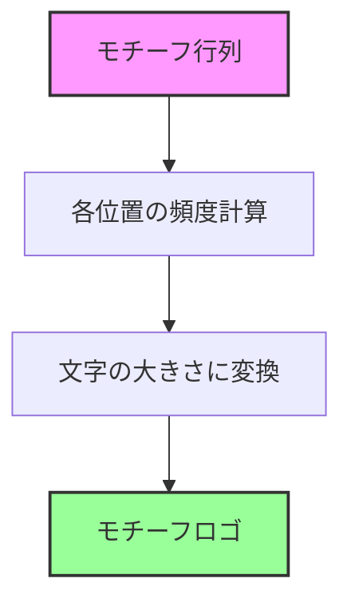

# 移植パターンから規制モチーフへ（パート2）

## 📖 概要

前回の講義で学んだモチーフ列挙アルゴリズムには限界がありました。実際の生物学的データでは、すべての配列にモチーフが存在するとは限りません。この講義では、より現実的なアプローチとして、モチーフ行列とスコアリング関数を使った方法を学びます。

## 🎯 学習目標

- モチーフ行列（Motifs Matrix）の理解
- コンセンサス文字列の構築
- スコアリング関数による評価
- モチーフ発見問題の定式化
- 計算量の分析

## 🔄 前回のアプローチの限界

### 問題点

前回のモチーフ列挙アルゴリズムでは：

1. **すべての配列にモチーフが存在する**と仮定
2. 生物学的には必ずしも正しくない
3. 一部の遺伝子にはモチーフが欠けている可能性

### 新しいアプローチ

モチーフの集合に対して**スコアを割り当てる**方法を導入します。

## 📊 モチーフ行列（Motifs Matrix）

### 定義

複数の配列から選んだk-merの集合を行列として表現：

```
例：8つの配列から選んだ15-merのモチーフ行列

TCGGGGGTTTTT
CCGGTGACTTAC
ACGGGGATTTTC
TTGGGGACTTTT
AAGGGGACTTCC
TTGGGGACTTCC
TCGGGGATTCAT
TCGGGGATTTTC
```

### 保存度の分析

各列のヌクレオチドの頻度を計算：

```python
def create_count_matrix(motifs):
    """
    モチーフ行列から各位置のヌクレオチド頻度を計算

    Args:
        motifs: モチーフ文字列のリスト

    Returns:
        位置ごとのヌクレオチド頻度辞書
    """
    k = len(motifs[0])
    count_matrix = []

    for j in range(k):
        column_counts = {'A': 0, 'C': 0, 'G': 0, 'T': 0}
        for motif in motifs:
            column_counts[motif[j]] += 1
        count_matrix.append(column_counts)

    return count_matrix
```

### 保存性の可視化

**高保存位置**：ほぼすべての配列で同じヌクレオチド

- 例：2,3番目の位置では'G'が全配列に存在

**低保存位置**：ヌクレオチドがばらつく

- 例：最後の位置では複数のヌクレオチドが混在

## 🎨 モチーフロゴ

モチーフの保存度を視覚的に表現する方法：



- **文字の大きさ**：出現頻度に比例
- **高さ**：その位置の保存度（情報量）を表現

## 🎯 コンセンサス文字列

### 定義

モチーフ行列の各列で最も頻出するヌクレオチドを選んで作る文字列

```python
def consensus(motifs):
    """
    モチーフ行列からコンセンサス文字列を生成

    Args:
        motifs: モチーフ文字列のリスト

    Returns:
        コンセンサス文字列
    """
    k = len(motifs[0])
    consensus_string = ""

    for j in range(k):
        counts = {'A': 0, 'C': 0, 'G': 0, 'T': 0}
        for motif in motifs:
            counts[motif[j]] += 1

        # 最頻出ヌクレオチドを選択（同数の場合は辞書順）
        most_frequent = max(counts, key=counts.get)
        consensus_string += most_frequent

    return consensus_string

# 例
motifs = [
    "TCGGGGGTTTTT",
    "CCGGTGACTTAC",
    "ACGGGGATTTTC",
    "TTGGGGACTTTT"
]
print(consensus(motifs))  # "TCGGGGATTTTT"
```

## 📏 スコアリング関数

### Score(Motifs)の定義

モチーフ行列のスコア = **コンセンサスと一致しない文字の総数**

```python
def score(motifs):
    """
    モチーフ行列のスコアを計算
    （小さいほど良い）

    Args:
        motifs: モチーフ文字列のリスト

    Returns:
        スコア（不一致の総数）
    """
    consensus_string = consensus(motifs)
    score = 0

    for motif in motifs:
        for i in range(len(motif)):
            if motif[i] != consensus_string[i]:
                score += 1

    return score
```

### ハミング距離を使った表現

スコアは各モチーフとコンセンサス文字列間のハミング距離の総和：

```python
def hamming_distance(s1, s2):
    """2つの文字列間のハミング距離"""
    return sum(c1 != c2 for c1, c2 in zip(s1, s2))

def score_with_hamming(motifs):
    """ハミング距離を使ったスコア計算"""
    consensus_string = consensus(motifs)
    return sum(hamming_distance(motif, consensus_string)
               for motif in motifs)
```

## 🎯 モチーフ発見問題

### 問題の定式化

**入力：**

- 整数k（モチーフの長さ）
- 整数t（配列の数）
- t個のDNA配列（それぞれ長さn）

**出力：**

- Score(Motifs)を最小化するk-merの集合

### ブルートフォースアプローチ

```python
def brute_force_motif_search(dna_list, k):
    """
    総当たりでモチーフを探索

    Args:
        dna_list: DNA配列のリスト
        k: モチーフの長さ

    Returns:
        最適なモチーフのリスト
    """
    import itertools

    best_motifs = []
    best_score = float('inf')

    # 各配列から可能なすべてのk-merを生成
    all_kmers = []
    for dna in dna_list:
        kmers = [dna[i:i+k] for i in range(len(dna) - k + 1)]
        all_kmers.append(kmers)

    # すべての組み合わせを試す
    for motifs in itertools.product(*all_kmers):
        current_score = score(list(motifs))
        if current_score < best_score:
            best_score = current_score
            best_motifs = list(motifs)

    return best_motifs
```

## ⚡ 計算量の分析

### ブルートフォースの計算量

- **可能なモチーフ行列の数**：(n - k + 1)^t
  - n: 各配列の長さ
  - k: モチーフの長さ
  - t: 配列の数

- **各行列のスコア計算**：O(k × t)

- **全体の計算量**：O((n - k + 1)^t × k × t)

:::warning実用性の問題
n = 1000, k = 15, t = 10の場合：

- 約986^10 ≈ 10^30通りの組み合わせ
- 現実的な時間では計算不可能！
  :::

## 🔄 新しいアプローチ：メディアン文字列

### 発想の転換

従来のアプローチ：

1. モチーフを選ぶ → コンセンサスを求める

新しいアプローチ：

1. **コンセンサス候補を選ぶ** → 最適なモチーフを求める

### Distance(Pattern, Motifs)

パターンとモチーフ集合間の距離：

```python
def distance_to_pattern(pattern, dna):
    """
    パターンとDNA配列間の最小ハミング距離
    """
    k = len(pattern)
    min_distance = float('inf')

    for i in range(len(dna) - k + 1):
        kmer = dna[i:i+k]
        distance = hamming_distance(pattern, kmer)
        min_distance = min(min_distance, distance)

    return min_distance

def total_distance(pattern, dna_list):
    """
    パターンとすべてのDNA配列間の距離の総和
    """
    return sum(distance_to_pattern(pattern, dna)
               for dna in dna_list)
```

## 📊 等価問題の定式化

モチーフ発見問題は以下と等価：

**メディアン文字列問題**：

- すべての配列への総距離を最小化するパターンを見つける
- 考えられる4^k個のパターンから選択

:::infoメリット

- 4^k個のパターンを探索（(n-k+1)^t個のモチーフ組み合わせより大幅に少ない）
- k = 15なら約10億通り（計算可能な範囲）。
  :::

## 📝 まとめ

この講義では、より実用的なモチーフ発見アプローチを学びました：

1. **モチーフ行列**による表現
2. **コンセンサス文字列**の構築
3. **スコアリング関数**による評価
4. **ブルートフォース**の限界
5. **メディアン文字列**への問題の変換

## 🚀 次回予告

次回は、メディアン文字列問題の効率的な解法を学びます：

- メディアン文字列アルゴリズム
- グリーディアプローチ
- 確率的手法の導入

## 📚 参考文献

- Coursera: Bioinformatics Specialization - Week 2
- Jones, N.C. and Pevzner, P.A. (2004) An Introduction to Bioinformatics Algorithms
