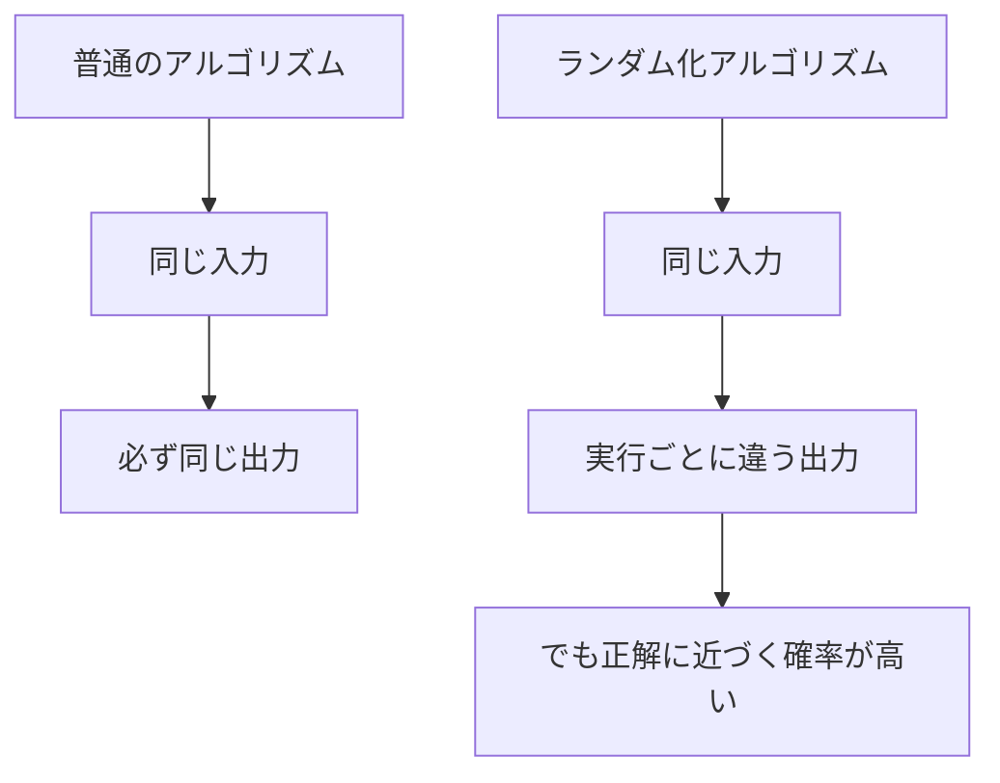
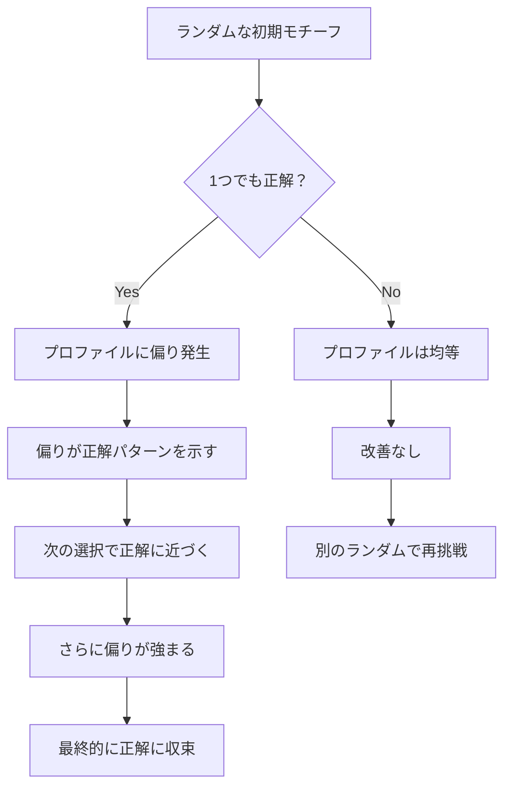
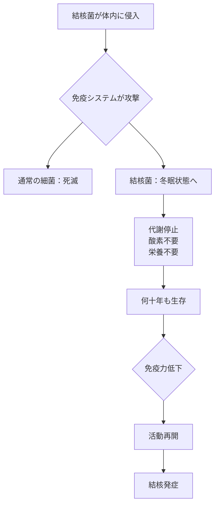

# サイコロを振ってモチーフを見つける方法（超詳細版）- なぜランダムが正解を導くのか

## 🎯 まず、この講義で何を学ぶのか

最終ゴール：**サイコロを振る**（ランダムに選ぶ）という一見いい加減な方法で、正確にDNAモチーフを見つける方法を学びます。

でも、ちょっと待ってください。そもそも..。

## 🤔 ステップ0：なぜサイコロを振る必要があるの？

### 前回の問題を思い出してみよう

```
前回学んだモチーフ列挙アルゴリズム：
✓ 確実に正解を見つける
✗ でも計算量が膨大（指数的）
✗ k=15が限界

現実の問題：
- モチーフの長さが分からない（k=8？20？）
- 全てを試すには時間がかかりすぎる
```

### サイコロを振る？ 本当に？

```
あなたの直感：
「サイコロ = ランダム = いい加減 = 正確じゃない」

でも実は...
「サイコロ × 1000回 = 統計的に正しい答えに収束」

例：コイン投げ
1回：表か裏か分からない（50%）
1000回：約500回ずつ（確率の法則）
```

## 📖 ステップ1：ランダム化アルゴリズムの基本アイデア

### 1-1. 普通のアルゴリズムとの違い



### 1-2. なぜランダムが有効なの？

アナロジー：迷路を解く方法

```
方法1：総当たり（前回の方法）
全ての道を試す → 確実だが時間がかかる

方法2：ランダムウォーク（今回の方法）
適当に歩き回る → 運が良ければすぐ出口
                → 何度も試せば必ず出口に到達
```

### 1-3. 生物学でのランダムの重要性

```
実は生物もランダムを使っている！

免疫システム：
- ランダムに抗体を作る
- 病原体に合うものが偶然できる
- それを大量生産

進化：
- ランダムな突然変異
- 有利なものが生き残る
- 結果的に適応
```

## 🔄 ステップ2：プロファイルとモチーフの相互変換

### 2-1. まず用語を整理しよう

```python
# モチーフ（Motifs）：各配列から選んだk-merの集合
motifs = [
    "ATGC",  # 配列1から選んだ4-mer
    "ATGC",  # 配列2から選んだ4-mer
    "ACGC",  # 配列3から選んだ4-mer
    "ATGT"   # 配列4から選んだ4-mer
]

# プロファイル（Profile）：各位置の文字の頻度
profile = {
    #    位置1  位置2  位置3  位置4
    'A': [1.0,  0.0,  0.0,  0.0],
    'C': [0.0,  0.25, 0.0,  0.75],
    'G': [0.0,  0.0,  1.0,  0.0],
    'T': [0.0,  0.75, 0.0,  0.25]
}
```

### 2-2. プロファイル → モチーフの変換

```python
def profile_to_motifs(profile, dna_list):
    """
    プロファイルを使って、各配列から最も確率の高いk-merを選ぶ

    なぜこれができる？
    プロファイル = 「理想的なパターン」の統計情報
    → 各配列でこれに最も近いものを選べばいい
    """
    motifs = []

    for dna in dna_list:
        best_kmer = None
        best_probability = -1

        # 各位置のk-merの確率を計算
        for i in range(len(dna) - k + 1):
            kmer = dna[i:i+k]

            # このk-merがプロファイルにどれだけ合うか
            probability = 1.0
            for j, nucleotide in enumerate(kmer):
                probability *= profile[nucleotide][j]

            if probability > best_probability:
                best_probability = probability
                best_kmer = kmer

        motifs.append(best_kmer)

    return motifs
```

### 2-3. モチーフ → プロファイルの変換

```python
def motifs_to_profile(motifs):
    """
    モチーフ集合から頻度プロファイルを作る

    なぜこれが重要？
    複数のモチーフの「平均的な特徴」を抽出
    → 次の探索の指針になる
    """
    k = len(motifs[0])
    t = len(motifs)

    profile = {'A': [], 'C': [], 'G': [], 'T': []}

    for j in range(k):  # 各位置について
        column = [motifs[i][j] for i in range(t)]

        for nucleotide in 'ACGT':
            count = column.count(nucleotide)
            frequency = count / t
            profile[nucleotide].append(frequency)

    return profile
```

## 💡 ステップ3：ランダム化モチーフ探索の仕組み

### 3-1. アルゴリズムの全体像

```python
def randomized_motif_search(dna_list, k, t):
    """
    ランダムから始めて、徐々に改善していく
    """
    # ステップ1：完全にランダムなモチーフから始める
    motifs = select_random_motifs(dna_list, k)
    best_motifs = motifs

    # ステップ2：改善ループ
    while True:
        # プロファイルを作る
        profile = motifs_to_profile(motifs)

        # プロファイルから新しいモチーフを作る
        motifs = profile_to_motifs(profile, dna_list)

        # 改善されたか確認
        if score(motifs) < score(best_motifs):
            best_motifs = motifs
        else:
            # 改善されなくなったら終了
            return best_motifs
```

### 3-2. でも、なぜこれで上手くいくの？

ここが**魔法のような部分**です！

```
疑問：完全にランダムから始めて、なぜ正解にたどり着ける？
```

## 🎲 ステップ4：ランダムの魔法を理解する

### 4-1. 具体例で考えてみよう

```python
# 例：4つの配列に埋め込まれたモチーフ "ACGT"（1文字変異あり）
sequences = [
    "TTACGTAA",  # 位置2にACGT
    "GGACGCTT",  # 位置2にACGC（1文字変異）
    "CCAACGTG",  # 位置3にAACGT（1文字変異）
    "AAACGTCC"   # 位置2にACGT
]

# ランダムに選んだ初期モチーフ（ほとんど外れ）
random_motifs = [
    "TTAC",  # 間違い（正解はACGT）
    "GGAC",  # 間違い（正解はACGC）
    "CCAA",  # 間違い（正解はACGT）
    "ACGT"   # 偶然正解！
]
```

### 4-2. たった1つの正解がもたらす偏り

```python
# このランダムモチーフからプロファイルを作ると...
profile = motifs_to_profile(random_motifs)

# 位置1の頻度を見てみると：
# T: 1/4, G: 1/4, C: 1/4, A: 1/4  → でも待って！
# 実際は：
# T: 1/4, G: 1/4, C: 1/4, A: 1/4
# あれ？均等？

# でも位置2を見ると：
# T: 1/4, G: 1/4, A: 1/4, C: 1/4
# 実際は：
# T: 1/4, G: 1/4, C: 2/4, A: 0/4
# Cが多い！これが埋め込まれたパターンのC！
```

### 4-3. 偏りが正解を引き寄せる



## 🔍 ステップ5：なぜ「偏り」が重要なのか

### 5-1. 偏りの数学的意味

```python
def calculate_bias(profile, true_pattern="ACGT"):
    """
    プロファイルがどれだけ真のパターンに偏っているか
    """
    bias_score = 0

    for i, nucleotide in enumerate(true_pattern):
        # その位置でのnucleotideの確率
        probability = profile[nucleotide][i]

        # 期待値（ランダムなら0.25）との差
        bias = probability - 0.25
        bias_score += bias

    return bias_score

# 完全にランダムなプロファイル
random_profile = {
    'A': [0.25, 0.25, 0.25, 0.25],
    'C': [0.25, 0.25, 0.25, 0.25],
    'G': [0.25, 0.25, 0.25, 0.25],
    'T': [0.25, 0.25, 0.25, 0.25]
}
print(f"ランダムの偏り：{calculate_bias(random_profile)}")
# 結果：0

# 1つ正解を含むプロファイル
biased_profile = {
    'A': [0.5,  0.25, 0.25, 0.25],  # Aが多い
    'C': [0.25, 0.5,  0.25, 0.25],  # Cが多い
    'G': [0.25, 0.25, 0.5,  0.25],  # Gが多い
    'T': [0.25, 0.25, 0.25, 0.5]   # Tが多い
}
print(f"偏りありプロファイル：{calculate_bias(biased_profile)}")
# 結果：1.0（正の偏り！）
```

### 5-2. 偏りの増幅効果

```
初回：1/10のモチーフが正解
↓
プロファイルに小さな偏り（10%）
↓
次回：3/10のモチーフが正解に近づく
↓
プロファイルの偏りが増大（30%）
↓
その次：6/10のモチーフが正解に
↓
偏りがさらに増大（60%）
↓
最終的に：10/10が正解！
```

## 🦠 ステップ6：実例 - 結核菌はどうやって冬眠するのか

### 6-1. 結核という病気の恐ろしさ

```
19世紀ヨーロッパ：人口の1/4が結核で死亡
現在：世界人口の1/3が結核菌を保有
     （でも発病するのは一部）

なぜ？
→ 結核菌は「冬眠」できる！
```

### 6-2. 結核菌の生存戦略



### 6-3. 冬眠の秘密を探る

```python
# 実験：酸素を奪うとどの遺伝子が活性化する？
hypoxia_genes = [
    "gene1_upstream_sequence...",  # 低酸素で活性化
    "gene2_upstream_sequence...",  # 低酸素で活性化
    # ... 約25個の遺伝子
]

# 疑問：これらの遺伝子に共通するモチーフは？
# → 冬眠スイッチの正体！
```

## 📊 ステップ7：どのモチーフが正しいか - エントロピーという指標

### 7-1. モチーフの長さ問題

```python
# k=8で探索
result_k8 = randomized_motif_search(hypoxia_genes, k=8)
# 結果：ATGATCAA

# k=12で探索
result_k12 = randomized_motif_search(hypoxia_genes, k=12)
# 結果：ATGATCAAGCTT

# k=20で探索
result_k20 = randomized_motif_search(hypoxia_genes, k=20)
# 結果：ATGATCAAGCTTGCGTATGC

# どれが正しい？
```

### 7-2. エントロピーとは何か

まず日常的な例から：

```
例1：全員が同じ答えのアンケート
「朝食は？」→ 全員「パン」
→ 情報量少ない（予測可能）
→ エントロピー低い

例2：バラバラな答えのアンケート
「朝食は？」→ パン、ご飯、シリアル、なし...
→ 情報量多い（予測困難）
→ エントロピー高い
```

### 7-3. モチーフのエントロピー計算

```python
import math

def calculate_entropy(column):
    """
    1つの位置（列）のエントロピーを計算

    エントロピー = -Σ(p_i × log2(p_i))
    """
    counts = {'A': 0, 'C': 0, 'G': 0, 'T': 0}

    # 各文字の出現回数を数える
    for nucleotide in column:
        counts[nucleotide] += 1

    # 確率に変換してエントロピー計算
    entropy = 0
    total = len(column)

    for count in counts.values():
        if count > 0:
            p = count / total
            entropy -= p * math.log2(p)

    return entropy

# 例：完全に保存された列
conserved = ['A', 'A', 'A', 'A']
print(f"保存列のエントロピー：{calculate_entropy(conserved)}")
# 結果：0（情報が確定的）

# 例：完全にランダムな列
random = ['A', 'C', 'G', 'T']
print(f"ランダム列のエントロピー：{calculate_entropy(random)}")
# 結果：2（最大の不確実性）
```

### 7-4. なぜエントロピーが重要か

```
生物学的に意味のあるモチーフ
↓
進化的に保存されている
↓
変異が少ない
↓
エントロピーが低い

逆に、偶然見つかったパターン
↓
保存されていない
↓
バラバラ
↓
エントロピーが高い
```

## 🎨 ステップ8：モチーフロゴ - 視覚的な理解

### 8-1. モチーフロゴとは

```
各位置での文字の重要度を視覚化

高さ = 2 - エントロピー
（情報量を表す）

文字の大きさ = その文字の頻度
```

### 8-2. ロゴの読み方

```
位置1：  A（巨大）
       C,G,T（極小）
→ ほぼ必ずA

位置2：  C（大）
       G（中）
       A,T（小）
→ Cが多いが、Gもあり

位置3：  全部同じ大きさ
→ どの文字でもOK（重要でない位置）
```

## 🔬 ステップ9：結核菌データでの実際の結果

### 9-1. アルゴリズムの比較

```python
# 実際の結核菌データで実行
true_motif = "TCGGGGATTTCC"  # 実験で確認された真のモチーフ

# モチーフ列挙（前回の方法）
enumeration_result = "TCGGGGAT----"  # 後半が見つからない

# ランダム化モチーフ探索（今回の方法）
random_search_result = "TCGGGGATTTCC"  # 完全に一致！

# なぜランダムの方が良い結果？
# → 局所的な最適解にとらわれない
# → 何度も試すことで真の答えに近づく
```

### 9-2. 成功の理由

```
1. 完全性よりも確率的な正しさ
   列挙：全て調べるが、計算量の制限でk≤12
   ランダム：k=20でも探索可能

2. ノイズへの耐性
   列挙：ノイズも真のパターンも同等に扱う
   ランダム：統計的に真のパターンが浮かび上がる

3. 実用性
   列挙：1回の実行に数時間
   ランダム：数秒×1000回 = 実用的な時間
```

## 💭 ステップ10：なぜランダムが生物学で重要か

### 10-1. 生物自身もランダムを使う

```
DNA修復：
- ランダムにDNAをチェック
- 傷を見つけたら修復
- 統計的に全体をカバー

免疫システム：
- ランダムに抗体を生成
- 病原体に合うものを選択
- 効率的な防御

進化：
- ランダムな突然変異
- 有利なものが生存
- 最適化without設計
```

### 10-2. ランダムアルゴリズムの哲学

```
決定的アルゴリズム：
「必ず正解を見つける」
→ でも時間がかかりすぎることも

ランダムアルゴリズム：
「高確率で正解を見つける」
→ 実用的な時間で解ける

どちらを選ぶ？
→ 問題による！
```

## 📝 まとめ：今日学んだことを整理

### レベル1：基本概念の理解

```
ランダム化アルゴリズム
↓
サイコロを振って初期値を選ぶ
↓
でも統計的に正解に収束
```

### レベル2：アルゴリズムの仕組み

```
1. ランダムなモチーフから開始
2. モチーフ→プロファイル変換
3. プロファイル→より良いモチーフ
4. 改善がなくなるまで繰り返し
5. 全体を何度も試行
```

### レベル3：なぜ成功するか

```
埋め込まれたパターンの存在
↓
ランダム選択でも一部は正解に近い
↓
プロファイルに偏りが生じる
↓
偏りが正解を引き寄せる
↓
収束！
```

### レベル4：実用的な知見

```
- エントロピーでモチーフの質を評価
- モチーフロゴで視覚化
- 実際の生物学データで有効
- 計算時間が現実的
```

## 🚀 次回予告：ギブスサンプラー

### さらに賢いランダム化

```
今回：全モチーフを一度に更新
次回：1つずつ更新（ギブスサンプラー）

なぜ1つずつ？
→ より細かい調整が可能
→ 局所最適を避けやすい
→ 収束が速い
```

### 考えてみてください

1. **なぜ全部一度に更新しない方が良い場合がある？**
2. **サンプリングの順番は重要？**
3. **温度パラメータとは？**

これらの答えは次回明らかに！

## 🎲 最後に：ランダムの深い意味

```
ランダム = 無秩序？
いいえ！
ランダム = 全ての可能性を公平に探索

だから...
ランダム × 繰り返し = 真実の発見

これが確率的アルゴリズムの美しさです。
```
