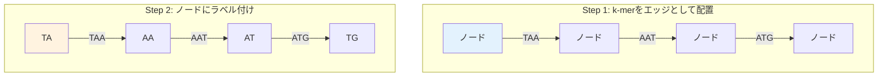

# オイラー経路問題：革命的な解決策

## 🎯 この講義で学ぶこと

**最終ゴール**: De Bruijnグラフとオイラー経路を使って、ゲノムアセンブリ問題を効率的に解く方法を理解する

でも、ちょっと待ってください。なぜハミルトニアン経路を諦めて、オイラー経路に切り替えるのでしょうか？

## 🔄 ステップ0：運命の異なる2つの類似問題

### 見た目は似ているが

```text
ハミルトニアン経路問題:
すべての「ノード」を1回ずつ訪問する経路を見つける

オイラー経路問題:
すべての「エッジ」を1回ずつ通過する経路を見つける
```

この違いは表面的で重要でないように見えます。しかし...

### アルゴリズムの運命の違い

```python
def compare_problems():
    """2つの問題の計算複雑性を比較"""

    print("=== アルゴリズムの運命 ===")
    print()

    print("ハミルトニアン経路問題:")
    print("  • NP完全問題")
    print("  • 効率的なアルゴリズム: ❌ 知られていない")
    print("  • 世代にわたるコンピューター科学者が挑戦するも未解決")
    print("  • 千年紀問題の一つ（100万ドルの懸賞金！）")
    print()

    print("オイラー経路問題:")
    print("  • 多項式時間で解ける")
    print("  • 効率的なアルゴリズム: ✅ 存在する！")
    print("  • 1736年にオイラーが解法を発見")
    print("  • 線形時間O(E)で解ける（E=エッジ数）")
    print()

    print("結論:")
    print("→ 見た目は似ているが、計算の難しさは天と地の差！")

compare_problems()
```

## 💡 ステップ1：不自然だが革命的なアプローチ

### 1-1. 発想の転換

```python
def paradigm_shift():
    """ハミルトニアンからオイラーへの発想転換"""

    print("従来のアプローチ（ハミルトニアン）:")
    print("  k-mer = ノード")
    print("  オーバーラップ = エッジ")
    print("  → すべてのノードを訪問")
    print()

    print("新しいアプローチ（オイラー）:")
    print("  (k-1)-mer = ノード")
    print("  k-mer = エッジ")
    print("  → すべてのエッジを通過")
    print()

    # 具体例
    kmer = "ATG"
    prefix = kmer[:-1]  # "AT"
    suffix = kmer[1:]   # "TG"

    print(f"例: k-mer '{kmer}' は")
    print(f"    ノード '{prefix}' から")
    print(f"    ノード '{suffix}' への")
    print(f"    エッジになる")

paradigm_shift()
```

### 1-2. グラフの変換プロセス



## 🧬 ステップ2：De Bruijnグラフの構築

### 2-1. De Bruijnグラフとは？

```python
def explain_de_bruijn():
    """De Bruijnグラフの概念を説明"""

    print("De Bruijnグラフの特徴:")
    print()
    print("1. ノード = (k-1)-mer")
    print("2. エッジ = k-mer")
    print("3. 魔法のトリック: 同じラベルのノードを「接着」する")
    print()

    # 例
    kmers = ["TAA", "AAT", "ATG", "TGC", "GCA", "CAT", "ATG", "TGG"]

    print("k-merリスト:", kmers)
    print()
    print("各k-merから(k-1)-merを抽出:")

    nodes = set()
    for kmer in kmers:
        prefix = kmer[:-1]
        suffix = kmer[1:]
        nodes.add(prefix)
        nodes.add(suffix)
        print(f"  {kmer}: {prefix} → {suffix}")

    print()
    print(f"ユニークなノード: {sorted(nodes)}")
    print(f"ノード数: {len(nodes)} (k-mer数{len(kmers)}より少ない！)")

explain_de_bruijn()
```

### 2-2. ノードの「接着」プロセス

```python
def demonstrate_gluing():
    """同じラベルのノードを接着するプロセス"""

    # 元の経路グラフ（接着前）
    path = "TAATGGGATGTT"
    k = 3

    print(f"元のゲノム: {path}")
    print()
    print("接着前（経路グラフ）:")

    # k-merとノードを表示
    for i in range(len(path) - k + 1):
        kmer = path[i:i+k]
        prefix = kmer[:-1]
        suffix = kmer[1:]
        print(f"  位置{i:2}: {prefix} →[{kmer}]→ {suffix}")

    print()
    print("同じラベルのノードを数える:")

    from collections import Counter

    nodes = []
    for i in range(len(path) - k + 1):
        kmer = path[i:i+k]
        nodes.append(kmer[:-1])
        nodes.append(kmer[1:])

    node_counts = Counter(nodes)
    for node, count in sorted(node_counts.items()):
        if count > 1:
            print(f"  '{node}': {count}回出現 → 1つに接着！")

    print()
    print("接着後: De Bruijnグラフが完成")
    print("  • ノード数が減少")
    print("  • グラフが単純化")
    print("  • でもゲノム情報は保持！")

demonstrate_gluing()
```

## 🌉 ステップ3：なぜこれが革命的なのか？

### 3-1. ケーニヒスベルクの橋問題を思い出そう

```python
def konigsberg_connection():
    """ケーニヒスベルクの橋とゲノムアセンブリの関連"""

    print("ケーニヒスベルクの橋問題（1736年）:")
    print("  問題: 7つの橋をすべて1回ずつ渡れるか？")
    print("  オイラーの答え: 不可能")
    print("  理由: 奇数次数の頂点が4つある")
    print()
    print("オイラーの定理:")
    print("  • 奇数次数の頂点が0個 → オイラー閉路が存在")
    print("  • 奇数次数の頂点が2個 → オイラー路が存在")
    print("  • それ以外 → オイラー路は存在しない")
    print()
    print("ゲノムアセンブリへの応用:")
    print("  • 各k-merは必ず1回使われる → 各エッジを1回通過")
    print("  • 始点と終点以外は入次数=出次数")
    print("  • → オイラー路が存在する条件を満たす！")

konigsberg_connection()
```

### 3-2. 計算効率の劇的な改善

```python
def efficiency_comparison():
    """ハミルトニアン vs オイラーの効率比較"""

    import math

    # パラメータ
    genome_size = 1000
    k = 10
    num_kmers = genome_size - k + 1

    print(f"ゲノムサイズ: {genome_size}")
    print(f"k-mer数: {num_kmers}")
    print()

    # ハミルトニアン経路
    print("ハミルトニアン経路アプローチ:")
    print(f"  ノード数: {num_kmers}")
    print(f"  最悪計算量: O({num_kmers}!) = 10^{int(num_kmers * math.log10(num_kmers))}")
    print("  実用性: ❌ 20ノード程度が限界")
    print()

    # オイラー経路
    num_nodes = 4 ** (k-1)  # 最大(k-1)-mer数
    print("オイラー経路アプローチ（De Bruijn）:")
    print(f"  ノード数: 最大{num_nodes}（実際はもっと少ない）")
    print(f"  計算量: O(エッジ数) = O({num_kmers})")
    print("  実用性: ✅ 数百万のk-merでも処理可能")

    # 時間の違い
    print()
    print("1000個のk-merを処理する時間（推定）:")
    print("  ハミルトニアン: 宇宙の年齢を超える")
    print("  オイラー: 1秒未満")

efficiency_comparison()
```

## 🔍 ステップ4：De Bruijnグラフの実装

### 4-1. グラフの構築

```python
def build_de_bruijn_graph(kmers):
    """k-merリストからDe Bruijnグラフを構築"""

    from collections import defaultdict

    graph = defaultdict(list)

    for kmer in kmers:
        # k-merを(k-1)-merのペアに分解
        prefix = kmer[:-1]  # 最初のk-1文字
        suffix = kmer[1:]   # 最後のk-1文字

        # エッジを追加（同じエッジが複数回現れる可能性あり）
        graph[prefix].append(suffix)

    return dict(graph)

# 例
kmers = ["AAT", "ATG", "TGC", "GCA", "CAT", "ATG", "TGG", "GGA"]
de_bruijn = build_de_bruijn_graph(kmers)

print("De Bruijnグラフ:")
for node, edges in sorted(de_bruijn.items()):
    print(f"  {node} → {edges}")

# グラフの特性を分析
total_edges = sum(len(edges) for edges in de_bruijn.values())
print(f"\nノード数: {len(de_bruijn)}")
print(f"エッジ数: {total_edges}")
print(f"元のk-mer数: {len(kmers)}")
```

### 4-2. オイラー路の探索

```python
def find_euler_path(graph):
    """De Bruijnグラフでオイラー路を見つける"""

    from collections import defaultdict, deque

    # グラフをコピー（破壊的変更を避けるため）
    g = defaultdict(list)
    in_degree = defaultdict(int)
    out_degree = defaultdict(int)

    for node, edges in graph.items():
        g[node] = edges.copy()
        out_degree[node] = len(edges)
        for edge in edges:
            in_degree[edge] += 1

    # 開始ノードを見つける（出次数 > 入次数）
    start = None
    for node in set(list(in_degree.keys()) + list(out_degree.keys())):
        if out_degree[node] - in_degree[node] == 1:
            start = node
            break

    # 開始ノードが見つからない場合は任意のノードから
    if start is None:
        start = next(iter(g))

    # Hierholzerのアルゴリズム
    stack = [start]
    path = []

    while stack:
        v = stack[-1]
        if g[v]:
            u = g[v].pop()
            stack.append(u)
        else:
            path.append(stack.pop())

    return path[::-1]

# オイラー路を見つけて、ゲノムを再構築
euler_path = find_euler_path(de_bruijn)
print("\nオイラー路:")
print(" → ".join(euler_path))

# ゲノムを再構築
if euler_path:
    genome = euler_path[0]
    for node in euler_path[1:]:
        genome += node[-1]  # 最後の文字を追加
    print(f"\n再構築されたゲノム: {genome}")
```

## 📊 ステップ5：実際の例で理解を深める

### 5-1. 完全な例

```python
def complete_example():
    """完全な例：ゲノムからDe Bruijnグラフ、そして再構築まで"""

    original_genome = "TAATGCCATGGGATGTT"
    k = 3

    print(f"元のゲノム: {original_genome}")
    print(f"長さ: {len(original_genome)}")
    print()

    # Step 1: k-merを抽出
    kmers = []
    for i in range(len(original_genome) - k + 1):
        kmers.append(original_genome[i:i+k])

    print(f"k-mer数: {len(kmers)}")
    print(f"k-merリスト: {kmers}")
    print()

    # Step 2: De Bruijnグラフを構築
    from collections import defaultdict
    graph = defaultdict(list)

    for kmer in kmers:
        prefix = kmer[:-1]
        suffix = kmer[1:]
        graph[prefix].append(suffix)

    print("De Bruijnグラフ:")
    for node, edges in sorted(graph.items()):
        print(f"  {node} → {edges}")

    # Step 3: グラフの特性を確認
    print()
    print(f"ノード数: {len(graph)} (k-mer数{len(kmers)}より大幅に少ない)")
    print(f"エッジ数: {sum(len(e) for e in graph.values())}")

    # Step 4: オイラー路の存在条件を確認
    in_deg = defaultdict(int)
    out_deg = defaultdict(int)

    for node, edges in graph.items():
        out_deg[node] = len(edges)
        for edge in edges:
            in_deg[edge] += 1

    odd_nodes = []
    for node in set(list(in_deg.keys()) + list(out_deg.keys())):
        if in_deg[node] != out_deg[node]:
            odd_nodes.append(node)

    print()
    print(f"次数が異なるノード: {len(odd_nodes)}個")
    if len(odd_nodes) <= 2:
        print("→ オイラー路が存在する！✅")
    else:
        print("→ オイラー路が存在しない可能性❌")

complete_example()
```

### 5-2. なぜDe Bruijnグラフは効率的なのか

```python
def why_efficient():
    """De Bruijnグラフの効率性の秘密"""

    print("De Bruijnグラフが効率的な理由:")
    print()

    print("1. ノード数の削減:")
    print("   • ハミルトニアン: k-mer数がノード数")
    print("   • De Bruijn: (k-1)-merがノード（重複は1つに）")
    print("   → 大幅にノード数が減少")
    print()

    print("2. 問題の変換:")
    print("   • NP完全問題 → 多項式時間問題")
    print("   • 指数時間 → 線形時間")
    print()

    print("3. 実装の単純さ:")
    print("   • グラフ構築: O(n)")
    print("   • オイラー路探索: O(E)")
    print("   • 全体: O(n) where n = k-mer数")
    print()

    print("4. メモリ効率:")
    print("   • 隣接リスト表現で効率的")
    print("   • 大規模ゲノムでも処理可能")

why_efficient()
```

## 🎯 まとめ：今日学んだことを整理

### レベル1：基礎理解

- **オイラー経路**: すべてのエッジを1回ずつ通過
- **De Bruijnグラフ**: (k-1)-merがノード、k-merがエッジ
- 同じノードを「接着」してグラフを単純化

### レベル2：なぜ革命的か

- ハミルトニアン（NP完全）→ オイラー（線形時間）
- 見た目は似ているが、計算の難しさは天と地の差
- 1736年のオイラーの発見が現代のゲノム解析に応用

### レベル3：実践的な利点

- 数百万のk-merでも数秒で処理
- メモリ効率的
- 実装が単純で確実

## 🚀 次回予告

次回は、De Bruijnグラフの実践的な応用を学びます：

- **実際のゲノムアセンブラー**の仕組み
- **エラー処理**と**リピート問題**への対処
- 最新のシーケンシング技術との組み合わせ

「理論から実践へ」- 実際のゲノムプロジェクトでの応用をお楽しみに！
