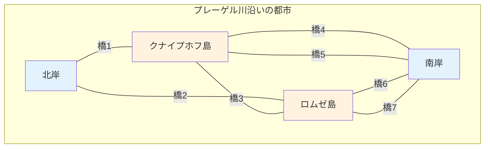
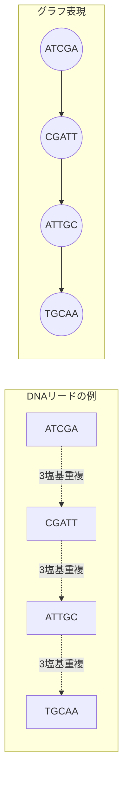
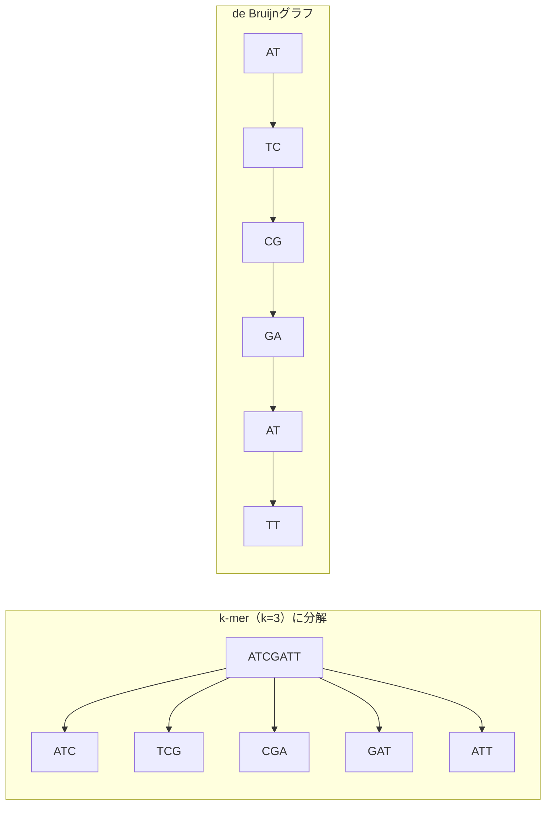

# オイラーグラフとゲノムアセンブリ：ロシアへの数学的遠足

## 🗺️ まず、この講義で何を学ぶのか

**最終ゴール**：オイラーの橋問題がどのようにゲノムアセンブリを可能にするかを理解する

:::tip 歴史的背景
1727年、20歳のレオンハルト・オイラーはロシアのサンクトペテルブルクに到着しました。
8年後、彼は数学史上最も重要な問題の一つを解決し、それが300年後のゲノム解読の基礎となりました。
:::

## 🌉 ステップ1：ケーニヒスベルクの7つの橋（1735年）

### 1-1. 実際の都市構造



**市民の問い**：すべての橋を1回ずつ渡って元の場所に戻れるか？

### 1-2. オイラーの革命的アプローチ

```python
def euler_abstraction():
    """オイラーの抽象化：都市をグラフに変換"""

    # 実際の都市構造
    city = {
        'places': ['北岸', 'クナイプホフ島', 'ロムゼ島', '南岸'],
        'bridges': 7
    }

    # 数学的抽象化
    graph = {
        '北岸': 3,         # 接続する橋の数
        'クナイプホフ島': 5,
        'ロムゼ島': 3,
        '南岸': 3
    }

    print("オイラーの洞察:")
    print("1. 場所 → グラフの頂点")
    print("2. 橋 → グラフの辺")
    print("3. 問題 → すべての辺を1回ずつ通る経路の存在")

    return graph

graph = euler_abstraction()
```

### 1-3. オイラーの定理

```python
def euler_theorem(graph):
    """オイラー路・オイラー閉路の存在条件"""

    odd_degree_vertices = []

    for vertex, degree in graph.items():
        if degree % 2 == 1:
            odd_degree_vertices.append(vertex)

    num_odd = len(odd_degree_vertices)

    if num_odd == 0:
        result = "オイラー閉路が存在（始点に戻れる）"
    elif num_odd == 2:
        result = f"オイラー路が存在（{odd_degree_vertices[0]}から{odd_degree_vertices[1]}へ）"
    else:
        result = f"オイラー路は存在しない（奇数次数の頂点が{num_odd}個）"

    return result, odd_degree_vertices

# ケーニヒスベルクの場合
konigsberg_graph = {'北岸': 3, 'クナイプホフ島': 5, 'ロムゼ島': 3, '南岸': 3}
result, odd_vertices = euler_theorem(konigsberg_graph)
print(f"結果: {result}")
print(f"奇数次数の頂点: {odd_vertices}")
# 出力:
# 結果: オイラー路は存在しない（奇数次数の頂点が4個）
# 奇数次数の頂点: ['北岸', 'クナイプホフ島', 'ロムゼ島', '南岸']
```

## 🧬 ステップ2：DNAリードからグラフへの変換

### 2-1. ゲノムアセンブリの現実的な問題

```python
def genome_assembly_challenge():
    """ゲノムアセンブリの規模を理解"""

    genome_length = 3_000_000_000  # 30億塩基
    read_length = 300  # 現代のシーケンサーの典型的な長さ
    coverage = 30  # 各位置を何回読むか（精度のため）

    num_reads = (genome_length * coverage) // read_length

    print(f"ゲノム長: {genome_length:,}塩基")
    print(f"リード長: {read_length}塩基")
    print(f"必要なリード数: {num_reads:,}")
    print(f"\nこれは{num_reads:,}個の橋を持つ都市を歩くようなもの！")

    return num_reads

num_reads = genome_assembly_challenge()
```

### 2-2. オーバーラップグラフの構築



```python
def build_overlap_graph(reads):
    """リードからオーバーラップグラフを構築"""

    graph = {}
    overlap_length = 3  # 最小オーバーラップ長

    for i, read1 in enumerate(reads):
        graph[read1] = []
        for j, read2 in enumerate(reads):
            if i != j:
                # read1の末尾とread2の先頭が重なるか
                if read1[-overlap_length:] == read2[:overlap_length]:
                    graph[read1].append(read2)

    return graph

# 例
reads = ["ATCGA", "CGATT", "ATTGC", "TGCAA"]
overlap_graph = build_overlap_graph(reads)

for read, neighbors in overlap_graph.items():
    if neighbors:
        print(f"{read} → {neighbors}")
# 出力:
# ATCGA → ['CGATT']
# CGATT → ['ATTGC']
# ATTGC → ['TGCAA']
```

## 🎯 ステップ3：de Bruijnグラフという革命

### 3-1. なぜオーバーラップグラフでは不十分か

```python
def overlap_graph_problem():
    """オーバーラップグラフの計算量問題"""

    n_reads = 300_000_000  # 実際のゲノムプロジェクト

    # すべてのリードペアを比較
    comparisons = n_reads * (n_reads - 1) // 2

    print(f"リード数: {n_reads:,}")
    print(f"必要な比較回数: {comparisons:,}")
    print(f"1秒に100万回比較しても: {comparisons/1_000_000/60/60:.1f}時間")

overlap_graph_problem()
```

### 3-2. de Bruijnグラフの構築



```python
def build_debruijn_graph(reads, k=3):
    """de Bruijnグラフの構築"""

    # k-merを抽出
    kmers = []
    for read in reads:
        for i in range(len(read) - k + 1):
            kmers.append(read[i:i+k])

    # (k-1)-merをノードとするグラフを構築
    graph = {}
    for kmer in kmers:
        prefix = kmer[:-1]  # 最初のk-1文字
        suffix = kmer[1:]   # 最後のk-1文字

        if prefix not in graph:
            graph[prefix] = []
        graph[prefix].append(suffix)

    return graph

# 例
reads = ["ATCGATT", "CGATTGC", "ATTGCAA"]
debruijn = build_debruijn_graph(reads, k=3)

print("de Bruijnグラフ:")
for node, edges in sorted(debruijn.items()):
    print(f"  {node} → {edges}")
```

## 🚀 ステップ4：数百万の橋を持つメガシティ

### 4-1. スケールの可視化

```python
import math

def megacity_visualization():
    """ゲノムアセンブリを都市として可視化"""

    # 実際のゲノムプロジェクト
    k = 31  # 典型的なk-merサイズ
    genome_size = 3_000_000_000

    # 理論的な最大値
    max_kmers = 4 ** k  # 4種類の塩基のk文字の組み合わせ
    actual_kmers = genome_size - k + 1  # 実際のk-mer数

    print("🏙️ ゲノムアセンブリのメガシティ:")
    print(f"  都市の島（ノード）: 最大{max_kmers:.2e}個")
    print(f"  実際の島: 約{actual_kmers:.2e}個")
    print(f"  橋（エッジ）: 約{actual_kmers:.2e}本")
    print(f"\n  これはケーニヒスベルクの{actual_kmers/7:.0e}倍の規模！")

megacity_visualization()
```

### 4-2. オイラー路を見つける

```python
def find_euler_path(graph):
    """Hierholzerのアルゴリズムでオイラー路を見つける"""

    # グラフのコピーを作成
    g = {node: edges[:] for node, edges in graph.items()}

    # 開始ノードを見つける
    in_degree = {}
    out_degree = {}

    for node in g:
        out_degree[node] = len(g[node])
        in_degree[node] = 0

    for node in g:
        for neighbor in g[node]:
            in_degree[neighbor] = in_degree.get(neighbor, 0) + 1

    # オイラー路の開始点を見つける
    start = None
    for node in g:
        if out_degree.get(node, 0) - in_degree.get(node, 0) == 1:
            start = node
            break

    if start is None:
        start = list(g.keys())[0]

    # Hierholzerのアルゴリズム
    stack = [start]
    path = []

    while stack:
        curr = stack[-1]
        if curr in g and g[curr]:
            next_node = g[curr].pop(0)
            stack.append(next_node)
        else:
            path.append(stack.pop())

    return path[::-1]

# 小さな例で実演
small_graph = {
    'AT': ['TC', 'TG'],
    'TC': ['CG'],
    'TG': ['GC'],
    'CG': ['GA'],
    'GC': ['CA'],
    'GA': ['AT'],
    'CA': ['AT']
}

euler_path = find_euler_path(small_graph)
print("オイラー路:")
print(" → ".join(euler_path))
```

## 📊 ステップ5：実世界での応用

### 5-1. 実際のゲノムプロジェクトでの使用

```python
def real_world_application():
    """実際のゲノムプロジェクトの統計"""

    projects = {
        'ヒトゲノム計画（2003）': {
            'size': 3_000_000_000,
            'cost': 2_700_000_000,  # ドル
            'time': 13  # 年
        },
        '現代のヒトゲノム（2024）': {
            'size': 3_000_000_000,
            'cost': 1_000,  # ドル
            'time': 0.004  # 年（約1.5日）
        }
    }

    print("ゲノム配列決定の進化:")
    for name, stats in projects.items():
        print(f"\n{name}:")
        print(f"  サイズ: {stats['size']:,}塩基")
        print(f"  コスト: ${stats['cost']:,}")
        print(f"  時間: {stats['time']}年")

    # コスト削減率
    cost_reduction = projects['ヒトゲノム計画（2003）']['cost'] / projects['現代のヒトゲノム（2024）']['cost']
    print(f"\nコスト削減: {cost_reduction:,.0f}倍！")
    print("これはオイラーのアルゴリズムの効率性のおかげです")

real_world_application()
```

### 5-2. なぜオイラーなしではゲノムアセンブリが不可能か

```python
def why_euler_essential():
    """オイラーのアプローチの重要性"""

    approaches = {
        'ブルートフォース': {
            'complexity': 'O(n!)',  # nはリード数
            'feasible': False,
            'reason': '組み合わせ爆発'
        },
        'オーバーラップグラフ': {
            'complexity': 'O(n²)',
            'feasible': 'Limited',
            'reason': '比較回数が多すぎる'
        },
        'de Bruijnグラフ + オイラー路': {
            'complexity': 'O(n)',
            'feasible': True,
            'reason': '線形時間で解ける！'
        }
    }

    print("アプローチ比較:")
    for name, details in approaches.items():
        print(f"\n{name}:")
        print(f"  計算量: {details['complexity']}")
        print(f"  実用性: {details['feasible']}")
        print(f"  理由: {details['reason']}")

    return approaches

why_euler_essential()
```

## 🎓 まとめ：287年の時を超えて

### レベル1：歴史的理解

- 1735年：オイラーがケーニヒスベルクの橋問題を解決
- グラフ理論の誕生
- 「すべての辺を1回ずつ通る」という概念の定式化

### レベル2：理論的理解

- オイラー路の存在条件（奇数次数の頂点が0個か2個）
- de Bruijnグラフによるゲノムの表現
- k-merを使った効率的なグラフ構築

### レベル3：実装理解

- Hierholzerのアルゴリズムによるオイラー路の発見
- O(n)時間での経路探索
- 数百万のDNAリードの効率的な処理

## 🚀 次回予告

次回は「**de Bruijnグラフの実装**」に焦点を当て、
実際のDNAシーケンスデータを使ってゲノムを組み立てる方法を学びます！

:::info 重要な洞察
オイラーは橋の問題を解いただけでなく、**問題を抽象化する**という
数学的思考法を確立しました。これが300年後のゲノム解読を可能にしたのです。
:::

## 📚 参考資料

- Euler, L. (1736) "Solutio problematis ad geometriam situs pertinentis"
- Pevzner, P.A. et al. (2001) "An Eulerian path approach to DNA fragment assembly"
- Compeau, P. et al. (2011) "How to apply de Bruijn graphs to genome assembly"
