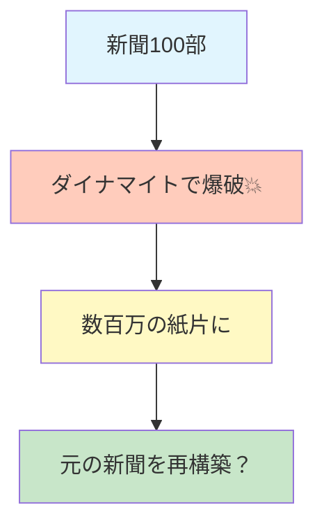
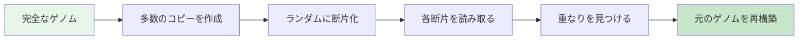
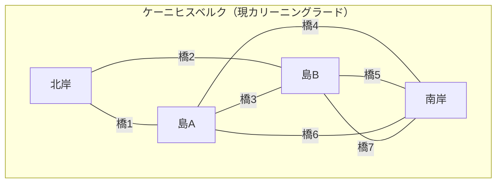
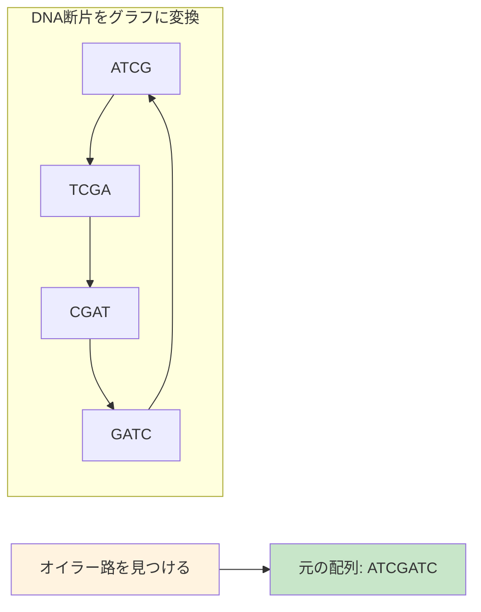
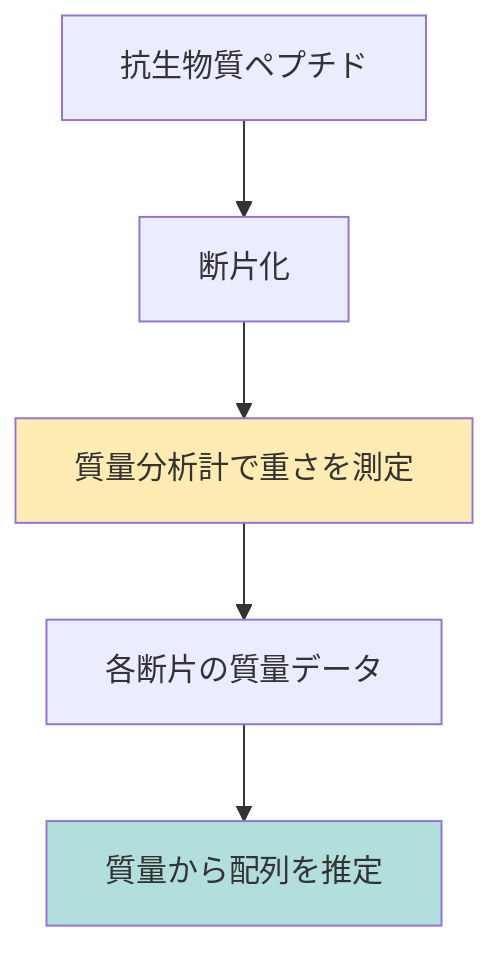

# ゲノム解読入門：30億ピースのパズルを解く

## 🎯 まず、この講義で何を学ぶのか

**最終ゴール**：ゲノム（DNAの全配列）を解読する方法を理解する

でも、ちょっと待ってください。そもそも「ゲノムを解読する」って何でしょう？

:::tip このコースで学ぶこと

1. **ゲノムアセンブリ**：数百万のDNA断片から完全なゲノムを再構築
2. **グラフ理論の応用**：ケーニヒスベルクの橋問題からゲノム解読へ
3. **抗生物質の配列決定**：質量分析を使った配列解読
   :::

## 🧬 ステップ1：ヒトゲノム計画の偉大さを理解する

### 1-1. 30億の文字を読むということ

2003年、人類は**30億ヌクレオチド**（A、T、G、C）からなるヒトゲノムの配列を解読しました。

```python
# ヒトゲノムのサイズを実感してみよう
genome_size = 3_000_000_000  # 30億塩基対
seconds_per_base = 1  # 1塩基を1秒で読むとして

reading_time_years = (genome_size * seconds_per_base) / (365 * 24 * 60 * 60)
print(f"1塩基/秒で読むと: {reading_time_years:.1f}年かかる！")
# 出力: 1塩基/秒で読むと: 95.1年かかる！
```

### 1-2. なぜゲノム解読が医療を変えるのか

- **個別化医療**：個人のゲノム情報に基づく治療
- **疾患の原因解明**：遺伝的要因の特定
- **新薬開発**：標的分子の発見

## 📰 ステップ2：新聞パズル問題で理解するゲノム配列決定

### 2-1. 奇妙な思考実験



なぜこんな例を？
→ **ゲノム配列決定もまったく同じ問題だから！**

### 2-2. DNAシーケンシングの現実

```python
# DNAシーケンシングの制約
def explain_sequencing_limitation():
    """現在の技術の限界を説明"""

    # 本のように最初から最後まで読めない！
    full_genome_length = 3_000_000_000  # 30億塩基
    readable_fragment = 1000  # 一度に読める長さ（約1000塩基）

    fragments_needed = full_genome_length // readable_fragment
    print(f"必要な断片数: {fragments_needed:,}個")
    print(f"各断片の長さ: {readable_fragment}塩基")
    print("問題：これらの断片がゲノムのどこにあるか分からない！")

    return fragments_needed

fragments = explain_sequencing_limitation()
# 出力:
# 必要な断片数: 3,000,000個
# 各断片の長さ: 1000塩基
# 問題：これらの断片がゲノムのどこにあるか分からない！
```

### 2-3. ショットガン配列決定法



**核心的な洞察**：重なり合う部分を手がかりに、パズルのピースをつなげる！

## 🌉 ステップ3：ケーニヒスベルクの橋問題との意外な関係

### 3-1. 18世紀の数学パズル



**問題**：すべての橋を1回ずつ渡って元の場所に戻れるか？

### 3-2. オイラーの革命的発見（1736年）

```python
def euler_path_exists(graph):
    """オイラー路が存在するか判定"""
    odd_degree_nodes = 0

    for node in graph:
        degree = len(graph[node])  # 接続している辺の数
        if degree % 2 == 1:
            odd_degree_nodes += 1

    # オイラー路の存在条件
    if odd_degree_nodes == 0:
        return "オイラー閉路が存在（すべての辺を1回ずつ通って戻れる）"
    elif odd_degree_nodes == 2:
        return "オイラー路が存在（すべての辺を1回ずつ通れる）"
    else:
        return "オイラー路は存在しない"

# ケーニヒスベルクの橋をグラフで表現
konigsberg = {
    '北岸': ['島A', '島B'],
    '島A': ['北岸', '島B', '島B', '南岸'],
    '島B': ['北岸', '島A', '島A', '南岸', '南岸'],
    '南岸': ['島A', '島B', '島B']
}

print(euler_path_exists(konigsberg))
# 出力: オイラー路は存在しない
```

### 3-3. ゲノムアセンブリへの応用



**驚くべき洞察**：ゲノムアセンブリ = 巨大な都市で数百万の橋を1回ずつ渡る問題！

## ⚗️ ステップ4：抗生物質の配列決定という別の挑戦

### 4-1. 小さいけど難しい問題

```python
def compare_sequencing_difficulty():
    """配列決定の難易度比較"""

    bacterial_genome = 1_000_000  # 100万塩基
    antibiotic_peptide = 10  # 10アミノ酸

    print(f"細菌ゲノム: {bacterial_genome:,}塩基 → 現在は簡単")
    print(f"抗生物質ペプチド: {antibiotic_peptide}アミノ酸 → なぜか難しい！")
    print("\n理由：読み取り方法が全く違うから")

compare_sequencing_difficulty()
```

### 4-2. 質量分析による配列決定



**核心的な問題**：

- DNAシーケンシング：文字を直接読める
- ペプチドシーケンシング：重さしか分からない！

### 4-3. ダプトマイシンの例

```python
# アミノ酸の質量（ダルトン）
amino_acid_mass = {
    'G': 57, 'A': 71, 'S': 87, 'P': 97,
    'V': 99, 'T': 101, 'C': 103, 'L': 113,
    'N': 114, 'D': 115, 'K': 128, 'E': 129,
    'M': 131, 'H': 137, 'F': 147, 'R': 156,
    'Y': 163, 'W': 186
}

def fragment_masses(peptide):
    """ペプチドの断片質量を計算"""
    masses = []
    for i in range(len(peptide)):
        for j in range(i+1, len(peptide)+1):
            fragment = peptide[i:j]
            mass = sum(amino_acid_mass[aa] for aa in fragment)
            masses.append((fragment, mass))
    return masses

# ダプトマイシン（簡略化した例）
daptomycin_fragment = "WNDG"  # 実際はもっと長い
fragments = fragment_masses(daptomycin_fragment)

print("断片と質量:")
for frag, mass in fragments[:5]:
    print(f"  {frag}: {mass} Da")
```

## 🎓 ステップ5：バイオインフォマティクスという学問

### 5-1. 講師紹介

- **Pavel Pevzner博士**（UCSD）
  - バイオインフォマティクスの第一人者
  - 「アルゴリズムの保安官」を自称
- **Phillip Compeau博士**（カーネギーメロン大学）
  - 若手研究者
  - アクティブラーニングの提唱者

### 5-2. なぜコンピュータサイエンスが必要か

```python
def why_cs_needed():
    """なぜコンピュータが必要か"""

    # 人間 vs コンピュータ
    human_comparison_per_second = 1
    computer_comparison_per_second = 1_000_000_000

    fragments = 3_000_000  # 断片数
    comparisons_needed = fragments * (fragments - 1) // 2  # 総比較回数

    human_time = comparisons_needed / human_comparison_per_second / (365*24*60*60)
    computer_time = comparisons_needed / computer_comparison_per_second / 60

    print(f"必要な比較回数: {comparisons_needed:,}")
    print(f"人間がやると: {human_time:,.0f}年")
    print(f"コンピュータなら: {computer_time:.1f}分")

why_cs_needed()
```

## 📝 まとめ：今日学んだことを整理

### レベル1：基礎理解

- ゲノム = 30億文字のテキスト
- 一度に短い断片しか読めない
- パズルのように組み立てる必要がある

### レベル2：応用理解

- ケーニヒスベルクの橋問題 = グラフ理論
- オイラー路 = ゲノムアセンブリの数学的基礎
- 質量分析 = 重さから配列を推定

### レベル3：実装理解

- ショットガン法の原理
- グラフアルゴリズムの応用
- 計算量の重要性

## 🚀 次回予告

次回は「**de Bruijnグラフ**」という革命的なアルゴリズムを学びます。
これにより、数百万の断片を効率的に組み立てる方法を理解します！

:::info 練習問題

1. なぜDNAを最初から最後まで読めないのか説明してください
2. ケーニヒスベルクの橋問題がなぜ不可能か、奇数次数の頂点から説明してください
3. 100塩基の断片が1000個ある場合、総比較回数は何回になるか計算してください
   :::

## 📚 参考資料

- [Coursera: Genome Sequencing](https://www.coursera.org/learn/genome-sequencing)
- Pevzner & Compeau 「Bioinformatics Algorithms: An Active Learning Approach」
- オイラー「ケーニヒスベルクの橋について」（1736年）
