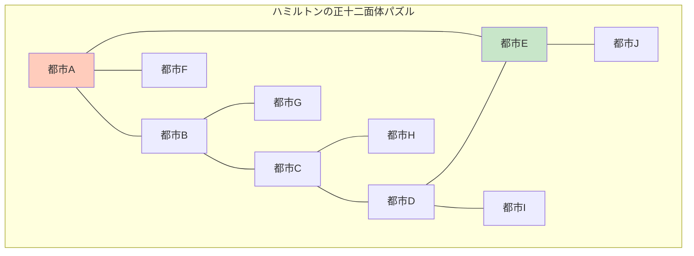

# ハミルトニアン経路問題：美しいが困難なアプローチ

## 🎯 この講義で学ぶこと

**最終ゴール**: ゲノムアセンブリをグラフ理論の問題として理解し、なぜハミルトニアン経路アプローチが魅力的だが実用的でないかを学ぶ

でも、ちょっと待ってください。「ハミルトニアン」って誰？なぜゲノムと関係があるの？

## 👨‍🔬 ステップ0：ウィリアム・ハミルトンと彼のゲーム

### 偉大な数学者のパズル

1857年、アイルランドの数学者ウィリアム・ローワン・ハミルトンは「Icosian Game」という数学パズルを発明しました。



**ルール**: すべての都市を**ちょうど1回ずつ**訪問する経路を見つけよ

## 🧬 ステップ1：ゲノムアセンブリとグラフ理論の出会い

### 1-1. k-merをノードとして表現

```python
def visualize_kmer_as_nodes():
    """k-merをグラフのノードとして視覚化"""

    genome = "TAATGGCATGGATGTT"
    k = 3

    # k-merを抽出
    kmers = []
    for i in range(len(genome) - k + 1):
        kmers.append(genome[i:i+k])

    print(f"元のゲノム: {genome}")
    print(f"長さ: {len(genome)}")
    print()
    print("k-mer（ノード）:")
    for i, kmer in enumerate(kmers):
        print(f"  ノード{i:2}: {kmer}")

    print()
    print("観察:")
    print("• ゲノム = すべてのノードを通る経路")
    print("• 各k-merは元の位置順に並んでいる")
    print("• でも実際は位置情報がない！")

visualize_kmer_as_nodes()
```

### 1-2. オーバーラップをエッジとして表現

```python
def create_overlap_edges():
    """k-mer間のオーバーラップをエッジとして表現"""

    kmers = ["TAA", "AAT", "ATG", "TGG", "GGC", "GCA", "CAT", "ATG", "TGG", "GGA", "GAT", "ATG", "TGT", "GTT"]
    k = 3
    overlap_len = k - 1  # 2文字の重複

    edges = []
    for i, kmer1 in enumerate(kmers):
        suffix = kmer1[-overlap_len:]
        for j, kmer2 in enumerate(kmers):
            if i != j:  # 自己ループは除く
                prefix = kmer2[:overlap_len]
                if suffix == prefix:
                    edges.append((kmer1, kmer2))

    print("オーバーラップグラフのエッジ（一部）:")
    for edge in edges[:10]:
        print(f"  {edge[0]} → {edge[1]} (重複: {edge[0][-2:]})")

    print(f"\n合計: {len(edges)}本のエッジ")
    print("\nこのグラフで、すべてのノードを1回ずつ訪問する経路がゲノム！")

create_overlap_edges()
```

## 🎮 ステップ2：ハミルトニアン経路問題として解く

### 2-1. 問題の定式化

```text
ハミルトニアン経路問題（Hamiltonian Path Problem）:

入力: 有向グラフ G = (V, E)
      V: ノード（k-merの集合）
      E: エッジ（オーバーラップ関係）

出力: すべてのノードをちょうど1回ずつ訪問する経路
      （存在しない場合は「解なし」）

ゲノムアセンブリへの適用:
- 各k-mer = 1つのノード
- オーバーラップ = エッジ
- ゲノム = ハミルトニアン経路
```

### 2-2. 小さな例で実演

```python
def hamiltonian_path_example():
    """小さな例でハミルトニアン経路を見つける"""

    # 簡単な例
    graph = {
        "TAA": ["AAT"],
        "AAT": ["ATG", "ATC"],
        "ATG": ["TGC"],
        "ATC": ["TCA"],
        "TGC": ["GCA"],
        "TCA": ["CAT"],
        "GCA": [],
        "CAT": []
    }

    def find_hamiltonian_path(graph, current, path, visited):
        """再帰的にハミルトニアン経路を探索"""
        if len(path) == len(graph):
            return path  # すべてのノードを訪問した

        for neighbor in graph.get(current, []):
            if neighbor not in visited:
                visited.add(neighbor)
                result = find_hamiltonian_path(graph, neighbor, path + [neighbor], visited)
                if result:
                    return result
                visited.remove(neighbor)

        return None

    # すべてのノードから開始を試す
    for start in graph:
        visited = {start}
        path = find_hamiltonian_path(graph, start, [start], visited)
        if path:
            print("ハミルトニアン経路を発見！")
            print(" → ".join(path))

            # ゲノムを再構築
            genome = path[0]
            for node in path[1:]:
                genome += node[-1]  # 最後の文字だけ追加
            print(f"\n再構築されたゲノム: {genome}")
            return

    print("ハミルトニアン経路が存在しません")

hamiltonian_path_example()
```

## 😰 ステップ3：なぜハミルトニアン経路は難しいのか？

### 3-1. 計算複雑性の悪夢

```python
def complexity_nightmare():
    """ハミルトニアン経路問題の計算複雑性"""

    import math

    print("ハミルトニアン経路問題の複雑さ:")
    print()

    # ノード数と可能な経路数
    for n in [5, 10, 20, 50, 100]:
        # 最悪の場合、すべての順列をチェック
        possibilities = math.factorial(n)

        # 1秒に10億経路をチェックできるとして
        seconds = possibilities / 1_000_000_000

        if seconds < 60:
            time_str = f"{seconds:.2f}秒"
        elif seconds < 3600:
            time_str = f"{seconds/60:.2f}分"
        elif seconds < 86400:
            time_str = f"{seconds/3600:.2f}時間"
        elif seconds < 31536000:
            time_str = f"{seconds/86400:.2f}日"
        else:
            years = seconds / 31536000
            if years < 1000000:
                time_str = f"{years:.2e}年"
            else:
                time_str = "宇宙の年齢を超える"

        print(f"  {n:3}ノード: {possibilities:.2e}通り → {time_str}")

    print()
    print("NP完全問題: 効率的なアルゴリズムは知られていない！")

complexity_nightmare()
```

### 3-2. NP完全問題とは？

````python
def explain_np_complete():
    """NP完全問題の説明"""

    print("NP完全問題の特徴:")
    print()
    print("1. 解の検証は簡単（多項式時間）")
    print("   → 経路が与えられれば、それがハミルトニアン経路か")
    print("     どうかはすぐ確認できる")
    print()
    print("2. 解を見つけるのは困難（指数時間）")
    print("   → すべての可能性を試す必要がある")
    print()
    print("3. 他のNP完全問題に変換可能")
    print("   → 巡回セールスマン問題、グラフ彩色問題など")
    print()

    # 視覚的な例
    print("例: たった10個のk-merでも...")
    print("```")
    print("      開始")
    print("    ╱   │   ╲")
    print("   ○    ○    ○  ← 10通りの選択")
    print("  ╱│╲  ╱│╲  ╱│╲")
    print(" ○○○ ○○○ ○○○ ← 各9通りの選択")
    print(" ...")
    print("```")
    print(f"合計: 10! = 3,628,800通りの経路")

explain_np_complete()
````

## 🎯 ステップ4：ハミルトニアン経路の実際の困難さ

### 4-1. 実際のゲノムでの問題規模

```python
def real_genome_difficulty():
    """実際のゲノムでハミルトニアン経路を見つける困難さ"""

    import math

    scenarios = [
        ("小さなウイルス", 5000, 10),
        ("大腸菌の一部", 10000, 100),
        ("大腸菌全体", 4600000, 100),
        ("ヒト1染色体", 50000000, 100)
    ]

    print("実際のゲノムでのハミルトニアン経路問題:")
    print()

    for organism, genome_size, k in scenarios:
        num_kmers = genome_size - k + 1

        # 簡略化: ユニークなk-merの数を推定
        unique_kmers = min(num_kmers, 4**k)  # 最大4^k種類

        print(f"{organism} (ゲノムサイズ: {genome_size:,}):")
        print(f"  k-mer数: 約{num_kmers:,}")
        print(f"  ユニークk-mer数（推定）: 約{unique_kmers:,}")

        if unique_kmers <= 20:
            possibilities = math.factorial(unique_kmers)
            print(f"  可能な経路数: {possibilities:,}")
        else:
            log_possibilities = unique_kmers * math.log10(unique_kmers)
            print(f"  可能な経路数: 約10^{int(log_possibilities)}")

        print(f"  → {'解ける' if unique_kmers < 15 else '現実的に不可能'}")
        print()

real_genome_difficulty()
```

### 4-2. さらなる問題：複数解の存在

```python
def multiple_solutions_problem():
    """複数のハミルトニアン経路が存在する問題"""

    # 同じk-mer集合から複数のゲノムが可能
    kmers = ["AT", "TG", "GC", "CA", "AT"]  # ATが2回

    print("k-mer集合: ", kmers)
    print()
    print("可能なハミルトニアン経路:")
    print()

    # 可能な配列1
    path1 = ["AT", "TG", "GC", "CA", "AT"]
    genome1 = "ATGCAT"
    print(f"経路1: {' → '.join(path1)}")
    print(f"ゲノム1: {genome1}")
    print()

    # 可能な配列2（ATの位置を入れ替え）
    path2 = ["AT", "TG", "GC", "CA", "AT"]
    genome2 = "ATGCAT"  # 同じに見えるが...

    # 実際は異なる構造の可能性
    print("しかし、リピートやエラーがあると:")
    kmers_with_error = ["AT", "TG", "GG", "GC", "CA", "AT"]
    print(f"k-mer（エラー含む）: {kmers_with_error}")
    print("→ 複数の異なるゲノムが可能！")
    print()
    print("問題: どれが正しいゲノムか判断できない")

multiple_solutions_problem()
```

## 🔄 ステップ5：なぜグラフ理論のアプローチなのか？

### 5-1. グラフ理論の美しさ

```python
def graph_theory_beauty():
    """グラフ理論アプローチの利点と欠点"""

    print("グラフ理論アプローチの魅力:")
    print()
    print("✅ 利点:")
    print("  • 問題が明確に定式化される")
    print("  • 数学的に厳密")
    print("  • 既存のグラフアルゴリズムを活用可能")
    print("  • 視覚的に理解しやすい")
    print()
    print("❌ ハミルトニアン経路の欠点:")
    print("  • NP完全問題（効率的な解法なし）")
    print("  • 実用的なサイズのゲノムでは解けない")
    print("  • 近似解法も品質保証が困難")
    print()
    print("💡 必要なもの:")
    print("  → もっと効率的に解けるグラフ問題への変換")
    print("  → それがオイラー経路！（次回）")

graph_theory_beauty()
```

### 5-2. ハミルトニアンからオイラーへの道

````python
def path_to_euler():
    """なぜオイラー経路が解決策になるか"""

    print("2つのグラフ問題の比較:")
    print()
    print("ハミルトニアン経路:")
    print("  • すべての頂点を1回ずつ訪問")
    print("  • NP完全（難しい）")
    print("  • 効率的なアルゴリズムなし")
    print()
    print("オイラー経路:")
    print("  • すべての辺を1回ずつ通過")
    print("  • 多項式時間で解ける（簡単）")
    print("  • 効率的なアルゴリズムあり")
    print()
    print("革命的なアイデア:")
    print("```")
    print("k-merをノードにする代わりに...")
    print("(k-1)-merをノードにして、")
    print("k-merをエッジにする！")
    print("```")
    print()
    print("これでハミルトニアン → オイラーに変換！")

path_to_euler()
````

## 🎯 まとめ：今日学んだことを整理

### レベル1：基礎理解

- **ハミルトニアン経路**: すべてのノードを1回ずつ訪問
- k-mer = ノード、オーバーラップ = エッジ
- ゲノム = ハミルトニアン経路

### レベル2：問題の理解

- **NP完全問題**: 効率的な解法が知られていない
- ノード数が増えると指数的に難しくなる
- 20個程度のノードでも現実的に解けない

### レベル3：実践的な課題

- 実際のゲノム: 数百万のk-mer
- 複数解の存在（どれが正しいか不明）
- より良いアプローチが必要 → オイラー経路

## 🚀 次回予告

次回は、革命的な解決策を学びます：

- **De Bruijnグラフ**: k-merをエッジとして扱う
- **オイラー経路問題**: 効率的に解ける！
- 実際のゲノムアセンブラーの仕組み

「不可能を可能にする」数学的トリックをお楽しみに！
