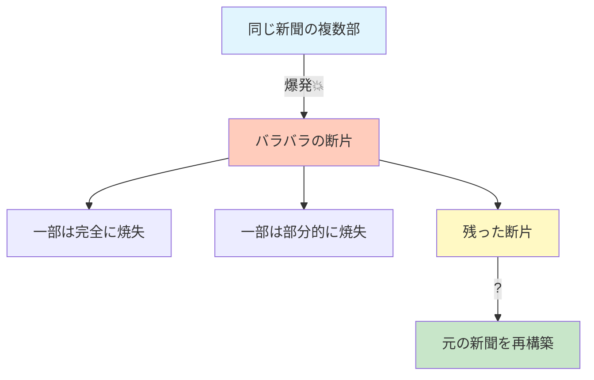
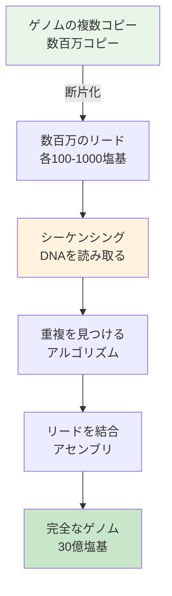
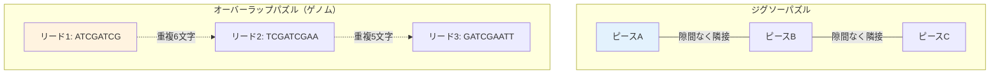

# 爆発する新聞問題：ゲノムアセンブリの本質

## 🎯 この講義で学ぶこと

**最終ゴール**: 短いDNA断片（リード）から完全なゲノム配列を再構築する方法を理解する

でも、ちょっと待ってください。そもそも「ゲノムを再構築する」って、どういうことでしょうか？

## 📰 ステップ1：新聞爆発問題 - 身近な例で理解する

### 1-1. 思考実験

想像してください：

1. **同じニューヨークタイムズ新聞の複数部**があります
2. それらを**ダイナマイトの山に乗せて爆発**させます（※仮想実験です！）
3. 爆発で新聞は**バラバラの断片**になります
4. 一部の断片は**完全に焼失**、一部は**部分的に焼失**します



**課題**: 残った断片から、元の新聞の内容を再構築できるか？

### 1-2. 再構築の鍵 - 重複する情報

ここで魔法のような発見があります：

**重複する情報を利用して新聞を再構築できる！**

```python
# 新聞の断片の例
fragment1 = "...政府は新しい..."
fragment2 = "...新しい政策を発表..."

# 重複部分: "新しい"
# この重複を使って2つの断片を結合
combined = "...政府は新しい政策を発表..."
```

```mermaid
graph LR
    A[断片1: "政府は新しい"]
    B[断片2: "新しい政策を"]
    C[断片3: "政策を発表した"]

    A -.重複: "新しい".-> B
    B -.重複: "政策を".-> C

    D[統合結果: "政府は新しい政策を発表した"]
    A --> D
    B --> D
    C --> D

    style D fill:#c8e6c9
```

実際の例（2001年6月27日のニューヨークタイムズ）：

- この日の新聞は**ヒトゲノム解読**に関する記事が掲載されていました！
- まさにゲノムアセンブリの話題が新聞に載った歴史的な日

## 🧬 ステップ2：新聞からゲノムへ - アナロジーの適用

### 2-1. 対応関係を理解する

| 新聞爆発問題     | ゲノムアセンブリ               | 具体的な数字   |
| ---------------- | ------------------------------ | -------------- |
| 同じ新聞の複数部 | 同じゲノムの複数コピー         | 数百万コピー   |
| 爆発による断片化 | DNAの断片化                    | ランダムに切断 |
| 新聞の断片       | リード（短いDNA配列）          | 100-1000塩基長 |
| 焼失した部分     | シーケンシングできなかった領域 | 全体の一部     |
| 重複する文章     | 重複するDNA配列                | オーバーラップ |

### 2-2. ゲノムアセンブリの実際のワークフロー



### 2-3. 具体的な例

```python
def demonstrate_assembly():
    """ゲノムアセンブリの基本原理を示す"""

    # 元のゲノム（実際は知らない）
    original_genome = "ATCGATCGAATTGC"

    # リード（実際に得られるデータ）
    reads = [
        "ATCGATCG",    # 位置 0-7
        "TCGATCGAA",   # 位置 2-10
        "ATCGAATT",    # 位置 5-12
        "CGAATTGC"     # 位置 7-14
    ]

    # 重複を見つけて結合
    print("リードと重複部分:")
    print("Read 1: ATCGATCG")
    print("Read 2:   TCGATCGAA (重複: TCGATCG)")
    print("Read 3:      ATCGAATT (重複: ATCGAA)")
    print("Read 4:        CGAATTGC (重複: CGAATT)")
    print()
    print("アセンブリ結果: ATCGATCGAATTGC")

    # 元のゲノムと一致！
    assembled = "ATCGATCGAATTGC"
    assert assembled == original_genome
    print("✓ 正しく再構築できました！")

demonstrate_assembly()
```

## 🔍 ステップ3：なぜこれほど難しいのか？

### 3-1. スケールの違い

```python
def compare_scales():
    """新聞とゲノムのスケール比較"""

    # 新聞
    newspaper_chars = 50_000  # 5万文字程度
    newspaper_fragments = 100  # 100個の断片

    # ヒトゲノム
    genome_bases = 3_000_000_000  # 30億塩基
    genome_reads = 600_000_000  # 6億リード

    scale_difference = genome_bases / newspaper_chars
    fragment_difference = genome_reads / newspaper_fragments

    print(f"文字数の違い: {scale_difference:,.0f}倍")
    print(f"断片数の違い: {fragment_difference:,.0f}倍")
    print()
    print("これは新聞10万部分の文字数に相当！")

compare_scales()
```

### 3-2. アルファベットの問題

新聞 vs ゲノム：複雑さの違い

```python
def alphabet_complexity():
    """アルファベットの複雑さの違い"""

    # 新聞
    newspaper_text = "The government announced new policies"
    newspaper_alphabet = set(newspaper_text.lower().replace(" ", ""))

    # ゲノム
    genome_text = "ATCGATCGATCGATCG"
    genome_alphabet = set(genome_text)

    print(f"新聞のアルファベット: {len(newspaper_alphabet)}文字")
    print(f"ゲノムのアルファベット: {len(genome_alphabet)}文字")
    print()
    print("新聞: 意味のある単語、文法規則あり")
    print("ゲノム: たった4文字、文法規則なし")

    # 重複の曖昧性
    print("\n重複の曖昧性の例:")
    fragment1 = "ATGATGATG"
    fragment2 = "GATGATGAT"
    print(f"断片1: {fragment1}")
    print(f"断片2: {fragment2}")
    print("可能な重複: GATGATG, ATGATGA, TGATGAT...")
    print("→ どれが正しい重複か判断が困難！")

alphabet_complexity()
```

### 3-3. リピート配列の悪夢

```python
def repeat_problem():
    """リピート配列による問題"""

    # ゲノムにはリピートが多い
    genome_with_repeats = "ATCG" + "GATC" * 100 + "ATCG" + "GATC" * 100 + "ATCG"

    # 同じリードが複数箇所から来る可能性
    repeat_read = "GATCGATC"

    positions = []
    for i in range(len(genome_with_repeats) - len(repeat_read) + 1):
        if genome_with_repeats[i:i+len(repeat_read)] == repeat_read:
            positions.append(i)

    print(f"リピート配列 '{repeat_read}' の出現位置:")
    print(f"合計 {len(positions)} 箇所で出現")
    print(f"最初の5箇所: {positions[:5]}")
    print("\n問題: このリードがどこから来たか特定できない！")

repeat_problem()
```

## 📊 ステップ4：パズルの種類の違い

### 4-1. ジグソーパズル vs オーバーラップパズル



**決定的な違い:**

| 特徴           | ジグソーパズル      | オーバーラップパズル |
| -------------- | ------------------- | -------------------- |
| ピースの重なり | なし                | あり（必須）         |
| 位置情報       | 形状がヒント        | なし                 |
| 一意性         | 各ピースは1箇所のみ | 同じ配列が複数箇所に |
| 解の数         | 通常1つ             | 複数の可能性         |

### 4-2. なぜ位置情報がないのか？

```python
def why_no_position_info():
    """なぜ位置情報が得られないか説明"""

    print("シーケンシングマシンの仕組み:")
    print("1. DNAをランダムに断片化")
    print("2. 各断片を別々に読み取る")
    print("3. 読み取った順序 ≠ ゲノム上の順序")
    print()

    # 例
    genome = "ATCGATCGAATTGC"

    # ランダムな位置から断片を取得（シミュレーション）
    import random
    reads_with_positions = [
        (7, "CGAATTGC"),   # 実際の位置7
        (0, "ATCGATCG"),   # 実際の位置0
        (5, "ATCGAATT"),   # 実際の位置5
        (2, "TCGATCGAA"),  # 実際の位置2
    ]

    # シャッフル（実際の読み取り順序）
    random.shuffle(reads_with_positions)

    print("実際に得られるデータ（位置情報なし）:")
    for _, read in reads_with_positions:
        print(f"  {read}")

    print("\n課題: これらを正しい順序に並べ直す必要がある！")

why_no_position_info()
```

## 💡 ステップ5：実際の数字で考える

### ヒトゲノムシーケンシングの規模

```python
def real_world_numbers():
    """実際のゲノムシーケンシングの数値"""

    # 基本パラメータ
    genome_size = 3_000_000_000  # 30億塩基対
    read_length = 150  # Illuminaの典型的なリード長
    coverage = 30  # 各位置を平均30回読む（精度のため）

    # 計算
    total_bases_to_sequence = genome_size * coverage
    total_reads = total_bases_to_sequence / read_length

    # データ量（各塩基は1バイトとして、品質スコアも含めて2バイト）
    data_size_gb = (total_reads * read_length * 2) / 1_000_000_000

    # 計算時間の推定
    comparisons_needed = total_reads * (total_reads - 1) / 2
    comparisons_per_second = 1_000_000  # 1秒間に100万回比較
    time_hours = comparisons_needed / comparisons_per_second / 3600

    print("=== ヒトゲノムシーケンシングの規模 ===")
    print(f"ゲノムサイズ: {genome_size:,} 塩基")
    print(f"リード長: {read_length} 塩基")
    print(f"カバレッジ: {coverage}x")
    print()
    print(f"必要なリード数: {total_reads:,.0f}")
    print(f"総塩基数: {total_bases_to_sequence:,}")
    print(f"データ量: {data_size_gb:.1f} GB")
    print()
    print(f"全リードペアの比較: {comparisons_needed:.2e} 回")
    print(f"計算時間（単純な方法）: {time_hours:,.0f} 時間")
    print()
    print("→ だから効率的なアルゴリズムが必要！")

real_world_numbers()
```

### なぜ30倍のカバレッジが必要？

```python
def why_high_coverage():
    """高カバレッジが必要な理由"""

    import random
    import matplotlib.pyplot as plt

    genome_length = 1000  # 簡略化のため1000塩基
    read_length = 50

    def simulate_coverage(coverage):
        """カバレッジをシミュレート"""
        covered = [0] * genome_length
        num_reads = int(genome_length * coverage / read_length)

        for _ in range(num_reads):
            start = random.randint(0, genome_length - read_length)
            for i in range(start, start + read_length):
                covered[i] += 1

        # カバーされていない位置を数える
        uncovered = covered.count(0)
        return uncovered, covered

    print("カバレッジと未カバー領域の関係:")
    for coverage in [1, 5, 10, 30]:
        uncovered, _ = simulate_coverage(coverage)
        percent = (uncovered / genome_length) * 100
        print(f"  {coverage:2}x カバレッジ: {percent:.1f}% が未カバー")

    print("\n理由:")
    print("1. シーケンシングエラーの補正")
    print("2. ランダムな断片化による偏り")
    print("3. 難読領域（GCリッチ、リピート）のカバー")

why_high_coverage()
```

## 🎯 まとめ：今日学んだことを整理

### レベル1：基礎理解

- ゲノムアセンブリ = 爆発した新聞を再構築する問題
- 重複部分が再構築の鍵
- 位置情報なしでパズルを解く必要がある

### レベル2：課題の理解

- **スケール**: 30億文字、6億断片
- **アルファベット**: たった4文字（A,T,C,G）
- **リピート**: 同じ配列が何度も出現
- **カバレッジ**: 精度のため各位置を30回読む

### レベル3：パズルの本質

- ジグソーパズルではなく**オーバーラップパズル**
- 形状のヒントなし、配列情報のみ
- 計算量が膨大（6億×6億の比較）

## 🚀 次回予告

次回は、この問題を解決する具体的なアルゴリズムを学びます：

- **文字列再構成問題**の形式化
- **ハミルトニアン経路**アプローチ
- なぜ単純な方法では解けないのか

「30億ピースのパズルを解く」ための、より洗練された手法を探求していきましょう！
