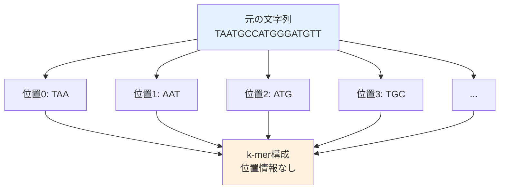

# 文字列再構成問題：ゲノムアセンブリの形式化

## 🎯 この講義で学ぶこと

**最終ゴール**: ゲノムアセンブリ問題をコンピュータ科学の言葉で正確に定義し、解法への道筋を理解する

でも、ちょっと待ってください。「形式化」って何でしょう？なぜ必要なのでしょう？

## 🤔 ステップ0：なぜ形式化が必要なのか？

### Pavel先生の批判を思い出そう

> 「これは計算上の問題ではありません！」

前回のDNA複製の章で、明確に定義された問題を出していないとしてPavel先生から批判されたことを覚えていますか？

コンピュータ科学では、問題を解く前に：

1. **入力**が何か明確にする
2. **出力**が何か明確にする
3. **制約条件**を明確にする

これが「形式化」です。

## 📚 ステップ1：k-mer構成の定義

### 1-1. k-merとは？

```python
def extract_kmers(text, k):
    """文字列からすべてのk-merを抽出"""
    kmers = []
    for i in range(len(text) - k + 1):
        kmers.append(text[i:i+k])
    return kmers

# 例：3-mer（k=3）の抽出
genome = "TAATGCCATGGGATGTT"
kmers_3 = extract_kmers(genome, 3)

print(f"元の文字列: {genome}")
print(f"3-mer構成: {kmers_3[:5]}...")  # 最初の5個を表示
print(f"合計: {len(kmers_3)}個の3-mer")
```

### 1-2. k-mer構成（k-mer Composition）

**定義**: 文字列のk-mer構成とは、その文字列に含まれるすべてのk-merの集合



**重要な点**：

- 位置情報は失われる
- 同じk-merが複数回現れる可能性がある
- 順序は辞書順（アルファベット順）に並べ替える

### 1-3. 具体例で理解する

```python
def demonstrate_kmer_composition():
    """k-mer構成の性質を示す"""

    genome = "TAATGCCATGGGATGTT"
    k = 3

    # 位置情報付きでk-merを抽出
    kmers_with_position = []
    for i in range(len(genome) - k + 1):
        kmer = genome[i:i+k]
        kmers_with_position.append((i, kmer))

    print("位置情報付きk-mer（実際には得られない）:")
    for pos, kmer in kmers_with_position[:5]:
        print(f"  位置{pos:2}: {kmer}")

    print("\n実際に得られるk-mer構成（辞書順）:")
    kmers_only = [kmer for _, kmer in kmers_with_position]
    kmers_sorted = sorted(kmers_only)

    from collections import Counter
    kmer_counts = Counter(kmers_sorted)

    for kmer, count in sorted(kmer_counts.items())[:10]:
        print(f"  {kmer}: {count}回")

    print(f"\n課題: これらのk-merから元の文字列 '{genome}' を再構築せよ！")

demonstrate_kmer_composition()
```

## 📝 ステップ2：文字列再構成問題の形式化

### 2-1. 正式な問題定義

```text
文字列再構成問題（String Reconstruction Problem）:

入力: k-merの集合（コレクション）
出力: k-mer構成が入力と一致するような文字列

制約:
- すべてのk-merを使用する
- 各k-merは与えられた回数だけ使用する
- 最短の文字列を構築する
```

### 2-2. なぜこれが「明確に定義された問題」なのか？

```python
def is_well_defined_problem():
    """明確に定義された問題の条件をチェック"""

    conditions = {
        "入力が明確": "k-merの集合（文字列のリスト）",
        "出力が明確": "文字列（元のゲノム）",
        "成功条件が明確": "出力のk-mer構成 = 入力のk-mer集合",
        "アルゴリズムで解ける": "決定的な手順で解を見つけられる"
    }

    print("明確に定義された問題の条件:")
    for condition, description in conditions.items():
        print(f"✓ {condition}: {description}")

    print("\nPavel先生も満足！ 🎓")

is_well_defined_problem()
```

## 🎮 ステップ3：単純なアプローチを試してみる

### 3-1. 貪欲アルゴリズム（Greedy Algorithm）

最も自然な方法：最初のk-merから始めて、重複する部分でつなげていく

```python
def greedy_assembly(kmers):
    """貪欲法による文字列再構成（失敗する例）"""

    kmers = kmers.copy()  # 元のリストを変更しないように

    # 最初のk-merから開始（辞書順で最初）
    current = kmers[0]
    result = current
    used = [False] * len(kmers)
    used[0] = True

    print(f"開始: {current}")

    steps = []
    while True:
        # 現在の末尾と重複するk-merを探す
        suffix = result[-(len(current)-1):]
        found = False

        for i, kmer in enumerate(kmers):
            if not used[i] and kmer.startswith(suffix):
                steps.append(f"  {result} + {kmer[-1]} ({kmer})")
                result += kmer[-1]
                used[i] = True
                found = True
                break

        if not found:
            break

    # 結果を表示
    print("\n組み立てステップ:")
    for step in steps[:5]:  # 最初の5ステップのみ表示
        print(step)

    if not all(used):
        unused_count = used.count(False)
        print(f"\n❌ 失敗: {unused_count}個のk-merが未使用")
        print(f"使われなかったk-mer: {[kmers[i] for i, u in enumerate(used) if not u][:3]}...")
    else:
        print(f"\n✓ 成功: {result}")

    return result

# 失敗する例
kmers = ["AAT", "ATG", "ATG", "ATG", "CAT", "CCA", "GAT", "GCC", "GGA", "GGG", "GTT", "TAA", "TGC", "TGG", "TGT"]
greedy_assembly(kmers)
```

### 3-2. なぜ貪欲法は失敗するのか？

````python
def why_greedy_fails():
    """貪欲法が失敗する理由を視覚化"""

    print("貪欲法の問題点:")
    print()
    print("1. 局所的な選択:")
    print("   TAA → AAT を選択")
    print("   でも、AAT → ATG が3つある。どれを選ぶ？")
    print()
    print("2. 行き止まり:")
    print("   GTT → TT... で始まるk-merがない！")
    print()
    print("3. グローバルな視点の欠如:")
    print("   全体の構造を考慮せずに進むため、")
    print("   後で使うべきk-merを先に使ってしまう可能性")

    # 視覚的な例
    print("\n視覚的な例:")
    print("```")
    print("    ┌─→ ATG ─→ TGC ─→ ?")
    print("TAA ┼─→ ATG ─→ TGG ─→ ?")
    print("    └─→ ATG ─→ TGT ─→ GTT ─→ ❌ (行き止まり)")
    print("```")

why_greedy_fails()
````

## 🧩 ステップ4：より賢いアプローチが必要

### 4-1. 問題の本質を理解する

````python
def problem_essence():
    """文字列再構成問題の本質"""

    print("問題の本質:")
    print()
    print("1. すべてのk-merを訪問する必要がある")
    print("2. 各k-merは与えられた回数だけ使用")
    print("3. k-merは重複して接続される")
    print()
    print("これって...")
    print("→ グラフ理論の問題として考えられる！")
    print()

    # グラフのイメージ
    print("k-merをノード（頂点）として:")
    print("```")
    print("  [AAT] ─→ [ATG]")
    print("    ↑        ↓")
    print("  [TAA]    [TGC]")
    print("```")
    print()
    print("課題: すべてのノードを1回ずつ訪問する経路を見つける")

problem_essence()
````

### 4-2. オーバーラップグラフの構築

```python
def build_overlap_graph(kmers):
    """k-merからオーバーラップグラフを構築"""

    graph = {}
    k = len(kmers[0])
    overlap_length = k - 1

    # 各k-merから、重複するk-merへのエッジを作成
    for kmer1 in kmers:
        suffix = kmer1[-overlap_length:]
        edges = []

        for kmer2 in kmers:
            if kmer1 != kmer2:  # 自己ループは除く（簡略化のため）
                prefix = kmer2[:overlap_length]
                if suffix == prefix:
                    edges.append(kmer2)

        if kmer1 not in graph:
            graph[kmer1] = []
        graph[kmer1].extend(edges)

    # グラフの一部を表示
    print("オーバーラップグラフ（一部）:")
    for node, edges in list(graph.items())[:5]:
        if edges:
            print(f"  {node} → {edges}")

    return graph

# 例
kmers = ["AAT", "ATG", "CAT", "GAT", "TAA", "TGA", "TGC"]
graph = build_overlap_graph(kmers)

print("\nグラフの特徴:")
print(f"  ノード数: {len(graph)}")
print(f"  エッジ総数: {sum(len(edges) for edges in graph.values())}")
```

## 📊 ステップ5：複雑さの分析

### 5-1. 計算量の見積もり

```python
def complexity_analysis():
    """文字列再構成の計算複雑さ"""

    import math

    # パラメータ
    genome_length = 1000  # 簡略化のため1000塩基
    k = 10  # k-merの長さ
    num_kmers = genome_length - k + 1

    print(f"ゲノム長: {genome_length}")
    print(f"k-mer長: {k}")
    print(f"k-mer数: {num_kmers}")
    print()

    # 可能な経路の数
    # 最悪の場合、すべてのk-merの順列を考える必要がある
    possible_paths = math.factorial(min(num_kmers, 20))  # 20!以上は大きすぎるので制限

    print("総当たり法の計算量:")
    print(f"  可能な順列: {num_kmers}! ≈ 10^{int(num_kmers * math.log10(num_kmers))}")
    print(f"  1秒に10億通り試しても...")

    if num_kmers <= 20:
        seconds = possible_paths / 1_000_000_000
        years = seconds / (365 * 24 * 60 * 60)
        print(f"  → {years:.2e} 年かかる！")
    else:
        print(f"  → 宇宙の年齢を超える時間が必要！")

    print()
    print("→ より効率的なアルゴリズムが必要")

complexity_analysis()
```

### 5-2. 実際のゲノムでの規模

```python
def real_genome_scale():
    """実際のゲノムでの問題規模"""

    scenarios = [
        ("バクテリア", 1_000_000, 100),
        ("酵母", 12_000_000, 100),
        ("ヒト（1染色体）", 250_000_000, 100),
        ("ヒト（全ゲノム）", 3_000_000_000, 100)
    ]

    print("実際のゲノムでのk-mer数:")
    print()

    for organism, genome_size, k in scenarios:
        num_kmers = genome_size - k + 1
        coverage = 30  # 典型的なカバレッジ
        total_kmers = num_kmers * coverage

        print(f"{organism}:")
        print(f"  ゲノムサイズ: {genome_size:,} bp")
        print(f"  ユニークk-mer数（推定）: {num_kmers:,}")
        print(f"  総k-mer数（30xカバレッジ）: {total_kmers:,}")
        print()

real_genome_scale()
```

## 🎯 まとめ：今日学んだことを整理

### レベル1：基礎理解

- **k-mer**: 長さkの部分文字列
- **k-mer構成**: 文字列に含まれるすべてのk-merの集合
- **文字列再構成問題**: k-mer集合から元の文字列を復元

### レベル2：問題の形式化

- **入力**: k-merの集合（位置情報なし）
- **出力**: k-mer構成が一致する文字列
- **制約**: すべてのk-merを指定回数使用

### レベル3：アルゴリズムの課題

- 貪欲法は失敗する（行き止まり問題）
- 総当たりは計算量が膨大（階乗的）
- グラフ理論的アプローチが有望

## 🚀 次回予告

次回は、この問題をグラフ理論で解決します：

- **ハミルトニアン経路問題**としての定式化
- なぜハミルトニアン経路は難しいのか
- より良いアプローチ（オイラー経路）への転換

「すべてのk-merを訪問する最適な経路」を見つける旅が始まります！
