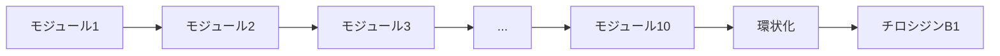

# バクテリアはどうやって抗生物質を作るのか

## 📚 概要

この講義では、細菌がどのようにして抗生物質ペプチドを生産するのか、そしてなぜ通常のタンパク質合成とは異なる特殊なメカニズムを使用するのかを学びます。

## 🧬 分子生物学のセントラルドグマ

### DNAからタンパク質への流れ

1. **転写（Transcription）**: DNA → RNA
   - DNAの二本鎖がRNAの一本鎖に転写される
   - RNAポリメラーゼによって実行される
   - 塩基の対応:
     - G（グアニン）、A（アデニン）、C（シトシン）は変化なし
     - T（チミン）→ U（ウラシル）に変換

2. **翻訳（Translation）**: RNA → タンパク質
   - リボソームによって実行される
   - コドン（3塩基の組み合わせ）がアミノ酸に対応

### 遺伝暗号とコドン

#### なぜ3塩基なのか？

- **4種類の塩基** vs **20種類のアミノ酸**
- 2塩基の組み合わせ: 4² = 16通り（不足）
- 3塩基の組み合わせ: 4³ = 64通り（十分）

#### コドンの特徴

- **1つのアミノ酸に複数のコドン**: 例）ロイシン（L）には6つのコドン
- **終止コドン**: 3つの特別なコドン（UAA、UAG、UGA）が翻訳を停止
- **リーディングフレーム**: 同じDNA配列から6種類の読み方が可能
  - 順方向: 3つのフレーム
  - 逆相補鎖: 3つのフレーム

### セントラルドグマの名前の由来

- **1958年**: フランシス・クリックが命名
- **「ドグマ」の誤用**: 本来は「原理（principle）」とすべきだった
- 皮肉にも、この「ドグマ」には例外が存在することを示唆

## 🔬 チロシジンB1の謎

### 問題の発見

バチルス・ブレビスのゲノムを解析しても、チロシジンB1をコードする30塩基配列が見つからない！

#### なぜ見つからないのか？

1. **遺伝暗号の冗長性**: 同じペプチドをコードする配列が何千通りも存在
2. **環状ペプチド**: 10個のアミノ酸の環状構造は10種類の線形表現が可能
3. **実際の結果**: どの線形表現もゲノム中に存在しない

## 💡 画期的な発見：非リボソームペプチド

### エドワード・テイタムの実験（1963年）

1. **仮説**: リボソームを阻害すれば、すべてのタンパク質合成が停止するはず
2. **実験**: バチルス・ブレビスのリボソームを阻害
3. **結果**: チロシジンの生産は継続！

### フリッツ・リップマンの発見（1969年）

**非リボソームペプチド（NRP: Non-Ribosomal Peptide）**の概念を提唱

## 🏭 NRP合成酵素の仕組み

### 巨大なモジュラー酵素

- **NRP合成酵素**: 非常に大きなタンパク質複合体
- **モジュラー構造**: チロシジンB1の場合、10個のモジュール
- **各モジュールの役割**: 1つのアミノ酸を追加

### 合成プロセス

### NRP合成の特徴

1. **リボソーム非依存**: DNAの配列に直接依存しない
2. **モジュラー方式**: 各モジュールが特定のアミノ酸を選択・追加
3. **環状化**: 最終的にペプチドを環状構造にする

## 🎯 なぜ非リボソーム合成なのか？

### 利点

1. **柔軟性**: 非標準アミノ酸も組み込み可能
2. **修飾**: 合成中に化学修飾を加えられる
3. **環状化**: 線形ペプチドを効率的に環状化

### 生物学的意義

- **抗生物質としての機能**: 環状構造により安定性と活性が向上
- **進化的優位性**: 他の細菌との競争で有利

## 🔍 バイオインフォマティクスへの示唆

### 課題

1. **配列予測の困難さ**: 通常の遺伝暗号規則が適用されない
2. **ゲノム解析の限界**: DNAシークエンスだけでは予測不可能

### アプローチ

1. **NRP合成酵素の同定**: 酵素の配列から産物を予測
2. **質量分析**: 実際のペプチド構造を直接解析
3. **機械学習**: NRPの構造パターンを学習

## 📖 まとめ

- 抗生物質ペプチドの多くは「セントラルドグマ」の例外
- NRP合成酵素による特殊な生合成経路
- バイオインフォマティクスにとって興味深い挑戦

## 🔗 関連トピック

- [抗生物質の発見](./antibiotic-discovery.md)
