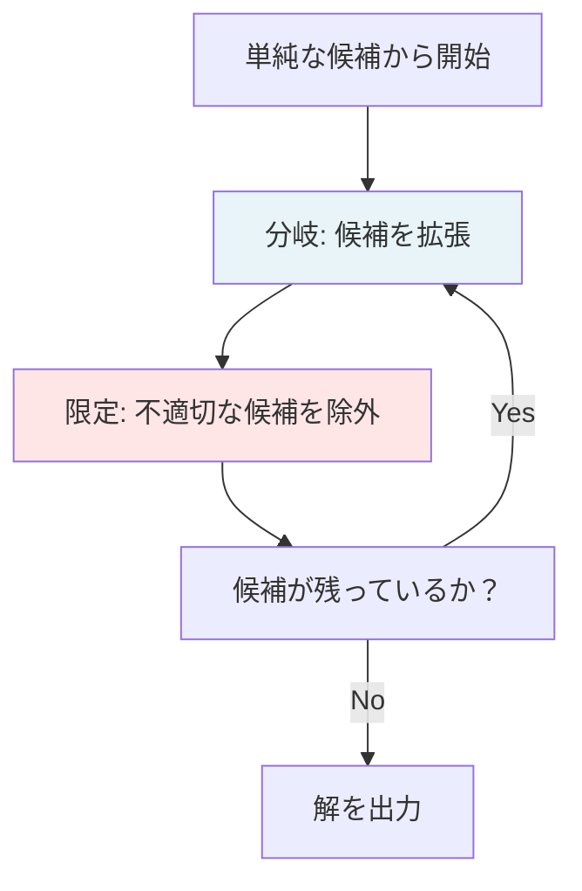

# 分岐限定法によるシクロペプチド配列決定

## 📚 概要

分岐限定法（Branch and Bound）は、ブルートフォースアルゴリズムの問題を解決する効率的なアプローチです。候補ペプチドを段階的に構築しながら、スペクトルとの一貫性をチェックすることで、不適切な候補を早期に除外します。

## 🌳 分岐限定法の基本概念

### アルゴリズムの構造



### 重要な2つのステップ

1. **分岐（Branch）**: 候補を様々な方向に拡張
2. **限定（Bound）**: 条件を満たさない候補を除外

## 🔬 シクロペプチド配列決定への応用

### 実例：スペクトルからのペプチド再構築

与えられたスペクトル（質量リスト）から開始：

```
0, 97, 99, 101, 103, 196, 198, 200, 202, ...
```

### ステップ1：初期候補の選択

スペクトルに存在する質量を持つアミノ酸を特定：

| アミノ酸 | 質量 | スペクトルに存在 |
| -------- | ---- | ---------------- |
| P        | 97   | ✓                |
| V        | 99   | ✓                |
| T        | 101  | ✓                |
| C        | 103  | ✓                |

初期候補：`{P, V, T, C}`

### ステップ2：2-merへの拡張

4つの1-mer × 18種類のアミノ酸 = 72個の2-mer候補

```
PA, PC, PD, PE, PF, PG, ... , PP, PQ, PR, PS, PT, PV, PW, PY
VA, VC, VD, VE, VF, VG, ... , VP, VQ, VR, VS, VT, VV, VW, VY
TA, TC, TD, TE, TF, TG, ... , TP, TQ, TR, TS, TT, TV, TW, TY
CA, CC, CD, CE, CF, CG, ... , CP, CQ, CR, CS, CT, CV, CW, CY
```

### ステップ3：一貫性チェック

#### 一貫性のあるペプチドの例：PV

```
P の質量: 97 ✓（スペクトルに存在）
V の質量: 99 ✓（スペクトルに存在）
PV の総質量: 196 ✓（スペクトルに存在）
→ PVは一貫性あり、保持
```

#### 一貫性のないペプチドの例：CD

```
C の質量: 103 ✓（スペクトルに存在）
D の質量: 115 ✗（スペクトルに不在）
CD の総質量: 218 ✗（スペクトルに不在）
→ CDは一貫性なし、除外
```

### ステップ4：繰り返し処理

```mermaid
graph LR
    A[4個の1-mer] -->|拡張| B[72個の2-mer]
    B -->|枝刈り| C[10個の2-mer]
    C -->|拡張| D[180個の3-mer]
    D -->|枝刈り| E[15個の3-mer]
    E -->|拡張| F[270個の4-mer]
    F -->|枝刈り| G[10個の4-mer]
    G -->|拡張| H[180個の5-mer]
    H -->|枝刈り| I[10個の5-mer]

    style A fill:#e8f4f8
    style C fill:#ccffcc
    style E fill:#ccffcc
    style G fill:#ccffcc
    style I fill:#ffcccc
```



## 📊 効率性の分析

### 候補数の推移

| ステップ      | 拡張後 | 枝刈り後 | 削減率 |
| ------------- | ------ | -------- | ------ |
| 1-mer → 2-mer | 72     | 10       | 86%    |
| 2-mer → 3-mer | 180    | 15       | 92%    |
| 3-mer → 4-mer | 270    | 10       | 96%    |
| 4-mer → 5-mer | 180    | 10       | 94%    |

### ブルートフォース vs 分岐限定法

```python
# ブルートフォース
候補数 = 18^n  # nはペプチド長
# 例: n=10 → 18^10 ≈ 3.5 × 10^12

# 分岐限定法
候補数 = 実際に一貫性のあるペプチドのみ
# 例: 最大でも数百個程度
```

## 🎯 アルゴリズムの詳細

### 擬似コード

```python
def BranchAndBound(spectrum):
    # 1. 初期候補を生成
    candidates = [amino_acid for amino_acid in AMINO_ACIDS
                  if mass(amino_acid) in spectrum]

    result = []

    while candidates:
        # 2. 分岐：すべての候補を拡張
        expanded = []
        for peptide in candidates:
            for amino_acid in AMINO_ACIDS:
                expanded.append(peptide + amino_acid)

        # 3. 限定：一貫性チェック
        candidates = []
        for peptide in expanded:
            if is_consistent(peptide, spectrum):
                if mass(peptide) == parent_mass(spectrum):
                    # 完全一致を発見
                    if theoretical_spectrum(peptide) == spectrum:
                        result.append(peptide)
                else:
                    candidates.append(peptide)

    return result

def is_consistent(peptide, spectrum):
    """ペプチドのすべての質量がスペクトルに含まれるかチェック"""
    for mass in all_submasses(peptide):
        if mass not in spectrum:
            return False
    return True
```

## 💡 重要なポイント

### 一貫性の定義

ペプチドがスペクトルと「一貫性がある」とは：

- ペプチドのすべての部分ペプチドの質量がスペクトルに含まれる
- 理論スペクトルが実験スペクトルの**サブセット**である

### 早期枝刈りの効果

- 不適切な候補を早期に除外
- 探索空間を劇的に削減
- 実用的な計算時間で解を発見

## ⚠️ アルゴリズムの限界

### 最悪ケースの計算量

- **理論的には指数関数的**: 特殊なデータセットでは効率が悪化
- **実用的には高速**: 実際の生物学的データでは非常に効率的

### 問題点の予告

「本当にこれで終わりか？」という疑問が残る：

- より複雑な状況への対応
- ノイズのあるスペクトルの扱い
- 修飾ペプチドの存在

## 📖 まとめ

- 分岐限定法はブルートフォースを大幅に改良
- スペクトルとの一貫性チェックによる早期枝刈りが鍵
- 実用的なデータでは非常に効率的
- しかし、まだ改良の余地がある

## 🔗 関連トピック

- [ブルートフォース法](./brute-force-cyclopeptide.md)
- [質量分析シークエンシング](./mass-spectrometry-sequencing.md)
