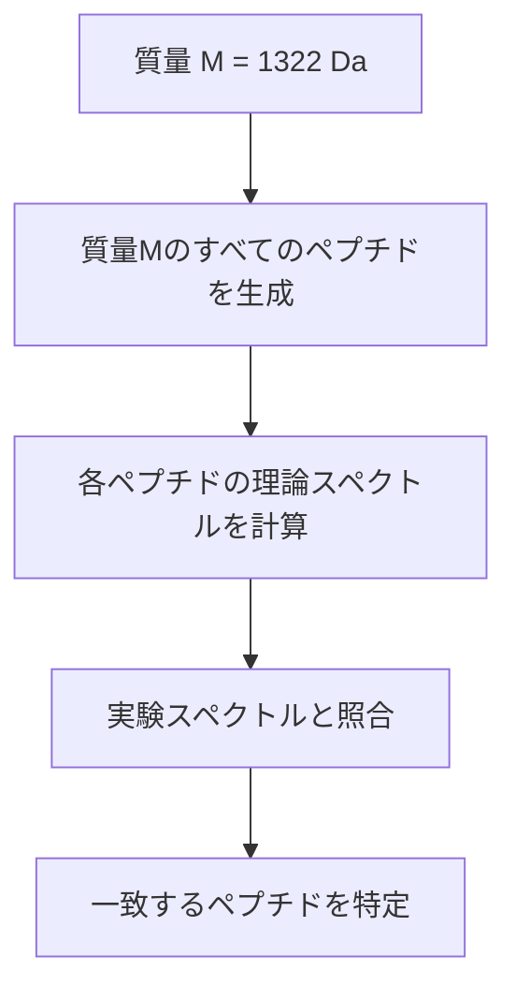
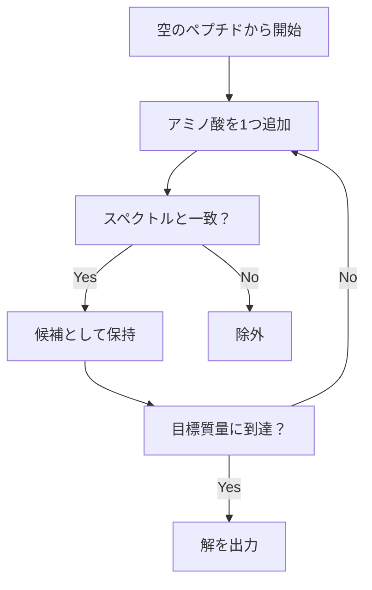

# シクロペプチド配列決定のための総当りアルゴリズム

## 📚 概要

質量分析データからペプチド配列を決定する最初のアプローチとして、ブルートフォース（総当り）アルゴリズムを検討します。しかし、このアプローチには深刻な計算量の問題があることが明らかになります。

## 🎯 基本的なアイデア

### ブルートフォースアルゴリズムの手順

1. **ペプチドの総質量を特定**: 例）チロシジンB1 = 1322 Da
2. **すべての候補を生成**: その質量を持つすべてのペプチドを生成
3. **スペクトル計算**: 各候補ペプチドの理論スペクトルを計算
4. **照合**: 実験スペクトルと一致するものを探す



## 📊 組み合わせ爆発の問題

### ペプチド数の指数関数的増加

```
質量とペプチド数の関係：

質量 500 Da  → 約10^6個のペプチド
質量 1000 Da → 約10^11個のペプチド
質量 1322 Da → 約10^14個のペプチド（数兆個！）
```

**問題**: チロシジンB1の質量（1322 Da）では、何兆個ものペプチドを検証する必要がある

## 🔍 なぜブルートフォースは失敗するのか

### 同じ質量、異なるペプチドの例

**NQEL** と **TMDH** の比較：

| 特性             | NQEL       | TMDH       |
| ---------------- | ---------- | ---------- |
| 総質量           | 484 Da     | 484 Da     |
| アミノ酸組成     | N, Q, E, L | T, M, D, H |
| 共通アミノ酸     | なし       | なし       |
| 共通サブペプチド | なし       | なし       |

### スペクトルの違い

```
NQELのスペクトル: 0, 113, 114, 128, 129, 227, 242, 242, 257, 355, 356, 370, 371, 484

TMDHのスペクトル: 0, 101, 115, 131, 137, 216, 232, 238, 246, 252, 353, 368, 369, 484
```

**重要な観察**:

- 共通の質量は **0** と **484**（空文字列と全体）のみ
- その他の質量は完全に異なる
- スペクトルを使って早期に不適切な候補を除外できる

## 💡 改良されたアプローチ：段階的構築

### 問題点の解決策

ブルートフォースの問題を解決するために、以下の戦略を採用：

1. **段階的な構築**
   - 大きなペプチドを一度に生成しない
   - 小さなペプチドから徐々に構築

2. **早期の枝刈り**
   - 各段階でスペクトルと照合
   - 不適切な候補を早期に除外

3. **探索空間の削減**
   - 正しい方向に進んでいる候補のみを保持

### アルゴリズムの改良



## 🔬 スペクトルベースのフィルタリング

### 一貫性チェック

ペプチドが成長するにつれて、その部分スペクトルが実験スペクトルと一致することを確認：

```python
def is_consistent(peptide, experimental_spectrum):
    """
    ペプチドの理論スペクトルが
    実験スペクトルのサブセットであるかをチェック
    """
    theoretical = compute_spectrum(peptide)
    return all(mass in experimental_spectrum
               for mass in theoretical)
```

## 📈 計算効率の改善

### ブルートフォース vs 改良版

| アプローチ         | 検証するペプチド数 | 計算時間   |
| ------------------ | ------------------ | ---------- |
| ブルートフォース   | 10^14個            | 実行不可能 |
| 段階的構築＋枝刈り | 10^6個程度         | 数秒〜数分 |

## 🎯 実装の要点

1. **質量の早期チェック**
   - 部分ペプチドの質量が目標を超えたら即座に除外

2. **スペクトルの整合性**
   - 各段階で理論スペクトルと実験スペクトルを比較

3. **メモリ効率**
   - 不要な候補は即座に削除

## 📖 まとめ

- ブルートフォースアルゴリズムは理論的には正しいが実用的でない
- 組み合わせ爆発により、大きな質量のペプチドでは計算不可能
- スペクトル情報を使った段階的構築と枝刈りが必須
- 改良されたアルゴリズムは次の講義で詳しく扱う

## 🔗 関連トピック

- [質量分析シークエンシング](./mass-spectrometry-sequencing.md)
- [分岐限定法](./branch-and-bound.md)
