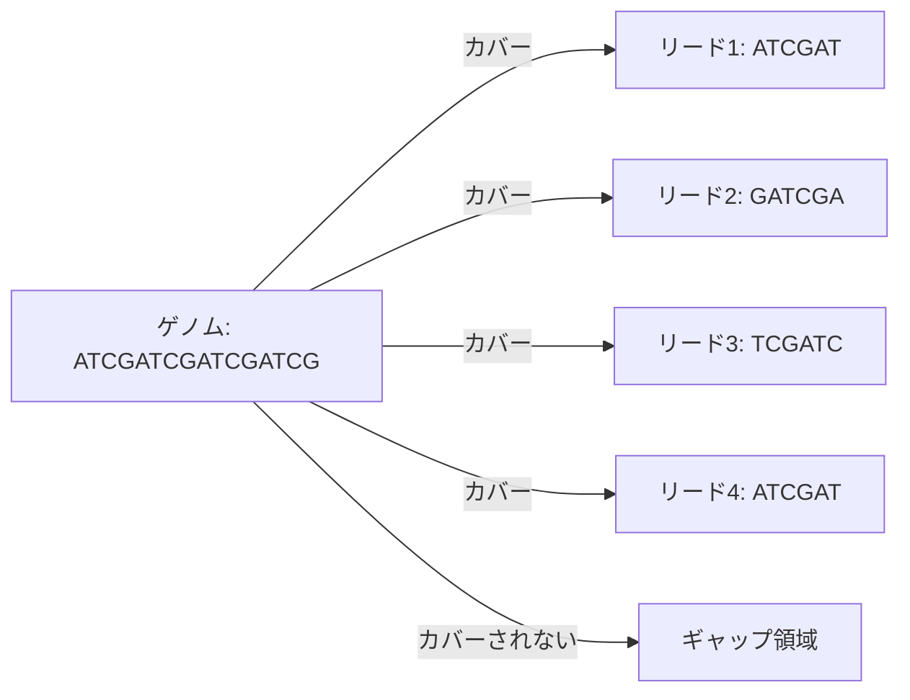
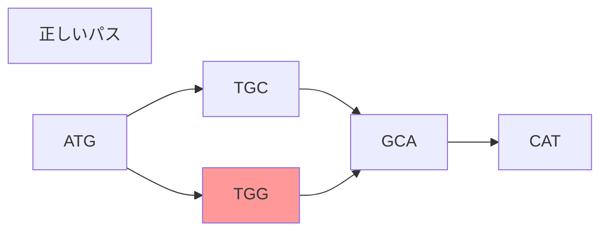
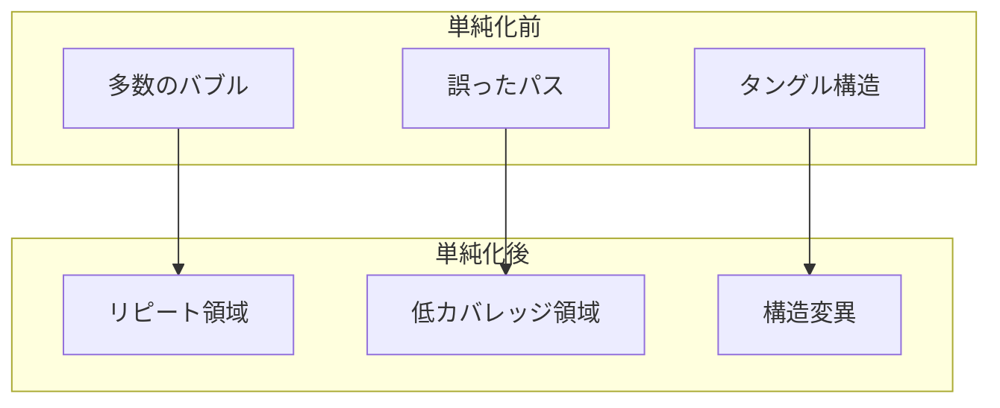

# デ・ブルイエン・グラフが直面する組み立ての厳しい現実

## 📚 はじめに

前回まで、デ・ブルイエン・グラフを使ったゲノムアセンブリの理論的な側面について学んできました。しかし、実際のゲノムアセンブリでは、理論では想定していなかった様々な問題に直面します。今回は、これらの「厳しい現実」について詳しく見ていきましょう。

## 🎯 理論と現実のギャップ

### 理論での仮定

これまでの説明では、以下のような非現実的な仮定をしてきました：

1. **完全なカバレッジ**: ゲノムの全ての位置がリードでカバーされている
2. **エラーフリー**: リードには一切のシーケンシングエラーがない
3. **k-mer多重度の把握**: 各k-merがゲノム中に何回出現するかが正確にわかる
4. **正確な距離情報**: ペアエンドリードの間隔が正確にわかる

### 現実の状況

実際のシーケンシングでは：

- ❌ **不完全なカバレッジ**: ゲノムの一部がリードで覆われていない
- ❌ **シーケンシングエラー**: リードには必ずエラーが含まれる
- ❌ **k-mer多重度の不確実性**: 正確な出現回数は不明
- ❌ **不正確な距離**: ペアエンドリードの間隔には誤差がある

## 🔬 問題1: 不完全なカバレッジ

### 問題の構造



### 解決策: k-mer分解

リードを短いk-merに分割することで、部分的にこの問題を緩和できます：

```python
def decompose_reads_to_kmers(reads, k):
    """
    リードをk-merに分解してカバレッジを改善
    """
    kmers = []
    for read in reads:
        for i in range(len(read) - k + 1):
            kmers.append(read[i:i+k])
    return kmers

# 例
reads = ["ATCGAT", "GATCGA", "TCGATC"]
k = 3
kmers = decompose_reads_to_kmers(reads, k)
print(f"k-mers: {kmers}")
# 出力: k-mers: ['ATC', 'TCG', 'CGA', 'GAT', 'GAT', 'ATC', 'TCG', 'CGA', 'TCG', 'CGA', 'GAT', 'ATC']
```

## 🔬 問題2: シーケンシングエラー

### エラーが引き起こす「バブル」

シーケンシングエラーは、デ・ブルイエン・グラフに「バブル」と呼ばれる構造を作り出します：



エラーを含むk-mer（TGG）が、正しいパス（TGC）と並行してバブルを形成します。

### エラーの影響のシミュレーション

```python
def introduce_errors(sequence, error_rate=0.01):
    """
    シーケンスにランダムなエラーを導入
    """
    import random

    bases = ['A', 'T', 'G', 'C']
    error_seq = list(sequence)

    for i in range(len(error_seq)):
        if random.random() < error_rate:
            current_base = error_seq[i]
            # 現在の塩基以外からランダムに選ぶ
            error_base = random.choice([b for b in bases if b != current_base])
            error_seq[i] = error_base

    return ''.join(error_seq)

# 例
original = "ATCGATCGATCG"
with_errors = introduce_errors(original, error_rate=0.1)
print(f"元の配列: {original}")
print(f"エラー含む: {with_errors}")
```

### バブル除去アルゴリズム

```python
def detect_bubbles(graph):
    """
    グラフ内のバブル構造を検出（簡略化版）
    """
    bubbles = []

    for node in graph.nodes():
        # 分岐点を探す
        if graph.out_degree(node) > 1:
            paths = []
            for neighbor in graph.neighbors(node):
                # 各パスを追跡
                path = trace_path(graph, neighbor)
                paths.append(path)

            # パスが再び合流するか確認
            if paths_converge(paths):
                bubbles.append({
                    'start': node,
                    'paths': paths
                })

    return bubbles

def remove_low_coverage_path(graph, bubble):
    """
    カバレッジの低いパスを除去
    """
    # 各パスのカバレッジを計算
    coverages = []
    for path in bubble['paths']:
        coverage = calculate_path_coverage(graph, path)
        coverages.append(coverage)

    # 最もカバレッジの低いパスを除去
    min_idx = coverages.index(min(coverages))
    remove_path(graph, bubble['paths'][min_idx])
```

## 🔬 実際のグラフの複雑さ

### 単純化後も残る複雑性

バブル除去などの単純化を行った後でも、実際の細菌ゲノムのグラフは非常に複雑です：



## 💡 バイオインフォマティクスのアプローチ

### 段階的な問題解決

バイオインフォマティクスでは、以下のアプローチが一般的です：

1. **問題の単純化**: まず非現実的な仮定をして問題を単純化
2. **核心アイデアの開発**: 単純化された問題に対する解法を開発
3. **段階的な改良**: 仮定を一つずつ取り除きながら改良

```python
class GenomeAssembler:
    """
    段階的に改良されるゲノムアセンブラー
    """

    def __init__(self):
        self.version = "1.0"
        self.assumptions = [
            "完全カバレッジ",
            "エラーフリー",
            "k-mer多重度既知"
        ]

    def assemble_v1(self, reads):
        """バージョン1: 理想的な仮定の下でのアセンブリ"""
        # デ・ブルイエン・グラフ構築
        graph = build_debruijn_graph(reads)
        # オイラーパス探索
        path = find_eulerian_path(graph)
        return reconstruct_genome(path)

    def assemble_v2(self, reads):
        """バージョン2: エラー処理を追加"""
        # エラー訂正
        corrected_reads = error_correction(reads)
        # グラフ構築
        graph = build_debruijn_graph(corrected_reads)
        # バブル除去
        graph = remove_bubbles(graph)
        # パス探索
        path = find_eulerian_path(graph)
        return reconstruct_genome(path)

    def assemble_v3(self, reads):
        """バージョン3: カバレッジ問題に対応"""
        # k-mer分解でカバレッジ改善
        kmers = decompose_to_kmers(reads)
        # カバレッジベースのフィルタリング
        filtered_kmers = filter_by_coverage(kmers)
        # 以下、v2と同様の処理
        # ...
```

## 🎯 重要な教訓

### なぜ「ばかげた仮定」から始めるのか？

1. **理解の促進**: 複雑な問題の本質を理解しやすくする
2. **アルゴリズムの核心**: 基本的なアイデアを明確にする
3. **段階的改良**: 一つずつ問題を解決していく道筋を作る

### 実際の研究開発

- 💡 個別化ゲノミクス革命の推進者たち
- 🧬 数百万人規模のゲノムシーケンシング計画
- 🎯 がんゲノム研究への応用
- 🧮 20年にわたるアルゴリズム開発の積み重ね

## 📝 まとめ

デ・ブルイエン・グラフを使ったゲノムアセンブリは、理論と実践のギャップを埋める継続的な努力の結果です。現実の問題に直面しても、段階的なアプローチと創造的な解決策により、実用的なツールへと進化してきました。

### 次のステップ

- より高度なエラー訂正アルゴリズムの開発
- ロングリードシーケンシングとの統合
- メタゲノムアセンブリへの応用

## 🔗 参考資料

- [SPAdes: A New Genome Assembly Algorithm](https://doi.org/10.1089/cmb.2012.0021)
- [Error Correction in Next-Generation Sequencing Data](https://doi.org/10.1093/bib/bbr024)
- [Assembly complexity of prokaryotic genomes using short reads](https://doi.org/10.1186/1471-2105-11-21)
