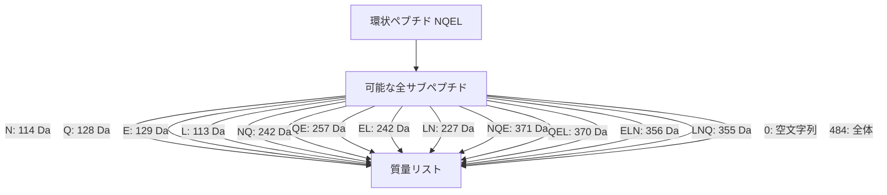

# 抗生物質を粉々にして配列決定

## 📚 概要

非リボソームペプチドはゲノムからは予測できないため、質量分析計を使用して直接ペプチドの配列を決定する必要があります。この講義では、質量分析によるペプチドシークエンシングの原理と課題を学びます。

## 🔬 質量分析計とは

### 分子スケール

- **質量分析計**: 分子の質量を測定する「高価な分子スケール」
- **主要ツール**: ゲノム解析に依存しないペプチド配列決定の主力ツール
- **原理**: ペプチドを断片化し、各断片の質量を測定

## ⚖️ 分子質量の基礎

### ダルトン（Da）

- **定義**: 陽子または中性子の質量にほぼ等しい単位
- **分子質量**: 分子内のすべての原子の陽子と中性子の合計

### グリシンの質量計算例

```
グリシン（Gly, G）の化学式: C₂H₅ON

質量計算:
- 炭素（C）: 2個 × 12 Da = 24 Da
- 水素（H）: 5個 × 1 Da = 5 Da
- 酸素（O）: 1個 × 16 Da = 16 Da
- 窒素（N）: 1個 × 14 Da = 14 Da

合計: 24 + 5 + 16 + 14 = 57 Da（整数質量）
実際の質量: 57.02 Da
```

## 📊 アミノ酸の整数質量表

### 20種類のアミノ酸の質量

| アミノ酸         | 1文字コード | 整数質量（Da） |
| ---------------- | ----------- | -------------- |
| グリシン         | G           | 57             |
| アラニン         | A           | 71             |
| セリン           | S           | 87             |
| プロリン         | P           | 97             |
| バリン           | V           | 99             |
| スレオニン       | T           | 101            |
| システイン       | C           | 103            |
| イソロイシン     | I           | 113            |
| ロイシン         | L           | 113            |
| アスパラギン     | N           | 114            |
| アスパラギン酸   | D           | 115            |
| リジン           | K           | 128            |
| グルタミン       | Q           | 128            |
| グルタミン酸     | E           | 129            |
| メチオニン       | M           | 131            |
| ヒスチジン       | H           | 137            |
| フェニルアラニン | F           | 147            |
| アルギニン       | R           | 156            |
| チロシン         | Y           | 163            |
| トリプトファン   | W           | 186            |

### 重要な注意点

⚠️ **同一質量のアミノ酸ペア**:

- **I（イソロイシン）とL（ロイシン）**: 両方とも113 Da
- **K（リジン）とQ（グルタミン）**: 両方とも128 Da

→ 質量分析では区別不可能（20種類→18種類の質量アルファベット）

## 🧮 ペプチド質量の計算

### チロシジンB1の例

```
配列: VKLFPWFNQY（環状）

質量計算:
V (99) + K (128) + L (113) + F (147) + P (97) +
W (186) + F (147) + N (114) + Q (128) + Y (163) = 1322 Da
```

## 🔨 質量分析の原理

### プロセス

1. **断片化**: ペプチドを様々な断片に分解
2. **質量測定**: 各断片の質量を測定
3. **スペクトル生成**: 断片質量のリストを作成

### 理論スペクトル

環状ペプチドNQELの例：



注意: 質量242 Daが2つ存在（NQとEL）

## 🎯 シクロペプチド配列問題

### 順問題と逆問題


### 課題

1. **順問題（簡単）**: ペプチド配列 → スペクトル
   - すべての断片を列挙
   - 各断片の質量を計算

2. **逆問題（困難）**: スペクトル → ペプチド配列
   - これが**シクロペプチド配列問題**
   - 質量から元の配列を再構築

## 💡 計算上の課題

### なぜ難しいのか？

1. **組み合わせ爆発**: 多数の可能な配列
2. **同一質量**: 異なるサブペプチドが同じ質量を持つ
3. **環状構造**: 開始点が不定
4. **実験誤差**: 実際のスペクトルにはノイズや欠損がある

## 🔍 次のステップ

この問題を解決するために、以下のアルゴリズムを学習します：

1. ブルートフォース法
2. 分岐限定法
3. スペクトルグラフアルゴリズム

## 📖 まとめ

- 質量分析はゲノムに依存しないペプチド配列決定の主要な方法
- アミノ酸の整数質量を使用して計算を簡略化
- 理論スペクトルから元のペプチド配列を再構築することは計算上の難題

## 🔗 関連トピック

- [抗生物質の発見](./antibiotic-discovery.md)
- [バクテリアの抗生物質生産](./bacterial-antibiotic-production.md)
