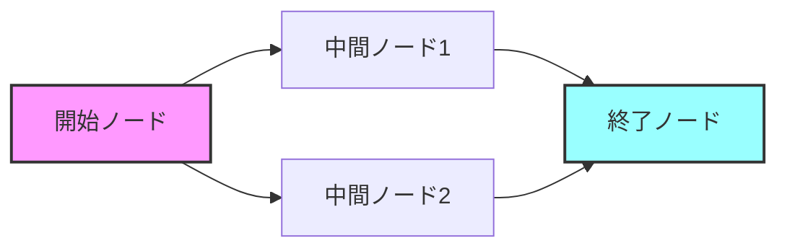
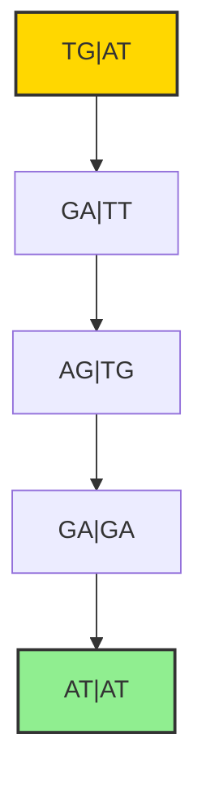

# リードペアの組み立て

## 📝 概要

de Bruijnグラフによるゲノムアセンブリには重要な問題があります：**複数のオイラー経路が存在する可能性**です。この講義では、この問題を解決するための「リードペアシーケンシング」技術と、それを用いた「ペアde Bruijnグラフ」について学びます。

## 🎯 学習目標

- de Bruijnグラフの曖昧性問題を理解する
- リードペアシーケンシングの原理を学ぶ
- ペアde Bruijnグラフの構築方法を理解する
- ペアde Bruijnグラフの利点を把握する

## 🔍 de Bruijnグラフの問題点

### 複数のオイラー経路

同じde Bruijnグラフから複数のオイラー経路が存在する可能性があります。これらの異なる経路は、異なる配列を生成してしまいます。



**問題**：シーケンシングしたのは1つのゲノムなのに、どの配列が正しいのか判断できない

### コンティグへの分解

この曖昧性のため、de Bruijnグラフを複数の**非分岐経路**（コンティグ）に分解せざるを得ません。

:::info コンティグとは

- de Bruijnグラフの非分岐経路に対応
- ゲノム内の部分文字列
- 複数のオイラー経路はすべて同じ非分岐経路のセットを共有
  :::

## 🧬 リードペアシーケンシング

### 基本原理

1. **ゲノムの断片化**
   - 同じゲノムの複数のコピーを用意
   - ランダムに同じサイズ（InsertLength）の断片に切断

2. **ペアリードの生成**
   - 各断片の両端からリードを生成
   - リードのペアは一定の距離（インサートサイズ）だけ離れている

3. **ペアk-mer**
   - 2つのk-merが与えられる
   - ゲノム内で一定の距離d離れている
   - これらを「ペアk-mer」と呼ぶ

### ペアk-mer構成

文字列から生成されたすべてのペアk-merの集合が、その文字列の**ペアk-mer構成**となります。

```python
# ペアk-merの表記例（2行式）
# 上段：最初のk-mer
# 下段：距離d離れたk-mer
"""
GAGA | TTGA | TACC
TTGA | TACC | ACTA
"""
```

## 🔧 ペアde Bruijnグラフ

### 構築方法

1. **エッジの作成**
   - 各ペアk-merを、ペアプレフィックスからペアサフィックスへのエッジとして表現

2. **ノードの接着**
   - 同じラベルを持つノードを接着（グルーイング）
   - ノードは(k-1)-merのペアでラベル付け

### 構築例



### ゲノムパス

- ゲノムはペアde Bruijnグラフの**オイラー経路**として表現される
- エッジはペアk-merでラベル付け
- ノードは(k-1)-merのペアでラベル付け

## ✨ ペアde Bruijnグラフの利点

### 通常のde Bruijnグラフとの比較

| 特徴           | de Bruijnグラフ | ペアde Bruijnグラフ |
| -------------- | --------------- | ------------------- |
| ノードのラベル | 個々の(k-1)-mer | (k-1)-merのペア     |
| 接着回数       | 多い            | 少ない              |
| グラフの複雑さ | 複雑            | シンプル            |
| オイラー経路   | 複数存在        | **一意に決定**      |

### 主要な利点

:::success 最大の利点
ペアde Bruijnグラフには**一意のオイラー経路**が存在し、ゲノムを一意に構築できる
:::

## 🎓 まとめ

1. **問題認識**
   - 通常のde Bruijnグラフでは複数のオイラー経路が存在
   - ゲノムを一意に決定できない

2. **解決策**
   - リードペアシーケンシング技術の導入
   - ペアk-merを使用した構築

3. **結果**
   - ペアde Bruijnグラフによる一意なゲノム構築
   - 実際のアセンブラで適用され、大きな利点を示している

## 🚀 実践での応用

現代のゲノムアセンブラでは、ペアde Bruijnグラフが広く採用されており、以下のような利点をもたらしています：

- より長いコンティグの生成
- リピート領域の解決
- アセンブリの精度向上
- 計算効率の改善

## 📚 関連トピック

- [de Bruijnグラフ](./de-bruijn-graph)
- [オイラーの定理](./euler-theorem)
- 次回：ペアde Bruijnグラフの実装と応用
