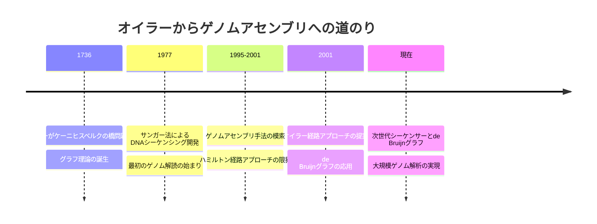
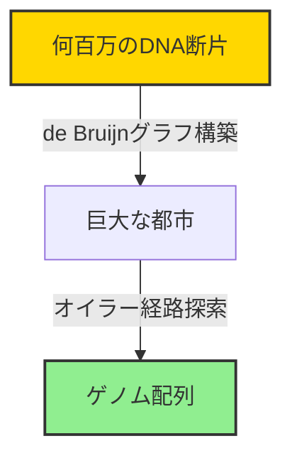

# ケーニヒスベルクへの帰還

## 📝 概要

ゲノムアセンブリの旅を終えて、私たちは再びケーニヒスベルク（現在のロシア・カリーニングラード）に戻ってきました。この講義では、18世紀のオイラーの数学的洞察が、どのように21世紀のゲノム解析に革命をもたらしたかを振り返ります。

## 🌉 歴史と現代の架け橋

### オイラーの遺産

1736年、レオンハルト・オイラーはケーニヒスベルクの橋の問題を解き、グラフ理論を創始しました。彼は当時、自分の抽象的な数学的考察が、3世紀後に生命の設計図を解読する鍵になるとは想像もしていなかったでしょう。



## 🧬 学んだことの統合

### 1. 問題の変換

私たちは以下の変換を学びました：



### 2. アルゴリズムの進化

| 段階 | アプローチ     | 課題           | 解決策          |
| ---- | -------------- | -------------- | --------------- |
| 初期 | 重複グラフ     | 計算量が膨大   | -               |
| 中期 | ハミルトン経路 | NP困難問題     | -               |
| 現在 | オイラー経路   | 効率的に解ける | de Bruijnグラフ |

## 🎯 重要な洞察

### シンプルさの中の深遠さ

> 「とてもシンプルで自然な都市建設アプローチのように思える - その方法を学んだ後になって初めて」

この言葉が示すように、最も革新的な解決策は、しばしば後から見れば驚くほどシンプルです。しかし、そこに到達するまでには：

- **20年の歳月**：バイオインフォマティシャンがオイラーのアイデアをフラグメントアセンブリに適用するまで
- **無数の試行錯誤**：様々なアプローチの検討と失敗
- **学際的な視点**：数学と生物学の融合

## 🔬 現実の複雑さ

### 理論から実践へ

実際のゲノムアセンブリには、理論だけでは解決できない課題があります：

1. **シーケンシングエラー**
   - 読み取りミスの処理
   - 品質スコアの考慮

2. **リピート配列**
   - 同じ配列の繰り返し
   - 曖昧性の解決

3. **不均一なカバレッジ**
   - 一部領域の読み取り不足
   - GCバイアスの影響

## 💡 バイオインフォマティクスの本質

> 「複雑になりがちな現実の生物学的問題を洗練されたアルゴリズム上の課題に変換することは、バイオインフォマティクス分野における最も困難でやりがいのある課題の1つです」

この分野の魅力は、まさにこの変換プロセスにあります：

- **生物学的直感** → **数学的定式化**
- **実験データ** → **計算可能な構造**
- **複雑な現象** → **エレガントな解法**

## ☕ 最後の問い

講義の最後に提示された問い：

> 「すべての喫茶店に一度だけ立ち寄って、この街を散歩することは可能だと思いますか？」

これは、オイラー経路問題の現代版です。答えは、喫茶店を頂点、道を辺とするグラフの構造に依存します。

```python
def can_visit_all_cafes_once(cafe_graph):
    """
    すべての喫茶店を一度だけ訪問できるか判定
    （オイラー経路が存在するか）
    """
    odd_degree_cafes = 0

    for cafe in cafe_graph.nodes():
        if cafe_graph.degree(cafe) % 2 == 1:
            odd_degree_cafes += 1

    # オイラー経路の条件：
    # 奇数次数の頂点が0個（オイラー閉路）または2個（オイラー経路）
    return odd_degree_cafes <= 2
```

## 🚀 これからの展望

### ゲノミクスの未来

オイラーの数学的洞察は、現在も進化を続けています：

1. **ロングリードシーケンシング**
   - より長い断片の読み取り
   - アセンブリの簡略化

2. **メタゲノミクス**
   - 複数種の同時解析
   - 環境サンプルの解読

3. **パンゲノミクス**
   - 種内の多様性の理解
   - 個別化医療への応用

## 📚 まとめ

ケーニヒスベルクの橋から始まった数学的冒険は、生命の設計図を解読する現代の冒険へと繋がりました。この旅が教えてくれるのは：

- **基礎研究の重要性**：今日の「無用な」数学が明日の革命的技術になる
- **学際的アプローチ**：異分野の知識の融合が新しい扉を開く
- **エレガントな解法の追求**：複雑な問題ほどシンプルな解法が効果的

オイラーが橋を渡りながら考えた抽象的な問題が、今や私たちのDNAを理解する鍵となっています。これこそが科学の美しさであり、次の大発見への希望でもあります。

## 🎓 次のステップ

この基礎を踏まえて、次は：

- より高度なアセンブリアルゴリズムの学習
- 実際のゲノムデータでの実践
- 新しいシーケンシング技術への適応

バイオインフォマティクスの旅は、まだ始まったばかりです。
